> 温馨提示: 不要试图一次性读完
> 想看什么, 去目录找

## 目录

- [script](#script)
  - [script 的常用标签](#script-的常用标签)
  - [async属性](#async属性)
  - [defer属性](#defer属性)
  - [noscript](#noscript)
- [基础语法](#基础语法)
  - [严格模式](#严格模式)
  - [变量声明](#变量声明)
- [String](#string)
  - [字符串的定义](#字符串的定义)
  - [String 对象的属性](#string-对象的属性)
  - [String 对象的方法](#string-对象的方法)
  - [一些案例](#一些案例)
  - [字符串练习](#字符串练习)
  - [...运算符 扩展运算符（展开语法）](#运算符-扩展运算符展开语法)
- [Array](#array)
  - [1. 数组简介](#1-数组简介)
  - [2. 创建数组对象](#2-创建数组对象)
  - [3. 数组的基本操作](#3-数组的基本操作)
  - [4. 数组的方法详细介绍](#4-数组的方法详细介绍)
  - [5. 关于数组的练习](#5-关于数组的练习)
- [Number](#number)
  - [parseInt()](#parseint)
  - [NaN遇到的坑](#nan遇到的坑)
- [Boolean](#boolean)
  - [转换结果列举【重要】](#转换结果列举重要)
- [Object](#object)
  - [对象的基本操作](#对象的基本操作)
  - [遍历操作](#遍历操作)
  - [深拷贝 浅拷贝](#深拷贝-浅拷贝)
- [Function](#function)
  - [函数的定义/声明](#函数的定义声明)
  - [函数的调用](#函数的调用)
  - [函数的参数：形参和实参](#函数的参数形参和实参)
  - [函数的返回值](#函数的返回值)
  - [函数名、函数体和函数加载问题（重要，请记住）](#函数名函数体和函数加载问题重要请记住)
  - [fn()  和 fn 的区别【重要】](#fn--和-fn-的区别重要)
  - [break、continue、return](#breakcontinuereturn)
  - [立即执行函数](#立即执行函数)
  - [方法](#方法)
  - [类数组 arguments](#类数组-arguments)
  - [arguments.length](#argumentslength)
  - [arguments.callee](#argumentscallee)
  - [arguments 可以修改元素](#arguments-可以修改元素)
  - [arguments 的使用](#arguments-的使用)
  - [函数参数默认值](#函数参数默认值)
  - [剩余参数 (rest 运算符)](#剩余参数-rest-运算符)
  - [原型， 原型链](#原型-原型链)
  - [构造函数](#构造函数)
  - [面向过程和面向对象](#面向过程和面向对象)
  - [原型的三角关系](#原型的三角关系)
  - [继承的演进：从原型链到 class](#继承的演进从原型链到-class)
  - [instanceof 的原理与手写实现](#instanceof-的原理与手写实现)
  - [属性判断的四种方式](#属性判断的四种方式)
  - [闭包的引入](#闭包的引入)
  - [执行期上下文](#执行期上下文)
- [Math](#math)
  - [内置对象：Math](#内置对象math)
  - [Math 的常用属性（常量）](#math-的常用属性常量)
  - [Math 的常用方法](#math-的常用方法)
  - [内置对象：Date](#内置对象date)
  - [创建Date对象](#创建date对象)
  - [日期的格式化](#日期的格式化)
  - [Date对象的方法](#date对象的方法)
  - [一些关于 Date 方法的测试](#一些关于-date-方法的测试)
  - [举例：年月日的格式化](#举例年月日的格式化)
  - [获取时间戳](#获取时间戳)
  - [getTime()：获取时间戳](#gettime获取时间戳)
  - [获取 Date 对象的时间戳](#获取-date-对象的时间戳)
  - [获取当前时间的时间戳](#获取当前时间的时间戳)
  - [利用时间戳检测代码的执行时间](#利用时间戳检测代码的执行时间)
  - [举例1：模拟日历](#举例1模拟日历)
  - [举例2：倒计时](#举例2倒计时)
- [Set](#set)
  - [生成 Set 数据结构](#生成-set-数据结构)
  - [删除元素](#删除元素)
  - [添加元素](#添加元素)
  - [判断是否存在元素](#判断是否存在元素)
  - [size 属性获取 set 的长度](#size-属性获取-set-的长度)
- [JSON](#json)
- [Null 与 Undefined](#null-与-undefined)
  - [Null：空对象](#null空对象)
  - [undefined：未定义类型](#undefined未定义类型)
  - [其他区别](#其他区别)
- [transition](#transition)
  - [1.2 transition-property](#12-transition-property)
  - [1.3 transition-duration](#13-transition-duration)
  - [1.4 transition-timing-function](#14-transition-timing-function)
  - [1.5 transition-delay](#15-transition-delay)
  - [1.6 简写属性](#16-简写属性)
  - [1.7 transition 的不足](#17-transition-的不足)
  - [1.8 一个简单的样式](#18-一个简单的样式)
- [2D 转换 (transform)](#2d-转换-transform)
  - [2.1 缩放：`scale`](#21-缩放scale)
  - [2.2 位移：translate](#22-位移translate)
  - [2.3 旋转：rotate](#23-旋转rotate)
- [3D 转换](#3d-转换)
  - [3.1 旋转：rotateX、rotateY、rotateZ](#31-旋转rotatexrotateyrotatez)
  - [3.2 移动：translateX、translateY、translateZ](#32-移动translatextranslateytranslatez)
  - [3.3 透视：perspective](#33-透视perspective)
- [animation](#animation)
  - [4.1 定义动画](#41-定义动画)
  - [4.2 调用动画](#42-调用动画)
  - [5.1 按钮抖动动画](#51-按钮抖动动画)
  - [5.2 背景颜色随鼠标渐变](#52-背景颜色随鼠标渐变)
- [正则表达式](#正则表达式)
  - [创建正则表达式的对象](#创建正则表达式的对象)
  - [正则表达式的简单语法](#正则表达式的简单语法)
  - [支持正则表达式的 String 对象的方法](#支持正则表达式的-string-对象的方法)
  - [常见正则表达式举例](#常见正则表达式举例)
- [promise](#promise)
  - [Promise 特点](#promise-特点)
  - [resolve() 的作用](#resolve-的作用)
  - [我们一般采用下面的写法](#我们一般采用下面的写法)
  - [reject() 的用法](#reject-的用法)
  - [all() 多个Promise 一起执行](#all-多个promise-一起执行)
  - [除此之外还有 race 的 用法](#除此之外还有-race-的-用法)
  - [读取多个文件 (案例)](#读取多个文件-案例)
- [async/await](#asyncawait)
  - [基本使用](#基本使用)
- [EventLoop](#eventloop)
- [异步编程（进阶）](#异步编程进阶)
  - [异步编程的演进路线](#异步编程的演进路线)
  - [事件循环综合题（含 async/await）](#事件循环综合题含-asyncawait)
  - [Promise 静态方法全家桶](#promise-静态方法全家桶)
  - [then 链式调用的 7 条规则](#then-链式调用的-7-条规则)
  - [手写 Promise（Promise A+ 核心实现）](#手写-promisepromise-a-核心实现)
  - [async / await 深入](#async--await-深入)
  - [Generator 与 async/await 的关系](#generator-与-asyncawait-的关系)
  - [异步实战工具函数](#异步实战工具函数)
- [ES6](#es6)
  - [Symbol](#symbol)
- [ES6+ 新特性（补充）](#es6-新特性补充)
  - [解构赋值（Destructuring）](#解构赋值destructuring)
  - [模板字符串与标签模板](#模板字符串与标签模板)
  - [箭头函数](#箭头函数)
  - [对象字面量的增强](#对象字面量的增强)
  - [可选链 ?. 与空值合并 ??（ES2020）](#可选链--与空值合并-es2020)
  - [Module 模块化](#module-模块化)
  - [Iterator 与 for...of](#iterator-与-forof)
  - [Set 与 Map](#set-与-map)
  - [Proxy 与 Reflect](#proxy-与-reflect)
  - [ES2016 ~ ES2025 新特性速览](#es2016--es2025-新特性速览)
  - [将ES6转为ES5 (Babel)](#将es6转为es5-babel)
- [作用域（Scope）的概念和分类](#作用域scope的概念和分类)
  - [全局作用域 和 window 对象](#全局作用域-和-window-对象)
  - [作用域的访问关系](#作用域的访问关系)
  - [变量的作用域](#变量的作用域)
  - [作用域的上下级关系](#作用域的上下级关系)
  - [作用域的预处理](#作用域的预处理)
  - [全局作用域-变量的声明提前（变量提升）](#全局作用域-变量的声明提前变量提升)
  - [全局作用域-函数的声明提前](#全局作用域-函数的声明提前)
  - [函数作用域的预处理](#函数作用域的预处理)
  - [JavaScript 没有块级作用域（ES6 之前）](#javascript-没有块级作用域es6-之前)
  - [作用域链](#作用域链)
  - [块级作用域 (ES6新增)](#块级作用域-es6新增)
  - [块级作用域有以下几个特点：](#块级作用域有以下几个特点)
  - [let var 区别](#let-var-区别)
  - [js 函数预编译](#js-函数预编译)
  - [一个有意思的案例](#一个有意思的案例)
  - [推荐](#推荐)
- [作用域与闭包（进阶）](#作用域与闭包进阶)
  - [词法作用域 vs 动态作用域](#词法作用域-vs-动态作用域)
  - [执行上下文与执行栈](#执行上下文与执行栈)
  - [暂时性死区（TDZ）详解](#暂时性死区tdz详解)
  - [var / let / const 全面对比](#var--let--const-全面对比)
  - [闭包的本质](#闭包的本质)
  - [闭包的典型应用](#闭包的典型应用)
  - [闭包的代价：内存泄漏](#闭包的代价内存泄漏)
  - [作用域链 vs 原型链：别再搞混](#作用域链-vs-原型链别再搞混)
- [Node 节点](#node-节点)
  - [1. 先解释清楚节点与元素](#1-先解释清楚节点与元素)
  - [2. 什么是`DOM`](#2-什么是dom)
  - [3. 获取节点](#3-获取节点)
  - [4. 节点的操作](#4-节点的操作)
  - [5. 获取 html 文档的方法](#5-获取-html-文档的方法)
- [Web 存储与应用缓存](#web-存储与应用缓存)
  - [H5 中有两种存储的方式](#h5-中有两种存储的方式)
  - [常见 API](#常见-api)
  - [案例：记住用户名和密码](#案例记住用户名和密码)
  - [应用缓存](#应用缓存)
  - [优势](#优势)
  - [`cache manifest` 缓存清单文件](#cache-manifest-缓存清单文件)
  - [使用](#使用)
- [新增全屏显示](#新增全屏显示)
  - [开启/关闭全屏显示](#开启关闭全屏显示)
  - [检测当前是否处于全屏状态](#检测当前是否处于全屏状态)
  - [全屏的伪类](#全屏的伪类)
- [音频视频](#音频视频)
  - [音频](#音频)
  - [视频](#视频)

# JavaScript [ 1995  Brendan Eich ]

[Javascript诞生记 -阮一峰]:http://www.ruanyifeng.com/blog/2011/06/birth_of_javascript.html

- `JavaScript` 的定位

- - `JavaScript` 是脚本编程语言
  - `JavaScript` 是弱类型语言
  - `JavaScript` 是动态类型的
  - `JavaScript` 是单线程的
  - `JavaScript` 解释型语言
  - `JavaScript` 具有良好的跨平台性

- `JavaScript` 和 `ECMAScript` 的区别，以及和 `DOM` 、`BOM` 的关系, JavaScript包含

- - `DOM`（文档对象模型），提供了与网页内容交互的 `方法` 和 `接口`
  - `BOM`（浏览器对象模型），提供了与浏览器交互的 `方法` 和 `接口`
  - `ECMAScript` 描述了 `JavaScript` 的语法和基本对象 (核心)

最后还是引用《JavaScript高级程序设计》的那段话："要真正学好用好 JavaScript，理解其本质、历史及局限性是非常重要的"。

**一起共勉～**

---

## script

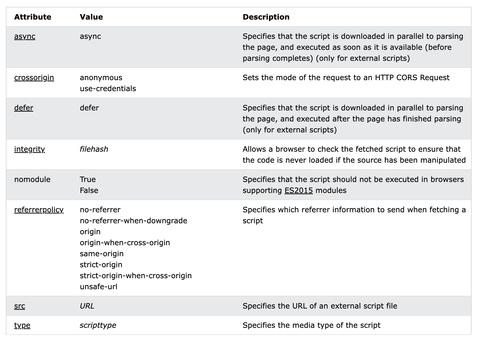

### script 的常用标签

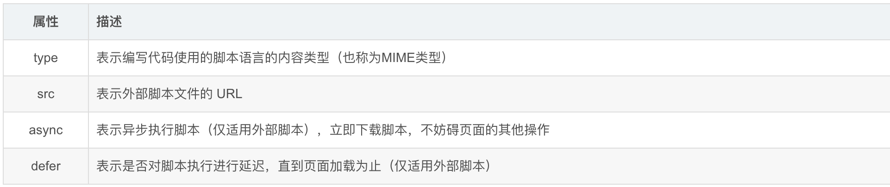

首先我们先来看一下 `<script>` 标签的几个重要特性：

- script标签的会阻止文档渲染。相关脚本会立即下载并执行。（不带defer或async属性的情况下）
- document.currentScript 可以获得当前正在运行的脚本(Chrome 29+, FF4+)。
- 脚本顺序再默认情况下和script标签出现的顺序一致。
- script标签是没有跨域问题，可以加载任何网站的脚本，和img标签非常类似，所以通常也会用来解决跨域问题，就是人们通常所说的JSONP。
- 当 `type = "module"` 的时候，代码会被识别为 ES6 模块，才可以使用 import 和 export（注意拼写是 `module`，不是 `moudle`；也不要写成中文引号）
- 同时具有行内代码和src标签的时候， 会忽视行内代码

`<script>` 一般都放在页面的 `<head>` 元素中, 这也意味着必须等到全部的JavaScript代码都被下载解析执行后，才开始呈现页面的内容

如果JavaScript代码太大的话，可能会让浏览器显示页面出现延迟的情况，所以通常可以把``<script>``放在`<body>`的最后位置，这样的话会使在解析JavaScript代码前就已经把页面显示出来，减少用户的等待时间

### async属性

async属性是HTML5的新特性，早期其兼容性并不乐观（IE10+）。好在 IE 浏览器已于 2022 年 6 月被微软停止支持，如今可以放心使用。

async 表示该 script 标签并不**阻塞**文档解析，也不保证同步顺序执行。

浏览器只需要在脚本下载完毕后再执行即可，即不必**阻塞**页面渲染去等待该脚本的下载和执行。

考究这个属性产生的**原因**，其实有大量的脚本加载器在做这样的事情：

```js
var script = document.createElement("script");
script.src = "file.js";
document.body.appendChild(script);
// 那么我们不难想象，通过脚本异步插入的script标签达到的效果和带async属性的script标签是一样的。
// 换句话说，由上面这种方式脚本插入的script标签默认是async的。

// 我们可以在上面的基础上把它设置为同步方式
script.async = false;

// 但是通过这种方式获取 script， 会影响资源队列的优先级
```

### defer属性

带有defer属性的脚本，同样会推迟脚本的执行，并且不会阻止文档解析。

defer属性是会确保脚本在文档解析完毕后执行的。

即使这个脚本在文档解析过程中就已经下载完毕变成可执行的状态，

浏览器也会推迟这个脚本的执行，直到文档解析完毕，并在DOMContentLoaded之前。

同时，带有defer的脚本彼此之间，能保证其执行顺序。

### noscript

`noscript`标签是一个相当古老的标签，其被引入的最初目的是帮助老旧浏览器的平滑升级更替，因为早期的浏览器并不能支持 JavaScript。noscript 标签在不支持JavaScript 的浏览器中显示替代的内容。这个元素可以包含任何 HTML 元素。这个标签的用法也非常简单：

```xml
<noscript>  <p>本页面需要浏览器支持（启用）JavaScript</p></noscript>
```

不过到了现在，浏览器不支持 Javascript 的事情应该已经不会出现了，但是用户也可能因为各种原因而禁用了 Javascript。

## 基础语法

语法特点

- JavaScript 严格区分字母大小写
- **标识符**以 数字，字母，下划线，美元符（`$`）组成， 第一位不能是数字（严格来说，标识符还可以包含 Unicode 字符，如中文变量名，但不推荐）
- 注释有两种形式 `// 单行注释内容`      `/* 多行注释 */`
- 语句以 `;` 结束， 但是可以不加， 不加 `;`的部分情况下会出错
- 

### 严格模式

在所有语句之前放一个特定语句 `"use strict"`，假设有一个脚本`reeoo.js`，可以这样开启严格模式：

```javascript
// reeoo.js
"use strict";
// 代码
var name = "Reeoo";
```

 同理， 要给某个函数开启严格模式，得把`"use strict";` 声明放在函数体所有语句之前就行了。

#### 严格模式中一些重要的限制

- 不允许使用一个没有声明的变量
- 不允许修改只读属性的值
- 不允许修改不可扩展的属性
- 在一个对象文本中多次定义某个属性
- **无法使用标识符的未来保留字，严格模式下将保留标识符名称**
- 不允许使用八进制数字参数和转义字符

### 变量声明

#### var 声明变量

- 初始化不赋值的情况下声明的值会被赋值 undefined
- var 声明的作用域是函数作用域
- var 声明的变量会成为包含他的函数的局部变量,
- 在全局中声明会挂载到 window 对象， 但是和window变量有区别
- 在函数内定义变量省略 var 时， 会将它视为全局变量
- var 声明的变量会自动提升到函数作用域顶部 （变量提升）
- 允许重复声明

#### let 声明变量

- let 声明的作用域是块级作用域
- 不允许重复声明
- 声明的变量不会提升（作用域死区）
- 全局中声明不会成为 window 对象的属性

#### const 声明变量

- 声明时必须初始化
- 不可以修改基本数据类型， 可以修改引用数据类型的属性的值


## String

### 字符串的定义

常规方法 “” ‘’ `` 都可以

```js
// 一：使用一对单引号或者一对双引号来定义一个字符串
let str1 = "str1";
console.log(str1); // str1
let str2 = 'str2';
console.log(str2); // str2
// 1. 在 JavaScript 中双引号定义的字符串和单引号定义的字符串没有本质区别
// 2. 无论是单引号还是双引号，都必须配对使用，不能一个单引号和双引号配对
let str3 = "str3'";
console.log(str3); // str'
// 3. 单引号中的字符串中不能出现单引号，可以出现双引号
//    双引号中的字符串中不能出现双引号，可以出现单引号
// 4. 单引号和双引号定义字符串时，须在一行内完成，不能换行
// 二：使用模板字符串的方式定义字符串：我们可以使用一对反引号来定义字符串（tab 键上面的 ``）
let str4 = `这是一个普通的字符串`;
let str5 = `这是一个换行的 字符串`;
let str6 = 7;
let str7 = 6;
// 模板字符串利用 ${} 使用变量
let str8 = `这是一个可以解析变量的字符串，例如：${str6 + str7}`;
console.log(str4); // 这是一个普通的字符串
console.log(str5); /* 这是一个换行的 字符串 */
console.log(str6); // 7
console.log(str7); // 6
console.log(str8); // 这是一个可以解析变量的字符串，例如：13
// ${varName} 或 ${value}。即 ${} 中可为变量名，也可直接为字面量值（如 ${123} 或 ${asd}）
```

不关心里面的内容是什么,只匹配对应的 “” ‘’ `` 与转义符

```js
let str1 = "true"; // 把布尔值转换为字符串
console.log(str1);
let str2 = "123"; // 把数值转换为字符串
console.log(str2);
let str3 = "[1,2,3]"; // 把数组转换为字符串
console.log(str3);
let str4 = "{x : 1; y : 2}"; // 把对象转换为字符串
console.log(str4);
let str5 = "console.log('Hello,World')"; // 把可执行表达式转换为字符串
console.log(str5);
// 打印结果：
// true
// 123
// [1,2,3]
// {x : 1; y : 2}
// console.log('Hello,World')
console.log(typeof str1);
console.log(typeof str2);
console.log(typeof str3);
console.log(typeof str4);
console.log(typeof str5);
// string
// string
// string
// string
// string
```

转义符: `\`

```js
// 在定义一个字符串的时候，有些特殊字符并不适合直接出现。例如：换行符、单引 号（不能出现在单引号内）、双引号（不能出现在双引号内）
```

例如 下面是错误的

```js
let str = " " " // 会直接报语法错误
```

但是我们需要这样去使用 , 这个时候可以我们就需要使用 `\` 转义符，例如： 

```js
// 在这里使用了 \n 来代表换行符
// 在这里使用了 \" 来代表双引号。
let str1 = '这是一个换行的\n字符串';
let str2 = '这是一个换行的\' 字符串';
console.log(str1);
console.log(str2);
/* 这是一个换行的字符串 */
// 这是一个换行的' 字符串
let str3 = `123 str3 \"\'`;
// 如果使用模板字符串的方式定义字符串，可以直接使用回车换行。但是要在其中使用反引号 `，也必须转义
console.log(str3);
// 打印结果：
// 123
// str3 "'
```

### String 对象的属性

**字符串可以看成是字符组成的数组**,拥有属性 length ------> 字符串的长度,可以通过for循环进行遍历

```js
let str = 'abcd';
for (let i of str) {
  console.log(i);
}
// a
// b
// c
// d
```

**字符串特性:不可变性,字符串的值是不能改变**

### String 对象的方法

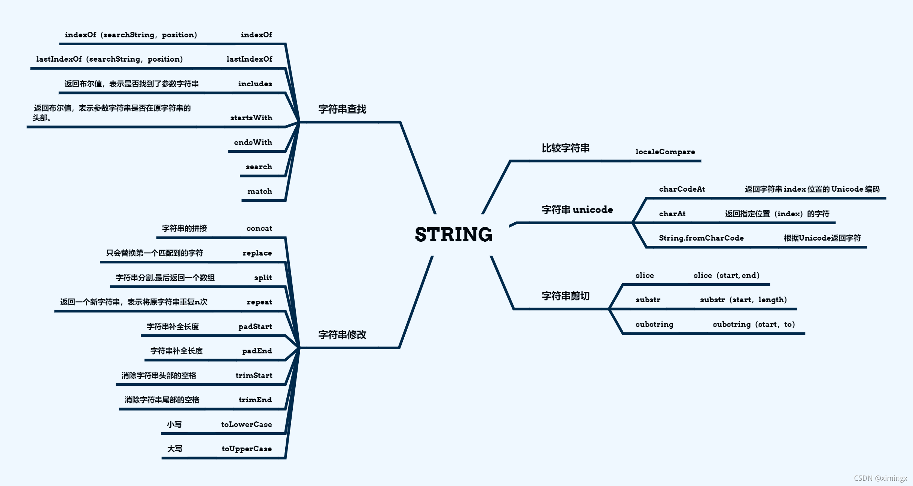


#### localeCompare() 

**这里先说明一个东西: 字符比较是指按照字典次序对单个字符或字符串进行比较大小的操作，一般都是以Unicode码值的大小作为字符比较的标准。**

JS字符串在进行大于(小于)比较时，**会根据第一个不同的字符的Unicode值码进行比较**

下面演示一些案例

```js
let a = "91";
let b = "390";
console.log(a.charCodeAt()); // 57
console.log(b.charCodeAt()); // 51
console.log(a < b); // false
```

**“91” < “390” 结果为 false** 

**字符串在比较的时候会按字符的 Unicode 码位（ASCII 打印字符部分）逐位比较**（'9' 是 57，'3' 是 51），从第一个字符开始依次比较，如果第一个字符相等就比较下一个，直到分出大小或到达末尾为止。所以在比较"数字字符串"的大小时，一定要先转化为 number 再比较。

所以解释一下上面的结果

a 中第一个字符为 9 , b 中第一个字符为 3 ,两者不同,所以开始比较他们的 ASCII 码位 , a 的 '9' (57) 大于 b 的 '3' (51) 所以 **“91” < “390” 结果为 false**

```js
let a = 34;
let b = "34";
console.log(a == b); // true
```

**如果一个是字符串,一个是数值,会倾向于将字符串转换为数值然后进行比较**

下面说正题

因为后一个参数浏览器支持不是很友好，就不多做介绍

一般的用法就是 a.localeCompare(b)，浏览器基本都是支持的。

```js
let str1 = "123456";
let str2 = "1234567";
let str3 = "12345678";
let str4 = "123478";
let str5 = "abcd";
let str6 = "dcba";
// 返回值大于 0：说明当前字符串 string 大于对比字符串 targetString
// 返回值小于 0：说明当前字符串 string 小于对比字符串 targetString
// 返回值等于 0：说明当前字符串 string 等于对比字符串 targetString
console.log(str1.localeCompare(str2)); // -1
console.log(str2.localeCompare(str2)); // 0
console.log(str3.localeCompare(str2)); // 1
console.log(str4.localeCompare(str2)); // 1
console.log(str5.localeCompare(str6)); // -1
```

#### charCodeAt()

```js
// 返回字符串 index 位置的 Unicode 编码，默认为 0 号位置
console.log("a".charCodeAt(0));
console.log("aabb".charCodeAt(2));
// 97
// 98
```

#### charAt()

```js
// charAt（index）
// 返回指定位置（index）的字符。
// 如果 index 小于 0 或者大于等于字符串的长度 string.length，它会返回空字符串。
let str = "str1";
console.log(str.charAt(1));
console.log(str.charAt(5));
// 打印结果：
// t
// （空字符串）
```

#### String.fromCharCode()

```js
console.log(String.fromCharCode(5, 66, 67, 68, 69, 70, 71));
console.log(String.fromCharCode(38));
console.log(String.fromCharCode(13, 22269));
console.log(String.fromCharCode());
// 打印结果：
// ║BCDEFG
// &
// 国
// （空字符串）
```

#### slice()

注意：

1.   字符串的索引是从0到 length-1
2.   slice（start, end）
3.   substring（start, to）
4.   substr（start，length）与前两者不同的是第二个参数是长度
5.   **三者的差别很细,具体仔细看下面案例结果**

```js
// slice（start, end）
// 截取字符串 start 索引位置到 end 索引位置之前的字符串
// start 参数：字符串中第一个字符位置为 0，第二个字符位置为 1，以此类推；如果是负数，表示从尾部截取。slice(-2) 表示提取原字符串的倒数第二个元素到最后一个元素（包含最后一个元素）。
// end 参数如果为负数：-1 指字符串的最后一个字符的位置，-2 指倒数第二个字符，以此类推。
let str1 = "123456789";
console.log(str1.slice(0, str1.length));
// 123456789
let str2 = "123456789";
console.log(str2.slice(1, 3));
// 23
console.log(str2.slice(-2));
// 89
// 使用 slice() 原字符串不会发生改变
console.log(str2);
// 123456789
console.log(str1.slice(0, -1));
// 参数为负数时，从字符串末尾开始处理
// 12345678
console.log(str1.slice(6, -5));
// （空字符串）
console.log(str1.slice(3, -5));
// 4
```

#### substr()

```js
// substr（start，length）
// 从 start 索引位开始，截取长度为 length 的字符串；如果没有 length，将后面的全部截取
let str = "str1";
console.log(str.substr(1));
console.log(str.substr(1, 2));
// 对，没错，最后的结果为空字符串
console.log(str.substr(1, -1));
// 打印结果：
// tr1
// tr
// （空字符串）
```

#### substring()

```js
// substring（start，to）
let str = "str1";
console.log(str.substring(0));
console.log(str.substring(1, 2));
// 如果参数 start 与 end 相等，那么该方法返回的就是一个空串（即长度为 0 的字符串）
console.log(str.substring(1, 1));
// start => to：如果 start 的数值大于 to 的位置，可以理解为把两个参数位置颠倒
console.log(str.substring(3, 1));
console.log(str.substring(2, 1));
console.log(str.substring(4, 2));
// 打印结果：
// str1
// t
// （空字符串）
// tr
// t
// r1
```

#### concat()

```js
// concat()// 一般字符串的拼接可以直接使用 + 连接console.log("c".concat("23", "str"));// c23str
```

#### indexOf()

```js
// indexOf（searchString，position）
let str1 = "123qwe";
console.log(str1.indexOf("2"));
console.log(str1.indexOf("a"));
console.log(str1.indexOf("ad"));
console.log(str1.indexOf("ae"));
console.log(str1.indexOf("we"));
console.log(str1.indexOf("we", 5));
// 打印结果：
// 1
// -1
// -1
// -1
// 4
// -1
```

**案例**：查找字符串"qianguyihao"中，所有 `a` 出现的位置以及次数。

思路：

（1）先查找第一个 a 出现的位置。

（2）只要 indexOf 返回的结果不是 -1 就继续往后查找。

（3）因为 indexOf 只能查找到第一个，所以后面的查找，可以利用第二个参数，在当前索引加 1，从而继续查找。

代码实现：


```js
var str = 'qianguyihao';
var index = str.indexOf('a');
var num = 0;
while (index !== -1) {
  console.log(index);
  num++; // 每打印一次，就计数一次
  index = str.indexOf('a', index + 1); // 继续向后查找下一个 'a'
}
console.log('a 出现的次数是: ' + num);
// 打印结果：
// 3
// a 出现的次数是: 1
```

#### lastIndexOf()

```js
// lastIndexOf（searchString，position）
let str1 = "123qwe";
// 与 indexOf 方法类似，只不过它是从该字符串的末尾开始查找而不是从开头
console.log(str1.lastIndexOf("2"));
console.log(str1.lastIndexOf("a"));
console.log(str1.lastIndexOf("ad"));
console.log(str1.lastIndexOf("ae"));
console.log(str1.lastIndexOf("we"));
console.log(str1.lastIndexOf("we", 5));
// 打印结果：
// 1
// -1
// -1
// -1
// 4
// 4
```

#### replace()

```js
let str1 = "121416";
let str2 = "1234567";
// 只会替换第一个匹配到的字符
console.log(str1.replace("1", str2));
// 123456721416
```

```js
var stringObj="终古，终古人民";var newstr=stringObj.replace("终古","中国"); // 中国，终古人民
```

会发现第二个错别字“终古”并没有被替换成“中国”

```js
var reg = new RegExp("终古", "g"); // 创建正则 RegExp 对象
var stringObj = "终古，终古人民";
var newstr = stringObj.replace(reg, "中国"); // 中国，中国人民
```

#### split()

```js
let str1 = '深入 Vue底层，手写一个vuex\n 348\n'; // split() 将以传递的参数把字符串分割，最后返回一个数组
console.log(str1.split(" "));
// [ '深入', 'Vue底层，手写一个vuex\n', '348\n' ]
console.log(str1.split("\n"));
// [ '深入 Vue底层，手写一个vuex', ' 348', '' ]
```

第二个参数代表分割次数

```js
let str = "山东省-济南市-市中区";
let newStr = str.split('-');
console.log(newStr);
// ["山东省","济南市","市中区"]
// 第二个参数 times：只匹配 '-' 两次
let str2 = "山东省-济南市-市中区";
let newStr2 = str2.split('-', 2);
console.log(newStr2);
// ["山东省", "济南市"]
```

#### includes()

```js
// 返回布尔值，表示是否找到了参数字符串。
let str = '这是测试字符串';
if (str.indexOf('测试') !== -1) {
  console.log(true); // 包含
} else {
  console.log(false); // 不包含
}
// true
```

#### startsWith()

```js
// 返回布尔值，表示参数字符串是否在原字符串的头部。
let str = '这是测试字符串';
if (str.startsWith('这') === true) {
  console.log(true);
} else {
  console.log(false);
}
if (str.startsWith('是') === true) {
  console.log(true);
} else {
  console.log(false);
}
// 打印结果：
// true
// false
```

#### endsWith()

```js
// 返回布尔值，表示参数字符串是否在原字符串的尾部。
let str = '这是测试字符串';
if (str.endsWith('这') === true) {
  console.log(true);
} else {
  console.log(false);
}
if (str.endsWith('串') === true) {
  console.log(true);
} else {
  console.log(false);
}
// 打印结果：
// false
// true
```

-   includes() startsWith() endsWith() 这三个方法都支持第二个参数，表示开始搜索的位置。如果repeat的参数是负数或者Infinity，会报错。

#### repeat()

```js
// repeat 方法返回一个新字符串，表示将原字符串重复 n 次。参数如果是小数，会被取整。
let str = '这是测试字符串';
console.log(str.repeat(3));
// 这是测试字符串这是测试字符串这是测试字符串
```

#### padStart()    padEnd()

-   ES2017 引入了字符串补全长度的功能。如果某个字符串不够指定长度，会在头部或尾部补全。padStart()用于头部补全，padEnd()用于尾部补全。

```js
console.log('x'.padStart(5, 'ab')); // 'ababx'
console.log('x'.padStart(4, 'ab')); // 'abax'
console.log('x'.padEnd(5, 'ab')); // 'xabab'
console.log('x'.padEnd(4, 'ab')); // 'xaba'
// 如果原字符串的长度，等于或大于最大长度，则字符串补全不生效，返回原字符串
// 如果省略第二个参数，默认使用空格补全长度。
// padStart() 的常见用途是为数值补全指定位数。下面代码生成 10 位的数值字符串。
console.log('1'.padStart(10, '0'));
console.log('12'.padStart(10, '0'));
console.log('123456'.padStart(10, '0'));
// 0000000001
// 0000000012
// 0000123456
// 另一个用途是提示字符串格式。
console.log('12'.padStart(10, 'YYYY-MM-DD')); // "YYYY-MM-12"
console.log('09-12'.padStart(10, 'YYYY-MM-DD')); // "YYYY-09-12"
```

#### trimStart()，trimEnd()

-   ES2019 对字符串实例新增了trimStart()和trimEnd()这两个方法。它们的行为与trim()一致，trimStart()消除字符串头部的空格，trimEnd()消除尾部的空格。它们返回的都是新字符串，不会修改原始字符串。

```js
const s = '  abc  ';s.trim() // "abc"s.trimStart() // "abc  "s.trimEnd() // "  abc"
```

#### search()

search() 方法用于检索字符串中指定的子字符串，或检索与正则表达式相匹配的子字符串。
如果没有找到任何匹配的子串，则返回 -1。

**search()方法查找时是对大小写敏感的。**

```js
let str = "abcd Abcd abc";
console.log(str.search("abc")); // 0
console.log(str.search("Abc")); // 5
```

#### match(正则表达式)

```js
let article = "12345657abcdeABCDE123";
console.log(article.match("123"));
// [ '123', index: 0, input: '12345657abcdeABCDE123', groups: undefined ]
console.log(article.match("3"));
// [ '3', index: 2, input: '12345657abcdeABCDE123', groups: undefined ]
```

#### toLowerCase() ,toUpperCase()

```js
let article = "this is pink";
console.log(article.toLowerCase());
console.log(article.toUpperCase());
// this is pink
// THIS IS PINK
```

### 一些案例

检索文章中有多少个单词

```js
let article = `ECMAScript (/ˈɛkməskrɪpt/) (or ES)[1] is a general-purpose programming language, standardised by Ecma International according to the document ECMA-262. It is a JavaScript standard meant to ensure the interoperability of web pages across different web browsers.[2] ECMAScript is commonly used for client-side scripting on the World Wide Web, and it is increasingly being used for writing server applications and services using Node.js.`;
```

```js
// 方法一，但结果并不理想，有很多小细节让人不满足
let try1 = article.split(' ');
console.log(try1);
// 打印结果：
// [
//   'ECMAScript',         '(/ˈɛkməskrɪpt/)', '(or',
//   'ES)[1]',             'is',              'a',
//   'general-purpose',    'programming',     'language,',
//   'standardised',       '\nby',            'Ecma',
//   'International',      'according',       'to',
//   'the',                'document',        'ECMA-262.',
//   'It',                 'is',              'a',
//   'JavaScript',         'standard',        'meant',
//   'to',                 'ensure',          'the',
//   '\ninteroperability', 'of',              'web',
//   'pages',              'across',          'different',
//   'web',                'browsers.[2]',    'ECMAScript',
//   'is',                 'commonly',        'used',
//   'for',                'client-side',     '\nscripting',
//   'on',                 'the',             'World',
//   'Wide',               'Web,',            'and',
//   'it',                 'is',              'increasingly',
//   'being',              'used',            'for',
//   'writing',            'server',          'applications',
//   'and',                '\nservices',      'using',
//   'Node.js.'
// ]
```

```js
let template = `qwertyuiopasdfghjklzxcvbnm`;
let word = '';
let list = [];
let obj = {};
for (let i = 0; i < article.length; i++) {
  if (template.indexOf(article[i].toLowerCase()) !== -1) {
    word += article[i].toLowerCase();
  } else {
    if (word !== '') {
      list.push(word);
      word = '';
    }
  }
}
console.log(list);
// 打印结果：
// [
//   'ecmascript',       'km',          'skr',
//   'pt',               'or',          'es',
//   'is',               'a',           'general',
//   'purpose',          'programming', 'language',
//   'standardised',     'by',          'ecma',
//   'international',    'according',   'to',
//   'the',              'document',    'ecma',
//   'it',               'is',          'a',
//   'javascript',       'standard',    'meant',
//   'to',               'ensure',      'the',
//   'interoperability', 'of',          'web',
//   'pages',            'across',      'different',
//   'web',              'browsers',    'ecmascript',
//   'is',               'commonly',    'used',
//   'for',              'client',      'side',
//   'scripting',        'on',          'the',
//   'world',            'wide',        'web',
//   'and',              'it',          'is',
//   'increasingly',     'being',       'used',
//   'for',              'writing',     'server',
//   'applications',     'and',         'services',
//   'using',            'node',        'js'
// ]
list.forEach(function (item) {
  if (obj[item] === undefined) {
    obj[item] = 1;
  } else {
    obj[item]++;
  }
});
console.log(obj);
// 打印结果：
// {
//   ecmascript: 2,
//   km: 1,
//   skr: 1,
//   pt: 1,
//   or: 1,
//   es: 1,
//   is: 4,
//   a: 2,
//   general: 1,
//   purpose: 1,
//   programming: 1,
//   language: 1,
//   standardised: 1,
//   by: 1,
//   ecma: 2,
//   international: 1,
//   according: 1,
//   to: 2,
//   the: 3,
//   document: 1,
//   it: 2,
//   javascript: 1,
//   standard: 1,
//   meant: 1,
//   ensure: 1,
//   interoperability: 1,
//   of: 1,
//   web: 3,
//   pages: 1,
//   across: 1,
//   different: 1,
//   browsers: 1,
//   commonly: 1,
//   used: 2,
//   for: 2,
//   client: 1,
//   side: 1,
//   scripting: 1,
//   on: 1,
//   world: 1,
//   wide: 1,
//   and: 2,
//   increasingly: 1,
//   being: 1,
//   writing: 1,
//   server: 1,
//   applications: 1,
//   services: 1,
//   using: 1,
//   node: 1,
//   js: 1
// }
```

### 字符串练习

#### 练习 1："smyhvaevaesmyh"查找字符串中所有 m 出现的位置。

代码实现：

```javascript
var str2 = 'smyhvaevaesmyh';
for (var i = 0; i < str2.length; i++) {
  // 如果指定位置的符号 === 'm'
  // str2[i]
  if (str2.charAt(i) === 'm') {
    console.log(i);
  }
}
```

#### 练习 2：判断一个字符串中出现次数最多的字符，统计这个次数

```html
<script>
    var str2 = 'smyhvaevaesmyhvae';
    // 定义一个 json，然后判断 json 中是否有该属性：如果有该属性，那么值 +1；否则创建一个该属性，并赋值为 1
    var json = {};
    for (var i = 0; i < str2.length; i++) {
        // 判断：如果有该属性，那么值 +1；否则创建一个该属性，并赋值为 1
        var key = str2.charAt(i);
        if (json[key] === undefined) {
            json[key] = 1;
        } else {
            json[key] += 1;
        }
    }
    console.log(json);
    console.log('----------------');
    // 获取 json 中属性值最大的选项
    var maxKey = '';
    var maxValue = 0;
    for (var k in json) {
        if (json[k] > maxValue) {
            maxKey = k;
            maxValue = json[k];
        }
    }
    console.log(maxKey);
    console.log(maxValue);
</script>
```

### ...运算符 扩展运算符（展开语法）

扩展运算符和剩余参数是相反的。

剩余参数是将剩余的元素放到一个数组中；而扩展运算符是将数组或者对象拆分成逗号分隔的参数序列。

代码举例：

```js
const arr = [10, 20, 30];
// ...arr // 10, 20, 30   （伪代码：这里用到了扩展运算符）
console.log(...arr); // 10 20 30
console.log(10, 20, 30); // 10 20 30
```

上面的代码要仔细看：

`arr`是一个数组，而`...arr`则表示`10, 20, 30`这样的序列。

我们把`...arr` 打印出来，发现打印结果竟然是 `10 20 30`，为啥逗号不见了呢？因为逗号被当作了 console.log 的参数分隔符。如果你不信，可以直接打印 `console.log(10, 20, 30)` 看看。

接下来，我们看一下扩展运算符的应用。

#### 数组赋值

数组赋值的代码举例：

```js
let arr2 = [...arr1]; // 将 arr1 赋值给 arr2
```

为了理解上面这行代码，我们先来分析一段代码：（将数组 arr1 赋值给 arr2）

```javascript
let arr1 = ['www', 'smyhvae', 'com'];
let arr2 = arr1; // 将 arr1 赋值给 arr2，其实是让 arr2 指向 arr1 的内存地址
console.log('arr1:' + arr1);
console.log('arr2:' + arr2);
console.log('---------------------');
arr2.push('你懂得'); // 往 arr2 里添加一部分内容
console.log('arr1:' + arr1);
console.log('arr2:' + arr2);
```

运行结果：


上方代码中，我们往往 arr2 里添加了`你懂的`，却发现，arr1 里也有这个内容。原因是：`let arr2 = arr1;`**其实是让 arr2 指向 arr1 的地址。也就是说，二者指向的是同一个内存地址。**

如果不想让 arr1 和 arr2 指向同一个内存地址，我们可以借助**扩展运算符**来做：

```javascript
let arr1 = ['www', 'smyhvae', 'com'];
let arr2 = [...arr1]; // 【重要代码】arr2 会重新开辟内存地址
console.log('arr1:' + arr1);
console.log('arr2:' + arr2);
console.log('---------------------');
arr2.push('你懂得'); // 往 arr2 里添加一部分内容
console.log('arr1:' + arr1);
console.log('arr2:' + arr2);
```

运行结果：

```bash
arr1:www,smyhvae,comarr2:www,smyhvae,com---------------------arr1:www,smyhvae,comarr2:www,smyhvae,com,你懂得
```

我们明白了这个例子，就可以避免开发中的很多业务逻辑上的 bug。

#### 合并数组

代码举例：

```js
let arr1 = ['王一', '王二', '王三'];
let arr2 = ['王四', '王五', '王六'];
// ...arr1  // '王一','王二','王三'
// ...arr2  // '王四','王五','王六'
// 方法 1
let arr3 = [...arr1, ...arr2];
console.log(arr3); // ["王一", "王二", "王三", "王四", "王五", "王六"]
// 方法 2
arr1.push(...arr2);
console.log(arr1); // ["王一", "王二", "王三", "王四", "王五", "王六"]
```

#### 将伪数组或者可遍历对象转换为真正的数组

代码举例：

```js
const myDivs = document.getElementsByClassName('div');const divArr = [...myDivs]; // 利用扩展运算符，将伪数组转为真正的数组
```

## Array

### 1. 数组简介

数组（Array）属于**内置对象**

数组和普通对象的功能类似，也是用来存储一些值的。不同的是：

-   普通对象是使用字符串作为属性名的，而数组是使用数字作为**索引**来操作元素。索引：从 0 开始的整数就是索引。

数组的存储性能比普通对象要好。在实际开发中我们经常使用数组来存储一些数据（尤其是**列表数据**），使用频率非常高。

数组中的元素可以是任意的数据类型，也可以是对象，也可以是函数，也可以是数组。数组的元素中，如果存放的是数组，我们就称这种数组为二维数组。(可以以此类推多维数组)

### 2. 创建数组对象

#### 方式一：使用字面量创建数组

举例：

```js
// 使用字面量创建数组
let arr1 = []; // 创建一个空数组
let arr2 = ["arr2"]; // 创建一个包含 1 个字符串的数组 ("arr2")
let arr3 = ["leo", "is", 18]; // 创建一个包含 3 项数据的数组
// 使用 var 创建数组
var arrA = []; // 创建一个空的数组
var arrB = [1, 2, 3]; // 创建带初始值的数组
```

#### 方式二：使用构造函数创建数组

语法：

```js
// 伪代码：new Array(参数) 和 Array(参数) 都可以创建数组
// let arr = new Array(参数);
// let arr = Array(参数);
let arr1 = new Array(); // 创建一个空数组
let arr2 = new Array("leo"); // 创建一个包含 1 个字符串的数组
let arr3 = new Array("leo", "is", "nice"); // 创建一个包含 3 个字符串的数组
```

如果**参数为空**，则表示创建一个空数组；如果参数是**一个数值**时，表示数组的长度；如果有多个参数时，表示数组中的元素。

这里很容易犯错, 一定要记得参数是**一个数值**时，表示的是数组的长度

来举个例子：

```javascript
// 方式一：使用字面量创建数组
var arr1 = [11, 12, 13];
// 方式二：使用构造函数创建数组
var arr2 = new Array(); // 参数为空
var arr3 = new Array(4); // 参数为一个数值
var arr4 = new Array(15, 16, 17); // 参数为多个数值
console.log(typeof arr1); // 打印结果：object
// JSON.stringify(arr1) 的目的是将数组转化为字符串
console.log('arr1 = ' + JSON.stringify(arr1));
console.log('arr2 = ' + JSON.stringify(arr2));
console.log('arr3 = ' + JSON.stringify(arr3));
console.log('arr4 = ' + JSON.stringify(arr4));
```

打印结果：

```javascript
object;arr1 = [11, 12, 13];arr2 = [];// 主要注意这里arr3 = [null, null, null, null]; arr4 = [15, 16, 17];
```

从上方打印结果的第一行里，可以看出，数组的类型其实也是属于**对象**。

#### Array.of 

Array.of()方法总会创建一个包含所有传入参数的数组，而不管参数的数量与类型

```js
let arr = Array.of(1, 2);
console.log(arr.length); // 2
console.log(arr[0]); // 1
let arr1 = Array.of("leo");
console.log(arr1.length); // 1
console.log(arr1[0]); // "leo"
```

#### Array.from 方式

Array.from() 将可迭代对象或者类数组对象作为第一个参数传入，就能返回一个数组

```js
console.log(Array.from('foo')); // expected output: Array ["f", "o", "o"]
console.log(Array.from([1, 2, 3], (x) => x + x));
// expected output: Array [2, 4, 6]
```

#### 数组中的元素的类型

数组中可以存放**任意类型**的数据，例如字符串、数字、布尔值、对象等。

比如：

```javascript
const arr = ['ximingx', 20, true, { name: 'ximingx' }];
```

我们甚至还可以存放**多维数组**（数组里面放数组）。比如：

```js
const arr2 = [    [11, 12, 13],    [21, 22, 23],];
```

### 3. 数组的基本操作

#### 数组的索引

**索引** (下标) ：用来访问数组元素的序号，代表的是数组中的元素在数组中的位置（下标从 0 开始算起）。

数组可以通过索引来访问、设置、修改对应的数组元素。我们继续看看。

#### 向数组中添加元素

语法：

```javascript
数组[索引] = 值;
```

代码举例：

```javascript
var arr = [];
// 向数组中添加元素
arr[0] = 10;
arr[1] = 20;
arr[2] = 30;
arr[3] = 40;
arr[5] = 50;
console.log(JSON.stringify(arr));
```

打印结果：

```js
[10,20,30,40,null,50]
```

#### 获取数组中的元素

语法：

```javascript
数组[索引];
```

如果读取不存在的索引（比如元素没那么多），系统不会报错，而是返回 undefined。

代码举例：

```javascript
var arr = [21, 22, 23];console.log(arr[0]); // 打印结果：21console.log(arr[5]); // 打印结果：undefined
```

#### 获取数组的长度

可以使用`length`属性来获取数组的长度(即“元素的个数”)。

数组的长度是元素个数，不要跟索引号混淆。

语法：

```javascript
// 伪代码：数组的长度 = 数组名.length;
```

代码举例：

```javascript
var arr = [21, 22, 23];console.log(arr.length); // 打印结果：3
```

补充：

对于连续的数组，使用 length 可以获取到数组的长度（元素的个数）；对于非连续的数组（即“稀疏数组”，下一段会讲），length 的值会大于元素的个数。因此，尽量不要创建非连续的数组。


#### 修改数组的长度（修改 length）

-   如果修改的 length 大于原长度，则多出部分会空出来，变成**空位（hole，稀疏数组）**。注意：这些空位并不是 null，用 `JSON.stringify` 序列化时显示为 null，但直接读取（如 `arr[4]`）结果是 undefined。

-   如果修改的 length 小于原长度，**则多出的元素会被删除，数组将从后面删除元素。**

代码举例：

```javascript
var arr1 = [11, 12, 13];
var arr2 = [21, 22, 23];
// 修改数组 arr1 的 length
arr1.length = 1;
console.log(JSON.stringify(arr1));
// 修改数组 arr2 的 length
arr2.length = 5;
console.log(JSON.stringify(arr2));
```

打印结果：

```javascript
[11]
[21, 22, 23, null, null]
```

> 说明：`arr2.length = 5` 之后多出的两个位置是空位（hole），`JSON.stringify` 会把它们显示成 null，但 `arr2[3]` 的实际读取结果是 undefined。

#### 遍历数组

**遍历**: 就是把数组中的每个元素从头到尾都访问一次。

最简单的做法是通过 for 循环，遍历数组中的每一项。举例：

```javascript
var arr = [10, 20, 30, 40, 50];
for (var i = 0; i < arr.length; i++) {
  console.log(arr[i]); // 打印出数组中的每一项
}
```

### 4. 数组的方法详细介绍

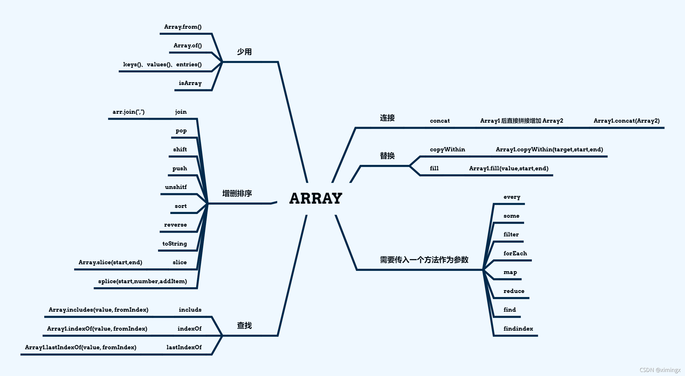

#### 数组的方法清单

######## 数组的类型相关

| 方法                             | 描述                               | 备注 |
| :------------------------------- | :--------------------------------- | :--- |
| Array.isArray()                  | 判断是否为数组                     |      |
| toString()                       | 将数组转换为字符串                 |      |
| Array.from(arrayLike)            | 将**伪数组**转化为**真数组**       |      |
| Array.of(value1, value2, value3) | 创建数组：将**一系列值**转换成数组 |      |

注意，获取数组的长度是用`length`属性，不是方法。

######## 数组元素的添加和删除

| 方法      | 描述                                                         | 备注           |
| :-------- | :----------------------------------------------------------- | :------------- |
| push()    | 向数组的**最后面**插入一个或多个元素，返回结果为新数组的**长度** | 会改变原数组   |
| pop()     | 删除数组中的**最后一个**元素，返回结果为**被删除的元素**     | 会改变原数组   |
| unshift() | 在数组**最前面**插入一个或多个元素，返回结果为新数组的**长度** | 会改变原数组   |
| shift()   | 删除数组中的**第一个**元素，返回结果为**被删除的元素**       | 会改变原数组   |
|           |                                                              |                |
| slice()   | 从数组中**提取**指定的一个或多个元素，返回结果为**新的数组** | 不会改变原数组 |
| splice()  | 从数组中**删除**指定的一个或多个元素，返回结果为**被删除元素组成的新数组** | 会改变原数组   |
|           |                                                              |                |
| fill()    | 填充数组：用固定的值填充数组，返回结果为**原数组本身**（已被填充修改） | 会改变原数组   |

######## 数组的合并和拆分

| 方法     | 描述                                                 | 备注             |
| :------- | :--------------------------------------------------- | :--------------- |
| concat() | 合并数组：连接两个或多个数组，返回结果为**新的数组** | 不会改变原数组   |
| join()   | 将数组转换为字符串，返回结果为**转换后的字符串**     | 不会改变原数组   |
| split()  | 将字符串按照指定的分隔符，组装为数组                 | 不会改变原字符串 |

注意，`split()`是字符串的方法，不是数组的方法。

######## 数组排序

| 方法      | 描述                                                    | 备注         |
| :-------- | :------------------------------------------------------ | :----------- |
| reverse() | 反转数组，返回结果为**反转后的数组**                    | 会改变原数组 |
| sort()    | 对数组的元素,默认按照**Unicode 编码**，从小到大进行排序 | 会改变原数组 |

######## 查找数组的元素

| 方法                  | 描述                                                         | 备注                                                     |
| :-------------------- | :----------------------------------------------------------- | :------------------------------------------------------- |
| indexOf(value)        | 从前往后索引，检索一个数组中是否含有指定的元素               |                                                          |
| lastIndexOf(value)    | 从后往前索引，检索一个数组中是否含有指定的元素               |                                                          |
| includes(item)        | 数组中是否包含指定的内容                                     |                                                          |
| find(function())      | 找出**第一个**满足「指定条件返回 true」的元素                |                                                          |
| findIndex(function()) | 找出**第一个**满足「指定条件返回 true」的元素的 index        |                                                          |
| every()               | 确保数组中的每个元素都满足「指定条件返回 true」，则停止遍历，此方法才返回 true | 全真才为真。要求每一项都返回 true，最终的结果才返回 true |
| some()                | 数组中只要有一个元素满足「指定条件返回 true」，则停止遍历，此方法就返回 true | 一真即真。只要有一项返回 true，最终的结果就返回 true     |

######## 遍历数组

| 方法      | 描述                                                         | 备注                                                   |
| :-------- | :----------------------------------------------------------- | :----------------------------------------------------- |
| for 循环  | 这个大家都懂                                                 |                                                        |
| forEach() | 和 for 循环类似，但它是 ES5 方法，IE9 以下（IE8 及更老）不支持 | forEach() 没有返回值。也就是说，它的返回值是 undefined |
| map()     | 对原数组中的每一项进行加工，将组成新的数组(最后的结果可能会含有undefined) | 不会改变原数组                                         |
| filter()  | 过滤数组：返回结果是 true 的项，将组成新的数组，返回结果为**新的数组** | 不会改变原数组                                         |
| reduce    | 接收一个函数作为累加器，返回值是回调函数累计处理的结果       |                                                        |


---

#### concat()

**返回结果: Array1 后直接拼接增加 Array2**

该方法不会改变现有的数组，而仅仅会返回被连接数组的一个副本。

Array2 的位置可以有多个数组,最后都将合并

**arrayObject.concat(arrayX,arrayX,......,arrayX)**

```js
let Array1 = [1, 2, 3, 4, 5];
let Array2 = ['a', 'b', 'c', 'd', 'e'];
let Array3 = Array1.concat(Array2);
console.log(Array3);
// 打印结果：
// [ 1, 2, 3, 4, 5, 'a', 'b', 'c', 'd', 'e' ]
// 原数组不改变
console.log(Array1);
// [ 1, 2, 3, 4, 5 ]
// 可以拼接多个数组
console.log(Array1.concat(Array2, Array1));
// [ 1, 2, 3, 4, 5, 'a', 'b', 'c', 'd', 'e', 1, 2, 3, 4, 5 ]
```

当然,拼接数组一般可以选择更简单的方式 `... `

```js
let arr1 = [1, 2, 3, 4];
let arr2 = [5, 6, 7, 8, 9, 1];
arr1.push(...arr2);
console.log(arr1);
console.log(arr2);
// 打印结果：
// [ 1, 2, 3, 4, 5, 6, 7, 8, 9, 1 ]
// [ 5, 6, 7, 8, 9, 1 ]
```

注意: 

```js
console.log(arr1.push(...arr2));// 返回的是数组的长度
```

#### copyWithin()

使用这个方法，**会修改当前数组。**

**start 索引位到 end 索引位之前(不包含end索引位)的值将依次替换掉 traget 索引位起的值 (start - end中间有几位,就替换几位 )      （会覆盖原有成员）**

**Array1.copyWithin(target,start,end)**

| 参数   | 描述                                                         |
| ------ | ------------------------------------------------------------ |
| target | 必填。复制到指定目标索引位置。                               |
| start  | 选填。元素复制的起始位置。默认为 0 ，如果为负值，表示倒数。  |
| end    | 选填。停止复制的索引位置。默认为array.length。如果为负值，表示倒数。 |

```js
let Array1 = [1, 2, 3, 4, 5, 6];
let Array2 = ['a', 'b', 'c', 'd', 'e', 'f'];
let Array3 = Array1.concat(Array2).copyWithin(1, 3, 5);
console.log(Array3);
// 打印结果：
// [ 1, 4, 5, 4, 5, 6, 'a', 'b', 'c', 'd', 'e', 'f' ]
// 省略第三个参数，将会从第二个参数到最后全部修改
console.log(Array1.copyWithin(0, 1));
// [ 2, 3, 4, 5, 6, 6 ]
console.log([1, 2, 3, 4, 5].copyWithin(0, -2, -1));
// [ 4, 2, 3, 4, 5 ]
```

#### every()

js中every和some都是对数组进行迭代操作的函数

**检测数组所有元素是否都符合every()里的函数,有一个不满足就返回false,全符合返回true,并停止检测**

**Array1.every((item) => {return condition})**

```js
let Array1 = [1, 2, 3, 4, 5, 6];
let Array2 = [2, 3, 4, 5];
let Array3 = Array1.concat(Array2);
Array3 = Array3.every((item) => {
  return item >= 2;
});
console.log(Array3);
// false
```

#### some()

**检测数组中是否至少有一个元素符合条件：只要有一个满足就返回 true，并停止检测；全部不满足才返回 false**

**Array1.some((item) => {return condition})**

```js
let Array1 = [1, 2, 3, 4, 5, 6];
let Array2 = [2, 3, 4, 5];
let Array3 = Array1.concat(Array2);
Array3 = Array3.some((item) => {
  return item >= 2;
});
console.log(Array3);
// true
```

#### fill()

**使用固定的值来填充数组,value为填充值,start 索引位到 end 索引位之前(不包含end索引位)的值被 value 替换**

**Array1.fill(value,start,end)**

```js
let Array1 = [1, 2, 3, 4, 5, 6];
let Array2 = [2, 3, 4, 5];
let Array3 = Array1.concat(Array2);
Array3 = Array3.fill("x", 1, 2);
console.log(Array3);
// 打印结果：
// [ 1, 'x', 3, 4, 5, 6, 2, 3, 4, 5 ]
let arr1 = [1, 2, 3, 4, 56, 7, 7, 8, 9];
arr1.fill(4, 2, 5);
console.log(arr1); // [1, 2, 4, 4, 4, 7, 7, 8, 9]
let arr2 = [1, 2, 3, 4, 56, 7, 7, 8, 9];
arr2.fill(4);
console.log(arr2); // [4, 4, 4, 4, 4, 4, 4, 4, 4]
```

#### filter()

**检测指定的数组中所有符合条件的元素，并将满足的值返回新的数组。**

**Array1.filter((item) => {return condition})**

```js
let Array1 = [1, 2, 3, 4, 5, 6];
let Array2 = [2, 3, 4, 5];
let Array3 = Array1.concat(Array2);
Array3 = Array3.fill("1", 1, 2);
let Array4 = Array3.filter((item) => {
  return item >= 2;
});
console.log(Array4);
// 打印结果：
// [ 3, 4, 5, 6, 2, 3, 4, 5 ]
```

#### find()

**语法**：

```javascript
find((item, index, arr) => {    return true;});
```


**返回通过函数判断的数组的  第一个元素的值  。**

如果没有符合条件的元素返回 undefined ,  find() 对于空数组，函数是不会执行的。

**Array1.find((item) => {return condition})**

```js
let Array2 = [2, 3, 4, 5];
console.log(
  Array2.find((item) => {
    return item >= 3;
  })
);
// 3
```

#### findindex()

**与 find() 方法相似,返回的结果为索引位置,返回通过函数判断的数组的  第一个元素的索引位置  。**

**Array1.findIndex((item) => {return condition})**

```js
let Array2 = [2, 3, 4, 5];
console.log(
  Array2.findIndex((item) => {
    return item >= 3;
  })
);
// 1
```

#### forEach()

**有三个参数  值,索引,和当前的数组  对每个元素进行一次调用**

**Array2.forEach((item,index,arr) => {return condition})**

```js
let Array2 = [2, 3, 4, 5];
Array2.forEach((item, index, arr) => {
  item = item * index;
  console.log(item);
});
// 0
// 3
// 8
// 15
```

forEach可以使用return中止这一层循环后续的代码执行 , **但是不能使用break**

forEach无法在所有元素都传递给调用的函数之前终止（而for循环却有break方法），**如果要提前终止**，必须把forEach放在try块中，并能抛出一个异常。

如果forEach()调用的函数抛出foreach.break异常，循环会提前终止

#### includes()

**判断一个数组是否包含一个指定的值，如果是返回true，否则返回false**

**注意：对象数组不能使用includes方法来检测,使用 includes()比较字符串和字符时是区分大小写。**

**Array1.includes(value, fromIndex)**

includes可以包含两个参数，**第二个参数表示判断的起始位置,起始位置第一个数字是0。**

```js
console.log([1, 2, 3, 4].includes(1)); // true
console.log([1, 2, 3, 4].includes(5)); // false
console.log([1, 2, 3, 4].includes(1, 0)); // true
console.log([1, 2, 3, 4].includes(2, 2)); // false
console.log([1, 2, 3, 4].includes(3, 2)); // true
```

#### indexOf()

**该方法将从头到尾地检索数组，看它是否含有对应的元素。如果找到一个 item，则返回 item 的第一次出现的位置。开始位置的索引为 0。**
**如果在数组中没找到指定元素则返回 -1。**

第二个参数 从第几位开始

**Array1.indexOf(value, fromIndex)**

```js
let arr=["a","b","c","a","b","c"];console.log(arr.indexOf("a", 2)); //3
```

#### isArray()

**判断一个对象是否为数组。返回bool值。**
**Array.isArray(obj)**

```js
let arr=["a","b","c","a","b","c"];console.log(Array.isArray(arr)); // true
```

#### join()

**把数组中的所有元素转换为一个字符串，元素通过分隔符分隔。**
**若没有指定分隔符则用逗号来分隔元素。**

**传入undefined会默认用逗号分隔。**

```js
let arr = ['a', 'b', 'c', 'a', 'b', 'c'];
console.log(arr.join()); // a,b,c,a,b,c
console.log(arr.join(",")); // a,b,c,a,b,c
console.log(arr.join(".")); // a.b.c.a.b.c
console.log(arr.join("-")); // a-b-c-a-b-c
```

#### lastIndexOf()

**返回一个指定的元素在数组中最后出现的位置，从后向前查找。若没有找到，则返回-1。**
**数组的检索位置从0开始。**

```js
let arr = ["a", "b", "c", "a", "b", "c"];
console.log(arr.lastIndexOf("a")); // 3
console.log(arr.lastIndexOf("a", 2)); // 0
```

#### map()

**通过指定函数处理数组的每个元素，并返回处理后的数组。**

```js
let arr = ["a", "b", "c", "a", "b", "c"];
let Array1 = arr.map((item) => {
  return (item = item + 1);
});
console.log(Array1);
// [ 'a1', 'b1', 'c1', 'a1', 'b1', 'c1' ]
let array1 = [1, 4, 9, 16];
const map1 = array1.map((x) => {
  if (x === 4) {
    return x * 2;
  }
});
console.log(map1);
// [ undefined, 8, undefined, undefined ]
```

map()方法创建了一个新数组，但新数组并不是在遍历完array1后才被赋值的，而是**每遍历一次就得到一个值**

```js
var array1 = [1, 4, 9, 16];
const map1 = array1.map((x) => {
    if (x == 4) {
        return x * 2;
    }
});
console.log(map1); // > Array [undefined, 8, undefined, undefined]
```

#### pop()

**pop()删除并返回数组的最后一个元素。**

**影响原数组** 

如果数组变为空，则该方法不改变数组，返回 undefined 值

```js
let arr=["a","b","c","a","b","c"];console.log(arr.pop()); //c
```

#### shift()

**shift()删除并返回数组的第一个元素。**

**影响原数组** 

```js
let arr=["a","b","c","a","b","c"];console.log(arr.shift()); //a
```

#### push()

**push()向数组的末尾添加一个或多个元素，并返回该数组的新长度。**

```js
let arr = ['a', 'b', 'c', 'a', 'b', 'c'];
console.log(arr.push('1')); // 7
let Array1 = arr.push("b");
console.log(Array1); // 8
let array1 = [1, 4, 9, 16];
array1.push("1", "2", "3", "4");
console.log(array1);
// [ 1, 4, 9, 16, '1', '2', '3', '4' ]
```

#### unshift()

**unshift() 向数组的开头添加一个或多个元素，并返回数组的新长度。**（注意拼写是 `unshift`，不是 `unshitf`）

```js
let arr = ["a", "b", "c", "a", "b", "c"];
console.log(arr.unshift("a")); // 7
console.log(arr); // [ 'a', 'a', 'b', 'c', 'a', 'b', 'c' ]
```

#### reduce()

**reduce 有两个参数 ,第一个参数为 callback 函数 ,第二个参数 是初始值**

**callback 函数中有四个参数(上一次回调时返回的值,当前的值,当前索引,原数组)**

**arr.reduce(callback(accumulator, currentValue[, index[, array]])[, initialValue])**

**这个很容易,不要被误导很难的想法**

相当于一个累加的效果,将前面运算的结果与当前的值进行运算

```js
let arr = ["a", "b", "c", "a", "b", "c"];
let Array = arr.reduce((pre, now, index, arr) => {
  return pre + now;
}, 0);
console.log(Array);
// 0abcabc
Array = arr.reduce((pre, now, index, arr) => {
  return pre + pre;
}, 0);
console.log(Array);
// 0
arr = [1, 2, 3, 4, 5, 6, 10];
Array = arr.reduce((pre, now, index, arr) => {
  return pre + now;
}, 0);
console.log(Array);
// 31
```

一个数组去重的实现

```js
let arr = [1, 2, 3, 3, 4, 2];
let newArr = arr.reduce((pre, cur) => {
  if (!pre.includes(cur)) {
    return pre.concat(cur);
  } else {
    return pre;
  }
}, []);
console.log(newArr);
```

在对象中的使用

```js
let arr = [
  { subject: 'math', score: 10 },
  { subject: 'chinese', score: 20 },
  { subject: 'english', score: 310 },
];
let sum = arr.reduce((pre, cur) => {
  return cur.score + pre;
}, 0);
console.log(sum); // 340
```

######## reduce() 的常见应用

**举例 1**、求和：

计算数组中所有元素项的总和。代码实现：

```javascript
const arr = [2, 0, 1, 9, 6];
// 数组求和
const total = arr.reduce((prev, item) => {
  return prev + item;
});
console.log('total:' + total); // 打印结果：18
```

**举例 2**、统计某个元素出现的次数：

代码实现：

```js
// 定义方法：统计 value 这个元素在数组 arr 中出现的次数
function repeatCount(arr, value) {
  if (!arr || arr.length == 0) return 0;
  return arr.reduce((totalCount, item) => {
    totalCount += item == value ? 1 : 0;
    return totalCount;
  }, 0);
}
let arr1 = [1, 2, 6, 5, 6, 1, 6];
console.log(repeatCount(arr1, 6)); // 打印结果：3
```

**举例 3**、求元素的最大值：

代码实现：

```js
const arr = [2, 0, 1, 9, 6];
// 数组求最大值
const maxValue = arr.reduce((prev, item) => {
  return prev > item ? prev : item;
});
console.log(maxValue); // 打印结果：9
```


#### sort()

**sort()对数组的元素进行排序。排序顺序可以是字母或数字，并按升序或降序，默认按字母升序。**

**在使用sort()方法时，可以使用箭头函数,比较好看**

```js
array.sort((a, b) => b - a);
```

**如果在使用 sort() 方法时不带参，则默认按照Unicode 编码，从小到大进行排序。**

```js
var fruits = ["Banana", "Orange", "Apple", "Mango"];fruits.sort();console.log(fruits,'fruits')
```

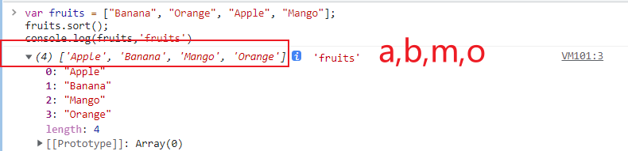


对数字排序

```js
var numbers = [8,13,5,7,0,20,6,1];numbers.sort();console.log(numbers)
```


**可以看出对数值的排序并不是理想状态**

此时打印出来的数组并不是按照升序进行排序，上面说到sort()默认是按照Unicode编码进行排序，

所以即使13 < 20，13也会在20的前面，因为13的第一位是1。

**数字与字母混合排序**

```js
var minx = [8,13,5,7,0,20,6,1,"Banana", "Orange", "Apple", "Mango"];minx.sort();console.log(minx)
```

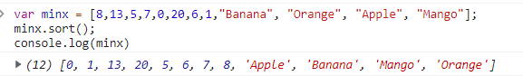


```js
let arr = ['General', 'Tom', 'Bob', 'John', 'Army'];
let resArr = arr.sort();
console.log(resArr); // 输出：["Army", "Bob", "General", "John", "Tom"]
let arr2 = [30, 10, 111, 35, 1899, 50, 45];
let resArr2 = arr2.sort();
console.log(resArr2); // 输出：[10, 111, 1899, 30, 35, 45, 50]
```

使用数字排序，你必须通过一个函数作为参数来调用。

**<font color="red">原理:  (理解了原理随便玩)</font>**

**sort()里面的函数返回值如果大于0，则a、b交换位置；（数组原本位置为a在b的前面）**

如果返回值小于0，则a、b不交换位置；

如果返回值等于0，则a、b的位置不变。

**简单的记忆: a-b是升序,b-a是降序**

**升序排列**

```js
let arr = [20, 20, 4, 22, 23];
console.log(
  arr.sort(function (a, b) {
    // 升序
    return a - b;
  })
); // [ 4, 20, 20, 22, 23 ]
```

**降序排列**

```js
let arr = [20, 20, 4, 22, 23];
console.log(
  arr.sort(function (a, b) {
    // 降序
    return b - a;
  })
); // [ 23, 22, 20, 20, 4 ]
```

**多排序**

```js
let arr6 = [
  { id: 10, age: 2 },
  { id: 5, age: 4 },
  { id: 6, age: 10 },
  { id: 9, age: 6 },
  { id: 2, age: 8 },
  { id: 10, age: 9 },
];
arr6.sort(function (a, b) {
  if (a.id === b.id) {
    // 如果 id 相同，按照 age 的降序
    return b.age - a.age;
  } else {
    return a.id - b.id;
  }
});
console.log(arr6);
// 输出新的排序：
// {id: 2, age: 8}
// {id: 5, age: 4}
// {id: 6, age: 10}
// {id: 9, age: 6}
// {id: 10, age: 9}
// {id: 10, age: 2}
```


#### reverse()

**reverse()反转数组的元素顺序。**

```js
let arr=["b","o","a","m"];arr.sort(); //字母升序arr.reverse(); //反转顺序console.log(arr)// o,m,b,a
```

#### slice()

**选取数组的一部分，并返回新数组。**

如果是负数，则表示从数组尾部开始算起

```js
let arr = ["b", "o", "a", "m"];
console.log(arr.slice(1, 3)); // [ 'o', 'a' ]
arr = ["b", "o", "a", "m"];
console.log(arr.slice(1)); // [ 'o', 'a', 'm' ]
```

```js
let arr=["b","o","a","m","c"];console.log(arr.slice(-3, -1));  //[ 'a', 'm' ]
```

#### splice()   !important

**从数组中添加或删除更改元素,注意: 会改变原始数组,返回删除的元素  个人最喜欢使用的方法**

**array.splice(index,deleteNumber,item1,item2)**

**其中的参数第一个是操作的数组下标index，而第二个是删除个数，之后的  可选参数  是增加内容**

**1. 删除操作**

splice(0) 会把原数组清空。

```js
let arr = ["b", "o", "a", "m"];
arr.splice(0);
console.log(arr);
// []
let array = ["a", "b", "c", "d", "e", "1"];
console.log(array.splice(0, 2));
console.log(array);
// [ 'a', 'b' ]
// [ 'c', 'd', 'e', '1' ]
```

> 举例4\：（删除指定元素，用得很多）

```js
const arr4 = ['a', 'b', 'c', 'd'];arr4.splice(arr4.indexOf('c'), 1); // 删除数组中的'c'这个元素
```


**2. 增加操作**

```js
let array = ["a", "b", "c", "d", "e", "1"];
console.log(array.splice(0, 0, "23"));
console.log(array);
// []
// [ '23', 'a', 'b', 'c', 'd', 'e', '1' ]
```

**3. 修改操作**

```js
let array = ["a", "b", "c", "d", "e", "1"];
console.log(array.splice(2, 0, "23"));
console.log(array);
// []
// [ 'a', 'b', '23', 'c', 'd', 'e', '1' ]
```

######## splice()练习：数组去重

代码实现：

```javascript
// 创建一个数组
var arr = [1, 2, 3, 2, 2, 1, 3, 4, 2, 5];
// 去除数组中重复的数字
// 获取数组中的每一个元素
for (var i = 0; i < arr.length; i++) {
  // console.log(arr[i]);
  /* 获取当前元素后的所有元素 */
  for (var j = i + 1; j < arr.length; j++) {
    // console.log("---->" + arr[j]);
    // 判断两个元素的值是否相等
    if (arr[i] == arr[j]) {
      // 如果相等则证明出现了重复的元素，则删除 j 对应的元素
      arr.splice(j, 1);
      // 当删除了当前 j 所在的元素以后，后边的元素会自动补位
      // 此时将不会再比较这个元素，我需要再比较一次 j 所在位置的元素
      // 使 j 自减
      j--;
    }
  }
}
console.log(arr);
```


#### toString()

**将数组转化成字符串**

```js
let arr=["b","o","a","m"];console.log(arr.toString())// b,o,a,m
```

#### Array.from()

> **伪数组**：包含 length 属性的对象或可迭代的对象。
> 另外，伪数组的原型链中没有 Array.prototype，而真数组的原型链中有  Array.prototype。因此伪数组没有数组的一般方法，比如 pop()、join() 等方 法。

用于类似数组的对象（**必须拥有length属性的对象**）和可遍历对象转为真正的数组。

**注意下面的三种结果差别**

```js
let json1 = {
  "0": "123",
  "1": "123",
  "2": "123",
};
let json2 = {
  "1": "123",
  "2": "123",
  "3": "123",
  length: 3,
};
let json3 = {
  "0": "123",
  "1": "123",
  "2": "123",
  length: 3,
};
let arr1 = Array.from(json1);
let arr2 = Array.from(json2);
let arr3 = Array.from(json3);
console.log(arr1);
console.log(arr2);
console.log(arr3);
// []
// [ undefined, '123', '123' ]
// [ '123', '123', '123' ]
```

将字符串转换为数组

```js
let array1 = "alone to find";
console.log(Array.from(array1));
// 打印结果：
// [ 'a', 'l', 'o', 'n', 'e', ' ', 't', 'o', ' ', 'f', 'i', 'n', 'd' ]
```

伪数组的举例

######## 

```html
<body>
    <button>按钮1</button>
    <button>按钮2</button>
    <button>按钮3</button>
    <script>
        let btnArray = document.getElementsByTagName('button');
        console.log(btnArray);
        console.log(btnArray[0]);
    </script>
</body>
```

上面的布局中，有三个 button 标签，我们通过`getElementsByTagName`获取到的`btnArray`实际上是**伪数组**，并不是真实的数组

**但是如果我们想要用到数组的方法该怎么办呢?**

解决办法：采用`Array.from`方法将`btnArray`这个伪数组转换为真数组即可：

```javascript
Array.from(btnArray);
```

然后就可以使用数组的一般方法了

#### Array.of()

**将一组值转变为数组**

```js
let arr1 = Array.of(1, 2, 3);
let arr2 = Array.of([1, 2, 3]);
let arr3 = Array.of({ "1": "1" });
let arr4 = Array.of();
console.log(arr1);
console.log(arr2);
console.log(arr3);
console.log(arr4);
// [ 1, 2, 3 ]
// [ [ 1, 2, 3 ] ]
// [ { '1': '1' } ]
// []
```

补充：`new Array()`和 `Array.of()`的区别在于：当参数只有一个时，前者表示数组的长度，后者表示数组中的内容。

#### keys()、values()、entries()

这三个方法都是返回一个遍历器对象，可用for...of循环遍历，**唯一区别：keys()是对键名的遍历、values()对键值的遍历、entries()是对键值对的遍历。**

```js
let arr = ['a', 'b', 'c', 'd'];
for (let i of arr.keys()) {
  console.log(i);
}
// 0
// 1
// 2
// 3
for (let i of arr.values()) {
  console.log(i);
}
// a
// b
// c
// d
for (let i of arr.entries()) {
  console.log(i);
}
// [ 0, 'a' ]
// [ 1, 'b' ]
// [ 2, 'c' ]
// [ 3, 'd' ]
```


### 5. 关于数组的练习

```js
let arr = [[1,2,3,4],[4,3,4,3],[[[123,23],[12,23,34]],[12,22,1]]]
```

使一个多维数组变成一维数组, 要得到数组的最终形式

```js
arr = [   1,  2,   3,  4,  4,  3,   4,  3, 123, 23, 12, 23,  34, 12,  22,  1]
```

实现方法:

```js
let arr = [
  [1, 2, 3, 4],
  [4, 3, 4, 3],
  [
    [
      [123, 23],
      [12, 23, 34],
    ],
    [12, 22, 1],
  ],
];
function flat(arr) {
  let result = [];
  arr.map((item) => {
    if (Array.isArray(item)) {
      result = result.concat(flat(item));
    } else {
      result.push(item);
    }
  });
  return result;
}
console.log(flat(arr));
// [ 1, 2, 3, 4, 4, 3, 4, 3, 123, 23, 12, 23, 34, 12, 22, 1 ]
```

## Number

### parseInt()

**parseInt()具有以下特性**：

（1）parseInt()、parseFloat()会将传入的数据当作**字符串**来处理。也就是说，如果对**非 String**使用 parseInt()、parseFloat()，它会**先将其转换为 String** 然后再操作。【重要】

比如：

```javascript
var a = 168.23;
console.log(parseInt(a)); // 打印结果：168 （因为是先将 a 转为字符串 "168.23"，然后再操作）
var b = true;
console.log(parseInt(b)); // 打印结果：NaN （因为是先将 b 转为字符串 "true"，然后再操作）
var c = null;
console.log(parseInt(c)); // 打印结果：NaN （因为是先将 c 转为字符串 "null"，然后再操作）
var d = undefined;
console.log(parseInt(d)); // 打印结果：NaN （因为是先将 d 转为字符串 "undefined"，然后再操作）
```


（2）**只保留字符串最开头的数字**，后面的中文自动消失。例如：

```javascript
console.log(parseInt('2017在公众号上写了6篇文章')); // 打印结果：2017
console.log(parseInt('2017.01在公众号上写了6篇文章')); // 打印结果仍是：2017 （说明只会取整数）
console.log(parseInt('aaa2017.01在公众号上写了6篇文章')); // 打印结果：NaN （因为不是以数字开头）
```


（3）自动截断小数：**取整，不四舍五入**。

例 1：

```javascript
var a = parseInt(5.8) + parseInt(4.7);console.log(a);
```

打印结果：

```bash
9
```

例 2：

```javascript
var a = parseInt(5.8 + 4.7);console.log(a);
```

打印结果：

```javascript
10;
```

（4）带两个参数时，表示在转换时，包含了进制转换。

代码举例：

```javascript
var a = '110';var num = parseInt(a, 16); // 【重要】将 a 当成 十六进制 来看待，转换成 十进制 的 numconsole.log(num);
```

打印结果：

```bash
272
```

如果你对打印结果感到震惊，请仔细看上面的代码注释。就是说，无论 parseInt() 里面的进制参数是多少，最终的转换结果是十进制。

我们来看下面的代码，打印结果继续震惊。

```javascript
var a = '5';
var num = parseInt(a, 2); // 将 a 当成二进制来看待，转换成十进制的 num
console.log(num); // 打印结果：NaN。因为二进制中没有 5 这个数，转换失败。
```

---

就拿`Number(true)` 和 `parseInt(true)/parseFloat(true)`来举例，二者在使用时，是有区别的：

-   Number(true) ：千方百计地想转换为数字；如果转换不了则返回 NaN。

-   parseInt(true)/parseFloat(true) ：提取出最前面的数字部分；没提取出来，那就返回 NaN。

### NaN遇到的坑

**举例 1**：

```javascript
var a = 'abc';
a++;
console.log(typeof a); // 打印结果：number
console.log(a); // 打印结果：NaN。因为 Number('abc') 的结果为 NaN，再自增后，结果依然是 NaN
```

## Boolean

### 转换结果列举【重要】

其他的数据类型都可以转换为 Boolean 类型。无论是隐式转换，还是显示转换，转换结果都是一样的。有下面几种情况：

（1）情况一：数字 --> 布尔。 0 和 NaN是 false，其余的都是 true。比如 `Boolean(NaN)`的结果是 false。

（2）情况二：字符串 ---> 布尔。空串是false，其余的都是 true。全是空格的字符串，转换结果也是 true。字符串`'0'`的转换结果也是 true。

（3）情况三：null 和 undefined 都会转换为 false。

（4）情况四：**引用数据类型会转换为 true。注意，空数组`[]`和空对象`{}`，转换结果也是 true，这一点，很多人都不知道。**

## Object

### 对象的基本操作

#### 创建对象

使用 new 关键字调用的函数，是构造函数 constructor。**构造函数是专门用来创建对象的函数**。

例如：

```javascript
var obj = new Object();
```

记住，使用`typeof`检查一个对象时，会返回`object`。

关于常见对象的更多方式，可以看上一篇文章《对象的创建&构造函数》。

#### 向对象中添加属性

在对象中保存的值称为属性。

向对象添加属性的语法：

```javascript
对象.属性名 = 属性值;
```

举例：

```javascript
var obj = new Object();
// 向 obj 中添加一个 name 属性
obj.name = '孙悟空';
// 向 obj 中添加一个 gender 属性
obj.gender = '男';
// 向 obj 中添加一个 age 属性
obj.age = 18;
console.log(JSON.stringify(obj)); // 将 obj 以字符串的形式打印出来
```

打印结果：

```
{ "name": "孙悟空", "gender": "男", "age": 18 }
```

#### 获取对象中的属性

**方式 1**：

语法：

```javascript
对象.属性名;
```

如果获取对象中没有的属性，不会报错而是返回`undefined`。

举例：

```javascript
var obj = new Object();
// 向 obj 中添加一个 name 属性
obj.name = '孙悟空';
// 向 obj 中添加一个 gender 属性
obj.gender = '男';
// 向 obj 中添加一个 age 属性
obj.age = 18;
// 获取对象中的属性，并打印出来
console.log(obj.gender); // 打印结果：男
console.log(obj.color); // 打印结果：undefined
```

**方式 2**：可以使用`[]`这种形式去操作属性

对象的属性名不强制要求遵守标识符的规范，不过我们尽量要按照标识符的规范去做。

但如果确实要使用特殊的属性名，就不能采用`.`的方式来操作对象的属性。比如说，`123`这种属性名，如果我们直接写成`obj.123 = 789`来操作属性，是会报错的。那怎么办呢？办法如下：

语法格式如下：（读取时，也是采用这种方式）

```javascript
// 注意，括号里的属性名，必须要加引号对象['属性名'] = 属性值;
```

上面这种语法格式，举例如下：

```javascript
obj['123'] = 789;
```

**重要**：使用`[]`这种形式去操作属性，更加的灵活，因为，我们可以在`[]`中直接传递一个**变量**。

#### 修改对象的属性值

语法：

```javascript
对象.属性名 = 新值;
```

```javascript
obj.name = 'tom';
```

#### 删除对象的属性

语法：

```javascript
delete obj.name;
```

#### in 运算符

通过该运算符可以检查一个对象中是否含有指定的属性。如果有则返回 true，没有则返回 false。

语法：

```javascript
'属性名' in 对象;
```

举例：

```javascript
//检查对象 obj 中是否含有name属性console.log('name' in obj);
```

我们平时使用的对象不一定是自己创建的，可能是从接口获取的，这个时候，in 运算符可以派上用场。

当然，还有一种写法可以达到上述目的：

```js
if (obj.name) {
  // 如果对象 obj 中有 name 属性，我就继续做某某事情。
}
```

#### Object.freeze() 冻结对象

Object.freeze() 方法可以冻结一个对象。一个被冻结的对象再也不能被修改；冻结了一个对象则不能向这个对象添加新的属性，不能删除已有属性，不能修改该对象已有属性的可枚举性、可配置性、可写性，以及不能修改已有属性的值。此外，冻结一个对象后该对象的原型也不能被修改。freeze() 返回和传入的参数相同的对象。

代码举例：

```js
const params = {
  name: 'ximingx',
  port: '8899',
};
Object.freeze(params); // 冻结对象 params
params.port = '8080'; // 修改无效
```

> 注意：对象字面量里各属性之间要用**逗号**分隔，不是分号。上方代码第一行原文误写成了 `name: 'ximingx';`，会直接报语法错误。

上方代码中，把 params 对象冻结后，如果想再改变 params 里面的属性值，是无效的。

### 遍历操作

#### for of：遍历数组


ES6 中，如果我们要遍历一个数组，可以这样做：

```js
let arr1 = [2, 6, 8, 5];for (let value of arr1) {    console.log(value);}
```

打印结果：


```js
2685
```


for ... of 的循环可以避免我们开拓内存空间，增加代码运行效率，所以建议大家在以后的工作中使用 for…of 遍历数组。

注意，上面的数组中，`for ... of`获取的是数组里的值；如果采用`for ... in`遍历数组，则获取的是 index 索引值。

#### Map 对象的遍历

`for ... of`既可以遍历数组，也可以遍历 Map 对象。

#### for in：遍历对象的属性

> `for ... in`主要用于遍历对象，不建议用来遍历数组。

语法：

```javascript
for (const 变量 in 对象) {}
```

解释：对象中有几个属性，循环体就会执行几次。每次执行时，会将对象中的**每个属性的 属性名 赋值给变量**。

语法举例：

```javascript
for (var key in obj) {
  console.log(key); // 这里的 key 是：对象属性的键（也就是属性名）
  console.log(obj[key]); // 这里的 obj[key] 是：对象属性的值（也就是属性值）
}
```

#### for in 遍历数组（不建议）

另外，for in 当然也可以用来遍历数组（只是不建议），此时的 key 是数组的索引。举例如下：

```js
const arr = ['hello1', 'hello2', 'hello3'];
for (const key in arr) {
  console.log('属性名：' + key);
  console.log('属性值：' + arr[key]);
}
```

打印结果：

```
属性名：0 属性值：hello1
属性名：1 属性值：hello2
属性名：2 属性值：hello3
```

### 深拷贝 浅拷贝

-   浅拷贝：只拷贝最外面一层的数据；更深层次的对象，只拷贝引用。

-   深拷贝：拷贝多层数据；每一层级别的数据都会拷贝。

**总结**：

**浅拷贝的时候如果数据是基本数据类型，那么就如同直接赋值那种，会拷贝其本身，如果除了基本数据类型之外还有一层对象，那么对于浅拷贝而言就只能拷贝其引用，对象的改变会反应到拷贝对象上；但是深拷贝就会拷贝多层，即使是嵌套了对象，也会都拷贝出来。**

拷贝引用的时候，是属于**传址**，而非**传值**。

深拷贝会把对象里**所有的数据**重新复制到新的内存空间，是最彻底的拷贝。

#### 用 for in 实现浅拷贝（比较繁琐）

```js
const obj1 = { name: 'ximingx', age: 28, info: { msg: '~ ~ ~' } };
const obj2 = {};
// 用 for in 将 obj1 的值拷贝给 obj2
for (let key in obj1) {
  obj2[key] = obj1[key];
}
console.log('obj2:' + JSON.stringify(obj2));
obj1.age = 20;
obj1.info.msg = 'aw'; // 当修改 obj1 的第二层数据时，obj2 的值也会被改变。所以 for in 是浅拷贝
console.log('obj2:' + JSON.stringify(obj2));
```

上方代码中，用 for in 做拷贝时，只能做到浅拷贝。也就是说，在 obj2 中， name 和 age 这两个属性会单独存放在新的内存地址中，和 obj1 没有关系。但是，`obj2.info` 属性，跟 `obj1.info` 属性，**它俩指向的是同一个堆内存地址**。所以，当我修改 `obj1.info.msg` 里的值之后，`obj2.info.msg` 的值也会被修改。

打印结果如下：

```
obj2:{"name":"ximingx","age":28,"info":{"msg":"~ ~ ~"}}
obj2:{"name":"ximingx","age":28,"info":{"msg":"aw"}}
```

#### 用 Object.assign() 实现浅拷贝（推荐的方式）

上面的 for in 方法做浅拷贝过于繁琐。ES6 给我们提供了新的语法糖，通过 `Object.assign()` 可以实现**浅拷贝**。（注意拼写是 `assign`，不是 `assgin`）

`Object.assign()` 在日常开发中，使用得相当频繁，非掌握不可。

**语法**：

```js
// 语法1
obj2 = Object.assign(obj2, obj1);
// 语法2（伪代码：目标对象、源对象1、源对象2……）
// Object.assign(目标对象, 源对象1, 源对象2...);
```

**解释**：将`obj1` 拷贝给 `obj2`。执行完毕后，obj2 的值会被更新。

**作用**：将 obj1 的值追加到 obj2 中。如果对象里的属性名相同，会被覆盖。

从语法2中可以看出，Object.assign() 可以将多个“源对象”拷贝到“目标对象”中。

**例 1**：

```js
const obj1 = { name: 'ximingx', age: 20, info: { desc: 'hello' } };
// 浅拷贝：把 obj1 拷贝给 obj2。如果 obj1 只有一层数据，那么 obj1 和 obj2 则互不影响
const obj2 = Object.assign({}, obj1);
console.log('obj2:' + JSON.stringify(obj2));
obj1.info.desc = 'aw'; // 由于 Object.assign() 只是浅拷贝，所以当修改 obj1 的第二层数据时，obj2 对应的值也会被改变
console.log('obj2:' + JSON.stringify(obj2));
```

代码解释：由于 Object.assign() 只是浅拷贝，所以在当前这个案例中， obj2 中的 name 属性和 age 属性是单独存放在新的堆内存地址中的，和 obj1 没有关系；但是，`obj2.info` 属性，跟 `obj1.info`属性，**它俩指向的是同一个堆内存地址**。所以，当我修改 `obj1.info` 里的值之后，`obj2.info`的值也会被修改。

打印结果：

```
obj2:{"name":"ximingx","age":20,"info":{"desc":"hello"}}
obj2:{"name":"ximingx","age":20,"info":{"desc":"aw"}}
```

**例 2**：

```js
const myObj = {
    name: 'ximingx',
    age: 20,
    info: { desc: 'hello' },
};

// 【写法1】把 myObj 拷贝进一个空对象（目标对象会被修改，返回值就是目标对象本身）
const obj1 = {};
Object.assign(obj1, myObj);

// 【写法2】把 myObj 拷贝进一个新对象（推荐：不会改动任何已有对象）
const obj2 = Object.assign({}, myObj);

// 【写法3】注意，这里的 obj31 和 obj32 其实是同一个对象，它们指向同一个内存地址
const obj31 = {};
const obj32 = Object.assign(obj31, myObj);
console.log(obj31 === obj32); // true
```

注意，写法 2 和写法 3 **并不等价**：`Object.assign()` 的返回值就是第一个参数（目标对象）本身，所以写法 3 中的 `obj32` 只是 `obj31` 的又一个引用，修改其中一个，另一个也会变；而写法 2 传入的是全新的 `{}`，得到的是一个独立的新对象。

所以，当我们需要将对象 A 复制（拷贝）给对象 B 时，**不要直接使用 `B = A`**（这只是把引用地址赋过去，两者还是同一个对象），而要使用 `Object.assign({}, A)`。

**例 3**：

```js
let obj1 = { name: 'ximingx', age: 126 };
let obj2 = { city: 'shanxi', age: 28 };
let obj3 = {};
Object.assign(obj3, obj1, obj2); // 将 obj1、obj2 的内容赋值给 obj3
console.log(obj3); // {name: "ximingx", age: 28, city: "shanxi"}
```

上面的代码，可以理解成：将多个对象（obj1和obj2）合并成一个对象 obj3。

**例4**：【重要】

```js
const obj1 = { name: 'ximingx', age: 28, desc: 'hello world' };
const obj2 = { name: 'luoyue', sex: '男' };
// 浅拷贝：把 obj1 赋值给 obj2。这一行，是关键代码。这行代码的返回值也是 obj2
Object.assign(obj2, obj1);
console.log(JSON.stringify(obj2));
```

打印结果：

```
{"name":"ximingx","sex":"男","age":28,"desc":"hello world"}
```

注意，**例 4 在实际开发中，会经常遇到，一定要掌握**。它的作用是：将 obj1 的值追加到 obj2 中。如果两个对象里的属性名相同，则 obj2 中的值会被 obj1 中的值覆盖。

#### 深拷贝的实现方式

深拷贝其实就是将浅拷贝进行递归。

#### 用 for in 递归实现深拷贝

代码实现：

```js
let obj1 = {
  name: 'qianguyihao',
  age: 28,
  info: { desc: 'hello' },
  color: ['red', 'blue', 'green'],
};
let obj2 = {};
deepCopy(obj2, obj1);
console.log(obj2);
obj1.info.desc = 'github';
console.log(obj2);
// 方法：深拷贝
function deepCopy(newObj, oldObj) {
  for (let key in oldObj) {
    // 获取属性值 oldObj[key]
    let item = oldObj[key];
    // 判断这个值是否是数组
    if (item instanceof Array) {
      newObj[key] = [];
      deepCopy(newObj[key], item);
    } else if (item instanceof Object) {
      // 判断这个值是否是对象
      newObj[key] = {};
      deepCopy(newObj[key], item);
    } else {
      // 简单数据类型，直接赋值
      newObj[key] = item;
    }
  }
}
```

还有一种类似的方法，就是用JSON进行转换

```js
var p1 = {
  name: 'jack',
  age: 12,
};
var p2 = JSON.parse(JSON.stringify(p1));
p2.name = 'rose';
```

> **注意 JSON 方式的局限**：`JSON.stringify` 会丢失函数、`undefined`、Symbol 类型的属性；`Date` 会被转成字符串、`NaN`/`Infinity` 会变成 `null`；循环引用会直接报错。有这些需求时应使用递归深拷贝或 structuredClone()（ES2022 新增，但不支持函数）。

实际开发中，可能这种方式用的更多一些，比如把一些数据转成json存储到本地缓存，需要用到的时候，我们再反序列化。

## Function

函数：就是将一些功能或语句进行**封装**，在需要的时候，通过**调用**的形式，执行这些语句。

- **函数也是一个对象**

- 使用`typeof`检查一个函数对象时，会返回 `function`

**函数的作用**：

- 将大量重复的语句抽取出来，写在函数里，以后需要这些语句的时候，可以直接调用函数，避免重复劳动。

- **简化编程，让编程模块化。高内聚、低耦合。**

来看个例子：

```javascript
console.log("你好");
sayHello(); // 调用函数
// 定义函数
function sayHello() {
  console.log("欢迎");
  console.log("welcome");
}
```

### 函数的定义/声明

#### 方式一：利用函数关键字自定义函数（命名函数）

使用`函数声明`来创建一个函数（也就是 function 关键字）。语法：

```javascript
// 伪代码：函数声明语法
// function 函数名([形参1, 形参2...形参N]) {
//   语句...
// }
// 备注：语法中的中括号，表示"可选"
```

举例：

```javascript
function fun1(a, b) {
  return a + b;
}
```

解释如下：

- function：是一个关键字。中文是“函数”、“功能”。

- 函数名字：命名规定和变量的命名规定一样。只能是字母、数字、下划线、美元符号，不能以数字开头。

- 参数：可选。

- 大括号里面，是这个函数的语句。

PS：在有些编辑器中，方法写完之后，我们在方法的前面输入`/**`，然后回车，会发现，注释的格式会自动补齐。

#### 方式二：函数表达式（匿名函数）

使用`函数表达式`来创建一个函数。语法：

```javascript
// 伪代码：函数表达式语法
// var 变量名 = function([形参1, 形参2...形参N]) {
//   语句...
// }
```

举例：

```javascript
var fun2 = function () {
  console.log("我是匿名函数中封装的代码");
};
```

解释如下：


- 上面的 fun2 是变量名，不是函数名。

- 函数表达式的声明方式跟声明变量类似，只不过变量里面存的是值，而函数表达式里面存的是函数。

- 函数表达式也可以传递参数。

从方式二的举例中可以看出：所谓的“函数表达式”，其实就是将匿名函数赋值给一个变量。

#### 方式三：使用构造函数 new Function()

使用构造函数`new Function()`来创建一个对象。这种方式，用的少。

语法：

```javascript
// 伪代码：使用 new Function 创建函数
// var 变量名 = new Function('形参1', '形参2', '函数体');
```

注意，Function 里面的参数都必须是**字符串**格式。也就是说，形参也必须放在**字符串**里；函数体也是放在**字符串**里包裹起来，放在 Function 的最后一个参数的位置。

代码举例：

```javascript
var fun3 = new Function('a', 'b', 'console.log("我是函数内部的内容");  console.log(a + b);');
fun3(1, 2); // 调用函数
```

打印结果：

```js
我是函数内部的内容3
```

**分析**：

方式3的写法很少用，原因如下：

- 不方便书写：写法过于啰嗦和麻烦。

- 执行效率较低：首先需要把字符串转换为 js 代码，然后再执行。

#### 总结

1、**所有的函数，都是 `Function` 的“实例”**（或者说是“实例对象”）。函数本质上都是通过 new Function 得到的。

2、函数既然是实例对象，那么，**函数也属于“对象”**。还可以通过如下特征，来佐证函数属于对象：

（1）我们直接打印某一个函数，比如 `console.log(fun2)`，发现它的里面有`__proto__`。

（2）我们还可以打印 `console.log(fun2 instanceof Object)`，发现打印结果为 `true`。这说明 fun2 函数就是属于 Object。

### 函数的调用

#### 方式1：普通函数的调用

函数调用的语法：

```javascript
函数名();
```

或者：

```js
函数名.call();
```

代码举例：

```javascript
function fn1() {
  console.log('我是函数体里面的内容1');
}
function fn2() {
  console.log('我是函数体里面的内容2');
}
fn1(); // 调用函数
fn2.call(); // 调用函数
```

#### 方式2：通过对象的方法来调用

```javascript
var obj = {
  a: 'qianguyihao',
  fn2: function () {
    console.log('千古壹号，永不止步!');
  },
};
obj.fn2(); // 调用函数
```

如果一个函数是作为一个对象的属性保存，那么，我们称这个函数是这个对象的**方法**。


#### 方式3：立即执行函数

代码举例：

```javascript
(function () {
  console.log('我是立即执行函数');
})();
```

立即执行函数在定义后，会自动调用。

#### 方式4：通过构造函数来调用

代码举例：

```javascript
function Fun3() {
  console.log('千古壹号，永不止步~');
}
new Fun3();
```

这种方式用得不多。

#### 方式5：绑定事件函数

代码举例：


```html
<!DOCTYPE html>
<html lang="en">
    <head>
        <meta charset="UTF-8" />
        <meta name="viewport" content="width=device-width, initial-scale=1.0" />
        <title>Document</title>
    </head>
    <body>
        <div id="btn">我是按钮，请点击我</div>
        <script>
            var btn = document.getElementById('btn');
            // 2.绑定事件
            btn.onclick = function () {
                console.log('点击按钮后，要做的事情');
            };
        </script>
    </body>
</html>
```


#### 方式6：定时器函数

代码举例：（每间隔一秒，将 数字 加1）

```javascript
    let num = 1;   setInterval(function () {       num ++;       console.log(num);   }, 1000);
```

这里涉及到定时器的知识点。

### 函数的参数：形参和实参

**形参：**

- 概念：形式上的参数。定义函数时传递的参数，当时并不知道是什么值。

- 定义函数时，可以在函数的`()`中来指定一个或多个形参。

- 多个形参之间使用`,`隔开，声明形参就相当于在函数内部声明了对应的变量，但是并不赋值。

**实参**：

- 概念：实际上的参数。调用函数时传递的参数，实参将会传递给函数中对应的形参。

- 在调用函数时，可以在函数的 `()`中指定实参。

注意：实际参数和形式参数的个数，一般要相同。

举例：

```javascript
// 调用函数
sum(3, 4);
sum("3", 4);
sum("Hello", "World");
// 定义函数：求和
function sum(a, b) {
  console.log(a + b);
}
```

控制台输出结果：

```
734 helloworld
```

#### 实参的类型

函数的实参可以是任意的数据类型。

调用函数时，解析器不会检查实参的类型，所以要注意，是否有可能会接收到非法的参数，如果有可能则需要对参数进行类型的检查。

#### 实参的数量（实参和形参的个数不匹配时）

调用函数时，解析器也不会检查实参的数量。

- 如果实参的数量多余形参的数量，多余实参不会被赋值。

- 如果实参的数量少于形参的数量，多余的形参会被定义为 undefined。表达式的运行结果为 NaN。

代码举例：

```javascript
function sum(a, b) {
  console.log(a + b);
}
sum(1, 2);
sum(1, 2, 3);
sum(1);
```

打印结果：

```
33NaN
```

注意：在 JS 中，形参的默认值是 undefined。

### 函数的返回值

举例：

```javascript
console.log(sum(3, 4)); // 将函数的返回值打印出来
// 函数：求和
function sum(a, b) {
  return a + b;
}
```

return 的作用是结束方法（终止函数）。

注意：

- return 的值将会作为函数的执行结果返回，可以定义一个变量，来接收该结果。

- 在函数中，return后的语句都不会执行（函数在执行完 return 语句之后停止并立即退出函数）

- 如果return语句后不跟任何值，就相当于返回一个undefined

- 如果函数中不写return，则也会返回undefined

- 返回值可以是任意的数据类型，可以是对象，也可以是函数。

- return 只能返回一个值。如果用逗号隔开多个值，则以最后一个为准。

### 函数名、函数体和函数加载问题（重要，请记住）

我们要记住：**函数名 == 整个函数**。举例：

```javascript
console.log(fn) ==
  console.log(function fn() {
    alert(1);
  });
// 定义 fn 方法
function fn() {
  alert(1);
}
```

我们知道，当我们在调用一个函数时，通常使用`函数()`这种格式；可如果，我们是直接使用`函数`这种格式，它的作用相当于整个函数。

**函数的加载问题**：JS加载的时候，只加载函数名，不加载函数体。所以如果想使用内部的成员变量，需要调用函数。

### fn()  和 fn 的区别【重要】

- `fn()`：调用函数。调用之后，还获取了函数的返回值。

- `fn`：函数对象。相当于直接获取了整个函数对象。

### break、continue、return 

- break ：结束当前的循环体（如 for、while）

- continue ：跳出本次循环，继续执行下次循环（如 for、while）

- return ：1、退出循环。2、返回 return 语句中的值，同时结束当前的函数体内的代码，退出当前函数。


### 立即执行函数

现有匿名函数如下：

```javascript
var fn = function (a, b) {
  console.log("a = " + a);
  console.log("b = " + b);
};
```

立即执行函数如下：

```javascript
(function (a, b) {
  console.log("a = " + a);
  console.log("b = " + b);
})(123, 456);
```

立即执行函数：函数定义完，立即被调用，这种函数叫做立即执行函数。

立即执行函数往往只会执行一次。为什么呢？因为没有变量保存它，执行完了之后，就找不到它了。

### 方法

函数也可以成为对象的属性。**如果一个函数是作为一个对象的属性保存，那么，我们称这个函数是这个对象的方法**。

调用这个函数就说调用对象的方法（method）。函数和方法，有什么本质的区别吗？它只是名称上的区别，并没有其他的区别。

函数举例：

```javascript
// 调用函数
fn();
```

方法举例：

```javascript
// 调用方法
obj.fn();
```

我们可以这样说，如果直接是`fn()`，那就说明是函数调用。如果是`XX.fn()`的这种形式，那就说明是**方法**调用。

### 类数组 arguments

在调用函数时，浏览器每次都会传递进两个隐含的参数：

- 1.函数的上下文对象 this

- 2.**封装实参的对象** arguments

例如：

```javascript
function foo() {    console.log(arguments);    console.log(typeof arguments);}foo();
```

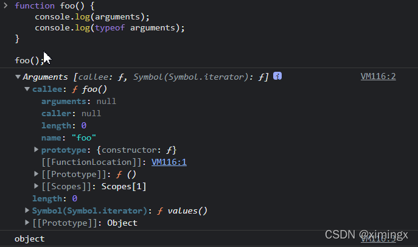


arguments 是一个类数组对象，它可以通过索引来操作数据，也可以获取长度。

**arguments 代表的是实参**。在调用函数时，我们所传递的实参都会在arguments 中保存。

有个讲究的地方是：arguments**只在函数中使用**。

### arguments.length

arguments.length 可以用来获取**实参的长度**。

> 函数名.length 可以获取形参的个数

举例：

```javascript
fn(2, 4);
fn(2, 4, 6);
fn(2, 4, 6, 8);
function fn(a, b) {
  console.log(arguments);
  console.log(fn.length); // 获取形参的个数
  console.log(arguments.length); // 获取实参的个数
  console.log('----------------');
}
```

打印结果：


我们即使不定义形参，也可以通过 arguments 来使用实参（只不过比较麻烦）：arguments[0] 表示第一个实参、arguments[1] 表示第二个实参...

### arguments.callee

arguments 里边有一个属性叫做 callee，这个属性对应一个函数对象，就是**当前正在指向的函数对象**。

```javascript
function fun() {
  console.log(arguments.callee == fun); // 打印结果为 true
}
fun('hello');
```

在使用函数**递归**调用时，推荐使用 arguments.callee 代替函数名本身。

### arguments 可以修改元素

之所以说 arguments 是伪数组，是因为：**arguments 可以修改元素，但不能改变数组的长短**。举例：

```javascript
fn(2, 4);
fn(2, 4, 6);
fn(2, 4, 6, 8);
function fn(a, b) {
  arguments[0] = 99; // 将实参的第一个数改为 99
  arguments.push(8); // 此方法不通过，因为无法增加元素
}
```


### arguments 的使用

当我们不确定有多少个参数传递的时候，可以用 **arguments** 来获取。在 JavaScript 中，arguments 实际上是当前函数的一个**内置对象**。所有函数都内置了一个 arguments 对象（只有函数才有 arguments 对象），arguments 对象中存储了**传递的所有实参**.

arguments的展示形式是一个**伪数组**。伪数组具有以下特点：

- 可以进行遍历；具有数组的 length 属性。

- 按索引方式存储数据。

- 不具有数组的 push()、pop() 等方法。

**代码举例**：利用 arguments 求函数实参中的最大值

代码实现：

```javascript
function getMaxValue() {
  var max = arguments[0];
  // 通过 arguments 遍历实参
  for (var i = 0; i < arguments.length; i++) {
    if (max < arguments[i]) {
      max = arguments[i];
    }
  }
  return max;
}
console.log(getMaxValue(1, 3, 7, 5));
```

### 函数参数默认值

**传统写法**：

```javascript
function fn(param) {    let p = param || 'hello';    console.log(p);}
```

上方代码中，函数体内的写法是：如果 param 不存在，就用 `hello`字符串做兜底。这样写比较啰嗦。

**ES6 写法**：（参数默认值的写法，很简洁）

```javascript
function fn(param = 'hello') {    console.log(param);}
```

在 ES6 中定义方法时，我们可以给方法里的参数加一个**默认值**（缺省值）：

-   方法被调用时，如果没有给参数赋值，那就是用默认值；

-   方法被调用时，如果给参数赋值了新的值，那就用新的值。

如下：

```javascript
var fn2 = (a, b = 5) => {
  console.log('haha');
  return a + b;
};
console.log(fn2(1)); // 第二个参数使用默认值 5。输出结果：6
console.log(fn2(1, 8)); // 输出结果：9
```

**提醒 1**：默认值的后面，不能再有**没有默认值的变量**。比如`(a,b,c)`这三个参数，如果我给 b 设置了默认值，那么就一定要给 c 设置默认值。

**提醒 2**：

我们来看下面这段代码：

```javascript
let x = 'smyh';function fn(x, y = x) {    console.log(x, y);}fn('vae');
```

注意第二行代码，我们给 y 赋值为`x`，这里的`x`是括号里的第一个参数，并不是第一行代码里定义的`x`。打印结果：`vae vae`。

如果我把第一个参数改一下，改成：

```javascript
let x = 'smyh';function fn(z, y = x) {    console.log(z, y);}fn('vae');
```

此时打印结果是：`vae smyh`。

### 剩余参数 (rest 运算符)

**剩余参数**允许我们将不确定数量的**剩余的元素**放到一个**数组**中。

比如说，当函数的实参个数大于形参个数时，我们可以将剩余的实参放到一个数组中。

**传统写法**：

ES5 中，在定义方法时，参数要确定个数，如下：（程序会报错）

```javascript
function fn(a, b, c) {
  console.log(a);
  console.log(b);
  console.log(c);
  console.log(d);
}
fn(1, 2, 3);
```

上方代码中，报错并不是因为"实参和形参个数不匹配"——JS 本身**不检查参数个数**（多传的实参被忽略，少传的形参是 undefined）。真正报错的原因是函数体里引用了一个从未声明过的变量 `d`：`ReferenceError: d is not defined`。

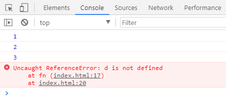

**ES6 写法**：

ES6 中，我们有了剩余参数，就不用担心报错的问题了。代码可以这样写：

```javascript
const fn = (...args) => {
  // 当不确定方法的参数时，可以使用剩余参数
  console.log(args[0]);
  console.log(args[1]);
  console.log(args[2]);
  console.log(args[3]);
};
fn(1, 2);
fn(1, 2, 3); // 方法的定义中有四个参数，但调用函数时只使用了三个参数，ES6 中并不会报错
```

打印结果：

```bash
12undefinedundefined123undefined
```

上方代码中注意，args 参数之后，不能再加别的参数，否则编译报错。

下面这段代码，也是利用到了剩余参数：

```js
function fn1(first, ...args) {
  console.log(first); // 10
  console.log(args); // 数组：[20, 30]
}
fn1(10, 20, 30);
```

#### 剩余参数的举例：参数求和

代码举例：

```js
const sum = (...args) => {
  let total = 0;
  args.forEach((item) => (total += item)); // 注意 forEach 里面的代码，写得很精简
  return total;
};
console.log(sum(10, 20, 30));
```

打印结果：60

#### 剩余参数和解构赋值配合使用

代码举例：

```js
const students = ['张三', '李四', '王五'];
let [s1, ...s2] = students;
console.log(s1); // '张三'
console.log(s2); // ['李四', '王五']
```


### 原型， 原型链

#### 原型对象

```javascript
function Person(name, age, gender) {
  this.name = name;
  this.age = age;
  this.gender = gender;
  // 向对象中添加一个方法
  this.sayName = function () {
    console.log("我是" + this.name);
  };
}
// 创建一个 Person 的实例
var per = new Person("孙悟空", 18, "男");
var per2 = new Person("猪八戒", 28, "男");
per.sayName();
per2.sayName();
console.log(per.sayName == per2.sayName); // 打印结果为 false
```

**分析如下**：

上方代码中，我们的sayName方法是写在构造函数 Person 内部的，然后在两个实例中进行了调用。造成的结果是，**构造函数每执行一次，就会给每个实例创建一个新的 sayName 方法**。

也就是说，每个实例的sayName都是唯一的。因此，最后一行代码的打印结果为false。

按照上面这种写法，假设创建10000个对象实例，就会创建10000个 sayName 方法。这种写法肯定是不合适的。

还有一种方式是，将sayName方法在全局作用域中定义：（不建议。原因看注释）

```javascript
function Person(name, age, gender) {
  this.name = name;
  this.age = age;
  this.gender = gender;
  this.sayName = fun;
}
// 将 sayName 方法在全局作用域中定义
/*
 * 将函数定义在全局作用域，污染了全局作用域的命名空间
 * 而且定义在全局作用域中也很不安全
 */
function fun() {
  alert("Hello大家好，我是:" + this.name);
}
```

比较好的方式是，在原型中添加sayName方法：

```javascript
    Person.prototype.sayName = function(){        alert("Hello大家好，我是:"+this.name);    };
```

这也就引入了我们本文要讲的「原型」。

#### 原型prototype的概念

**认识1**：

我们所创建的每一个函数，解析器都会向函数中添加一个属性 prototype。这个属性对应着一个对象，这个对象就是我们所谓的原型对象。

如果函数作为普通函数调用prototype没有任何作用，当函数以构造函数的形式调用时，它所创建的实例对象中都会有一个隐含的属性，指向该构造函数的原型，我们可以通过__proto__来访问该属性。

代码举例：

```javascript
// 定义构造函数
function Person() {}
var per1 = new Person();
var per2 = new Person();
console.log(Person.prototype); // 打印结果：{}
console.log(per1.__proto__ == Person.prototype); // 打印结果：true
```

上方代码的最后一行：打印结果表明，`实例.__proto__` 和 `构造函数.prototype`都指的是原型对象。

**认识2**：

原型对象就相当于一个公共的区域，**所有同一个类的实例都可以访问到这个原型对象，我们可以将对象中共有的内容，统一设置到原型对象中。**

以后我们创建构造函数时，可以将这些对象共有的属性和方法，统一添加到构造函数的原型对象中，这样就不用分别为每一个对象添加，也不会影响到全局作用域，就可以使每个对象都具有这些属性和方法了。

**认识3**：

使用 `in` 检查对象中是否含有某个属性时，如果对象中没有但是**原型中**有，也会返回true。

可以使用对象的`hasOwnProperty()`来检查**对象自身中**是否含有该属性。

#### 原型链

原型对象也是对象，所以它也有原型，当我们使用或访问一个对象的属性或方法时：

- 它会先在对象自身中寻找，如果有则直接使用；

- 如果没有则会去原型对象中寻找，如果找到则直接使用；

- 如果没有则去原型的原型中寻找，直到找到Object对象的原型。

- Object对象的原型没有原型，如果在Object原型中依然没有找到，则返回 null

#### 原型规则

> 1. 所有的引用类型（数组、对象、函数），都具有对象特性，都可以**自由扩展属性**。null 除外。

```js
let a = {};
a.name = "ximingx";
console.log(a.name);
```

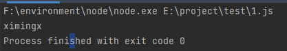

> 2. 所有的**引用类型**（数组、对象、函数），都有一个`__proto__`属性（注意：前后各两个下划线），属性值是一个**普通的对象**。`__proto__`的含义是隐式原型。

```js
let a = {};
a.name = "ximingx";
console.log(a.__proto__);
```

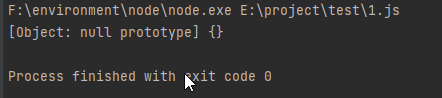

> 3. 所有的**函数**（不包括数组、对象），都有一个`prototype`属性，属性值是一个**普通的对象**。`prototype`的含义是**显式原型**。（实例没有这个属性）

```js
let a = function () {};
console.log(a.prototype);
```


> 4. 所有的**引用类型**（数组、对象、函数），`__proto__`属性指向它的**构造函数**的`prototype`值。

```js
let a = {};
console.log(a.__proto__ === Object.prototype);
```

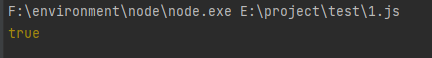

> 5. 当试图获取一个对象的某个属性时，如果这个对象本身没有这个属性，那么会去它的`__proto__`中寻找（即它的构造函数的`prototype`）。

```js
// 创建方法
function Foo(name) {
  this.name = name;
}
Foo.prototype.alertName = function () {
  // 既然 Foo.prototype 是普通的对象，那也允许给它添加额外的属性 alertName
  console.log(this.name);
};
// 测试
let fn = new Foo("ximingx");
fn.alertName(); // 输出结果：ximingx
```

上方代码中，虽然 alertName 不是 fn 自身的属性，但是会从它的构造函数的`prototype`里面找。

### 构造函数

#### 代码引入

```javascript
// 创建一个构造函数，专门用来创建 Person 对象
function Person(name, age, gender) {
  this.name = name;
  this.age = age;
  this.gender = gender;
  this.sayName = function () {
    alert(this.name);
  };
}
var per = new Person('ximingx', 18, '男');
var per2 = new Person('luotyue', 16, '女');
// 创建一个构造函数，专门用来创建 Dog 对象
function Dog() {}
var dog = new Dog();
```

#### 构造函数的概念

**构造函数**：是一种特殊的函数，主要用来创建和初始化对象，也就是为对象的成员变量赋初始值。它与 `new` 一起使用才有意义。

我们可以把对象中一些公共的属性和方法抽取出来，然后封装到这个构造函数里面。

#### 构造函数和普通函数的区别

构造函数的创建方式和普通函数没有区别，**不同的是构造函数习惯上首字母大写。**

构造函数和普通函数的区别就是**调用方式**的不同：普通函数是直接调用，而构造函数需要使用 new 关键字来调用。

**this 的指向也有所不同**：

-   1.以函数的形式调用时，**非严格模式下** this 是 window。比如`fun();`相当于`window.fun();`（严格模式下是 undefined，详见后文「函数内 this 的指向」）

-   2.以方法的形式调用时，this 是调用方法的那个对象

-   3.以构造函数的形式调用时，this 是新创建的实例对象

#### new 一个构造函数的执行流程

new 在执行时，会做下面这四件事：

（1）开辟内存空间，在内存中创建一个新的空对象。

（2）让 this 指向这个新的对象。

（3）执行构造函数里面的代码，给这个新对象添加属性和方法。

（4）返回这个新对象（所以构造函数里面不需要 return）。

因为 this 指的是 new 一个 Object 之后的对象实例。于是，下面这段代码：

```javascript
// 创建一个函数
function createStudent(name) {
  var student = new Object();
  student.name = name; // 第一个 name 指的是 student 对象定义的变量；第二个 name 指的是 createStudent 函数的参数。二者不一样
}
```

可以改进为：

```javascript
// 创建一个函数function Student(name) {    this.name = name; //this指的是构造函数中的对象实例}
```

注意上方代码中的注释。

#### 静态成员和实例成员

JavaScript 的构造函数中可以添加一些成员，可以在构造函数本身上添加，也可以在构造函数内部的 this 上添加。通过这两种方式添加的成员，就分别称为静态成员和实例成员。

-   静态成员：在构造函数本上添加的成员称为静态成员，只能由构造函数本身来访问。

-   实例成员：在构造函数内部创建的对象成员称为实例成员，只能由实例化的对象来访问。

#### 类、实例

使用同一个构造函数创建的对象，我们称为一类对象，也将一个构造函数称为一个**类**。

通过一个构造函数创建的对象，称为该类的**实例**。

#### instanceof

使用 instanceof 可以检查**一个对象是否为一个类的实例**。

**语法如下**：

```javascript
对象 instanceof 构造函数;
```

如果是，则返回 true；否则返回 false。

**代码举例**：

```javascript
function Person() {}
function Dog() {}
var person1 = new Person();
var dog1 = new Dog();
console.log(person1 instanceof Person); // 打印结果：true
console.log(dog1 instanceof Person); // 打印结果：false
console.log(dog1 instanceof Object); // 所有的对象都是 Object 的后代。因此，打印结果为：true
```

根据上方代码中的最后一行，需要补充一点：**所有的对象都是 Object 的后代，因此 `任何对象 instanceof Object` 的返回结果都是 true**。

### 面向过程和面向对象

#### 面向过程

**面向过程**：先分析好的具体步骤，然后按照步骤，一步步解决问题。

优点：性能比面向对象高，适合跟硬件联系很紧密的东西，例如单片机就采用的面向过程编程。

缺点：没有面向对象易维护、易复用、易扩展。

#### 面向对象

**面向对象**（OOP，Object Oriented Programming）：以对象功能来划分问题，而不是步骤。

优点：**易维护、易复用、易扩展，由于面向对象有封装、继承、多态性的特性**，可以设计出低耦合的系统，使系统 更加灵活、更加易于维护。

缺点：性能比面向过程低。

#### 面向对象的编程思想

面向对象的编程思想：对代码和数据进行封装，并以对象调用的方式，对外提供统一的调用接口。

比如说，当我们在开车的时候，无需关心汽车的内部构造有多复杂，对于大多数人而言，只需要会开、知道汽车有哪些功能就行了。

#### 面向对象的特性

在面向对象程序开发思想中，每一个对象都是功能中心，具有明确分工。面向对象编程具有灵活、代码可复用、容易维护和开发的优点，适合多人合作的大型软件项目，更符合我们认识事物的规律。

面向对象的特性如下：

- **封装性**

- **继承性**

- **多态性**

#### JS 中的面向对象

JS 中的面向对象，是基于**原型**的面向对象。

另外，在ES6中，新引入了 类（`Class`）和继承（`Extends`）来实现面向对象。


#### 基于原型的面向对象

JS 中的对象（Object）是依靠构造器（`constructor`）和原型（`prototype`）构造出来的。

---

### 原型的三角关系

这是理解原型必须记住的三条等式，几乎所有原型相关的面试题都是从它派生出来的：

```js
function Person(name) {
    this.name = name;
}
const p = new Person('ximingx');

// ① 实例的隐式原型 === 构造函数的显式原型
console.log(p.__proto__ === Person.prototype);          // true

// ② 原型对象的 constructor 指回构造函数
console.log(Person.prototype.constructor === Person);   // true

// ③ 实例自身没有 constructor，是沿着原型链从 Person.prototype 上读到的
console.log(p.constructor === Person);                  // true
console.log(p.hasOwnProperty('constructor'));           // false
```

图示：

```
        ┌──────────────────┐
        │   Person（函数）  │
        └────────┬─────────┘
                 │ .prototype
                 ▼
        ┌──────────────────────────┐        ┌──────────────┐
        │  Person.prototype        │◀──┐    │  p（实例）    │
        │  ├─ constructor ─────────┼───┼───▶│              │
        │  └─ sayName()            │   │    └──────┬───────┘
        └──────────────────────────┘   │           │
                                       └───────────┘
                                         p.__proto__
```

> **注意**：`constructor` 是可以被改写的。一旦你用 `Person.prototype = { ... }` 整体覆盖原型对象，`constructor` 就会丢失（变成指向 `Object`），必须手动补回来 —— 这是继承实现里最容易漏掉的一步。

#### 原型链的终点

```js
function Foo() {}
const f = new Foo();

console.log(f.__proto__ === Foo.prototype);               // true
console.log(Foo.prototype.__proto__ === Object.prototype); // true
console.log(Object.prototype.__proto__);                   // null  ← 原型链的终点
console.log(Object.prototype.constructor === Object);      // true
```

所以完整的查找路径是：

```
f → Foo.prototype → Object.prototype → null
```

**这里有几个"反直觉但必须记住"的结论**（函数在 JS 里也是对象）：

```js
// 所有函数都是 Function 的实例，包括内建构造函数本身
console.log(Person.__proto__ === Function.prototype);   // true
console.log(Object.__proto__ === Function.prototype);   // true

// Function 自己也是 Function 的实例（自己造自己）
console.log(Function.__proto__ === Function.prototype); // true

// Function.prototype 是个普通对象，所以它的原型是 Object.prototype
console.log(Function.prototype.__proto__ === Object.prototype); // true
```

---

### 继承的演进：从原型链到 class

JS 里没有真正的"类继承"（ES6 的 `class` 只是语法糖），但可以用原型模拟出继承。下面按"由浅入深、由劣到优"的顺序梳理 6 种方案，重点理解**每一种解决了什么问题、又留下了什么问题**。

#### 方式一：原型链继承

**做法**：把子类的原型对象，替换成父类的一个实例。

```js
function Parent() {
    this.name = 'parent';
    this.colors = ['red', 'blue'];
}
Parent.prototype.sayName = function () {
    console.log(this.name);
};

function Child() {
    this.age = 18;
}
// 关键一步：让 Child 的原型指向 Parent 的实例
Child.prototype = new Parent();
Child.prototype.constructor = Child; // 补回 constructor

const c1 = new Child();
c1.sayName(); // parent —— 成功继承到父类原型上的方法
```

**两个致命缺点**：

1. **引用类型的属性被所有实例共享**（这是最常见的踩坑点）

```js
const c2 = new Child();
c1.colors.push('green');
console.log(c2.colors); // ['red', 'blue', 'green'] —— c2 被 c1 污染了！
```

原因是 `colors` 数组挂在 `Parent` 实例上，而这个实例被当成了 `Child.prototype`，于是所有 `Child` 实例共享同一个数组。

2. **创建子类实例时，无法向父类构造函数传参**。

#### 方式二：借用构造函数继承（经典继承）

**做法**：在子类构造函数内部，用 `call` / `apply` 把父类构造函数跑一遍，并绑定 `this`。

```js
function Parent(name) {
    this.name = name;
    this.colors = ['red', 'blue'];
}

function Child(name, age) {
    Parent.call(this, name); // 关键：把 Parent 的 this 换成 Child 的 this
    this.age = age;
}

const c1 = new Child('ximingx', 18);
const c2 = new Child('luoyue', 16);
c1.colors.push('green');

console.log(c1.colors); // ['red', 'blue', 'green']
console.log(c2.colors); // ['red', 'blue']  ← 互不干扰，缺点 1 解决了
console.log(c1.name);   // 'ximingx'        ← 可以传参了，缺点 2 解决了
```

**遗留问题**：

> **只能继承父类构造函数内部的属性，继承不到 `Parent.prototype` 上的方法。**
> 方法如果都写在构造函数里，就又退化成了"每 new 一次就重新创建一个函数"，失去复用意义。

```js
Parent.prototype.sayName = function () { console.log(this.name); };
c1.sayName(); // TypeError: c1.sayName is not a function
```

#### 方式三：组合继承（最常用的经典方案）

**做法**：原型链继承（拿方法）+ 借用构造函数继承（拿属性），两者结合。

```js
function Parent(name) {
    this.name = name;
    this.colors = ['red', 'blue'];
}
Parent.prototype.sayName = function () {
    console.log(this.name);
};

function Child(name, age) {
    Parent.call(this, name);   // 第二次调用 Parent —— 拿到实例属性
    this.age = age;
}
Child.prototype = new Parent();       // 第一次调用 Parent —— 拿到原型方法
Child.prototype.constructor = Child;

const c1 = new Child('ximingx', 18);
c1.sayName();            // ximingx —— 方法能用了
c1.colors.push('green');
const c2 = new Child('luoyue', 16);
console.log(c2.colors);  // ['red', 'blue'] —— 属性也独立了
```

**唯一缺点**：**父类构造函数被调用了两次**。

- 一次是 `Child.prototype = new Parent()`，在 `Child.prototype` 上留下了一份 `name`、`colors`；
- 一次是 `new Child()` 时的 `Parent.call(this)`，在实例上又留了一份。

实例上的属性会**遮蔽（shadow）**原型上的同名属性，所以功能没问题，但存在冗余。

#### 方式四：原型式继承与 Object.create()

**做法**：不定义构造函数，直接基于一个已有对象创建新对象。

```js
const parent = {
    name: 'parent',
    colors: ['red', 'blue'],
    sayName() { console.log(this.name); }
};

const child = Object.create(parent); // child.__proto__ === parent
child.name = 'child';
child.sayName(); // child
```

`Object.create(proto, [propertiesObject])` 的本质等价于：

```js
function create(proto) {
    function F() {}
    F.prototype = proto;
    return new F();
}
```

要点：

- `Object.create(null)` 创建的是**无原型对象**（`__proto__` 为 `null`），没有 `toString`、`hasOwnProperty` 等任何 Object 方法，常被用作"纯净的字典"。
- 原型式继承同样存在**引用类型共享**的问题，和方式一完全一样。

#### 方式五：寄生组合式继承（最优方案，也是 ES6 class 的实现原理）

**做法**：用 `Object.create()` 代替 `new Parent()` 来建立原型链，从而避免"父类构造函数被调用两次"。

```js
function Parent(name) {
    this.name = name;
    this.colors = ['red', 'blue'];
}
Parent.prototype.sayName = function () {
    console.log(this.name);
};

function Child(name, age) {
    Parent.call(this, name);   // 只调用这一次
    this.age = age;
}

// 关键差异：不再 new Parent()，而是用一个干净的、只继承原型的对象
Child.prototype = Object.create(Parent.prototype);
Child.prototype.constructor = Child;

const c1 = new Child('ximingx', 18);
c1.sayName(); // ximingx
```

**为什么它是最优解**：

| 方案 | 父类执行次数 | 实例属性独立 | 能继承原型方法 | 能传参 |
| --- | --- | --- | --- | --- |
| ① 原型链继承 | 1 | ✗（共享引用） | ✓ | ✗ |
| ② 借用构造函数 | 1 | ✓ | ✗ | ✓ |
| ③ 组合继承 | 2 | ✓ | ✓ | ✓ |
| ⑤ 寄生组合式 | **1** | ✓ | ✓ | ✓ |

可以封装成一个通用工具函数：

```js
function inheritPrototype(Child, Parent) {
    const prototype = Object.create(Parent.prototype); // 创建对象
    prototype.constructor = Child;                     // 增强对象
    Child.prototype = prototype;                       // 指定对象
}
```

#### 方式六：ES6 class 与 extends

**做法**：`class` + `extends` + `super`。它在底层做的事情，本质上就是**寄生组合式继承**。

```js
class Parent {
    constructor(name) {
        this.name = name;
        this.colors = ['red', 'blue'];
    }
    sayName() {
        console.log(this.name);
    }
    static staticMethod() {
        console.log('我是静态方法，只能通过 Parent.staticMethod() 调用');
    }
}

class Child extends Parent {
    constructor(name, age) {
        super(name);  // 必须在使用 this 之前调用！等价于 Parent.call(this, name)
        this.age = age;
    }
    sayAge() {
        console.log(this.age);
    }
}

const c = new Child('ximingx', 18);
c.sayName(); // ximingx
c.sayAge();  // 18
```

**class 与普通构造函数的 6 个重要区别**（高频面试点）：

1. **class 不存在变量提升**，有暂时性死区，必须先声明后使用。

```js
new Foo();      // ReferenceError: Cannot access 'Foo' before initialization
class Foo {}
```

2. **必须用 `new` 调用**，直接调用会报错（普通函数不会）。

```js
Foo(); // TypeError: Class constructor Foo cannot be invoked without 'new'
```

3. **class 内部默认是严格模式**，不需要也不应该手动加 `"use strict"`。

4. **class 的方法不可枚举**。用 `function` 定义在 `prototype` 上的方法是可枚举的，会被 `for...in` 遍历到。

```js
function F() {}
F.prototype.foo = function () {};
class C { bar() {} }

console.log(Object.keys(F.prototype)); // ['foo']
console.log(Object.keys(C.prototype)); // []  —— bar 不可枚举
```

5. **class 的所有方法都没有 `prototype` 属性**，因此不能用 `new` 去调用一个类的方法。

6. **子类必须在 `constructor` 里先调用 `super()` 才能使用 `this`**。

> 本质原因：ES6 中，子类实例的构建是基于父类实例的（`this` 要先由父类构造出来），所以 `super()` 必须先执行。而在 ES5 的借用构造函数继承里，`Parent.call(this)` 的位置就比较自由。

**继承的两条链**（理解这个，class 的继承就通了）：

```js
// 链 1：实例的原型链（对象角度）
// c.__proto__ → Child.prototype → Parent.prototype → Object.prototype → null
//
// 链 2：构造函数自身的原型链（类角度，实现静态方法继承）
// Child.__proto__ → Parent → Function.prototype → Object.prototype → null
```

所以 `Child.staticMethod()` 能调用成功，靠的是链 2。

---

### instanceof 的原理与手写实现

`instanceof` 的判断逻辑是：**沿着左边对象的 `__proto__` 链一直往上找，看能否找到右边函数的 `prototype`**。

```js
function myInstanceof(left, right) {
    // 基本数据类型直接返回 false
    if (left === null || (typeof left !== 'object' && typeof left !== 'function')) {
        return false;
    }
    let proto = Object.getPrototypeOf(left); // 等价于 left.__proto__
    const prototype = right.prototype;
    while (true) {
        if (proto === null) return false;    // 找到原型链终点还没找到
        if (proto === prototype) return true;
        proto = Object.getPrototypeOf(proto);
    }
}

console.log(myInstanceof([], Array));    // true
console.log(myInstanceof([], Object));   // true
console.log(myInstanceof('abc', String)); // false（基本类型不是对象）
```

> **注意**：`instanceof` 判断的是"是否出现在原型链上"，因此 `[] instanceof Object` 也是 `true`。
> 它并**不能**准确判断一个对象的真实类型。更可靠的做法是使用 `Object.prototype.toString.call()`：
> ```js
> Object.prototype.toString.call([]);      // '[object Array]'
> Object.prototype.toString.call(null);    // '[object Null]'
> Object.prototype.toString.call(new Date);// '[object Date]'
> ```

### 属性判断的四种方式

```js
function Parent() { this.a = 1; }
Parent.prototype.b = 2;
const obj = new Parent();

// ① in：自身 + 原型链
console.log('a' in obj); // true
console.log('b' in obj); // true

// ② hasOwnProperty()：只看自身
console.log(obj.hasOwnProperty('a')); // true
console.log(obj.hasOwnProperty('b')); // false

// ③ Object.getOwnPropertyNames()：自身所有属性（含不可枚举）
console.log(Object.getOwnPropertyNames(obj)); // ['a']

// ④ Object.keys()：自身所有【可枚举】属性
console.log(Object.keys(obj)); // ['a']
```

| 方法 | 查找原型链 | 包含不可枚举 | 包含 Symbol |
| --- | --- | --- | --- |
| `in` | ✓ | ✓ | ✓ |
| `hasOwnProperty()` | ✗ | ✓ | ✓ |
| `Object.keys()` | ✗ | ✗ | ✗ |
| `Object.getOwnPropertyNames()` | ✗ | ✓ | ✗ |
| `Reflect.ownKeys()` | ✗ | ✓ | ✓ |

### 闭包的引入

我们知道，变量根据作用域的不同分为两种：全局变量和局部变量。

- 函数内部可以访问全局变量和局部变量。

- 函数外部只能访问全局变量，不能访问局部变量。

- 当函数执行完毕，本作用域内的局部变量会销毁。

比如下面这样的代码：

```js
function foo() {
  let a = 1;
}
foo();
console.log(a); // 打印报错：Uncaught ReferenceError: a is not defined
```

上方代码中，由于变量 `a` 是函数内的局部变量，所以外部无法访问。

但是，在有些场景下，我们就是想要在函数外部访问函数内的局部变量，那要怎么办呢？这就需要引入闭包的概念。

#### 闭包的概念

**闭包**（closure）：指有权**访问**另一个函数作用域中**变量**的**函数**。

闭包是一种函数；当然，你可以**把闭包理解成是一种现象**。具体解释如下。

简单理解就是：如果**这个作用域可以访问另外一个函数内部的局部变量**，那就产生了闭包（此时，你可以把闭包理解成是一种现象）；而另外那个作用域所在的函数称之为**闭包函数**。注意，这里强调的是访问**局部变量**哦。

#### 闭包代码举例

代码举例：

```js
function fn1() {    let a = 10;    function fn2() {        console.log(a);    }    fn2();}fn1();
```

打印结果：

```js
10
```

上方代码中，函数 fn2 的作用域 访问了 fn1 中的局部变量，那么，此时在 fn1 中就产生了闭包，fn1 称之为闭包函数。

#### 闭包的作用：延伸变量的作用范围

我们来看看下面这段闭包的代码：

```js
function fn1() {
    let a = 20;
    function fn2() {
        console.log(a);
    }
    return fn2;
}
const foo = fn1(); // 执行 fn1() 之后，会得到一个返回值。foo 代表的就是 fn2 函数foo();
```

上方代码中，foo 代表的就是整个 fn2 函数。当执行了 `foo()` 语句之后（相当于执行了 `fn2()`），fn1 函数内就产生了闭包。

一般来说，在 fn1 函数执行完毕后，它里面的变量 a 会立即销毁。但此时由于产生了闭包，所以 **fn1 函数中的变量 a 不会立即销毁，因为 fn2 函数还要继续调用变量 a**。只有等所有函数把变量 a 调用完了（即 fn2 也不再被引用、可以被垃圾回收时），变量 a 才会销毁。

而且，可以看出， 在执行 `foo()`语句之后，竟然能够打印出 `20`，这就完美通过闭包实现了：全局作用域成功访问到了局部作用域中的变量 a。

因此，我们可以看出，闭包的主要作用就是：**延伸了变量的作用范围。**

上面的代码也可以简写成：

```js
function fn1() {
  let a = 20;
  return function () {
    console.log(a);
  };
}
const foo = fn1(); // 执行 fn1() 之后，会得到一个返回值。这个返回值是函数 foo
```

### 执行期上下文

当**函数执行**时（准确来说，是在函数发生预编译的前一刻），会创建一个执行期上下文的内部对象。一个执行期上下文定义了一个函数执行时的环境。

每调用一次函数，就会创建一个新的上下文对象，他们之间是相互独立且独一无二的。当函数执行完毕，它所产生的执行期上下文会被销毁。

#### this

解析器在调用函数每次都会向函数内部传递进一个隐含的参数，这个隐含的参数就是 this，this 指向的是一个对象，这个对象我们称为函数执行的 上下文对象。

#### 函数内 this 的指向【非常重要】

根据函数的调用方式的不同，this 会指向不同的对象：

- 1.以函数的形式（包括普通函数、定时器函数、立即执行函数）调用时，**非严格模式下** this 的指向是 window。比如`fun();`相当于`window.fun();`。

  > **严格模式下的例外**：如果脚本或函数开启了 `"use strict"`，独立函数调用时 `this` 是 `undefined`，不再是 `window`。
  > ```js
  > function f() { console.log(this); }
  > f();                 // 非严格：Window   严格：undefined
  > setTimeout(f, 0);    // 浏览器里恒为 Window（定时器回调由宿主环境以全局对象调用）
  > ```
  > 另外，Node.js 的模块作用域中，顶层 `this` 是 `module.exports`（不是 `global`），这一点和浏览器不同。

- 2.以方法的形式调用时，this 指向调用方法的那个对象

- 3.以构造函数的形式调用时，this 指向实例对象

- 4.以事件绑定函数的形式调用时，this 指向**绑定事件的对象**

- 5.使用 call 和 apply 调用时，this 指向指定的那个对象

**针对第 1 条的举例**：

```javascript
function fun() {
    console.log(this);
    console.log(this.name);
}
var obj1 = { name: 'ximingx', sayName: fun };
var obj2 = { name: 'luoyue', sayName: fun };
var name = '全局的name属性'; //以函数形式调用，this是windowfun(); //可以理解成 window.fun()
```

打印结果：

```
Window    全局的 name 属性
```

上面的举例可以看出，this 指向的是 window 对象，所以 this.name 指的是全局的 name。

**第 2 条的举例**：

```javascript
function fun() {
    console.log(this);
    console.log(this.name);
}
var obj1 = { name: 'ximingx', sayName: fun };
var obj2 = { name: 'luoyue', sayName: fun };
var name = '全局的name属性'; //以方法的形式调用，this是调用方法的对象obj2.sayName();
```

打印结果：

```
Object    luoyue
```

上面的举例可以看出，this 指向的是 对象 obj2 ，所以 this.name 指的是 obj2.name。

#### 箭头函数中 this 的指向

ES6 中的箭头函数并不会使用上面的准则，而是会继承外层函数调用的 this 绑定（无论 this 绑定到什么）。


#### 改变 this 的指向

JS 专门为我们提供了一些方法来改变函数内部的 this 指向。常见的方法有 call()、apply()、bind() 方法。

#### call() 方法的作用

call() 方法的作用：可以**调用**一个函数，与此同时，它还可以改变这个函数内部的 this 指向。

call() 方法的另一个应用：**可以实现继承**。之所以能实现继承，其实是利用了上面的作用。

语法：

```js
fn1.call(想要将this指向哪里, 函数实参1, 函数实参2);
```

备注：第一个参数中，如果不需要改变 this 指向，则传 null。

#### call() 方法举例

**举例 1**、通过 call() 调用函数：

```js
const obj1 = { nickName: 'ximingx', age: 28 };
function fn1() {
    console.log(this);
    console.log(this.nickName);
}
fn1.call(this); // this的指向并没有被改变，此时相当于 fn1();
```

上方代码的打印结果：

```js
windowundefined
```

上面的代码，跟普通的函数调用 `fn1()` 没有区别。

**举例 2**、通过 call() 改变 this 指向：

```js
var obj1 = { nickName: 'ximingx', age: 28 };
function fn1(a, b) {
    console.log(this);
    console.log(this.nickName);
    console.log(a + b);
}
fn1.call(obj1, 2, 4); // 先将 this 指向 obj1，然后执行 fn1() 函数
```

上方代码的打印结果：

```js
obj1ximingx6
```

**举例 3**、通过 call() 实现继承：

```js
// 给 Father 增加 name 和 age 属性
function Father(myName, myAge) {
  this.name = myName;
  this.age = myAge;
}
function Son(myName, myAge) {
  // 【下面这一行，重要代码】
  // 通过这一步，将 Father 里面的 this 修改为 Son 里面的 this；另外，给 Son 加上相应的参数，让 Son 自动拥有 Father 里的属性。最终实现继承
  Father.call(this, myName, myAge);
}
const son1 = new Son('ximingx', 28);
console.log(JSON.stringify(son1));
```

上方代码中，通过 call() 方法，让 Son 继承了 Father 里面的 name 和 age 属性。

打印结果：

```
{"name":"ximingx","age":28}
```

> **说明**：结果里的 key 是 `name` 和 `age`，而不是 `myName` / `myAge`。
> 因为 `Father` 内部写的是 `this.name = myName`，等号左边的 `this.name` 才决定属性名，等号右边的 `myName` 只是形参名。这一点在手写继承时非常容易写错。

同时也要注意，这种方式（借用构造函数）**只能继承构造函数内部的属性，继承不了 `Father.prototype` 上的方法**，后面「原型与继承」一节会详细讲。

#### apply() 方法的作用

apply() 方法的作用：可以**调用**一个函数，与此同时，它还可以改变这个函数内部的 this 指向。这一点，和 call()类似。

apply() 方法的应用： 由于 apply()需要传递数组，所以它有一些巧妙应用，稍后看接下来的应用举例就知道了。

语法：

```js
fn1.apply(想要将this指向哪里, [函数实参1, 函数实参2]);
```

备注：第一个参数中，如果不需要改变 this 指向，则传 null。

到这里可以看出，call() 和 apply() 方法的作用是相同的。唯一的区别在于，apply() 里面传入的**实参，必须是数组（或者类数组，即 array-like object）**。

#### apply() 方法举例

**举例**、通过 apply() 改变 this 指向：

```js
var obj1 = { nickName: 'ximingx', age: 28 };
function fn1(a) {
    console.log(this);
    console.log(this.nickName);
    console.log(a);
}
fn1.apply(obj1, ['hello']); // 先将 this 指向 obj1，然后执行 fn1() 函数
```

注意，上方代码中，**apply()** 里面传实参时，需要以数组的形式。即便是只传一个实参，也需要传数组。（原文写作 call()，此处为笔误，call() 是逐个传参的）

打印结果：

```js
obj1ximingxhello
```

#### apply() 方法的巧妙应用：求数组的最大值

我们知道，如果想要求数组中元素的最大值的时候，数组本身是没有自带方法的。那怎么办呢？

虽然数组里没有获取最大值的方法，但是数值里面有 `Math.max(数字1，数字2，数字3)` 方法，可以获取**多个数值中的最大值**。 另外，由于 apply() 方法在传递实参时，必须要以数组的形式，所以我们可以 通过 Math.max() 和 apply() 曲线救国。

**举例**：求数组中多个元素的最大值：

```js
const arr1 = [3, 7, 10, 8];
// 下面这一行代码的目的，无需改变 this 指向，所以：第一个参数填 null，或者填 Math，或者填 this 都可以。
// 补充：非严格模式下传 null，this 会被自动替换成 window；严格模式下传 null，this 就是 null 本身（不会被替换），但都不影响 Math.max 的计算结果。
const maxValue = Math.max.apply(Math, arr1); // 求数组 arr1 中元素的最大值
console.log(maxValue);
const minValue = Math.min.apply(Math, arr1); // 求数组 arr1 中元素的最小值
console.log(minValue);
```

打印结果：

```js
103
```

#### bind() 方法的作用

bind() 方法**不会调用函数**，但是可以改变函数内部的 this 指向。

把call()、apply()、bind()这三个方法做一下对比，你会发现：实际开发中， bind() 方法使用得最为频繁。如果有些函数，我们不需要立即调用，但是又想改变这个函数内部的this指向，此时用 bind() 是最为合适的。


语法：

```js
新函数 = fn1.bind(想要将this指向哪里, 函数实参1, 函数实参2);
```

参数：

- 第一个参数：在 fn1 函数运行时，指定 fn1 函数的this 指向。如果不需要改变 this 指向，则传 null。

- 其他参数：fn1 函数的实参。

解释：它不会调用 fn1 函数，但会返回 由指定this 和指定实参的**原函数拷贝**。可以看出， bind() 方法是有返回值的。

## Math

### 内置对象：Math

Math 是 JavaScript 的内置对象，提供**数学计算**相关的常量与方法。与 Date 不同，**Math 不是构造函数，不需要实例化**，直接通过 `Math.方法名()` 调用即可。

### Math 的常用属性（常量）

| 属性 | 值 | 说明 |
| --- | --- | --- |
| `Math.PI` | 3.14159… | 圆周率 π |
| `Math.E` | 2.71828… | 自然对数的底数 e |

### Math 的常用方法

#### 1. 取整相关

| 方法 | 说明 | 示例 |
| --- | --- | --- |
| `Math.ceil(x)` | 向上取整（天花板） | `Math.ceil(2.1)` → 3 |
| `Math.floor(x)` | 向下取整（地板） | `Math.floor(2.9)` → 2 |
| `Math.round(x)` | 四舍五入 | `Math.round(2.5)` → 3 |
| `Math.trunc(x)` | 直接截断小数部分（ES6 新增） | `Math.trunc(2.9)` → 2 |

代码举例：

```js
console.log(Math.ceil(2.1));  // 3
console.log(Math.floor(2.9)); // 2
console.log(Math.round(2.5)); // 3
console.log(Math.trunc(2.9)); // 2
```

#### 2. 最值

| 方法 | 说明 | 示例 |
| --- | --- | --- |
| `Math.max(a, b, ...)` | 取最大值 | `Math.max(1, 5, 3)` → 5 |
| `Math.min(a, b, ...)` | 取最小值 | `Math.min(1, 5, 3)` → 1 |

#### 3. 幂、开方与绝对值

| 方法 | 说明 | 示例 |
| --- | --- | --- |
| `Math.pow(x, y)` | x 的 y 次幂 | `Math.pow(2, 10)` → 1024 |
| `Math.sqrt(x)` | 平方根 | `Math.sqrt(9)` → 3 |
| `Math.abs(x)` | 绝对值 | `Math.abs(-5)` → 5 |

#### 4. 随机数

- `Math.random()`：返回 **[0, 1)** 之间的随机小数（包含 0，不包含 1）。

代码举例：生成 [min, max] 之间的随机整数：

```js
function getRandomInt(min, max) {
  return Math.floor(Math.random() * (max - min + 1)) + min;
}
console.log(getRandomInt(1, 10)); // 1~10 之间的随机整数
```

> 其他常用方法：`Math.sin()` / `Math.cos()` / `Math.tan()`（三角函数）、`Math.log()`（自然对数）、`Math.sign(x)`（返回数字的符号：-1 / 0 / 1，ES6 新增）、`Math.hypot()`（平方和的平方根）等。


### 内置对象：Date


内置对象 Date 用来处理日期和时间。

**需要注意的是**：与 Math 对象不同，Date 对象是一个**构造函数** ，需要**先实例化**后才能使用。

### 创建Date对象

创建Date对象有两种写法：

- 写法一：如果Date()不写参数，就返回当前时间对象

- 写法二：如果Date()里面写参数，就返回括号里输入的时间对象

#### 写法一：不传递参数时，则获取系统的当前时间对象

代码举例：

```javascript
var date1 = new Date();console.log(date1);console.log(typeof date1);
```

代码解释：不传递参数时，表示的是获取系统的当前时间对象。也可以理解成是：获取当前代码执行的时间。

打印结果： (node 执行环境)

> 2022年,3月,5日

```bash
2022-03-05T02:19:02.682Zobject
```

打印结果： (浏览器执行环境)

```bash
Sat Mar 05 2022 10:21:22 GMT+0800 (中国标准时间)VM102:3 object
```

#### 写法二：传递参数

传递参数时，表示获取指定时间的时间对象。**参数中既可以传递字符串，也可以传递数字，也可以传递时间戳。**

通过传参的这种写法，我们可以把时间字符串/时间数字/时间戳，按照指定的格式，转换为时间对象。

**举例1：（参数是字符串）**

```js
const date11 = new Date('2020/02/17 21:00:00');
console.log(date11); // Mon Feb 17 2020 21:00:00 GMT+0800 (中国标准时间)
const date12 = new Date('2020/04/19'); // 返回的就是四月
console.log(date12); // Sun Apr 19 2020 00:00:00 GMT+0800 (中国标准时间)
const date13 = new Date('2020-05-20');
console.log(date13); // Wed May 20 2020 08:00:00 GMT+0800 (中国标准时间)
const date14 = new Date('Wed Jan 27 2017 12:00:00 GMT+0800 (中国标准时间)');
console.log(date14); // Fri Jan 27 2017 12:00:00 GMT+0800 (中国标准时间)
```


举例2：（参数是多个数字）

```js
const date21 = new Date(2020, 2, 18); // 注意，第二个参数返回的是三月，不是二月
console.log(date21); // Wed Mar 18 2020 00:00:00 GMT+0800 (中国标准时间)
const date22 = new Date(2020, 3, 18, 22, 59, 58);
console.log(date22); // Sat Apr 18 2020 22:59:58 GMT+0800 (中国标准时间)
const params = [2020, 06, 12, 16, 20, 59];
const date23 = new Date(...params);
console.log(date23); // Sun Jul 12 2020 16:20:59 GMT+0800 (中国标准时间)
```


举例3：（参数是时间戳）

```js
const date31 = new Date(1591950413388);
console.log(date31); // Fri Jun 12 2020 16:26:53 GMT+0800 (中国标准时间)
// 先把时间对象转换成时间戳，然后把时间戳转换成时间对象
const timestamp = new Date().getTime();
const date32 = new Date(timestamp);
console.log(date32); // Fri Jun 12 2020 16:28:21 GMT+0800 (中国标准时间)
```


### 日期的格式化

上一段内容里，我们获取到了 Date **对象**，但这个对象，打印出来的结果并不是特别直观。

如果我们需要获取日期的**指定部分**，就需要用到 Date对象自带的方法。

获取了日期指定的部分之后，我们就可以让日期按照指定的格式，进行展示（即日期的格式化）。比如说，我期望能以 `2020-02-02 19:30:59` 这种格式进行展示。

在这之前，我们先来看看 Date 对象有哪些方法。

### Date对象的方法

Date对象 有如下方法，可以获取日期和时间的**指定部分**：

| 方法名            | 含义              | 备注                 |
| ----------------- | ----------------- | -------------------- |
| getFullYear()     | 获取年份          |                      |
| getMonth()        | **获取月： 0-11** | 0代表一月            |
| getDate()         | **获取日：1-31**  | 获取的是几号         |
| getDay()          | **获取星期：0-6** | 0代表周日，1代表周一 |
| getHours()        | 获取小时：0-23    |                      |
| getMinutes()      | 获取分钟：0-59    |                      |
| getSeconds()      | 获取秒：0-59      |                      |
| getMilliseconds() | 获取毫秒          | 1s = 1000ms          |


**代码举例**：

### 一些关于 Date 方法的测试

```js
const date = new Date();

console.log(new Date);   // 2021-12-05T11:11:42.652Z
console.log(+new Date);  // 1638702702658
// + 运算符（一元数值运算符）会将表达式转换为数字，从而拿到当前时间戳

// -----------------------------------------------------------------------
/* 获取时间 */
// 注意：getYear() / setYear() 已被废弃，请用 getFullYear() / setFullYear() 代替
console.log(date.getFullYear());     // 获取完整年份（4 位，1970-????）
console.log(date.getMonth());        // 获取月份（0-11，0 代表 1 月）
console.log(date.getDate());         // 获取日期（1-31）
console.log(date.getDay());          // 获取星期（0-6，0 代表星期天）
console.log(date.getTime());         // 获取时间戳（从 1970.1.1 开始的毫秒数）
console.log(date.getHours());        // 获取小时（0-23）
console.log(date.getMinutes());      // 获取分钟（0-59）
console.log(date.getSeconds());      // 获取秒（0-59）
console.log(date.getMilliseconds()); // 获取毫秒（0-999）
console.log(date.toLocaleDateString()); // 获取当前日期  2021/12/5
console.log(date.toLocaleTimeString()); // 获取当前时间  下午7:11:42
console.log(date.toLocaleString());     // 获取日期与时间 2021/12/5 下午7:11:42

// -----------------------------------------------------------------------
/* 修改时间（会直接修改原 date 对象） */
date.setTime(14);       // 设置时间戳（单位：毫秒），不是"设置时"
date.setFullYear(2023); // 设置年（用 setFullYear，不要用已废弃的 setYear）
date.setMonth(1);       // 设置月（0-11，此处的 1 表示二月）
date.setDate(20);       // 设置日（1-31，日期从 1 开始计，不是从 0 开始）
date.setHours(11);      // 设置小时
date.setMinutes(56);    // 设置分
date.setSeconds(36);    // 设置秒

console.log(date.getFullYear());     // 2023
console.log(date.getMonth());        // 1
console.log(date.getDate());         // 20
console.log(date.getDay());          // 1
console.log(date.getMilliseconds()); // 14（由 setTime(14) 留下来的毫秒位）
console.log(date.toLocaleString());  // 2023/2/20 上午11:56:36
```


```javascript
// 我在执行这行代码时，当前时间为 2019年2月4日，周一，13:23:52
var myDate = new Date();
console.log(myDate); // 打印结果：Mon Feb 04 2019 13:23:52 GMT+0800 (中国标准时间)
console.log(myDate.getFullYear()); // 打印结果：2019
console.log(myDate.getMonth() + 1); // 打印结果：2
console.log(myDate.getDate()); // 打印结果：4
var dayArr = ['星期日', '星期一', '星期二', '星期三', '星期四', '星期五', '星期六'];
console.log(myDate.getDay()); // 打印结果：1
console.log(dayArr[myDate.getDay()]); // 打印结果：星期一
console.log(myDate.getHours()); // 打印结果：13
console.log(myDate.getMinutes()); // 打印结果：23
console.log(myDate.getSeconds()); // 打印结果：52
console.log(myDate.getMilliseconds()); // 打印结果：393
console.log(myDate.getTime()); // 获取时间戳。打印结果：1549257832393
```

获取了日期和时间的指定部分之后，我们把它们用字符串拼接起来，就可以按照自己想要的格式，来展示日期。

### 举例：年月日的格式化

代码举例：

```js
console.log(formatDate());
/*
  方法：日期格式化。
  格式要求：今年是：2020年02月02日 08:57:09 星期日
*/
function formatDate() {
  var date = new Date();
  var year = date.getFullYear(); // 年
  var month = date.getMonth() + 1; // 月
  var day = date.getDate(); // 日
  var week = date.getDay(); // 星期几
  var weekArr = ['星期日', '星期一', '星期二', '星期三', '星期四', '星期五', '星期六'];
  var hour = date.getHours(); // 时
  hour = hour < 10 ? '0' + hour : hour; // 如果只有一位，则前面补零
  var minute = date.getMinutes(); // 分
  minute = minute < 10 ? '0' + minute : minute; // 如果只有一位，则前面补零
  var second = date.getSeconds(); // 秒
  second = second < 10 ? '0' + second : second; // 如果只有一位，则前面补零
  var result = '今天是：' + year + '年' + month + '月' + day + '日 ' + hour + ':' + minute + ':' + second + ' ' + weekArr[week];
  return result;
}
```


### 获取时间戳


**时间戳**：指的是从格林威治标准时间的`1970年1月1日，0时0分0秒`到当前日期所花费的**毫秒数**（1秒 = 1000毫秒）。

计算机底层在保存时间时，使用的都是时间戳。时间戳的存在，就是为了**统一**时间的单位。

我们经常会利用时间戳来计算时间，因为它更精确。而且，在实战开发中，接口返回给前端的日期数据，都是以时间戳的形式。

我们再来看下面这样的代码：

```javascript
var myDate = new Date("1970/01/01 0:0:0");
console.log(myDate.getTime()); // 获取时间戳
```

打印结果（可能会让你感到惊讶）

```javascript
	-28800000
```

为啥打印结果是`-28800000`，而不是`0`呢？这是因为，我们的当前代码，是在中文环境下运行的，与英文时间会存在**8个小时的时差**（中文时间比英文时间早了八个小时）。如果代码是在英文环境下运行，打印结果就是`0`。


### getTime()：获取时间戳

`getTime()`  获取日期对象的**时间戳**（单位：毫秒）。这个方法在实战开发中，用得比较多。但还有比它更常用的写法，我们往下看。


### 获取 Date 对象的时间戳

代码演示：

```js
// 方式一：获取 Date 对象的时间戳（最常用的写法）
const timestamp1 = +new Date();
console.log(timestamp1); // 打印结果举例：1589448165370
// 方式二：获取 Date 对象的时间戳（较常用的写法）
const timestamp2 = new Date().getTime();
console.log(timestamp2); // 打印结果举例：1589448165370
// 方式三：获取 Date 对象的时间戳
const timestamp3 = new Date().valueOf();
console.log(timestamp3); // 打印结果举例：1589448165370
// 方式四：获取 Date 对象的时间戳
const timestamp4 = new Date() * 1;
console.log(timestamp4); // 打印结果举例：1589448165370
// 方式五：获取 Date 对象的时间戳
const timestamp5 = Number(new Date());
console.log(timestamp5); // 打印结果举例：1589448165370
```

上面这五种写法都可以获取任意 Date 对象的时间戳，最常见的写法是**方式一**，其次是方式二。

根据前面所讲的关于「时间戳」的概念，上方代码获取到的时间戳指的是：从 `1970年1月1日，0时0分0秒` 到现在所花费的总毫秒数。

### 获取当前时间的时间戳

如果我们要获取**当前时间**的时间戳，除了上面的几种方式之外，还有另一种方式。代码如下：

```js
// 方式六：获取当前时间的时间戳（很常用的写法）console.log(Date.now()); // 打印结果举例：1589448165370
```

上面这种方式六，用得也很多。`Date.now()` 是 ES5 中新增的特性，如今所有现代浏览器（含 IE9+）均已支持，可以直接使用。


### 利用时间戳检测代码的执行时间

我们可以在业务代码的前面定义 `时间戳1`，在业务代码的后面定义 `时间戳2`。把这两个时间戳相减，就能得出业务代码的执行时间。

### 举例1：模拟日历

要求每天打开这个页面，都能定时显示当前的日期。

代码实现：

```html
<!DOCTYPE html>
<html>
    <head lang="en">
        <meta charset="UTF-8" />
        <title></title>
        <style>
            div {
                width: 800px;
                margin: 200px auto;
                color: red;
                text-align: center;
                font: 600 30px/30px 'simsun';
            }
        </style>
    </head>
    <body>
        <div></div>
        <script>
            // 模拟日历
            // 需求：每天打开这个页面都能定时显示年月日和星期几
            function getCurrentDate() {
                // 1.创建一个当前日期的日期对象
                const date = new Date();
                // 2.然后获取其中的年、月、日和星期
                const year = date.getFullYear();
                const month = date.getMonth();
                const hao = date.getDate();
                const week = date.getDay();
                // console.log(year + " " + month + " " + hao + " " + week);
                // 3.赋值给 div
                const arr = ['星期日', '星期一', '星期二', '星期三', '星期四', '星期五', '星期六'];
                const div = document.getElementsByTagName('div')[0];
                return '今天是：' + year + '年' + (month + 1) + '月' + hao + '日 ' + arr[week];
            }
            const div = document.getElementsByTagName('div')[0];
            div.innerText = getCurrentDate();
        </script>
    </body>
</html>
```


### 举例2：倒计时

实现思路：

- 设置一个定时器，每间隔1毫秒就自动刷新一次div的内容。

- 核心算法：输入的时间戳减去当前的时间戳，就是剩余时间（即倒计时），然后转换成时分秒。

代码实现：

```html
<!DOCTYPE html>
<html>
    <head lang="en">
        <meta charset="UTF-8" />
        <title></title>
        <style>
            div {
                width: 1210px;
                margin: 200px auto;
                color: red;
                text-align: center;
                font: 600 30px/30px 'simsun';
            }
        </style>
    </head>
    <body>
        <div></div>
        <script>
            var div = document.getElementsByTagName('div')[0];
            var timer = setInterval(() => {
                countDown('2022/06/07 09:00:00');
            }, 1);
            function countDown(myTime) {
                var nowTime = new Date();
                var future = new Date(myTime);
                var timeSum = future.getTime() - nowTime.getTime(); // 获取时间差：发布会时间减去此刻的毫秒值
                var day = parseInt(timeSum / 1000 / 60 / 60 / 24); // 天
                var hour = parseInt((timeSum / 1000 / 60 / 60) % 24); // 时
                var minu = parseInt((timeSum / 1000 / 60) % 60); // 分
                var sec = parseInt((timeSum / 1000) % 60); // 秒
                var millsec = parseInt(timeSum % 1000); // 毫秒
                // 细节处理：所有的时间小于 10 的时候，在前面自动补 0，毫秒值要补双 0（比如，把 8 秒改成 08 秒）
                day = day < 10 ? '0' + day : day; // day 小于 10 吗？如果小于，就补 0；如果不小于，就是 day 本身
                hour = hour < 10 ? '0' + hour : hour;
                minu = minu < 10 ? '0' + minu : minu;
                sec = sec < 10 ? '0' + sec : sec;
                if (millsec < 10) {
                    millsec = '00' + millsec;
                } else if (millsec < 100) {
                    millsec = '0' + millsec;
                }
                // 兜底处理
                if (timeSum < 0) {
                    div.innerHTML = '祝你未来可期';
                    clearInterval(timer);
                    return;
                }
                // 前端要显示的文案
                div.innerHTML = day + '天' + hour + '小时' + minu + '分' + sec + '秒' + millsec + '毫秒';
            }
        </script>
    </body>
</html>
```


## Set

ES6 提供了 新的数据结构 Set。Set 类似于**数组**，但成员的值都是**唯一**的，没有重复的值。可以轻松实现去重的功能。

Set 的应用有很多。比如，在 H5 页面的搜索功能里，用户可能会多次搜索重复的关键字；但是在数据存储上，不需要存储重复的关键字。此时，我们就可以用 Set 来存储用户的搜索记录，Set 内部会自动判断值是否重复，如果重复，则不会进行存储，十分方便。

### 生成 Set 数据结构

Set 本身就是一个构造函数，可通过 `new Set()` 生成一个 Set 的实例。

举例 1：

```js
const set1 = new Set();console.log(set1.size); // 打印结果：0
```

**举例 2**、可以接收一个**数组**作为参数，实现**数组去重**：

```js
const set2 = new Set(['张三', '李四', '王五', '张三']); // 注意，这个数组里有重复的值
// 注意，这里的 set2 并不是数组，而是一个单纯的 Set 数据结构
// 是一种对象的形式
console.log(set2); // {"张三", "李四", "王五"}
// 通过 ... 扩展运算符，拿到 set 中的元素（用逗号分隔的序列）
// ...set2 // "张三", "李四", "王五"
// 注意，到这一步，才获取到了真正的数组
console.log([...set2]); // ["张三", "李四", "王五"]
```

注意上方的第一行代码，虽然参数里传递的是数组结构，但拿到的 `set2` 不是数组结构，而是 Set 结构，而且里面元素是去重了的。通过 `[...set2]`就可以拿到`set2`对应的数组。

### 删除元素

```js
// 伪代码：set.delete(item)
```

### 添加元素

```js
set.add(item)
```

### 判断是否存在元素

```js
set.has(item) // 返回 true or false
```

### size 属性获取 set 的长度

```js
set.size
```


## JSON

一般我们可以在本地存储使用

1、js对象(数组) --> json对象(数组)：

```javascript
	JSON.stringify(obj/arr)
```

2、json对象(数组) --> js对象(数组)：


```javascript
	JSON.parse(json)
```


上面这两个方法是ES5中提供的。

我们要记住，我们通常说的“json字符串”，只有两种：**json对象、json数组**。

`typeof json字符串`的返回结果是string。

## Null 与 Undefined

### Null：空对象

null 专门用来定义一个**空对象**。例如：`let a = null`，又例如 `Object.create(null)`.

如果你想定义一个变量用来保存引用类型，但是还没想好放什么内容，这个时候，可以在初始化时将其设置为 null。你可以把 null 理解为：**null 虽然是一个单独的数据类型，但null 相当于是一个 object，只不过地址为空（空指针）而已**。

比如：

```js
let myObj = null;console.log(typeof myObj); // 打印结果：object
```

补充：

-   Null 类型的值只有一个，就是 null。比如 `let a = null`。

-   使用 typeof 检查一个 null 值时，会返回 object。

### undefined：未定义类型

#### case1：变量已声明，未赋值时

**声明**了一个变量，但没有**赋值**，此时它的值就是 `undefined`。举例：

```js
let name;console.log(name); // 打印结果：undefinedconsole.log(typeof name); // 打印结果：undefined
```

补充：

-   Undefined 类型的值只有一个，就是 undefined。比如 `let a = undefined`。

-   使用 typeof 检查一个 undefined 值时，会返回 undefined。

#### case2：变量未声明（未定义）时

如果你从未声明一个变量，就去使用它，则会报错（这个大家都知道）；此时，如果用 `typeof` 检查这个变量时，会返回 `undefined`。举例：

```js
console.log(typeof a); // undefinedconsole.log(a); // 打印结果：Uncaught ReferenceError: a is not defined
```

#### case3：函数无返回值时

如果一个函数没有返回值，那么，这个函数的返回值就是 undefined。

或者，也可以这样理解：在定义一个函数时，如果末尾没有 return 语句，那么，其实就是 `return undefined`。

举例：

```js
function foo() {}console.log(foo()); // 打印结果：undefined
```

#### case4：调用函数时，未传参

调用函数时，如果没有传参，那么，这个参数的值就是 undefined。

举例：

```js
function foo(name) {    console.log(name);}foo(); // 调用函数时，未传参。执行函数后的打印结果：undefined
```

实际开发中，如果调用函数时没有传参，我们可以根据需要给形参设置一个默认值：

```js
function foo(name) {    name = name || 'qianguyihao';}foo();
```

等学习了 ES6 之后，上方代码也可以这样写：

```js
function foo(name = 'qianguyihao') {}foo();
```

### 其他区别

null 和 undefined 有很大的相似性。看看 `null == undefined` 的结果为 `true` 也更加能说明这点。

但是 `null === undefined` 的结果是 false。它们虽然相似，但还是有区别的，其中一个区别是，和数字运算时：

-   10 + null 结果为 10。

-   10 + undefined 结果为 NaN。

规律总结：

- **数值运算**中，null 会被看做 0（`10 + null = 10`）。
- 数值运算中，只要有 undefined 参与，结果就是 NaN（`10 + undefined = NaN`）。
- 注意：如果是字符串拼接（`+` 且有一方是字符串），则不适用上述规律，如 `'a' + null` 得到 `'anull'`。

## transition

animation 的学习之前 其实需要顺便提一下 transition 

首先强调一下我认为他最大的不足

1.   过渡只关心元素的初始状态和结束状态，没有方法可以获取到元素在过渡中每一帧的状态

下面介绍一下他的四个属性以及简写

### 1.2 transition-property

**不是所有属性都能过渡，只有属性具有一个中间点值才具备过渡效果 !!!**

用于指定应用过渡的属性名称，可以指定多个属性名称，多个属性名称之间用`,` 分隔。

默认值为 `all` 也就是所有的元素都应用过渡效果。

```html
<template><div id="test"></div></template>
<script>
    export default { name: 'Test' };
</script>
<style scoped>
    div {
        width: 200px;
        height: 200px;
        background-color: dodgerblue;
        transition-property: width, height;
    }
    div:hover {
        width: 400px;
        height: 400px;
    }
</style>
```

![\[外链图片转存失败,源站可能有防盗链机制,建议将图片保存下来直接上传(img-s5i6WknW-1637112573576)(D:/start/image-20211117090918168.png)\]](https://i-blog.csdnimg.cn/blog_migrate/7bcd91578ef3115470a3367797a80c7d.png)


当鼠标悬浮上去的时候 , 他会立即变成这个样子,**过渡效果不会生效。因为没有设置 transition-duration 属性**,他会立即变成最后的结果

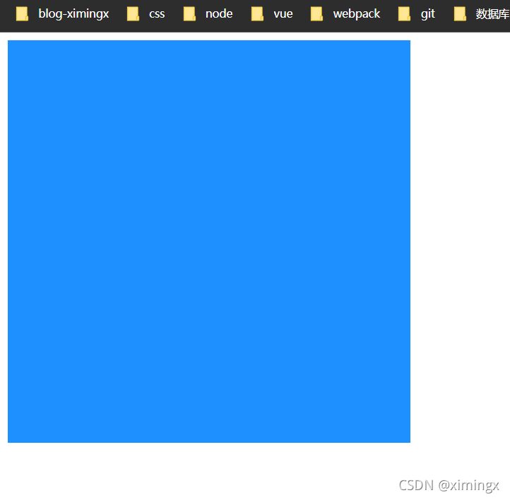


### 1.3 transition-duration

用于设置过渡的持续时间，属性值以秒`s`或毫秒`ms`为单位，默认值为0 , 为0时，表示变化是瞬时的，看不到过渡效果。

多个每个时长会被应用到由 `transition-property` 指定的对应属性上。

**如果指定的时长个数小于属性个数，那么时长列表会重复.如果时长列表更长，那么该列表会被裁减。**

### 1.4 transition-timing-function

>   liner
>   ease-in
>   ease-out
>   ease-in-out
>   cubic-bezier

这里先提一下,下面 animation 里会有具体的解释

### 1.5 transition-delay

`transition-delay` 规定了在过渡效果开始作用之前需要等待的时间（延迟时间），值以秒（s）或毫秒（ms）为单位，表明动画过渡效果将在何时开始

**取值为正时会延迟一段时间来响应过渡效果；取值为负时会导致过渡立即开始。**

一个完整的案例

```css
div {
    width: 200px;
    height: 200px;
    background-color: #000000;
    transition-property: width;
    transition-duration: 3s;
    transition-timing-function: linear;
    transition-delay: 0.5s;
}
div:hover {
    width: 400px;
}
```

### 1.6 简写属性

```css
transition: 过渡属性 过渡所需要时间 过渡动画函数 过渡延迟时间；
```

### 1.7 transition 的不足

**transition的优点在于简单易用，但是它有几个很大的局限。**
（1）transition需要事件的触发，所以没法在网页加载时自动发生。
（2）transition是一次性的，不能重复发生，除非一再触发。
（3）transition只能定义开始状态和结束状态，不能定义中间状态，也就是说只有两个状态。
（4）一条 transition 规则，**可以通过逗号同时定义多个属性的变化**（如 `transition: width 1s, height 2s;`）；它的真正局限是一条规则只能定义"开始态 → 结束态"这一种过渡，无法描述中间过程。
CSS Animation就是为了解决这些问题而提出的,完美的解决了这些问题

### 1.8 一个简单的样式

```html
<!DOCTYPE html>
<html lang="en">
    <head>
        <meta charset="UTF-8" />
        <title>CSS 过渡</title>
        <style>
            body {
                margin: 0;
                padding: 0;
                background-color: #eeeeee;
            }
            .content {
                width: 800px;
                height: 320px;
                padding-left: 20px;
                margin: 80px auto;
            }
            .item {
                width: 230px;
                height: 300px;
                text-align: center;
                margin-right: 20px;
                background-color: #fff;
                float: left;
                position: relative;
                top: 0;
                overflow: hidden; /* 让溢出的内容隐藏起来。意思是让下方的橙色方形先躲起来 */
                transition: all 0.5s; /* 从最初到鼠标悬停时的过渡 */
            }
            .item .desc {
                position: absolute;
                left: 0;
                bottom: -80px;
                width: 100%;
                height: 80px;
                background-color: #ff6700;
                transition: all 0.5s;
            } /* 鼠标悬停时，让 item 整体往上移动5px，且加一点阴影 */
            .item:hover {
                top: -5px;
                box-shadow: 0 0 15px #aaa;
            } /* 鼠标悬停时，让下方的橙色方形现身 */
            .item:hover .desc {
                bottom: 0;
            }
        </style>
    </head>
    <body>
        <div class="content">
            <div class="item"><span class="desc"></span></div>
        </div>
    </body>
</html>
```


## 2D 转换 (transform)

**转换**是 CSS3 中具有颠覆性的一个特征，可以实现元素的**位移、旋转、变形、缩放**，甚至支持矩阵方式。

转换再配合过渡和动画，可以取代大量早期只能靠 Flash 才可以实现的效果。

在 CSS3 当中，通过 `transform` 转换来实现 2D 转换或者 3D 转换。

- 2D转换包括：缩放、移动、旋转。

### 2.1 缩放：`scale`

格式：

```css
/* transform: scale(x, y); */
/* transform: scale(2, 0.5); */
```

参数解释： x：表示水平方向的缩放倍数。y：表示垂直方向的缩放倍数。如果只写一个值就是等比例缩放。

取值：大于1表示放大，小于1表示缩小。不能为百分比。

### 2.2 位移：translate

格式：


```css
/* transform: translate(水平位移, 垂直位移); */
/* transform: translate(-50%, -50%); */
```

参数解释：

- 参数为百分比，相对于自身移动。

- 正值：向右和向下。 负值：向左和向上。如果只写一个值，则表示水平移动。

### 2.3 旋转：rotate

格式：

```css
/* transform: rotate(角度); */
/* transform: rotate(45deg); */
```

参数解释：正值 顺时针；负值：逆时针。

rotate 旋转时，默认是以盒子的正中心为坐标原点的。如果想**改变旋转的坐标原点**，可以用`transform-origin`属性。格式如下：


```css
/* transform-origin: 水平坐标 垂直坐标; */
/* transform-origin: 50px 50px; */
/* transform-origin: center bottom; // 旋转时，以盒子底部的中心为坐标原点 */
```


## 3D 转换

### 3.1 旋转：rotateX、rotateY、rotateZ

**3D坐标系（左手坐标系）**

**浏览器的这个平面，是X轴、Y轴；垂直于浏览器的平面，是Z轴。**

从上面这句话，我们也能看出：所有的3d旋转，对着正方向去看，都是顺时针旋转。

**格式：**

```css
/* transform: rotateX(360deg); // 绕 X 轴旋转 360 度 */
/* transform: rotateY(360deg); // 绕 Y 轴旋转 360 度 */
/* transform: rotateZ(360deg); // 绕 Z 轴旋转 360 度 */
```

### 3.2 移动：translateX、translateY、translateZ

**格式：**

```css
/* transform: translateX(100px); // 沿着 X 轴移动 */
/* transform: translateY(360px); // 沿着 Y 轴移动 */
/* transform: translateZ(360px); // 沿着 Z 轴移动 */
```

### 3.3 透视：perspective

电脑显示屏是一个 2D 平面，图像之所以具有立体感（3D效果），其实只是一种视觉呈现，通过透视可以实现此目的。

透视可以将一个2D平面，在转换的过程当中，呈现3D效果。但仅仅只是视觉呈现出 3d 效果，并不是正真的3d。

格式有两种写法：

- 作为一个属性，设置给父元素，作用于所有3D转换的子元素

- 作为 transform 属性的一个值，做用于元素自身。

格式举例：

```css
perspective: 500px;
```


## animation

**CSS3的animation属性可以像Flash制作动画一样，通过控制关键帧来控制动画的每一步**，实现更为复杂的动画效果。ainimation实现动画效果主要由两部分组成：

制作动画分为两步：

1.  定义动画 @keyframes
2.  使用(调用)

### 4.1 定义动画

#### @keyframes(关键帧) 用于 定义动画

```css
@keyframes animation01 {    0% {        margin-top: 10px;    }    100% {        margin-top: 20px;    }}
```

0%是动画的开始，100%是动画的完成。**中间可以插入任意百分比**
在 @keyframes 中规定某项CSS样式，就能创建由当前样式逐渐改为新样式的动画效果
**可以改变任意多的样式任意多的次数。**
或用关键词"from"和"to",等同于0%和100%

两者等同

```css
@keyframes animation01 {    from {        margin-top: 10px;    }    to {        margin-top: 20px;    }}
```

**部分属性是不可以发生改变的,因为 “不连续”,属性间的变换没有中间值**

### 4.2 调用动画

要调用动画,必须要得给他添加一些必要的属性: 

#### 时间函数（animation-timing-function）

animation-timing-function 属性定义了动画的播放速度曲线。

|                               |                                                              |
| :---------------------------: | :----------------------------------------------------------: |
|              值               |                             描述                             |
|            linear             |                 动画从头到尾的速度是相同的。                 |
|             ease              |        默认。动画以低速开始，然后加快，在结束前变慢。        |
|            ease-in            |                       动画以低速开始。                       |
|           ease-out            |                       动画以低速结束。                       |
|          ease-in-out          |                    动画以低速开始和结束。                    |
|             steps             |              指定了时间函数中的间隔数量（步长）              |
| cubic-bezier(*n*,*n*,*n*,*n*) | 在 cubic-bezier 函数中自己的值。可能的值是从 0 到 1 的数值。 |

默认值，如果没有显示写调用的函数，则默认为ease。

**cubic-bezier(*n*,*n*,*n*,*n*)  是生成速度曲线的函数**  


从上图中我们可以看到，cubic-bezier有四个点：
两个默认的，即：P0(0,0)，P3(1,1)；
**两个控制点，即 cubic-bezier 函数中传递的四个值,分别依次带入 P1(x1,y1)，P2(x2,y2)**
注：X轴的范围是0~1，超出cubic-bezier将失效，Y轴的取值没有规定，但是也不宜过大。
**我们只要调整两个控制点P1和P2的坐标，最后形成的曲线就是动画曲线。**

举例 cubic-bezier(0.25,0.1,0.25,1)


画的丑,下面不手画了

给大家一个地址: https://easings.net/

可以自己去看看 cubic-bezier( ) 函数的演示


and cubic-bezier 可以自己随心所欲地绘制 cubic-bezier( ) 函数

https://cubic-bezier.com/##.17,.67,.83,.67


**而 steps 会一卡一卡的 生成我们的动画**

---

#### 动画方向（animation-direction）

animation-direction: normal 正序播放  起点=>终点
animation-direction: reverse 倒序播放  终点=>起点
animation-direction: alternate 交替播放  
animation-direction: alternate-reverse 反向交替播放  

---

#### 动画延迟（animation-delay）

animation-delay属性定义动画是从何时开始播放，即动画应用在元素上的到动画开始的这段时间的长度。默认值0s，表示动画在该元素上后立即开始执行。该值以秒(s)或者毫秒(ms)为单位。

---


#### 动画迭代次数（animation-iteration-count）

animation-iteration-count该属性就是定义我们的动画播放的次数。次数可以是1次或者无限循环。默认值只播放一次。

single-animation-iteration-count = infinite | number


---


#### 动画填充模式（animation-fill-mode）

animation-fill-mode是指给定动画播放前后应用元素的样式。

single-animation-fill-mode = none | forwards | backwards | both

animation-fill-mode: none 动画执行前后不改变任何样式
animation-fill-mode: forwards 保持目标动画最后一帧的样式
animation-fill-mode: backwards 保持目标动画第一帧的样式
animation-fill-mode: both 动画将会执行 forwards 和 backwards 执行的动作。


---


#### 动画播放状态（animation-play-state）

animation-play-state: 定义动画是否运行或者暂停。可以确定查询它来确定动画是否运行。默认值为running

animation-play-state = running | paused

running 动画正常播放
paused 动画暂停播放


---


#### 简写

```css
animation:动画名称 持续时间 运动曲线 何时开始 播放次数 是否反方向 动画起始或者结束的状态;
```

但是需要注意: 简写属性里面不包含 **animation- play-state**

### 5.1 按钮抖动动画

```html
<template>
  <div :class="{ shake: disabled }">
    <button @click="warnDisabled">Click me</button>
    <span v-if="disabled">This feature is disabled!</span>
  </div>
</template>
<script>
export default {
  name: 'ShakeButton',
  data() {
    return {
      disabled: false,
    };
  },
  methods: {
    warnDisabled() {
      this.disabled = true;
      setTimeout(() => {
        this.disabled = false;
      }, 1500);
    },
  },
};
</script>
<style>
.shake {
  animation: shake 0.82s cubic-bezier(0.36, 0.07, 0.19, 0.97) both;
  transform: translate3d(0, 0, 0);
}
@keyframes shake {
  10%,
  90% {
    transform: translate3d(-1px, 0, 0);
  }
  20%,
  80% {
    transform: translate3d(2px, 0, 0);
  }
  30%,
  50%,
  70% {
    transform: translate3d(-4px, 0, 0);
  }
  40%,
  60% {
    transform: translate3d(4px, 0, 0);
  }
}
</style>
```

### 5.2 背景颜色随鼠标渐变

[演示地址](http://ximingx.com/TransitionColor22_3_24/index.html)

```html
<template>
  <div
    @mousemove="onMousemove"
    :style="{ backgroundColor: `hsl(${x}, 80%, 50%)` }"
    class="movearea"
  >
    <p>Move your mouse across this div...</p>
    <p>x: {{ x }}</p>
  </div>
</template>
<script>
export default {
  name: 'ShakeButton',
  data() {
    return {
      x: 0,
    };
  },
  methods: {
    onMousemove(e) {
      this.x = e.clientX;
    },
  },
};
</script>
<style>
* {
  padding: 0;
  margin: 0;
}
.movearea {
  width: 100vw;
  height: 100vh;
  transition: 0.3s background-color ease;
}
</style>
```

## 正则表达式

**定义**：正则表达式用于定义一些字符串的规则。

**作用**：计算机可以根据正则表达式，来检查一个字符串是否符合指定的规则；或者将字符串中符合规则的内容提取出来。

### 创建正则表达式的对象

#### 方式一：使用构造函数创建正则表达式的对象

语法：

```javascript
// 伪代码：创建正则表达式对象（注意，参数是字符串）
// var 变量 = new RegExp("正则表达式");
// var 变量 = new RegExp("正则表达式", "匹配模式");
```

备注：`RegExp`的意思是 **Regular expression**。使用typeof检查正则对象，会返回object。

上面的语法中，既可以传一个参数，也可以传两个参数。

创建了正则表达式的对象后，该怎么使用呢？大致分为两个步骤：

- （1）创建正则表达式的对象 reg。

- （2）使用 reg 的test() 方法，判断指定字符串是否符合规则。

**正则表达式的`test()`方法**：【重要】

```javascript
// 伪代码：判断字符串 str 是否符合指定的 myReg 这个正则表达式的规则
// myReg.test(str);
```

解释：使用`test()`这个方法可以用来检查一个字符串是否符合正则表达式的规则，**如果符合则返回true，否则返回false**。

我们来看看下面的例子。

**1、传一个参数时**：

构造函数 RegExp 中，可以只传一个参数。

代码举例：

```javascript
var reg = new RegExp('x'); // 定义一个正则表达式：检查一个字符串中是否含有 x
var str1 = "ximingx";
var str2 = "bawd";
// 通过 test() 方法，判断字符串是否符合上面定义的 reg 规则
console.log(reg.test(str1)); // 打印结果：true
console.log(reg.test(str2)); // 打印结果：false
```

注意，上面的例子中，我们是先定义了一个正则表达式的规则，然后通过正则表达式的`test()`方法来判断字符串是否符合之前定义的规则。

**2、传两个参数时**：匹配模式 【重要】

构造函数 RegExp 中，也可以传两个参数。我们可以传递一个**匹配模式**作为第二个参数。这个参数可以是：

- `i` 忽略大小写。这里的 i 指的是 ignore。

- `g` 全局匹配模式。这里的 g 指的是 global。

代码举例：

```javascript
var reg = new RegExp('M', 'i');
var str = 'ximingx';
console.log(reg.test(str)); // 打印结果：true
```

#### 方式二：使用字面量创建正则表达式

我们可以使用字面量来创建正则表达式。

语法：

```javascript
// 伪代码：创建正则表达式
// var 变量 = /正则表达式/;
// var 变量 = /正则表达式/匹配模式;
// 注意，这个语法里没有引号
```

代码举例：

```javascript
var reg = /X/i; // 定义正则表达式的规则：检查一个字符串中是否含有 X。忽略大小写。
var str = "ximingx";
console.log(typeof reg); // 打印结果：object
console.log(reg.test(str)); // 打印结果：true
```

#### 以上两种方式的对比

- 方式一：使用构造函数创建时，更加灵活，因为参数中还可以传递变量。

- 方式二：使用字面量的方式创建，更加简单。

代码举例：

```javascript
var reg = new RegExp("a", "i"); // 方式一
var reg2 = /a/i; // 方式二
```

上面这两行代码的作用是等价的。

#### 避坑指南：全局匹配 g 慎用test()方法

对于非全局匹配的正则表达式，`test()`只会检测**是否存在某个目标字符串**（只要存在就为 true），多次检测的结果都相同。例如：

```javascript
const reg = /test/;
const str = '_test_test';
reg.test(str); // true
reg.test(str); // true
reg.test(str); // true
```

重点来了。

当设置全局标志 `/g` 时，一旦字符串中还存在匹配，test() 方法都将返回 true，同时匹配成功后将把 `lastIndex` 属性的值**设置为上次匹配成功结果之后的第一个字符所在的位置**，下次匹配将从 `lastIndex` 指示的位置开始；匹配不成功时返回 false，同时将 lastIndex 属性的值重置为 0。

```javascript
const reg = /test/g;
const str = '_test_test_test';
console.log(reg.test(str)); // true
console.log(reg.lastIndex); // 5
console.log(reg.test(str)); // true
console.log(reg.lastIndex); // 10
console.log(reg.test(str)); // true
console.log(reg.lastIndex); // 15
console.log(reg.test(str)); // false
console.log(reg.lastIndex); // 0
```

**总结**：

全局匹配模式`g`一般用于 `exec()`、`match()`、`replace()`等方法。

全局匹配模式`g`如果用于test()方法会有问题。因为g模式会生成一个`lastindex`参数来存储匹配最后一次的位置。

### 正则表达式的简单语法

#### 检查一个字符串中是否包含 a或b

**写法1**：

```javascript
// 伪代码：var reg = /a|b/;
```

解释：使用 `|` 表示`或`的意思。

**写法2**：

```javascript
// 伪代码：var reg = /[ab]/;（跟上面的那行语法是等价的）
```

解释：这里的`[]`也是表示`或`的意思。

`[]`这个符号在正则还是比较常用的。我们接下来看几个例子。

#### []表示：或

一些规则：

- `/[ab]/` 等价于 `/a|b/`：检查一个字符串中是否包含 **a或b**

- `/[a-z]/`：检查一个字符串那种是否包含**任意小写字母**

- `/[A-Z]/`：任意大写字母

- `/[A-z]/`：任意字母。（严格来说 `[A-z]` 的范围是 ASCII 码 65~122，Z 和 a 之间还夹着 6 个非字母字符——方括号、反斜杠、插入符、下划线、反引号；要表示"任意字母"，更严谨的写法是 `[A-Za-z]`）

- `/[0-9]/`：任意数字

- `/a[bde]c/`：检查一个字符串中是否包含 abc 或 adc 或 aec

#### [^ ] 表示：除了

举例1：

```javascript
var reg = /[^ab]/; // 规则：字符串中，除了 a、b 之外，还有没有其他的字符内容？
var str = "acb";
console.log(reg.test(str)); // 打印结果：true
```

举例2：（可以用来验证某字符串是否为 纯数字）

```javascript
var reg = /[^0-9]/; // 规则：字符串中，除了数字之外，还有没有其他的内容？
var str1 = "1991";
var str2 = "199a1";
console.log(reg.test(str1)); // 打印结果：false （如果字符串是纯数字，则返回 false）
console.log(reg.test(str2)); // 打印结果：true
```

### 支持正则表达式的 String 对象的方法

 String对象的如下方法，是支持正则表达式的：

| 方法      | 描述                                                   | 备注 |
| :-------- | :----------------------------------------------------- | :--- |
| split()   | 将字符串拆分成数组                                     |      |
| search()  | 搜索字符串中是否含有指定内容，返回索引 index           |      |
| match()   | 根据正则表达式，从一个字符串中将符合条件的内容提取出来 |      |
| replace() | 将字符串中的指定内容，替换为新的内容并返回             |      |

下面来分别介绍和举例。

#### split()

`split()`：将一个字符串拆分成一个数组。可以接受一个正则表达式作为参数。

**正则相关的举例**：根据任意字母，将字符串拆分成数组。

代码实现：（通过正则）

```javascript
var str = "1a2b3c4d5e6f7g";
var result = str.split(/[A-z]/); // 参数是一个正则表达式：表示所有字母
console.log(result);
```

打印结果：

```json
	["1", "2", "3", "4", "5", "6", "7", ""]
```

#### search()

`search()`：搜索字符串中是否含有指定内容。如果搜索到指定内容，则会返回第一次出现的索引；否则返回-1。

`search()`方法可以接受一个正则表达式作为参数，然后会根据正则表达式去检索字符串。`serach()`只会查找第一个，即使设置全局匹配也没用。

**举例**：

```javascript
var str = "hello abc hello aec afc";
/*
 * 搜索字符串中是否含有 abc 或 aec 或 afc
 */
result = str.search(/a[bef]c/);
console.log(result); // 打印结果：6
```

#### match()

`match()`：根据正则表达式，从一个字符串中将符合条件的内容提取出来，封装到一个数组中返回（即使只查询到一个结果）。

**注意**：默认情况下，`match()`方法只会找到**第一个**符合要求的内容，找到以后就停止检索。我们可以设置正则表达式为**全局匹配**模式，这样就会匹配到所有的内容，并以**数组**的形式返回。

另外，我们可以为一个正则表达式设置多个匹配模式，且匹配模式的顺序无所谓。

**代码举例**：

```javascript
var str = '1a2a3a4a5e6f7A8B9C';
var result1 = str.match(/[a-z]/); // 找到符合要求的第一个内容，然后返回
var result2 = str.match(/[a-z]/g); // 设置为"全局匹配"模式，匹配字符串中所有的小写字母
var result3 = str.match(/[a-z]/gi); // 设置多个匹配模式，匹配字符串中所有的字母（忽略大小写）
console.log(result1); // 打印结果：["a"]
console.log(result2); // 打印结果：["a", "a", "a", "a", "e", "f"]
console.log(result3); // 打印结果：["a", "a", "a", "a", "e", "f", "A", "B", "C"]
```

**总结**：

match()这个方法还是很实用的，可以在一个很长的字符串中，提取出**有规则**的内容。这不就是爬虫的时候经常会遇到的场景么？

#### replace()

`replace()`：将字符串中的指定内容，替换为新的内容并返回。不会修改原字符串。

语法：

```javascript
// 伪代码：新的字符串 = str.replace(被替换的内容，新的内容);
```

参数解释：

- 被替换的内容：可以接受一个正则表达式作为参数。

- 新的内容：默认只会替换第一个。如果需要替换全部符合条件的内容，可以设置正则表达式为**全局匹配**模式。

代码举例：

```javascript
// replace() 方法：替换
var str2 = "Today is fine day,today is fine day !!!";
console.log(str2);
console.log(str2.replace("today", "tomorrow")); // 只能替换第一个 today
console.log(str2.replace(/today/gi, "tomorrow")); // 这里用到了正则，且为"全局匹配"模式，才能替换所有的 today
```

### 常见正则表达式举例

#### 检查一个字符串是否是一个合法手机号

手机号的规则：

- 以1开头（`^1` 表示1开头 , `[^1]`表示非1或除了1）

- 第二位是3~9之间任意数字

- 三位以后任意9位数字

正则实现：

```javascript
var phoneStr = "13067890123";
var phoneReg = /^1[3-9][0-9]{9}$/;
console.log(phoneReg.test(phoneStr));
```

**备注**：如果在正则表达式中同时使用`^`和`$`符号，则要求字符串必须完全符合正则表达式。

#### 去掉字符串开头和结尾的空格

正则实现：

```javascript
str = str.replace(/^\s*|\s*$/g, "");
```

解释如下：

```javascript
str = str.replace(/^\s*/, ""); // 去除开头的空格
str = str.replace(/\s*$/, ""); // 去除结尾的空格
```

#### 判断字符串是否为电子邮件

正则实现：

```javascript
var emailReg = /^\w{3,}(\.\w+)*@[A-z0-9]+(\.[A-z]{2,5}){1,2}$/;
var email = "abchello@163.com";
console.log(emailReg.test(email));
```

## promise

学习 Promise 之前我们需要了解 回调地狱

**多层回调函数的相互嵌套，就形成了回调地狱。**

回调地狱的缺点：

- 代码耦合性太强，牵一发而动全身，难以维护；
- 大量冗余的代码相互嵌套，代码的可读性变差；

---

**Promise 是异步编程的一种优雅的解决方案**，是一个构造函数，有all、reject、resolve这几个方法，原型上有then、catch等方法

### Promise 特点

（1）Promise对象里的异步操作执行时**有三种状态：pending（进行中）、fulfilled（已成功）和rejected（已失败)** ,而Promise对象状态的改变，只有两种可能：**从pending变为fulfilled或者从pending变为rejected。**

（2）而一旦上面的这种状态发生改变，之后就不会再变，任何时候都可以得到这个结果。**如果改变已经发生了，你再对Promise对象添加回调函数，也会立即得到这个结果**。

（3） Promise.prototype 上包含一个 `.then()` 方法	**每一次 new Promise() 构造函数得到的实例对象，都可以通过原型链的方式访问到 .then() 方法**, `.then()` 方法用来预先指定成功和失败的回调函数, 也可以 p.then(result => { }, error => { })；这样的方式, 调用 .then() 方法时，成功的回调函数是必选的、失败的回调函数是可选的；

（4）**new 出来的 Promise 实例对象，代表一个异步操作；**

以下案例均在 vue 的代码中演示

```js
mounted() {
  let promise1 = new Promise(function (resolve, reject) {
    // 做一些异步操作（可以是网络请求、定时器、回调函数、事件绑定）
    setTimeout(function () {
      console.log('完成异步操作');
      resolve('返回任意的数据');
      // 会在两秒之后返回打印值
    }, 2000);
  });
}
```

**这里我们 new 了一个 Promise , 在 Promise 里面执行异步操作的代码** 

可以看到,这里**只是对他进行了声明,并没有执行这一个函数**

但是从结果上看来结果 却是执行了 这个函数  ,  这里先忘记里面的  resolve('返回任意的数据');  里起了什么作用

**其执行过程是：执行了一个异步操作，也就是setTimeout，2秒后，输出“完成异步操作”，并且调用resolve方法。这里首先要明白一件事情, Promise 对象的声明会使内部的异步操作发生**

这里需要知道的是:  如果我们直接 new 一个 promise , 而没有将他放置在函数中的时候 , 他会直接执行里面的异步操作

所以我们用Promise的时候一般是包在一个函数中，在需要的时候去运行这个函数 , 这里演示一下

```js
methods: {
  test: function () {
    return new Promise(function (resolve, reject) {
      // 做一些异步操作（可以是网络请求、定时器、回调函数、事件绑定）
      setTimeout(function () {
        console.log('完成异步操作');
        resolve('返回任意的数据');
        // 会在两秒之后返回打印值
      }, 2000);
    });
  },
},
mounted() {
  this.test();
}
```

可以看到 在这里 我们直接 return 出  Promise对象 , 这将在在之后给我们非常大的便利 , **可以让我们直接链式调用它的方法**

### resolve() 的作用

先看一段代码和结果

```js
mounted() {
  let promise = new Promise(function (resolve, reject) {
    // 做一些异步操作（可以是网络请求、定时器、回调函数、事件绑定）
    setTimeout(function () {
      resolve('返回任意的数据');
      // 会在两秒之后返回打印值
    }, 2000);
  }).then((data) => {
    console.log(data);
  });
}
```


我们可以发现在之后的 .then(data) 中有一句 console.log(data)

这这里的 **data 对应的正是 resolve() 参数中返回的值** , **原来then里面的函数就跟我们平时的回调函数一个意思，能够在这个异步任务执行完成之后被执行.** 而这也这就是Promise的作用了，**用链式调用的方式执行回调函数。**

而 Promise的优势正是在于可以链式调用 , 可以在then方法中继续写Promise对象并返回，然后继续调用then来进行回调操作。

但是 + - +

```js
mounted() {
  return new Promise(function (resolve, reject) {
    if (1 < 2) {
      resolve(true);
    } else {
      console.log("error");
    }
  })
    .then((data) => {
      console.log(data);
      return new Promise(function (resolve, reject) {
        if (2 < 3) {
          resolve(true);
        } else {
          console.log("error");
        }
      });
    })
    .then((data) => {
      console.log(data);
      return new Promise(function (resolve, reject) {
        if (2 < 3) {
          resolve(true);
        } else {
          console.log("error");
        }
      }).then((data) => {
        console.log(data);
      });
    });
}
```

上面这样子的代码  是不是很丑 , 很难看懂 + - + , 而且和之前的回调地狱一样不方便读懂代码

但是实际上 不这么搞

### 我们一般采用下面的写法

```js
methods: {
  test: function () {
    return new Promise((resolve, reject) => {
      setTimeout(() => {
        resolve(1);
      }, 1000);
    });
  },
},
mounted() {
  this.test()
    .then((data) => {
      console.log(data);
      // 返回 Promise 对象，使其继续进行链式调用
      return this.test();
    })
    .then((data) => {
      console.log(data);
      return this.test();
    })
    .then((data) => {
      console.log(data);
      return this.test();
    })
    .then((data) => {
      console.log(data);
    });
}
```

这样就能够按顺序,输出每个异步回调中的内容

每次 .then 中的 return 都可以返回一个 Promise , 从而可以在之后继续链式调用  , 这样写是不是就很好看了


### reject() 的用法

**resolve 是 promise 成功执行时候的回调，它把 promise 的状态修改为 fulfilled**（注意拼写是 `fulfilled`，不是 `fullfiled`）

那么，**reject就是失败的时候的回调，他把promise的状态修改为rejected**，这样我们就可以在 .then中 捕捉到，然后执行“失败”情况的回调

```js
methods: {
  test: function () {
    return new Promise((resolve, reject) => {
      setTimeout(() => {
        resolve(1);
      }, 1000);
    });
  },
},
mounted() {
  this.test()
    .then((data) => {
      console.log(data);
      return this.test();
    })
    .then((data) => {
      console.log(data);
      return this.test();
    })
    .then((data) => {
      console.log(data);
      return this.test();
    })
    .then((data) => {
      console.log(data);
      return new Promise((resolve, reject) => {
        if (1 !== 1) {
          reject(1);
        } else {
          resolve(2);
        }
      });
    })
    .then(
      (data) => {
        console.log(data);
      },
      (info) => {
        console.log(info);
      }
    );
}
```

这里在最后一次调用 promise 返回的结果时 , 执行力 resolve(2) , 最后打印台显示的结果也是 2 ,

而且我们也可以看到 , 在then中传了两个参数，这两个参数分别是两个函数，then方法可以接受两个参数，**第一个对应resolve的回调，第二个对应reject的回调。（也就是说then方法中接受两个回调，一个成功的回调函数，一个失败的回调函数）**，所以我们能够分别拿到成功和失败传过来的数据就有以上的运行结果


接下来我们再看一下 .catch 和 直接在 .then 中传入第二个参数的区别

```js
methods: {
  test: function () {
    return new Promise((resolve, reject) => {
      setTimeout(() => {
        resolve(1);
      }, 1000);
    });
  },
},
mounted() {
  this.test()
    .then((data) => {
      console.log(data);
      return this.test();
    })
    .then((data) => {
      console.log(data);
      return this.test();
    })
    .then((data) => {
      console.log(data);
      return this.test();
    })
    .then((data) => {
      console.log(data);
      return new Promise((resolve, reject) => {
        if (1 !== 1) {
          reject(1);
        } else {
          resolve(2);
        }
      });
    })
    .then((data) => {
      console.log(data);
    })
    .catch((info) => {
      console.log(info);
    });
}
```

我们可以看到: 两次结果是一样的 , 但是我们需要明白 , 在 .then 中写第二个参数 和 用 .catch 是有区别的

.catch 除了会得到失败的结果,还会捕获异常 , 类似于一些语法的错误 , 在捕获到异常的时候 , 并不会卡死 , 而是继续执行下面的代码
**`Promise.all()` 是 Promise 上的一个静态方法（注意：它是构造函数 `Promise` 自己的方法，不是原型上的，和 `then` 不在同一层），该方法提供了并行执行异步操作的能力，并且在所有异步操作都执行完、且结果都是成功的时候，才执行回调。**

### all() 多个Promise 一起执行

```js
methods: {
  test1: function () {
    return new Promise((resolve, reject) => {
      setTimeout(() => {
        resolve(1);
      }, 1000);
    });
  },
  test2: function () {
    return new Promise((resolve, reject) => {
      setTimeout(() => {
        resolve(1);
      }, 1000);
    });
  },
  test3: function () {
    return new Promise((resolve, reject) => {
      setTimeout(() => {
        resolve(1);
      }, 1000);
    });
  },
},
mounted() {
  // 用一个数组包裹。注意：这里传的是【调用后返回的 Promise 实例】，必须带小括号
  Promise.all([this.test1(), this.test2(), this.test3()]).then((res) => {
    console.log(res);
    console.log(res.length);
  });
}
```

> **易错点**：上面必须写 `this.test1()` 而不是 `this.test1`。
> 如果只写 `this.test1`，传进去的是**函数本身**而非 Promise 实例，`Promise.all()` 会把它当成普通值（非 thenable）直接放进结果数组，于是**立刻** resolve，根本不会等待异步操作完成——链式调用看起来"能用"，但结果是错的。

这里在三个异步方法都执行完毕后 , 返回了一个数组 , 里面包含了每个方法对应的结果


Promise.all来执行多个异步操作，**all接收一个数组参数**，这组参数为需要执行异步操作的所有方法，**里面的值最终都算返回Promise对象。**

这样，**三个异步操作的并行执行的，等到它们都执行完后才会进到then里面**。

**数组中 Promise 实例的顺序，就是最终结果的顺序！**

### 除此之外还有 race 的 用法

all是等所有的异步操作都执行完了再执行then方法，那么race方法就是相反的，**谁先执行完成就先执行回调**。先执行完的不管是进行了race的成功回调还是失败回调，**其余的将不会再进入race的任何回调**

```js
methods: {
  test1: function () {
    return new Promise((resolve, reject) => {
      setTimeout(() => {
        resolve(1);
      }, 1000);
    });
  },
  test2: function () {
    return new Promise((resolve, reject) => {
      setTimeout(() => {
        resolve(1);
      }, 2000);
    });
  },
  test3: function () {
    return new Promise((resolve, reject) => {
      setTimeout(() => {
        resolve(1);
      }, 3000);
    });
  },
},
mounted() {
  // 同样要传调用后的 Promise 实例
  Promise.race([this.test1(), this.test2(), this.test3()]).then((res) => {
    console.log(res);
  });
}
```

这次只是 将 Promise.all 修改为了 Promise.race , 返回的结果中 只有最先执行结束的结果

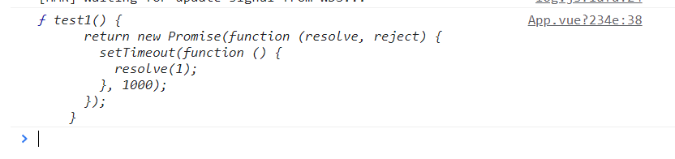

**补充:**


```js
// Promise 用于解决回调地狱
// Promise 是一个构造函数
const fs = require('fs');
// 在 promise 容器里的函数里放置异步操作
// promise 容器一旦创建就开始执行里面的代码
new Promise(function (resolve, reject) {
  fs.readFile('./package.json', 'utf8', function (err, data) {
    if (err) {
      reject(err);
    } else {
      resolve(data);
    }
  });
})
  .then((data) => {
    console.log(data);
    // -----------------------------------------------------------------------
    new Promise(function (resolve, reject) {
      fs.readFile('./package.json', 'utf8', function (err, data) {
        if (err) {
          reject(err);
        } else {
          resolve(data);
        }
      });
    })
      .then((data) => {
        console.log(data);
      })
      .catch((err) => {
        console.log(err);
      });
    // -----------------------------------------------------------------------
  })
  .catch((err) => {
    console.log(err);
  });
```

**异步的处理方式**

```js
const fs = require('fs');
const p1 = new Promise((resolve, reject) => {
  fs.readFile('./a.txt', 'utf8', (err, data) => {
    if (err) {
      reject(err);
    } else {
      resolve(data);
    }
  });
});
const p2 = new Promise((resolve, reject) => {
  fs.readFile('./b.txt', 'utf8', (err, data) => {
    if (err) {
      reject(err);
    } else {
      resolve(data);
    }
  });
});
const p3 = new Promise((resolve, reject) => {
  fs.readFile('./c.txt', 'utf8', (err, data) => {
    if (err) {
      reject(err);
    } else {
      resolve(data);
    }
  });
});
p1.then((data) => {
  console.log(data);
  // 这里的 return p2 会将 p2 的 resolve 结果传递给下面的 .then
  // 当 return 一个 promise 对象时，后续的 .then 中方法的第一个参数会作为返回的 promise (p2) 的 resolve
  return p2;
})
  .catch((err) => {
    console.log(err);
  })
  .then((data) => {
    console.log(data);
    return p3;
  })
  .catch((err) => {
    console.log(err);
  })
  .then((data) => {
    console.log(data);
  })
  .catch((err) => {
    console.log(err);
  });
```

**异步函数的封装**

```js
const fs = require('fs');
function pReadFile(filePath) {
  return new Promise(function (resolve, reject) {
    fs.readFile(filePath, 'utf8', function (err, data) {
      if (err) {
        reject(err);
      } else {
        resolve(data);
      }
    });
  });
}
pReadFile('./a.txt')
  .then((data) => {
    console.log(data);
    return pReadFile('./b.txt');
  })
  .then((data) => {
    console.log(data);
    return pReadFile('./c.txt');
  })
  .then((data) => {
    console.log(data);
  });
```

**Promise 在创建后会立马执行**
下面代码中，Promise 新建后立即执行，所以首先输出的是Promise。然后，then方法指定的回调函数，将在当前脚本所有同步任务执行完才会执行，所以resolved最后输出。
注意结果的输出顺序

```js
let promise = new Promise(function (resolve, reject) {
    console.log('Promise');
    resolve();
});
promise.then(function () {
    console.log('resolved.');
});
console.log('Hi!'); // Promise// Hi!// resolved
```

---

### 读取多个文件 (案例)

由于 node.js 官方提供的 fs 模块仅支持以回调函数的方式读取文件，不支持Promise 的调用方式。因此，需要先运行如下的命令，安装 `then-fs` 这个第三方包，从而支持我们基于 Promise 的方式读取文件的内容：

```bash
npm install then-fs
```

调用 then-fs 提供的 `readFile()` 方法，可以异步地读取文件的内容，它的返回值是 Promise 的实例对象。因此可以调用 `.then()` 方法为每个 Promise 异步操作指定成功和失败之后的回调函数。示例代码如下：

```js
import thenFS from 'then-fs';
thenFS.readFile('./1.text', 'utf8').then((r1) => {
  console.log(r1);
});
thenFS.readFile('./1.text', 'utf8').then((r2) => {
  console.log(r2);
});
thenFS.readFile('./1.text', 'utf8').then((r3) => {
  console.log(r3);
});
```

上述的代码无法保证文件的读取顺序，需要做进一步的改进！

`Promise` 支持链式调用，从而来解决回调地狱的问题。示例代码如下：

```js
import thenFS from 'then-fs';
thenFS
  .readFile('./1.text', 'utf8')
  .catch((err) => {
    console.log(err);
  })
  .then((r1) => {
    console.log(r1);
    return thenFS.readFile('./2.text', 'utf8');
  })
  .then((r2) => {
    console.log(r2);
    return thenFS.readFile('./3.text', 'utf8');
  })
  .then((r3) => {
    console.log(r3);
  });
```


## async/await

终究是放弃了写 Promise

**`async/await`** 是 **ES8（ECMAScript 2017）引入的新语法**，用来简化 Promise 异步操作。在 `async/await` 出现之前，开发者只能通过链式.then() 的方式处理 Promise 异步操作。

### 基本使用

使用 `async/await` 简化 Promise 异步操作的示例代码如下

```js
const thenFs = require('then-fs');
async function get() {
    const r1 = await thenFs.readFile('./yarn.lock');
    console.log(r1.toString());
    const r2 = await thenFs.readFile('./1.js');
    console.log(r2.toString());
    const r3 = await thenFs.readFile('./1.html');
    console.log(r3.toString());
}
get();
```

**如果在 function 中使用了 await，则 function 必须被 async 修饰；**


## EventLoop

JavaScript 是一门单线程执行的编程语言。也就是说，同一时间只能做一件事情。

单线程执行任务队列的问题：如果前一个任务非常耗时，则后续的任务就不得不一直等待，从而导致程序假死的问题。

一般而言，任务分为：发出调用和得到结果两步。

- 发出调用，“立即”得到结果是为同步
- 发出调用，但无法“立即”得到结果，需要额外的操作才能得到预期的结果是为异步。

为了防止某个耗时任务导致程序假死的问题，**JavaScript 把待执行的任务分为了两类：**

- **同步任务（synchronous）**

又叫做非耗时任务，指的是在主线程上排队执行的那些任务；

- **异步任务（asynchronous）**

又叫做耗时任务，异步任务由JavaScript 委托给宿主环境进行执行；
当异步任务执行完成后，会通知 JavaScript 主线程执行异步任务的回调函数；

**JS 执行栈采用的是后进先出的规则，当函数执行的时候，会被添加到栈的顶部，当执行栈执行完成后，就会从栈顶移出，直到栈内被清空。**

执行过程: 

- 首先任务会依次进入**执行栈**，而首先入场的就是宏任务全局上下文, 然后执行 js 主线程中的同步任务
- 将异步任务委托给宿主环境执行
- 已完成的异步任务会把它对应的回调函数放到任务队列中等待执行
- **当 js 主线程执行栈执行完毕**, 查看执行栈是否为空，如果执行栈为空
- **先检查**微任务(microTask)队列，如果存在任务，则**一次性执行完所有**微任务，无任务则跳过
- **后检查**宏任务(macroTask)队列，如果存在任务，则**取出第一个**宏任务，执行，
- 主线程不断重复上述操作

**JavaScript 主线程从“任务队列”中读取异步任务的回调函数，放到执行栈中依次执行。这个过程是循环不断的，所以整个的这种运行机制又称为 EventLoop（事件循环）。**

然而异步任务的也做了进一步的划分

1. **宏任务（macrotask）**

- 异步 Ajax 请求、
- setTimeout、setInterval、
- 文件操作
- 其它宏任务

2.  **微任务（microtask）**

- Promise.then、.catch 和 .finally
- `async/await` 中 `await` 之后的代码（本质是 Promise 回调）
- `queueMicrotask()`、`MutationObserver`
- `process.nextTick`（**Node 环境特有，优先级高于普通微任务**）
- 其它微任务

**每一个宏任务执行完之后，都会检查是否存在待执行的微任务，如果有，则执行完所有微任务之后，再继续执行下一个宏任务。**

> **更正一个常见误解**：早期笔记里写的"把宏任务理解为进程、微任务理解为线程"是不准确的。
> 宏任务和微任务**都是运行在同一个主线程上的任务**，与操作系统里的进程/线程没有任何对应关系。
> 二者的真实区别在于**调度时机**：一轮事件循环（tick）只取**一个**宏任务执行，执行完后必须把微任务队列**清空**，才允许进入下一轮。
> 一个更贴切的比喻是：宏任务是"一节课"，微任务是"这节课的随堂作业"——作业必须在本节课结束时全部做完，才能上下一节课。

```js
console.log(1);
setTimeout(() => {
  console.log(2);
  new Promise(function (resolve) {
    console.log(3);
    resolve();
  }).then(() => {
    console.log(4);
  });
});
new Promise((resolve) => {
  console.log(5);
  resolve();
}).then(() => {
  console.log(6);
});
setTimeout(() => {
  console.log(7);
  new Promise(function (resolve) {
    console.log(8);
    resolve();
  }).then(() => {
    console.log(9);
  });
});
// 打印结果：156234789
```

---

## 异步编程（进阶）

### 异步编程的演进路线

| 阶段 | 方案 | 解决的问题 | 遗留问题 |
| --- | --- | --- | --- |
| ① | **回调函数** | 让耗时任务不阻塞主线程 | 回调地狱、无法 `return`、无法 `try/catch` |
| ② | **Promise** | 链式调用、统一错误处理 | 仍然是回调，语义不够直观 |
| ③ | **Generator** | 用同步写法写异步 | 需要手动执行器，用起来麻烦 |
| ④ | **async / await** | 语法层面彻底用同步写法写异步 | 容易滥用串行，丢失并发 |

### 事件循环综合题（含 async/await）

这是目前最经典的一道执行顺序题，务必能独立推导出来：

```js
async function async1() {
    console.log('async1 start');
    await async2();
    console.log('async1 end');
}
async function async2() {
    console.log('async2');
}

console.log('script start');

setTimeout(function () {
    console.log('setTimeout');
}, 0);

async1();

new Promise(function (resolve) {
    console.log('promise1');
    resolve();
}).then(function () {
    console.log('promise2');
});

console.log('script end');
```

打印结果：

```
script start
async1 start
async2
promise1
script end
async1 end
promise2
setTimeout
```

**逐步推导**：

1. 同步代码开始：`console.log('script start')` → 打印 `script start`
2. 遇到 `setTimeout`，回调进入**宏任务队列**
3. 调用 `async1()`：**async 函数被调用时，函数体是同步执行的**，直到遇到第一个 `await`
   - 打印 `async1 start`
   - 执行 `async2()`，打印 `async2`
   - 遇到 `await`，**`await` 后面的代码（`console.log('async1 end')`）被包装成微任务**推入队列
4. 继续同步执行 `new Promise(...)`：executor 是同步的 → 打印 `promise1`；`resolve()` 后把 `.then` 回调推入**微任务队列**
5. 打印 `script end`
6. **同步代码执行完，清空微任务队列**：
   - 微任务 1：`async1 end`
   - 微任务 2：`promise2`
7. 微任务清空，取下一个宏任务 → `setTimeout`

> **关键认知**：`async` 函数体在被**调用**时是同步执行的，`await` 只会让**它后面的代码**变成异步。

#### 进阶题：返回 Promise 会"慢两个 tick"

```js
Promise.resolve().then(() => {
    console.log(0);
    return Promise.resolve(4);   // ← 返回的是一个 Promise
}).then((res) => {
    console.log(res);
});

Promise.resolve().then(() => {
    console.log(1);
}).then(() => {
    console.log(2);
}).then(() => {
    console.log(3);
}).then(() => {
    console.log(5);
}).then(() => {
    console.log(6);
});
```

打印结果：

```js
0
1
2
3
4
5
6
```

**为什么 `4` 排在了 `3` 后面**：

当 `then` 的回调**返回一个 Promise（thenable）**时，引擎不能直接采纳它的值，必须走"thenable 解包"流程——这会额外消耗 **2 个微任务 tick**：

1. 第 1 个 tick：把 `Promise.resolve(4)` 注册为待解包的 thenable
2. 第 2 个 tick：执行 `thenable.then(...)`，把结果 4 传给外层的 resolve

而另一条链上每个 `then` 只消耗 1 个 tick，跑得更快，所以 `1 2 3` 先打印完，才轮到 `4`。

> 如果 `then` 里 `return 4`（普通值）而不是 `return Promise.resolve(4)`，结果就是 `0 1 4 2 3 5 6` —— 这个差异是区分"背过答案"和"真懂微任务"的分水岭。

### Promise 静态方法全家桶

```js
const p1 = Promise.resolve(3);
const p2 = new Promise((resolve) => setTimeout(() => resolve('fast'), 100));
const p3 = new Promise((_, reject) => setTimeout(() => reject(new Error('boom')), 200));
```

| 方法 | 标准 | 行为 | 特点 |
| --- | --- | --- | --- |
| `Promise.resolve(v)` | ES6 | 返回以 v 敲定的 Promise | v 是 thenable 时会**采纳其状态** |
| `Promise.reject(e)` | ES6 | 返回以 e 拒绝的 Promise | 不会被"再包一层" |
| `Promise.all([...])` | ES6 | 全部成功才成功 | **快速失败**，一个 reject 立即结束；结果顺序 = 输入顺序 |
| `Promise.allSettled([...])` | ES2020 | 等所有都敲定 | **永不 reject**，返回 `[{status, value \| reason}]` |
| `Promise.race([...])` | ES6 | 第一个**敲定**的胜出 | 失败也算"敲定"，会直接 reject |
| `Promise.any([...])` | ES2021 | 第一个**成功**的胜出 | 全部失败才 reject，抛 `AggregateError` |

```js
// all：全部成功，结果是数组，顺序与输入一致（不是按完成先后排序！）
Promise.all([p1, p2]).then(console.log);        // [3, 'fast']

// all：快速失败
Promise.all([p1, p2, p3]).catch((e) => console.log(e.message)); // 'boom'

// allSettled：无论成败都等全部结束
Promise.allSettled([p1, p2, p3]).then(console.log);
// [
//   { status: 'fulfilled', value: 3 },
//   { status: 'fulfilled', value: 'fast' },
//   { status: 'rejected',  reason: Error: boom }
// ]

// race：谁先敲定用谁
Promise.race([p2, p3]).then(console.log);       // 'fast'

// any：谁先成功用谁（会跳过失败）
Promise.any([p3, p2]).then(console.log);        // 'fast'

// any：全部失败时抛 AggregateError
Promise.any([p3, Promise.reject(new Error('x'))]).catch((e) => {
    console.log(e instanceof AggregateError); // true
    console.log(e.errors);                    // [Error: boom, Error: x]
});
```

**几个容易掉的坑**：

```js
Promise.all([])         // 立即 resolve → []
Promise.race([])        // 永远 pending，什么都不做
Promise.any([])         // 立即 reject → AggregateError: All promises were rejected
Promise.allSettled([])  // 立即 resolve → []
```

还有一个**高频陷阱**：

```js
// ❌ 错误：forEach 不会等待异步，Promise.all 收到的是 [undefined, undefined, ...]
const results = await Promise.all(urls.forEach(async (url) => fetch(url)));

// ✅ 正确：用 map 得到 Promise 数组
const results = await Promise.all(urls.map((url) => fetch(url)));
```

> **重要提醒**：`Promise.all` **没有并发数限制**。如果一次性发出 10000 个请求，很可能把接口打挂或触发浏览器每域名 6 个连接的限制。需要限流时，请用后面「并发控制」一节的工具函数。

### then 链式调用的 7 条规则

1. **`then` 永远返回一个全新的 Promise**，这是链式调用的基础。
2. 回调 `return` 一个**普通值** → 新 Promise 以该值 resolve。
3. 回调 `return` 一个 **Promise** → 新 Promise 采纳它的状态和结果（**慢 2 个 tick**）。
4. 回调**没有 return** → 新 Promise 以 `undefined` resolve。
5. 回调 **throw** → 新 Promise reject。
6. 错误沿链**向后冒泡**，直到遇到 `onRejected` 或 `catch`。
7. `catch` 本身也返回 Promise，**所以 `catch` 后面还能继续 `then`**。

```js
Promise.resolve(1)
    .then((v) => v + 1)              // return 普通值 → 2
    .then((v) => Promise.resolve(v * 10)) // return Promise → 采纳，得 20
    .then((v) => { console.log(v); })      // 没有 return → undefined
    .then((v) => { console.log(v); throw new Error('出错了'); }) // throw → reject
    .then(() => console.log('这里不会执行'))  // 被跳过
    .catch((e) => console.log('捕获：', e.message)) // 捕获：出错了
    .then(() => console.log('catch 之后还能继续'));  // 执行
```

#### `.then(fn1, fn2)` 和 `.then(fn1).catch(fn2)` 的区别

这是本节最值得记住的一条：

```js
// 写法 A：第二个参数【捕获不到】fn1 里抛出的错误
Promise.resolve()
    .then(
        () => { throw new Error('A'); },
        (err) => console.log('A 能捕获吗？不能')
    )
    .catch((err) => console.log('最终被外层 catch 捕获：', err.message));

// 写法 B：catch 能捕获链上【前面所有】的错误
Promise.resolve()
    .then(() => { throw new Error('B'); })
    .catch((err) => console.log('catch 捕获：', err.message));
```

**结论**：`onRejected` 只能处理**它前面那个 Promise**的失败；`catch` 能处理它之前**整条链**的失败。实际开发中推荐统一用 `catch` 收尾。

### 手写 Promise（Promise A+ 核心实现）

面试高频。下面是一份能跑通异步 resolve、链式调用、值穿透、错误冒泡的精简实现：

```js
const PENDING = 'pending';
const FULFILLED = 'fulfilled';
const REJECTED = 'rejected';

class MyPromise {
    constructor(executor) {
        this.status = PENDING;
        this.value = undefined;
        this.reason = undefined;
        this.onFulfilledCallbacks = []; // 支持同一个 Promise 被 then 多次
        this.onRejectedCallbacks = [];

        const resolve = (value) => {
            if (this.status !== PENDING) return; // ① 状态一旦改变就不可逆
            this.status = FULFILLED;
            this.value = value;
            this.onFulfilledCallbacks.forEach((fn) => fn());
        };

        const reject = (reason) => {
            if (this.status !== PENDING) return;
            this.status = REJECTED;
            this.reason = reason;
            this.onRejectedCallbacks.forEach((fn) => fn());
        };

        try {
            executor(resolve, reject); // ② executor 是同步执行的
        } catch (err) {
            reject(err);
        }
    }

    then(onFulfilled, onRejected) {
        // ③ 参数可选 + 值穿透：then() / then(null, fn) 也要能工作
        onFulfilled = typeof onFulfilled === 'function' ? onFulfilled : (v) => v;
        onRejected =
            typeof onRejected === 'function'
                ? onRejected
                : (e) => { throw e; };

        const promise2 = new MyPromise((resolve, reject) => {
            const runFulfilled = () => {
                // ④ 回调必须异步执行（这里用 queueMicrotask 模拟微任务）
                queueMicrotask(() => {
                    try {
                        const x = onFulfilled(this.value);
                        resolvePromise(promise2, x, resolve, reject);
                    } catch (err) {
                        reject(err);
                    }
                });
            };
            const runRejected = () => {
                queueMicrotask(() => {
                    try {
                        const x = onRejected(this.reason);
                        resolvePromise(promise2, x, resolve, reject);
                    } catch (err) {
                        reject(err);
                    }
                });
            };

            if (this.status === FULFILLED) runFulfilled();
            else if (this.status === REJECTED) runRejected();
            else {
                // ⑤ 还在 pending：先存起来，等 resolve / reject 时再执行
                this.onFulfilledCallbacks.push(runFulfilled);
                this.onRejectedCallbacks.push(runRejected);
            }
        });

        return promise2;
    }

    catch(onRejected) {
        return this.then(null, onRejected);
    }

    finally(callback) {
        return this.then(
            (value) => MyPromise.resolve(callback()).then(() => value),
            (reason) =>
                MyPromise.resolve(callback()).then(() => { throw reason; })
        );
    }

    static resolve(value) {
        if (value instanceof MyPromise) return value;
        return new MyPromise((resolve) => resolve(value));
    }

    static reject(reason) {
        return new MyPromise((_, reject) => reject(reason));
    }
}

// ⑥ 处理 then 的返回值（Promise A+ 规范 2.3）
function resolvePromise(promise2, x, resolve, reject) {
    if (x === promise2) {
        return reject(new TypeError('Chaining cycle detected for promise'));
    }
    if (x instanceof MyPromise) {
        x.then(resolve, reject); // 采纳 x 的状态
    } else {
        resolve(x); // 普通值直接 resolve
    }
}
```

**验证**：

```js
new MyPromise((resolve) => setTimeout(() => resolve(1), 1000))
    .then((v) => {
        console.log(v);   // 1 秒后打印 1
        return v + 1;
    })
    .then((v) => console.log(v)); // 打印 2

new MyPromise((_, reject) => reject(new Error('失败')))
    .then((v) => console.log('不会执行'))
    .catch((e) => console.log('捕获：', e.message)); // 捕获：失败
```

> `queueMicrotask()` 是浏览器原生的微任务 API（Node 11+ 也支持），等价于 `Promise.resolve().then(fn)`，但语义更清晰、开销更小。
> 完整实现还需支持 `Promise.all` / `race` 等静态方法，以及更严格的 thenable 处理，这里从略。

### async / await 深入

**五条核心规则**：

1. **`async` 函数的返回值永远是一个 Promise**，无论你 `return` 什么。

```js
async function f() { return 123; }
console.log(f() instanceof Promise); // true
f().then(console.log);               // 123
// 等价于：return Promise.resolve(123)
```

2. **`await` 后面可以跟 Promise，也可以跟普通值**（普通值会被 `Promise.resolve()` 包装）。

```js
async function f() {
    const a = await 1;      // 等价于 await Promise.resolve(1)
    const b = await Promise.resolve(2);
    return a + b;
}
f().then(console.log); // 3
```

3. **`async` 函数里 `throw` 等价于 `reject`**。

```js
async function f() { throw new Error('出错'); }
f().catch((e) => console.log(e.message)); // '出错'
```

4. **错误处理用 try / catch**，这是 async/await 相对 Promise 链最大的优势。

```js
async function getUser() {
    try {
        const res = await fetch('/api/user');
        const data = await res.json();
        return data;
    } catch (err) {
        console.error('请求失败：', err);
        return null; // 兜底，避免错误继续往上抛
    } finally {
        console.log('无论成功失败都会执行');
    }
}
```

5. **await 只会等待，不会自动重试；一个 await 失败，后面的 await 都不会执行。**

#### 最大的性能陷阱：把并行写成串行

```js
// ❌ 串行：总耗时 = 1000 + 1000 = 2000ms
async function slow() {
    const a = await request('A'); // 等 1000ms
    const b = await request('B'); // 再等 1000ms
    return [a, b];
}

// ✅ 并行：总耗时 = max(1000, 1000) = 1000ms
async function fast() {
    const [a, b] = await Promise.all([request('A'), request('B')]);
    return [a, b];
}
```

> 只有当**后一个请求依赖前一个的结果**时，才必须用串行写法。

#### forEach 里的 await 不生效

```js
// ❌ 错误：forEach 是同步的，不会等待回调里的 await
arr.forEach(async (item) => {
    await handle(item);
});
console.log('done'); // 会立刻打印，此时任务还没跑完

// ✅ 方案一：for...of（串行）
for (const item of arr) {
    await handle(item);
}
console.log('done');

// ✅ 方案二：Promise.all + map（并行）
await Promise.all(arr.map((item) => handle(item)));
console.log('done');
```

**原因**：`forEach` 的回调返回什么它都不管，更不会去 `await` 那个 Promise。

#### 顶层 await（ES2022）

只能在 **ES Module**（`<script type="module">`）里使用，模块顶层可以直接 `await`：

```js
// module.js
const data = await fetch('/api/config').then((r) => r.json());
export default data;
```

### Generator 与 async/await 的关系

**Generator** 是可以暂停和恢复执行的函数，语法是 `function*` + `yield`。

```js
function* gen() {
    const a = yield 1;
    console.log('a =', a);
    const b = yield 2;
    console.log('b =', b);
    return 3;
}

const g = gen();
console.log(g.next());   // { value: 1, done: false }
console.log(g.next(10)); // a = 10  →  { value: 2, done: false }
console.log(g.next(20)); // b = 20  →  { value: 3, done: true }
console.log(g.next());   // { value: undefined, done: true }
```

要点：

- 调用 `gen()` **不会执行函数体**，只是返回一个迭代器
- 每次 `next()` 执行到下一个 `yield` 处暂停
- **`next(arg)` 传入的参数，会作为上一个 `yield` 表达式的返回值**

#### async/await 就是 Generator + 自动执行器

下面这个函数，把 Generator 自动跑完，作用和 `async` 关键字完全等价：

```js
function asyncToGenerator(generatorFn) {
    return function (...args) {
        const gen = generatorFn.apply(this, args);
        return new Promise((resolve, reject) => {
            function step(key, arg) {
                let result;
                try {
                    result = gen[key](arg);
                } catch (err) {
                    return reject(err);
                }
                const { value, done } = result;
                if (done) {
                    return resolve(value); // 全部执行完
                }
                // 用 Promise.resolve 包一层，让 yield 普通值也能 work
                return Promise.resolve(value).then(
                    (v) => step('next', v),   // 成功 → 继续下一步
                    (e) => step('throw', e)   // 失败 → 把错误抛回函数体内
                );
            }
            step('next');
        });
    };
}

// 使用：写法和 async/await 几乎一模一样
const fetchData = asyncToGenerator(function* () {
    const a = yield Promise.resolve(1);
    const b = yield Promise.resolve(2);
    return a + b;
});

fetchData().then(console.log); // 3
```

**对比记忆**：

| | Generator | async / await |
| --- | --- | --- |
| 暂停关键字 | `yield` | `await` |
| 是否自动执行 | 否，需手动 `next()` | 是，内置执行器 |
| 返回值 | 迭代器 | Promise |
| 错误处理 | 手动 `gen.throw()` | `try / catch` |
| 语义 | 更底层、可自定义 | 专为异步设计 |

### 异步实战工具函数

#### 1. sleep

```js
const sleep = (ms) => new Promise((resolve) => setTimeout(resolve, ms));

(async () => {
    console.log('开始');
    await sleep(1000);
    console.log('1 秒后');
})();
```

#### 2. 超时控制（timeout）

```js
function timeout(promise, ms) {
    let timer;
    const timeoutPromise = new Promise((_, reject) => {
        timer = setTimeout(() => reject(new Error(`请求超时（${ms}ms）`)), ms);
    });
    return Promise.race([promise, timeoutPromise]).finally(() => clearTimeout(timer));
}

// 使用
timeout(fetch('/api/slow'), 3000).catch((e) => console.log(e.message));
```

#### 3. 失败重试（retry）

```js
function retry(fn, times = 3, delay = 1000) {
    return new Promise((resolve, reject) => {
        function attempt(remaining) {
            Promise.resolve(fn())
                .then(resolve)
                .catch((err) => {
                    if (remaining <= 0) return reject(err);
                    console.log(`失败，${delay}ms 后重试，剩余 ${remaining} 次`);
                    setTimeout(() => attempt(remaining - 1), delay);
                });
        }
        attempt(times);
    });
}

// 使用：最多重试 3 次
retry(() => fetch('/api/data'), 3).then(console.log).catch(console.error);
```

#### 4. 并发控制（limitConcurrency）

`Promise.all` 无法限流，这是实际项目里最常用的一段异步工具代码：

```js
function limitConcurrency(tasks, limit) {
    return new Promise((resolve, reject) => {
        if (tasks.length === 0) return resolve([]);

        const results = new Array(tasks.length);
        let index = 0;     // 下一个要取的任务下标
        let finished = 0;  // 已完成数量
        let running = 0;   // 正在执行数量

        function run() {
            // 只要没到上限、任务还没取完，就继续往里塞
            while (running < limit && index < tasks.length) {
                const cur = index++;
                const task = tasks[cur];
                running++;
                Promise.resolve(task())
                    .then((res) => { results[cur] = res; }) // 按原顺序存放
                    .catch(reject)
                    .finally(() => {
                        running--;
                        finished++;
                        if (finished === tasks.length) {
                            resolve(results); // 全部完成
                        } else {
                            run();            // 空出一个位置，补一个任务
                        }
                    });
            }
        }

        run();
    });
}

// 使用：10 个任务，但同一时刻最多只跑 3 个
const tasks = Array.from({ length: 10 }, (_, i) => () => fetch(`/api/page/${i}`));
limitConcurrency(tasks, 3).then((results) => console.log(results));
```

#### 5. 串行执行（series）

```js
function series(tasks) {
    return tasks.reduce(
        (chain, task) =>
            chain.then((results) =>
                Promise.resolve(task()).then((res) => [...results, res])
            ),
        Promise.resolve([])
    );
}

// 使用：按顺序依次执行，后一个等前一个完成
series([() => fetch('/a'), () => fetch('/b'), () => fetch('/c')]).then(console.log);
```

#### 6. 图片 / 资源加载

```js
function loadImage(src) {
    return new Promise((resolve, reject) => {
        const img = new Image();
        img.onload = () => resolve(img);
        img.onerror = () => reject(new Error(`图片加载失败：${src}`));
        img.src = src;
    });
}

// 批量预加载
Promise.allSettled(urls.map(loadImage))
    .then((results) => console.log(results.filter((r) => r.status === 'fulfilled').length));
```

## ES6

### Symbol

#### 概述

背景：ES5中对象的属性名都是字符串，容易造成重名，污染环境。

**概念**：ES6 引入了一种新的原始数据类型Symbol，表示独一无二的值。它是 JavaScript 语言的第七种数据类型，前六种是：undefined、null、布尔值（Boolean）、字符串（String）、数值（Number）、对象（Object）。

**特点：**

- Symbol属性对应的值是唯一的，解决**命名冲突问题**

- Symbol值不能与其他数据进行计算，包括同字符串拼串

- for in、for of 遍历时不会遍历Symbol属性。

#### 1. 创建Symbol属性值

Symbol是函数，但并不是构造函数。创建一个Symbol数据类型：

```javascript
let mySymbol = Symbol();
console.log(typeof mySymbol); // 打印结果：symbol
console.log(mySymbol); // 打印结果：Symbol()
```

#### 2. 将Symbol作为对象的属性值

```javascript
let mySymbol = Symbol();
let obj = { name: 'smyhvae', age: 26 };
// obj.mySymbol = 'male'; // 错误：不能用 . 这个符号给对象添加 Symbol 属性。
obj[mySymbol] = 'hello'; // 正确：通过属性选择器给对象添加 Symbol 属性。后面的属性值随便写。
console.log(obj);
```

上面的代码中，我们尝试给obj添加一个Symbol类型的属性值，但是添加的时候，不能采用`.`这个符号，而是应该用`属性选择器`的方式。

#### 3. 创建Symbol属性值时，传参作为标识

如果我通过 Symbol()函数创建了两个值，这两个值是不一样的：

```javascript
let mySymbol1 = Symbol();
let mySymbol2 = Symbol();
console.log(mySymbol1 == mySymbol2); // 打印结果：false
console.log(mySymbol1); // 打印结果：Symbol()
console.log(mySymbol2); // 打印结果：Symbol()
```

上面代码中，倒数第三行的打印结果也就表明了，二者的值确实是不相等的。

最后两行的打印结果却发现，二者的打印输出，肉眼看到的却相同。那该怎么区分它们呢？

既然Symbol()是函数，函数就可以传入参数，我们可以通过参数的不同来作为**标识**。比如：


```javascript
// 在括号里加入参数，来标识不同的 Symbol
let mySymbol1 = Symbol('one');
let mySymbol2 = Symbol('two');
console.log(mySymbol1 == mySymbol2); // 打印结果：false
console.log(mySymbol1); // 打印结果：Symbol(one)
console.log(mySymbol2); // 打印结果：Symbol(two)
console.log(mySymbol2.toString()); // 打印结果：Symbol(two)
```

#### 4. 定义常量

Symbol 可以用来定义常量：


```javascript
    const MY_NAME = Symbol('my_name');
```

#### 5. 内置的 Symbol 值

除了定义自己使用的 Symbol 值以外，ES6 还提供了 11 个内置的 Symbol 值，指向语言内部使用的方法。

- `Symbol.iterator`属性

对象的`Symbol.iterator`属性，指向该对象的默认遍历器方法。

**内置 Symbol 值完整清单**（后续版本又补充了 `Symbol.asyncIterator`、`Symbol.matchAll` 等，已不止 11 个）：

| 内置 Symbol | 被什么语法触发 |
| --- | --- |
| `Symbol.iterator` | `for...of`、扩展运算符、解构赋值 |
| `Symbol.asyncIterator` | `for await...of`（ES2018） |
| `Symbol.hasInstance` | `obj instanceof Constructor` |
| `Symbol.isConcatSpreadable` | `Array.prototype.concat()` 是否展开 |
| `Symbol.toPrimitive` | 对象转原始值（`==`、运算、`String(obj)`） |
| `Symbol.toStringTag` | `Object.prototype.toString.call(obj)` 的后半段 |
| `Symbol.species` | 派生对象（如 `map()` 的返回值）的构造函数 |
| `Symbol.match` / `replace` / `search` / `split` / `matchAll` | 对应的 String 方法 |

利用 `Symbol.toStringTag` 可以自定义类型标签：

```js
class MyArray {
    static get [Symbol.toStringTag]() { return 'MyArray'; }
}
console.log(Object.prototype.toString.call(new MyArray())); // '[object MyArray]'

const obj = { [Symbol.toPrimitive](hint) {
    return hint === 'number' ? 42 : 'hello';
} };
console.log(+obj);        // 42
console.log(`${obj}`);    // 'hello'
```

---

## ES6+ 新特性（补充）

> 下面按"日常使用频率"排序整理。其中 `let / const`、原型与 `class`、Promise、`async/await` 的详细内容分别在**作用域与闭包（进阶）**、**原型与继承**、**异步编程（进阶）** 三节，本处只做索引，不再重复。

### 解构赋值（Destructuring）

#### 数组解构

```js
const [a, b, ...rest] = [1, 2, 3, 4];
console.log(a, b, rest); // 1 2 [3, 4]

// 交换变量（不需要临时变量）
let x = 1, y = 2;
[x, y] = [y, x];
console.log(x, y); // 2 1

// 跳过某些元素
const [, , third] = [1, 2, 3];
console.log(third); // 3

// 默认值（仅当对应位置 === undefined 时生效）
const [p = 10, q = 20] = [1];
console.log(p, q); // 1 20
```

> **注意默认值的一个细节**：默认值只在解构到的值**严格等于 `undefined`** 时才生效。
> ```js
> const [m = 10] = [null];
> console.log(m); // null，不是 10
> ```

#### 对象解构

```js
const user = { name: 'ximingx', age: 18, city: '西安' };

// 基本解构
const { name, age } = user;

// 重命名（左边是属性名，右边是新变量名）
const { name: userName, age: userAge } = user;
console.log(userName); // 'ximingx'

// 默认值
const { gender = 'unknown' } = user;
console.log(gender); // 'unknown'

// 嵌套解构
const { info: { city } } = { info: { city: '北京' } };
console.log(city); // '北京'

// 剩余属性（ES2018）
const { name: n, ...others } = user;
console.log(others); // { age: 18, city: '西安' }
```

> **嵌套解构的坑**：如果中间层是 `undefined`，会直接报错。
> ```js
> const { info: { city } } = {}; // TypeError: Cannot destructure property 'city' of 'info' as it is undefined
> // 稳妥写法：给中间层加默认值
> const { info: { city } = {} } = {};
> ```

#### 函数参数解构

```js
// 对象参数解构 + 默认值，React / Vue 组件里天天在写
function connect({ host = 'localhost', port = 3306, ...options } = {}) {
    console.log(host, port, options);
}
connect();                                    // localhost 3306 {}
connect({ host: '127.0.0.1', port: 8080 });   // 127.0.0.1 8080 {}
```

> 末尾的 `= {}` 不能省，否则不传参数时会因为对 `undefined` 解构而报错。

### 模板字符串与标签模板

```js
const name = 'ximingx';
const age = 18;

// 1. 多行字符串（保留换行和缩进）
const html = `
    <div>
        <span>${name}</span>
    </div>
`;

// 2. ${} 里可以是任意表达式
console.log(`${name} 明年 ${age + 1} 岁`);
console.log(`${age >= 18 ? '成年' : '未成年'}`);
```

#### 标签模板（Tagged Template）

在模板字符串前写一个函数名，函数会以"字符串数组 + 各个插值"的形式被调用：

```js
function tag(strings, ...values) {
    console.log(strings); // ['Hello ', ', you are ', ' years old']
    console.log(values);  // ['ximingx', 18]
    return '处理结果';
}

const name = 'ximingx', age = 18;
console.log(tag`Hello ${name}, you are ${age} years old`); // '处理结果'
```

实际应用——**防 XSS 的 HTML 转义函数**（styled-components 就是基于这个原理）：

```js
function safeHtml(strings, ...values) {
    return strings.reduce((result, str, i) => {
        const value = values[i - 1];
        const escaped = String(value)
            .replace(/&/g, '&amp;')
            .replace(/</g, '&lt;')
            .replace(/>/g, '&gt;');
        return result + escaped + str;
    });
}

const userInput = '<script>alert(1)</script>';
console.log(safeHtml`<div>${userInput}</div>`);
// '<div>&lt;script&gt;alert(1)&lt;/script&gt;</div>'
```

### 箭头函数

#### 语法简写

```js
// 完整写法
const fn1 = (a, b) => { return a + b; };
// 单表达式可省略 {} 和 return
const fn2 = (a, b) => a + b;
// 单参数可省略小括号
const fn3 = a => a * 2;
// 无参数不能省括号
const fn4 = () => 'hello';
// 返回对象时要用小括号包住，否则 {} 会被当成函数体
const fn5 = () => ({ name: 'ximingx' });
```

#### 箭头函数与普通函数的 6 个区别【重要】

| 对比项 | 普通函数 | 箭头函数 |
| --- | --- | --- |
| `this` 指向 | **调用时**决定 | **定义时**继承外层作用域，且 `call/apply/bind` 改不了 |
| 能否 `new` | 可以 | **不可以**（没有自己的 `this`，也没有 `prototype`） |
| `arguments` | 有 | **没有**，要用 `...rest` 代替 |
| `prototype` | 有 | **没有** |
| 能否用 `yield` | 可以（Generator） | **不可以** |
| 能否作为对象方法 | 可以（`this` 指向对象） | 不适合（`this` 会指向外层） |

```js
const obj = {
    name: 'ximingx',
    // 箭头函数：this 继承自定义时的外层作用域（这里是全局 / 模块作用域）
    sayArrow: () => console.log(this.name),
    // 普通方法简写：this 是调用者 obj
    sayNormal() { console.log(this.name); },
};

obj.sayArrow();  // undefined
obj.sayNormal(); // 'ximingx'
```

**经典的 this 陷阱（也是箭头函数的主要用途）**：

```js
// ❌ ES5 写法：必须先把 this 存起来
function Timer() {
    this.seconds = 0;
    const self = this;
    setInterval(function () {
        self.seconds++;
    }, 1000);
}

// ✅ 箭头函数：this 自动继承外层
function Timer() {
    this.seconds = 0;
    setInterval(() => {
        this.seconds++; // this 就是 Timer 的实例
    }, 1000);
}
```

**箭头函数没有 arguments**：

```js
const fn = () => {
    console.log(arguments); // ReferenceError: arguments is not defined
};

// 用 rest 参数代替
const fn2 = (...args) => console.log(args);
fn2(1, 2, 3); // [1, 2, 3]
```

### 对象字面量的增强

```js
const name = 'ximingx';
const age = 18;

const obj = {
    // ① 属性简写：变量名就是属性名
    name,
    age,

    // ② 方法简写：省略 function 关键字
    sayHi() {
        console.log(`Hi, I'm ${this.name}`);
    },

    // ③ 计算属性名：方括号里可以放表达式
    ['user_' + name]: true,
    [Symbol.iterator]() { /* ... */ },

    // ④ getter / setter 简写
    get info() { return `${this.name} - ${this.age}`; },
    set info(val) { [this.name, this.age] = val.split('-'); },
};

console.log(obj.user_ximingx); // true
```

### 可选链 ?. 与空值合并 ??（ES2020）

#### 可选链 `?.`

一层层判空的语法糖，只要链上任意一环是 `null` 或 `undefined`，就**短路返回 `undefined` 而不报错**。

```js
// 以前
const city = user && user.address && user.address.city;

// 现在
const city = user?.address?.city;

// 三种用法
obj?.prop          // 读属性
obj?.[expr]        // 动态属性
obj?.method?.()    // 调用方法（方法不存在也不报错）
```

#### 空值合并 `??`

```js
const value = input ?? 'default';
// 等价于：input !== null && input !== undefined ? input : 'default'
```

> **`??` 和 `||` 的区别【高频考点】**：
> `||` 对所有"假值"（`0`、`''`、`false`、`NaN`、`null`、`undefined`）都生效；
> `??` **只对 `null` 和 `undefined` 生效**。
> ```js
> console.log(0 || 5);   // 5   ← 0 被当成假值，不符合预期
> console.log(0 ?? 5);   // 0   ← 正确保留 0
> console.log('' || 'a');// 'a'
> console.log('' ?? 'a');// ''
> ```

### Module 模块化

#### 导出（export）

```js
// 方式一：逐个导出（命名导出）
export const name = 'ximingx';
export function add(a, b) { return a + b; }
export class User {}

// 方式二：统一导出
const age = 18;
export { age };

// 方式三：导出时重命名
export { age as userAge };

// 方式四：默认导出（一个模块只能有一个）
export default { name: 'ximingx', age: 18 };

// 方式五：转发导出
export * from './other.js';
```

#### 导入（import）

```js
// 导入命名导出（名字必须一致）
import { name, add } from './user.js';

// 导入时重命名
import { name as userName } from './user.js';

// 导入默认导出（名字随便起）
import user from './user.js';

// 混合导入
import user, { name } from './user.js';

// 整体导入
import * as UserModule from './user.js';
console.log(UserModule.name);

// 只执行模块，不导入任何东西（常用于引入 polyfill / 副作用文件）
import './polyfill.js';
```

#### 动态 import()

静态 `import` 必须在顶层，且编译期就确定；**动态 `import()` 返回 Promise，可以按需加载**：

```js
// 路由懒加载（Vue Router / React.lazy 的底层原理）
button.addEventListener('click', async () => {
    const { default: Chart } = await import('./chart.js');
    new Chart();
});
```

#### 模块化的 5 个特点

1. **自动严格模式**：ES Module 内部默认 `"use strict"`，无需手动声明。
2. **模块作用域**：顶层变量不会挂到 `window`，不会污染全局。
3. **单例**：同一个模块被 import 多次，只会执行一次，后续直接复用缓存。
4. **静态分析**：`import` / `export` 必须在顶层且不能写在 `if` 里，这让打包工具能做 **Tree Shaking**（摇树优化，剔除未使用代码）。
5. **输出的是值的引用**（live binding），不是拷贝：

```js
// counter.js
export let count = 0;
export function inc() { count++; }

// main.js
import { count, inc } from './counter.js';
console.log(count); // 0
inc();
console.log(count); // 1  ← 跟着变，CommonJS 的 exports.count 不会变
```

> `<script type="module">` 还有两个额外特性：**默认带 `defer` 效果**（不阻塞 HTML 解析）、**支持顶层 await**。

### Iterator 与 for...of

#### 可迭代协议

一个对象只要实现了 **`Symbol.iterator`** 方法，就是**可迭代对象（iterable）**。该方法返回一个迭代器，迭代器必须有 `next()` 方法，每次返回 `{ value, done }`。

**原生可迭代的对象**：`Array`、`String`、`Map`、`Set`、`arguments`、`NodeList`、`TypedArray`。
**注意：普通对象 `{}` 不是可迭代的**，`for...of` 会直接报错。

#### for...of vs for...in

| 对比项 | `for...of` | `for...in` |
| --- | --- | --- |
| 遍历内容 | **值**（value） | **键名**（key，字符串类型） |
| 适用对象 | 可迭代对象（Array / String / Map / Set…） | 任意对象 |
| 遍历数组 | 拿到元素 `1, 2, 3` | 拿到索引 `'0', '1', '2'` |
| 是否遍历原型链 | 否 | **是**（会遍历到继承的可枚举属性） |
| 能否遍历普通对象 | 不能（除非自己实现 iterator） | 能 |

```js
const arr = ['a', 'b'];

for (const v of arr) console.log(v); // 'a' 'b'
for (const k in arr) console.log(k); // '0' '1'

// for...of 可以直接拿到 Map 的键值对
const map = new Map([['name', 'ximingx'], ['age', 18]]);
for (const [key, value] of map) {
    console.log(key, value); // name ximingx / age 18
}
```

> **不要对数组用 `for...in`**：它会遍历原型链上的可枚举属性，且不保证顺序，还可能拿到非数字索引的属性。

#### 手写 Symbol.iterator

```js
const range = {
    from: 1,
    to: 5,
    [Symbol.iterator]() {
        let current = this.from;
        const last = this.to;
        return {
            next() {
                return current <= last
                    ? { value: current++, done: false }
                    : { value: undefined, done: true };
            },
        };
    },
};

console.log([...range]);            // [1, 2, 3, 4, 5]
for (const n of range) console.log(n); // 1 2 3 4 5
```

用 Generator 可以更简单地实现：

```js
const range2 = {
    from: 1,
    to: 5,
    *[Symbol.iterator]() {
        for (let i = this.from; i <= this.to; i++) yield i;
    },
};
console.log([...range2]); // [1, 2, 3, 4, 5]
```

### Set 与 Map

#### Set（集合）

值唯一的集合，使用 **SameValueZero** 判等（与 `===` 基本一致，但 `NaN` 等于 `NaN`，`+0` 等于 `-0`）。

```js
const s = new Set([1, 2, 2, 3]);
s.add(4).add(5);
console.log(s.size);      // 5
console.log(s.has(2));    // true
s.delete(1);
s.clear();

console.log(new Set([NaN, NaN]).size); // 1 —— NaN 被视为相等
```

**常用方法**：`add` / `delete` / `has` / `clear` / `size` / `forEach` / `keys` / `values` / `entries`

**最经典的用途——数组去重与集合运算**：

```js
// 去重
const unique = [...new Set([1, 2, 2, 3])]; // [1, 2, 3]

const a = new Set([1, 2, 3]);
const b = new Set([3, 4, 5]);

// 并集
new Set([...a, ...b]);                        // Set {1, 2, 3, 4, 5}
// 交集
new Set([...a].filter((x) => b.has(x)));      // Set {3}
// 差集（a 有 b 没有）
new Set([...a].filter((x) => !b.has(x)));     // Set {1, 2}
```

#### Map（字典）

与 Object 相比，**Map 的键可以是任意类型**（对象、函数、NaN 都行）。

```js
const m = new Map();
const objKey = { id: 1 };

m.set(objKey, '对象做键');   // 对象当键，Object 做不到
m.set('name', 'ximingx');
m.set(NaN, 'NaN 也能做键');

console.log(m.get(objKey)); // '对象做键'
console.log(m.size);        // 3
console.log(m.has('name')); // true
m.delete('name');
m.clear();
```

#### WeakSet 与 WeakMap

| 特性 | Set / Map | WeakSet / WeakMap |
| --- | --- | --- |
| 键的类型 | 任意 | **只能是对象**（WeakSet 的成员也只能是对象） |
| 引用方式 | 强引用 | **弱引用**（不影响垃圾回收） |
| 能否遍历 | 能（`forEach`、`keys`…） | **不能**（没有 `size`、没有 `clear`、不能 `for...of`） |
| 典型用途 | 通用集合 / 字典 | 私有属性、DOM 关联数据、缓存 |

```js
// WeakMap 经典用法一：给对象挂私有数据，对象被回收时自动释放
const privateData = new WeakMap();
class User {
    constructor(name) {
        privateData.set(this, { name }); // 外部拿不到 privateData，就改不了
    }
    getName() {
        return privateData.get(this).name;
    }
}

// WeakMap 经典用法二：缓存，避免内存泄漏
const cache = new WeakMap();
function compute(obj) {
    if (cache.has(obj)) return cache.get(obj);
    const result = expensiveCalculation(obj);
    cache.set(obj, result);
    return result;
}
// 当 obj 不再被引用时，缓存条目会被自动回收，无需手动清理
```

> Vue 3 的响应式系统就是基于 `WeakMap` + `Proxy` 实现的。

### Proxy 与 Reflect

#### Proxy

`Proxy` 可以在目标对象前架设一层"拦截"，对对象的读写等操作进行自定义。

```js
const proxy = new Proxy(target, handler);
```

**常用拦截方法**：

| 拦截方法 | 触发时机 |
| --- | --- |
| `get(target, key, receiver)` | 读取属性 `obj.key` |
| `set(target, key, value, receiver)` | 设置属性 `obj.key = v` |
| `has(target, key)` | `key in obj` |
| `deleteProperty(target, key)` | `delete obj.key` |
| `ownKeys(target)` | `Object.keys()` / `for...in` |
| `getPrototypeOf` / `setPrototypeOf` | 读写原型 |
| `apply(target, thisArg, args)` | 函数调用 |
| `construct(target, args, newTarget)` | `new` 操作 |

**应用一：实现响应式（Vue 3 原理简化版）**

```js
function reactive(obj, onChange) {
    return new Proxy(obj, {
        get(target, key, receiver) {
            console.log(`读取 ${key}`);
            return Reflect.get(target, key, receiver);
        },
        set(target, key, value, receiver) {
            const oldValue = target[key];
            const result = Reflect.set(target, key, value, receiver);
            if (oldValue !== value) {
                onChange(key, oldValue, value); // 通知视图更新
            }
            return result;
        },
    });
}

const state = reactive({ count: 0 }, (key, oldV, newV) => {
    console.log(`${key} 从 ${oldV} 变成了 ${newV}`);
});
state.count = 1; // count 从 0 变成了 1
```

**应用二：支持负索引的数组**

```js
const arr = [1, 2, 3];
const negativeIndexArr = new Proxy(arr, {
    get(target, prop) {
        const index = Number(prop);
        if (Number.isInteger(index) && index < 0) {
            return target[target.length + index];
        }
        return Reflect.get(target, prop);
    },
});
console.log(negativeIndexArr[-1]); // 3
```

#### Reflect

`Reflect` 提供了拦截 JS 底层操作的方法，与 Proxy 的 13 个拦截方法一一对应。它的价值在于：

1. **把 `Object` 上的命令式操作函数化**（`key in obj` → `Reflect.has(obj, key)`，`delete obj.key` → `Reflect.deleteProperty(obj, key)`）
2. **修改某些 Object 方法的返回值，使其更合理**（`Object.defineProperty` 失败会抛错，`Reflect.defineProperty` 返回 `false`）
3. **让 `Object` 操作都变成函数行为**，便于 Proxy 中转发默认行为

```js
const obj = { name: 'ximingx' };

// 老的写法
'name' in obj;              // true
delete obj.name;
Object.defineProperty(obj, 'a', { value: 1 }); // 失败时抛 TypeError

// Reflect 写法
Reflect.has(obj, 'name');                       // true
Reflect.deleteProperty(obj, 'name');            // true
Reflect.defineProperty(obj, 'a', { value: 1 }); // 失败时返回 false
Reflect.ownKeys(obj);                           // ['a']（包含 Symbol）
```

### ES2016 ~ ES2025 新特性速览

按版本整理的高频特性，写法上都值得直接用到项目里：

| 版本 | 年份 | 重要特性 |
| --- | --- | --- |
| **ES2016** | 2016 | `Array.prototype.includes()`、指数运算符 `**` |
| **ES2017** | 2017 | `async/await`、`Object.values()` / `Object.entries()`、`String.padStart()` / `padEnd()`、`Object.getOwnPropertyDescriptors()`、函数参数尾逗号 |
| **ES2018** | 2018 | 对象扩展运算符 `{ ...obj }`、`for await...of`、`Promise.prototype.finally()`、正则命名捕获组 `(?<name>)`、正则 `s` 修饰符 |
| **ES2019** | 2019 | `Array.prototype.flat()` / `flatMap()`、`Object.fromEntries()`、`String.trimStart()` / `trimEnd()`、catch 可省略参数、`Symbol.description` |
| **ES2020** | 2020 | 可选链 `?.`、空值合并 `??`、`Promise.allSettled()`、`BigInt`、`globalThis`、动态 `import()`、`String.matchAll()` |
| **ES2021** | 2021 | `String.replaceAll()`、`Promise.any()`、逻辑赋值运算符 `&&=` / `||=` / `??=`、数值分隔符 `1_000_000`、`WeakRef` |
| **ES2022** | 2022 | class 私有字段 `#field`、`static` 静态块、`Array.prototype.at()`、`Object.hasOwn()`、顶层 `await`、`error.cause` |
| **ES2023** | 2023 | `findLast()` / `findLastIndex()`、数组的不可变方法 `toSorted()` / `toReversed()` / `toSpliced()` / `with()`、Symbol 作为 WeakMap 键 |
| **ES2024** | 2024 | `Object.groupBy()` / `Map.groupBy()`、`Promise.withResolvers()`、`ArrayBuffer.prototype.transfer()`、`String.isWellFormed()`、正则 `v` 标志 |
| **ES2025** | 2025 | Set 集合方法（`union` / `intersection` / `difference` 等）、`Promise.try()`、`RegExp.escape()`、重复命名捕获组 |

> 说明：ES2015（即 ES6）之后，标准改为**每年发布一次**，并以年份命名。ES2026 及之后的特性仍处于提案阶段，尚未定稿，此处不列。

**几个立刻能用上的写法**：

```js
// ES2016 指数运算符
2 ** 10;               // 1024
let n = 2; n **= 3;    // 8

// ES2016 includes（比 indexOf 更直观，且能正确处理 NaN）
[1, 2, NaN].includes(NaN);  // true（indexOf 会返回 -1）

// ES2017 Object.entries / values / fromEntries
const obj = { a: 1, b: 2 };
Object.entries(obj);                          // [['a', 1], ['b', 2]]
Object.values(obj);                           // [1, 2]
Object.fromEntries([['a', 1], ['b', 2]]);     // { a: 1, b: 2 }

// 常见组合技：过滤对象属性
const filtered = Object.fromEntries(
    Object.entries(obj).filter(([key, value]) => value > 1)
); // { b: 2 }

// ES2019 flat：数组降维
[1, [2, [3, [4]]]].flat(2);      // [1, 2, 3, [4]]
[1, [2, [3, [4]]]].flat(Infinity); // [1, 2, 3, 4]
[1, 2, 3].flatMap((x) => [x, x * 2]); // [1, 2, 2, 4, 3, 6]

// ES2020 BigInt：任意精度整数
const big = 9007199254740993n;   // 数字后加 n
console.log(big + 1n);           // 9007199254740994n
console.log(typeof big);         // 'bigint'
// 注意：BigInt 不能和 Number 混算，2n + 1 会抛 TypeError

// ES2021 数值分隔符：纯可读性，不影响值
const billion = 1_000_000_000;

// ES2021 逻辑赋值运算符
let a = null;
a ??= 'default';   // 等价于 a = a ?? 'default'  → 'default'
let b = 1;
b ||= 10;          // 等价于 b = b || 10         → 1
let c = 1;
c &&= 20;          // 等价于 c = c && 20         → 20

// ES2022 at()：支持负索引
const arr = [1, 2, 3];
arr.at(-1);        // 3（等价于 arr[arr.length - 1]）

// ES2022 私有字段
class Counter {
    #count = 0;                 // 真正的私有属性
    static #instances = 0;      // 私有静态字段
    increment() { return ++this.#count; }
    get value() { return this.#count; }
}
const counter = new Counter();
// counter.#count;  // SyntaxError: Private field '#count' must be declared in an enclosing class

// ES2023 不可变数组方法（不修改原数组）
const nums = [3, 1, 2];
nums.sort();        // 原地修改 → [1, 2, 3]，原数组被改了
const sorted = nums.toSorted(); // 返回新数组，nums 不变

// ES2023 findLast：从后往前找
[1, 2, 3, 4].findLast((n) => n % 2 === 1); // 3

// ES2024 Object.groupBy：按条件分组
const people = [
    { name: 'a', age: 20 },
    { name: 'b', age: 20 },
    { name: 'c', age: 30 },
];
Object.groupBy(people, (p) => p.age);
// { '20': [{name:'a',age:20}, {name:'b',age:20}], '30': [{name:'c',age:30}] }

// ES2024 Promise.withResolvers：不用再在 executor 里存 resolve
const { promise, resolve, reject } = Promise.withResolvers();
// 以前要写：let res, rej; const p = new Promise((a, b) => { res = a; rej = b; });
```

### 将ES6转为ES5 (Babel)

> 掌握 ES6 之后，如果你的业务需要考虑 ES5 的兼容性，则可以这样做：写 ES6 语法的 js 代码，然后通过 `Babel`将 ES6 转换为 ES5。如果没有这样的需要，那么下面的内容，了解即可。

babel 的作用是将 ES6 语法转为 ES5 语法，支持低端浏览器。

以一个简单的案例说明

#### 1. 先创建一个项目的目录

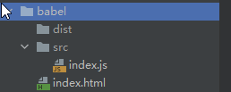
在 index.js 写入

```js
let a = (item) => item + 2;
console.log(a(4));
```

这个文件是一个 ES6 语法 的 js 文件，稍后，我们尝试把这个 ES6 语法的 js 文件转化为 ES5 的 js 文件。


#### 2. 安装 Babel-cli

初始化项目：

在安装 Babel 之前，需要先用 npm init 先初始化我们的项目。打开终端或者通过 cmd 打开命令行工具，进入项目目录，输入如下命令：

```bash
	npm init -y
```

上方代码中，`-y` 代表全部默认同意，就不用一次次按回车了（稍后再根据需要，在文件中手动修改）。命令执行完成后，会在项目的根目录下生成 package.json 文件：

```json
{
    "name": "babel",
    "version": "1.0.0",
    "description": "",
    "main": "index.js",
    "scripts": { "test": "echo \"Error: no test specified\" && exit 1" },
    "keywords": [],
    "author": "",
    "license": "ISC"
}
```

#### 3. 本地安装

```bash
	npm install --save-dev babel-preset-es2015 babel-cli
```

#### 4. 新建.babelrc：

在根目录下新建文件`.babelrc`，输入如下内容：

```json
{
  "presets": ["es2015"],
  "plugins": []
}
```

#### 5. 开始转换：

现在，我们应该可以将 ES6 的文件转化为 ES5 的文件了，命令如下：（此命令略显复杂）

```bash
	babel src/index.js -o dist/index.js
```

我们可以将上面这个命令进行简化一下。操作如下：

在文件 `package.json` 中修改键 `scripts`中的内容：

```json
  "scripts": {    "build": "babel src/index.js -o dist/index.js"  },
```

目前为止，环境配置好了。以后，我们执行如下命令，即可将`src/index.js`这个 ES6 文件转化为 `dist/index.js`这个 ES5 文件：

```bash
	npm run build
```

我们执行上面的命令之后，会发现， dist 目录下会生成 ES5 的 js 文件：

之后我们就可以在 index.html 中使用 es5的语法了

```js
"use strict";var a = function a(item) {  return item + 2;};console.log(a(4));
```


## 作用域（Scope）的概念和分类

-   **概念**：通俗来讲，作用域是一个变量或函数的作用范围。作用域在**函数定义**时，就已经确定了。换句话说，作用域决定了代码区块中变量和其他资源的可见性。

-   **目的**：为了提高程序的可靠性，同时减少命名冲突。

在 JS 中，一共有两种作用域：（ES5 中）

-   **全局作用域**：作用于整个 script 标签内部，或者作用于一个独立的 JS 文件。
-   **函数作用域**（局部作用域）：作用于函数内的代码环境。


### 全局作用域 和 window 对象

直接编写在 script 标签中的 JS 代码，都在全局作用域。全局作用域在页面打开时创建，在页面关闭时销毁。

在全局作用域中有一个全局对象 window，它代表的是一个浏览器的窗口，由浏览器创建，我们可以直接使用。相关知识点如下：

-   创建的**变量**都会作为 window 对象的属性保存。比如在全局作用域内写 `var a = 100`，这里的 `a` 等价于 `window.a`。
-   创建的**函数**都会作为 window 对象的方法保存。

### 作用域的访问关系

在内部作用域中可以访问到外部作用域的变量，在外部作用域中无法访问到内部作用域的变量。

代码举例：

```javascript
var a = 'aaa';
function foo() {
  var b = 'bbb';
  console.log(a); // 打印结果：aaa。说明 内层作用域 可以访问 外层作用域 里的变量
}
foo();
console.log(b); // 报错：Uncaught ReferenceError: b is not defined。说明 外层作用域 无法访问 内层作用域 里的变量
```

### 变量的作用域

根据作用域的不同，变量可以分为两类：全局变量、局部变量。

**全局变量**：

-   在全局作用域下声明的变量，叫「全局变量」。在全局作用域的任何一地方，都可以访问这个变量。

-   在全局作用域下，使用 var 声明的变量是全局变量。

-   **特殊情况：在函数内不使用 var 声明的变量也是全局变量（不建议这么用）。** (~ ~ ~最好不要哇, 因为他还有一个条件: 必须先调用函数之后才可以使用该变量)

```js
function outFun1() {
  variable1 = '未定义直接赋值的变量';
}
function outFun2() {
  variable2 = '未定义直接赋值的变量';
}
outFun2(); // 要先执行这个函数，否则根本不知道里面是啥
console.log(variable2); // 未定义直接赋值的变量
console.log(variable1); // variable1 is not defined
```

**局部变量**：

-   **定义在函数作用域的变量，叫「局部变量」。仅限函数内部访问这个变量。**

-   在函数内部，使用 var 声明的变量是局部变量。

-   函数的**形参**也是属于局部变量。

从执行效率来看全局变量和局部变量：

-   全局变量：只有浏览器关闭时才会被销毁，比较占内存。

-   局部变量：当其所在的代码块运行结束后，就会被销毁，比较节约内存空间。

### 作用域的上下级关系

当在函数作用域操作一个变量时，它会先在自身作用域中寻找，如果有就直接使用（**就近原则**）。如果没有则向上一级作用域中寻找，直到找到全局作用域；如果全局作用域中依然没有找到，则会报错 ReferenceError。

在函数中要访问全局变量可以使用 window 对象。（比如说，全局作用域和函数作用域都定义了变量 a，优先使用的是函数中的a , 但如果想访问全局变量，可以使用`window.a`）

### 作用域的预处理

**预处理（预解析）**的概念：浏览器在解析 JS 代码之前，会进行一个操作叫“预处理（预解析）”：将当前 JS 代码中所有变量的定义和函数的定义，放到所有代码的最前面。

这种预解析，也称之为声明提前。

### 全局作用域-变量的声明提前（变量提升）

使用 var 关键字声明的变量（ 比如 `var a = 1`），**会在所有的代码执行之前被声明**（但是不会赋值），但是如果声明变量时不是用 var 关键字（比如直接写`a = 1`），则变量不会被声明提前。

**举例 1**：

```javascript
// 这里并没有报错console.log(a);var a = 123;
```

打印结果：undefined。注意，打印结果并没有报错，而是 undefined，说明变量 a 被提前声明了，只是尚未被赋值。

**举例 2**：

```javascript
console.log(a);// 没有使用var声明a = 123; 
```

程序会报错：`Uncaught ReferenceError: a is not defined`。

**举例 3**：

```javascript
a = 123; //此时a相当于window.aconsole.log(a);
```

打印结果：123。

**注意 2 和 3 的差别**

**举例 4**：

```javascript
foo();function foo() {    if (false) {        var i = 123;    }    console.log(i);}
```

打印结果：undefined。注意，打印结果并没有报错，而是 undefined。这个例子，再次说明了：变量 i 在函数执行前，就被提前声明了，只是尚未被赋值。

例 4 中， `if(false)`里面的代码虽然不会被执行，但是整个代码有**解析**的环节，解析的时候就已经把 变量 i 给提前声明了。

**总结**：

既然 JS 中存在变量提升的现象，那么，在实战开发中，为了避免出错，建议先声明一个变量，然后再使用这个变量。

### 全局作用域-函数的声明提前

**函数声明**：

使用`函数声明`的形式创建的函数`function foo(){}`，**会被声明提前**。

**也就是说，整个函数会在所有的代码执行之前就被创建完成**。所以，在代码顺序上，我们可以先调用函数，再定义函数。

代码举例：

```javascript
fn1(); // 虽然 函数 fn1 的定义是在后面，但是因为被提前声明了， 所以此处可以调用函数function fn1() {    console.log('我是函数 fn1');}
```

**函数表达式**：

使用`函数表达式`创建的函数`var foo = function(){}`，**不会被声明提前**，所以不能在声明前调用。

很好理解，因为此时 foo 被声明了（这里只是变量声明），且为 undefined，并没有把 `function(){}` 赋值给 foo。

### 函数作用域的预处理

1、在函数作用域中，也有声明提前的特性：

-   函数中，使用 var 关键字声明的变量，会在函数中所有的代码执行之前被声明。

-   函数中，没有 var 声明的变量都是**全局变量**，而且并不会提前声明。

举例：

```javascript
var a = 1;
function foo() {
  console.log(a);
  a = 2; // 此处的 a 相当于 window.a
}
foo();
console.log(a); // 打印结果是 2
```

上方代码中，执行 foo() 后，函数里面的打印结果是`1`。如果去掉第一行代码，执行 foo() 后，函数里面的打印结果是`Uncaught ReferenceError: a is not defined`。

2、定义形参就相当于在函数作用域中声明了变量。

```javascript
function fun6(e) {
  // 这个函数中，因为有了形参 e，此时就相当于在函数内部的第一行代码里，写了 var e;
  console.log(e);
}
fun6(); // 打印结果为 undefined
fun6(123); // 打印结果为 123
```

注意一些重复声明时的问题

```js
var scope = "global";
function fn() {
  console.log(scope); // undefined
  var scope = "local";
  console.log(scope); // local
}
fn();
```


### JavaScript 没有块级作用域（ES6 之前）

在其他编程语言中（如 Java、C#等），存在块级作用域，由`{}`包括起来。比如在 Java 语言中，if 语句里创建的变量，只能在 if 语句内部使用：

```java
if (true) {
    String num = "123";
    System.out.print(num); // 123，块内可以访问
}
System.out.print(num); // 报错：num cannot be resolved，块外已经超出作用域
```

但是，在 JS 中没有块级作用域（ES6 之前）。举例如下：

```javascript
if (true) {
  var num = 123;
  console.log(123); // 123
}
console.log(num); // 123（可以正常打印）
```

### 作用域链

引入：

-   只要是代码，就至少有一个作用域

-   写在函数内部的局部作用域

-   如果函数中还有函数，那么在这个作用域中就又可以诞生一个作用域

基于上面几条内容，我们可以得出作用域链的概念。

**作用域链**：内部函数访问外部函数的变量，采用的是链式查找的方式来决定取哪个值，这种结构称之为作用域链。查找时，采用的是**就近原则**。

代码举例：

```javascript
var num = 10;
function fn() {
  // 外部函数
  var num = 20;
  function fun() {
    // 内部函数
    console.log(num);
  }
  fun();
}
fn();
```

打印结果：20。


### 块级作用域 (ES6新增)

块级作用域可通过新增命令let和const声明，所声明的变量在指定块的作用域外无法被访问。块级作用域在如下情况被创建：

1. 在一个函数内部
2. 在一个代码块（由一对花括号包裹）内部

### 块级作用域有以下几个特点：

**声明变量不会提升到代码块顶部**

错误示范: 

```js
// ReferenceError: Cannot access 'a' before initializationconsole.log(a) let a = 1
```

**禁止重复声明**

如果一个标识符已经在代码块内部被定义，那么在此代码块内使用同一个标识符进行 let 声明就会导致抛出错误。例如：

```js
var count = 30;let count = 40;// Uncaught SyntaxError: Identifier 'count' has already been declared 
```


### let var 区别

var定义的变量，没有块的概念，可以跨块访问, 不能跨函数访问。

let, const 定义的变量，只能在块作用域里访问，不能跨块访问，也不能跨函数访问。

```js
{
  var a = 1;
  let b = 2;
  const c = 3;
  {
    console.log(a); // 1  子作用域可以访问到父作用域的变量
    console.log(b); // 2  子作用域可以访问到父作用域的变量
    console.log(c); // 3  子作用域可以访问到父作用域的变量
    var aa = 11;
    let bb = 22;
    const cc = 33;
  }
  console.log(aa); // 11  // 可以跨块访问到子块作用域的变量
  // console.log(bb); // 报错  bb is not defined
  // console.log(cc); // 报错  cc is not defined
}
```

### js 函数预编译

> 预编译简单理解就是在内存中开辟一些空间，存放一些变量与函数
> 预编译会在script代码内执行前发生了, 但是它大部分会发生在函数执行前

预编译四部曲：

1. 函数在运行的瞬间，生成一个执行期上下文 （Active Object），简称AO；

2. 分析参数
   2.1 函数接收形式参数，添加到AO的属性，并且这个时候值为undefine,例如AO.age=undefined;
   2.2 接收实参，添加到AO的属性，覆盖之前的undefined;

3. 分析变量声明，如var age;或var age=23;
   3.1 如果上一步分析参数中AO还没有age属性，则添加AO属性为undefined，即AO.age=undefined;
   3.2 如果AO上面已经有age属性了，则不作任何修改;


4. 分析函数的声明，如果有function age(){}；把函数赋给AO.age ,覆盖上一步分析的值;


```js
function fn(a) {
    console.log(a);
    var a = 123;
    console.log(a);
    function a() {}
    console.log(a);
    var b = function () {};
    console.log(b);
    function d() {}
} //调用函数 fn(1);
```

创建AO对象

```js
// AO {
//   （空对象）
// }
```

找形参和变量声明

```js
// AO {
//   a: undefined,
//   b: undefined
// }
```

只将实参赋值给形参

```js
// AO {
//   a: 1,
//   b: undefined
// }
```

找函数声明, 覆盖

```js
// AO {
//   a: function a() {},
//   b: undefined,
//   d: function d() {}
// }
```

预编译环节就此结束，此时的AO对象已经更新为：

```js
// AO {
//   a: function a() {},
//   b: undefined,
//   d: function d() {}
// }
```

函数开始逐行顺序执行：

```js
function fn(a) {
  console.log(a); // 输出 function a() {}
  var a = 123; // 执行到这里重新对 a 赋值，AO 对象再一次更新
  console.log(a); // 输出 123
  function a() {} // 预编译环节已经进行了变量提升，故执行时不再看这行代码
  console.log(a); // 输出 123
  var b = function () {}; // 这个是函数表达式不是函数声明，故不能提升，会对 AO 中的 b 重新赋值
  console.log(b); // 输出 function() {}
  function d() {}
}
```

至此，函数执行完毕，销毁AO对象。

### 一个有意思的案例

```js
function foo() {
  var a = (b = 100); // 连续赋值
}
foo();
console.log(window.b); // 在全局范围内访问 b
console.log(b); // 在全局范围内访问 b，但是前面没有加 window 这个关键字
console.log(window.a); // 在全局范围内访问 a
console.log(a); // 在全局范围内访问 a，但是前面没有加 window 这个关键字
```

结果: 

```
100 100 undefined（会报错，提示 Uncaught ReferenceError: a is not defined）
```

**解释**：

当执行了`foo()`函数之后， `var a = b = 100` 这行**连续赋值**的代码等价于 `var a = (b = 100)`，其执行顺序是：

（1）先把 100 赋值给 b；

（2）再声明变量 a；

（3）再把 b 的值赋值给 a。

我们可以看到，b 是未经声明的变量就被赋值了，此时，根据规律1，这个 b 是属于 `window.b`；而 a 的作用域仅限于 foo() 函数内部，不属于 window。所以也就有了这样的打印结果。

### 推荐

[JavaScript预编译原理分析](https://blog.csdn.net/q1056843325/article/details/52951114)

---

## 作用域与闭包（进阶）

### 词法作用域 vs 动态作用域

这是作用域最底层的一条规则，务必先搞清楚：

- **词法作用域（静态作用域）**：作用域在**函数定义（书写）的位置**就已经确定，和函数在哪里被调用无关。
- **动态作用域**：作用域在**函数调用时**才确定，取决于调用链。

**JavaScript 采用的是词法作用域**，只有极少数特例（`this`、`arguments`）才带一点动态色彩，但那不属于作用域。

看一个能一锤定音的例子：

```js
let x = 1;

function foo() {
    console.log(x);
}

function bar() {
    let x = 2;
    foo(); // 注意：foo 是在 bar 内部被调用的
}

bar();
```

打印结果：

```js
1
```

**分析**：如果 JS 是动态作用域，答案会是 `2`（因为 `foo` 在 `bar` 里被调用，就近找到 `bar` 的 `x`）。但实际输出 `1`，因为 **foo 定义在全局，它的外层作用域就是全局**，这一点在写下代码的那一刻就固定了，无论它后来被谁调用。

### 执行上下文与执行栈

作用域是"静态的规则"，而**执行上下文（Execution Context）**是"运行时的环境"。

执行上下文分为三类：

1. **全局执行上下文**：整个 script 只有一个，浏览器中是 `window`，页面关闭时销毁。
2. **函数执行上下文**：每调用一次函数就创建一个新的（注意：同一个函数调用 N 次，就有 N 个**相互独立**的上下文）。
3. **Eval 执行上下文**：运行在 `eval()` 内部的代码（不推荐使用）。

**执行栈（调用栈，Call Stack）** 用来管理这些上下文，遵循**后进先出**：

```js
function first() {
    console.log('first 开始');
    second();
    console.log('first 结束');
}
function second() {
    console.log('second');
}
first();
```

执行过程：

```
① 全局上下文入栈                      [ 全局 ]
② 调用 first()，first 上下文入栈      [ 全局, first ]
③ 调用 second()，second 上下文入栈    [ 全局, first, second ]
④ second 执行完，出栈                 [ 全局, first ]
⑤ first 执行完，出栈                  [ 全局 ]
⑥ 页面关闭，全局上下文出栈             [ ]
```

#### 执行上下文的生命周期

每个函数执行上下文的创建分为两个阶段：

**阶段一：创建阶段**（代码一行都还没执行时）

1. 绑定 `this`（`thisBinding`）
2. 创建**词法环境（Lexical Environment）**：存放 `let` / `const` 声明、函数声明
3. 创建**变量环境（Variable Environment）**：存放 `var` 声明
4. 建立**作用域链**：把当前环境和所有外层环境串成一条链

**阶段二：执行阶段**

逐行执行代码，完成变量赋值、函数调用。

> **关于 VO / AO 的说明**：上一节「js 函数预编译」里讲的 **VO（变量对象）/ AO（活动对象）** 是 ES3 规范里的说法，容易理解但已经过时。
> ES5 之后，规范改用 **词法环境（LexicalEnvironment）+ 变量环境（VariableEnvironment）** 来描述同一件事。
> 两者的对应关系：`var` 和 `function` 声明 → 变量环境；`let` / `const` / `class` 声明 → 词法环境。
> 这也就解释了为什么 `var` 会提升并初始化为 `undefined`，而 `let` / `const` 有 TDZ。

**递归爆栈**就是执行栈被撑爆的直接后果：

```js
function recursion() { recursion(); }
recursion();
// Uncaught RangeError: Maximum call stack size exceeded
```

### 暂时性死区（TDZ）详解

**暂时性死区（Temporal Dead Zone）**：从**进入当前作用域**开始，到 `let` / `const` 声明语句**执行完成**为止，这段区域内该变量不可访问。

```js
{
    // ↓ TDZ 开始
    console.log(a); // ReferenceError: Cannot access 'a' before initialization
    let a = 1;      // ↑ TDZ 结束
    console.log(a); // 1
}
```

几个必须掌握的细节：

**1、`typeof` 也会在 TDZ 中报错**，这和"变量完全没声明"的表现不同：

```js
console.log(typeof undeclared); // 'undefined' —— 未声明的变量，typeof 是安全的
console.log(typeof td);         // ReferenceError —— TDZ 内，连 typeof 都不行
let td = 1;
```

**2、`var` 没有 TDZ**，它会被提升并初始化为 `undefined`：

```js
console.log(b); // undefined（不报错）
var b = 1;
```

**3、TDZ 让 `let` 看起来"没有提升"，其实它提升了，只是没初始化**：

```js
let x = 'outer';
function f() {
    console.log(x); // ReferenceError，不是 'outer'！
    let x = 'inner';
}
f();
```

**分析**：如果 `x` 完全不提升，那 `console.log(x)` 应该沿着作用域链找到外层的 `'outer'`。但它报错了，说明**引擎已经知道函数内有 `x` 这个绑定**（提升发生了），只是它还处在 TDZ 里无法访问。

**4、函数参数也有 TDZ**：参数默认值若在默认值之前引用后面的参数，会报错。

```js
function f(a = b, b = 2) {}
f(); // ReferenceError: Cannot access 'b' before initialization

function g(a = 2, b = a) {}
g(); // 正常，因为 a 在 b 之前已经初始化
```

**5、TDZ 是 `let` / `const` 能"检查出先用后声明"这类低级错误的原因**，也是现代 JS 推荐全面使用 `const` / `let` 的理由之一。

### var / let / const 全面对比

| 特性 | `var` | `let` | `const` |
| --- | --- | --- | --- |
| 作用域 | 函数作用域（或全局） | 块级作用域 `{}` | 块级作用域 `{}` |
| 变量提升 | ✓，初始化为 `undefined` | ✓，但不初始化（TDZ） | ✓，但不初始化（TDZ） |
| 重复声明 | 允许 | 不允许 | 不允许 |
| 重新赋值 | 允许 | 允许 | **不允许** |
| 声明时必须初始化 | 否 | 否 | **是** |
| 全局声明时挂到 `window` | ✓ | ✗ | ✗ |
| 能否用于 `for` 循环绑定 | ✗（会出问题） | ✓（每次迭代新绑定） | ✓（不重新赋值时） |

> **关于 `const` 的常见误解**：`const` 保证的是**变量指向的内存地址不变**，不是"值不变"。
> ```js
> const obj = { name: 'ximingx' };
> obj.name = 'luoyue';   // ✓ 完全合法，改的是堆内存里的内容
> obj = {};              // ✗ TypeError: Assignment to constant variable
>
> const arr = [1, 2];
> arr.push(3);           // ✓ 合法
> ```
> 如果真想让对象完全不可变，用 `Object.freeze()`（注意它只是**浅冻结**，嵌套对象仍然可改）。

### 闭包的本质

上一节讲过"闭包是能够访问另一个函数作用域中变量的函数"。这里补充它的**底层机制**。

**每个函数在"定义"时，都会偷偷保存一个对外层词法环境的引用，存放在内部属性 `[[Environment]]` 上。**

当函数被调用时，会创建一个新的词法环境，并把它的"外层引用"指向 `[[Environment]]`。于是：

> 只要内层函数还活着，它引用的那一份外层环境就**不会被垃圾回收**，即使外层函数早就执行完毕、早就出栈了。

这就是为什么闭包能"延长变量的生命周期"。

```js
function makeCounter() {
    let count = 0;              // count 在 makeCounter 的词法环境里
    return function () {
        return ++count;         // 内层函数持有对那份环境的引用
    };
}

const counter = makeCounter();
console.log(counter()); // 1
console.log(counter()); // 2
console.log(counter()); // 3
```

**关键点**：每一次调用 `makeCounter()`，都会创建一个**全新的、互相独立**的词法环境：

```js
const c1 = makeCounter();
const c2 = makeCounter();
c1(); c1();
console.log(c1()); // 3
console.log(c2()); // 1  —— c2 完全不受 c1 影响
```

#### 闭包的经典陷阱：循环里的 var

这是面试出现频率最高的闭包题，没有之一。

**问题代码**：

```js
for (var i = 0; i < 3; i++) {
    setTimeout(function () {
        console.log(i);
    }, 100);
}
// 打印结果：3 3 3
```

**为什么会是 3 3 3**：

1. `var i` 在**函数作用域/全局作用域**里只有**一份**绑定，整个循环自始至终都是同一个 `i`；
2. `setTimeout` 的回调是异步的，要等同步代码跑完才执行；
3. 等它们执行时，循环早已结束，`i` 的值已经是 `3`；
4. 三个回调函数共享同一个 `i`，所以都打印 `3`。

**解法一：改用 `let`（最推荐）**

```js
for (let i = 0; i < 3; i++) {
    setTimeout(function () {
        console.log(i);
    }, 100);
}
// 打印结果：0 1 2
```

原理：`let` 在 `for` 循环里有特殊行为——**每一次迭代都会创建一个新的块级绑定**，并且会把上一轮的值拷贝过来。三个回调函数因此各自捕获了不同的 `i`。

**解法二：IIFE 立即执行函数（ES6 之前的写法）**

```js
for (var i = 0; i < 3; i++) {
    (function (j) {
        setTimeout(function () {
            console.log(j);
        }, 100);
    })(i);
}
// 打印结果：0 1 2
```

原理：用函数的形参 `j` 把每一轮的 `i` **拷贝**一份，形成独立的闭包。

**解法三：利用 `setTimeout` 的第三个参数**

```js
for (var i = 0; i < 3; i++) {
    setTimeout(function (j) {
        console.log(j);
    }, 100, i);
}
// 打印结果：0 1 2
```

> `setTimeout(fn, delay, arg1, arg2, ...)` 第三个及之后的参数会作为实参传给回调。

### 闭包的典型应用

#### 应用一：数据私有化与模块化

JS 没有原生私有属性（ES2022 的 `#` 私有字段之前），闭包是最经典的替代方案：

```js
const Counter = (function () {
    let count = 0; // 外部完全访问不到

    function increment() { return ++count; }
    function decrement() { return --count; }
    function getCount() { return count; }

    // 对外只暴露这三个方法
    return { increment, decrement, getCount };
})();

Counter.increment();
Counter.increment();
console.log(Counter.getCount()); // 2
console.log(Counter.count);      // undefined —— 真正的私有
```

这就是 **IIFE 模块模式**，也是早期 jQuery、lodash 等库的基本组织方式。

> ES2022 已正式支持 `#` 私有字段，`class` 里可以直接写 `#count = 0`，外部访问会直接语法报错。

#### 应用二：函数柯里化（Currying）

**柯里化**：把一个接收多个参数的函数，转换成一系列只接收一个参数的函数。

```js
function curry(fn) {
    return function curried(...args) {
        // 实参够了，就执行原函数
        if (args.length >= fn.length) {
            return fn.apply(this, args);
        }
        // 实参不够，返回一个新函数继续收集
        return function (...args2) {
            return curried.apply(this, args.concat(args2));
        };
    };
}

function add(a, b, c) { return a + b + c; }

const curriedAdd = curry(add);
console.log(curriedAdd(1)(2)(3));   // 6
console.log(curriedAdd(1, 2)(3));   // 6
console.log(curriedAdd(1)(2, 3));   // 6
```

`fn.length` 是函数声明时的**形参个数**，这是柯里化判断"参数收够了没"的依据。

#### 应用三：防抖（debounce）

**防抖**：事件被触发后，等待 `delay` 毫秒再执行；如果在这段时间内又被触发，则**重新计时**。适合搜索框输入、窗口 resize 结束后再计算。

```js
function debounce(fn, delay = 300) {
    let timer = null;
    return function (...args) {
        const context = this;
        clearTimeout(timer);           // 每次触发都把上一次的定时器清掉
        timer = setTimeout(() => {
            fn.apply(context, args);   // 用 apply 保证 this 和参数都不丢
        }, delay);
    };
}

// 使用
const onSearch = debounce(function (e) {
    console.log('发起请求', e.target.value, this);
}, 500);
input.addEventListener('input', onSearch);
```

#### 应用四：节流（throttle）

**节流**：无论触发多频繁，`delay` 毫秒内**只执行一次**。适合滚动事件、鼠标移动、按钮防重复点击。

```js
function throttle(fn, delay = 300) {
    let timer = null;
    return function (...args) {
        if (timer) return;             // 定时器还在，说明冷却中，直接忽略
        timer = setTimeout(() => {
            fn.apply(this, args);
            timer = null;              // 执行完释放，允许下一次
        }, delay);
    };
}

// 使用
window.addEventListener('scroll', throttle(function () {
    console.log('处理滚动');
}, 200));
```

**防抖与节流的区别一句话总结**：

- 防抖：**"等你停下来了，我再做"**（合并多次为最后一次）
- 节流：**"不管你多急，我按自己的节奏来"**（稀释执行频率）

#### 应用五：缓存 / 记忆化（memoize）

```js
function memoize(fn) {
    const cache = new Map(); // 闭包持有缓存，函数外部访问不到
    return function (...args) {
        const key = JSON.stringify(args);
        if (cache.has(key)) {
            return cache.get(key);
        }
        const result = fn.apply(this, args);
        cache.set(key, result);
        return result;
    };
}

function slowSquare(n) {
    console.log('正在计算...');
    return n * n;
}

const fastSquare = memoize(slowSquare);
console.log(fastSquare(5)); // 正在计算...  25
console.log(fastSquare(5)); // 25（直接命中缓存，不再计算）
```

### 闭包的代价：内存泄漏

闭包的本质是"让本该销毁的变量继续活着"，这本身是把双刃剑。

**典型泄漏场景**：

```js
function bindEvent() {
    const btn = document.getElementById('btn');
    const hugeData = new Array(1000000).fill('*');

    btn.onclick = function () {
        // 这个闭包引用了 hugeData，即使 bindEvent 执行完也释放不掉
        console.log(hugeData.length, btn.id);
    };
}
```

只要 `btn.onclick` 还存在（即 btn 还在 DOM 里），`hugeData` 就永远无法被回收。

**规避手段**：

```js
// 1. 不再需要时，手动解除引用
btn.onclick = null;

// 2. 移除 DOM 节点前先解绑
btn.remove();

// 3. 把不需要的大对象放到闭包之外，或在使用后置空
function bindEvent() {
    const btn = document.getElementById('btn');
    let hugeData = new Array(1000000).fill('*');
    btn.onclick = function () {
        console.log(hugeData.length);
        hugeData = null; // 用完立刻释放
    };
}
```

> **不用谈闭包色变**：现代 JS 引擎（V8）已经能识别"未被使用的闭包变量"并将其回收。
> 真正危险的只有**长期存活的引用**（挂在全局、挂在 DOM 上、挂在定时器里）配合**大对象**的情况。
> 在 Chrome DevTools 的 Memory 面板里可以做 Heap Snapshot 对比来定位这类问题。

### 作用域链 vs 原型链：别再搞混

这是初学者最常混淆的两个"链"，它们的查找目标完全不同：

| 对比项 | 作用域链（Scope Chain） | 原型链（Prototype Chain） |
| --- | --- | --- |
| 查找对象 | **变量 / 函数标识符** | **对象的属性 / 方法** |
| 形成时机 | 函数**定义**时确定（词法作用域） | 对象**创建**时确定 |
| 连接方式 | 内层环境 → 外层环境 → … → 全局环境 | 实例 → 构造函数.prototype → … → `Object.prototype` |
| 终点 | 全局执行上下文 | `Object.prototype.__proto__ === null` |
| 找不到时 | 抛 `ReferenceError` | 返回 `undefined`（不报错） |
| 典型语法 | `let` / `const` / 嵌套函数 | `new` / `prototype` / `class` |

```js
const obj = { a: 1 };
console.log(obj.b);       // undefined —— 原型链没找到，返回 undefined（不报错）
console.log(notDefined);  // ReferenceError —— 作用域链没找到，直接报错
```

## Node 节点

### 1. 先解释清楚节点与元素

**节点**（Node）：构成 `HTML `网页的最基本单元。网页中的每一个部分都可以称为是一个节点，比如：`html`标签、属性、文本、注释、整个文档等都是一个节点。

虽然都是节点，但是实际上他们的具体类型是不同的。常见节点分为四类：

- 文档节点（文档）：整个 `HTML` 文档。整个 `HTML` 文档就是一个文档节点。

- 元素节点（标签）：`HTML`标签。

- 属性节点（属性）：元素的属性。

- 文本节点（文本）：`HTML`标签中的文本内容（包括标签之间的空格、换行）。

节点的类型不同，属性和方法也都不尽相同。所有的节点都是`Object`。

**总的来说:** 

**元素（element）**：页面中所有的**标签,每个`html`标签都是一个元素**

**节点（node）**：页面中所有的内容，包括标签、属性（标签的属性）、文本(文字,换行,空格,回车)) **即使元素也是节点**

**nodeType**:节点的类型

- **nodeType == 1  表示的是元素节点**（标签） 。记住：在这里，元素就是标签。

- nodeType == 2  表示是属性节点。

- nodeType == 3  是文本节点。
  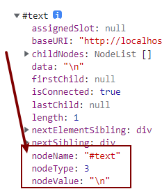


---

### 2. 什么是`DOM`

**`DOM`**：Document Object Model，文档对象模型。`DOM` 为文档提供了结构化表示，并定义了如何通过脚本来访问文档结构。目的其实就是为了能让js操作html元素而制定的一个规范。

而 `DOM` 就是由节点组成的。

**解析过程**：
HTML加载完毕，渲染引擎会在内存中把HTML文档，生成一个DOM树，getElementById是获取内中DOM上的元素节点。然后操作的时候修改的是该元素的**属性**。


---

### 3. 获取节点

节点的访问关系，是以**属性**的方式存在的。

#### 获取父节点

调用者就是节点。一个节点只有一个父节点，调用方式就是

```js
	node.parentNode
```

#### 获取兄弟节点

| 方法                   | 说明               |
| ---------------------- | ------------------ |
| nextElementSibling     | 获取下一个元素节点 |
| previousElementSibling | 获取上一个元素节点 |

> 获得任意一个兄弟节点：
> **节点自己.parentNode.children[index];**  

#### 获取单个的子节点

| 方法              | 说明                   |
| ----------------- | ---------------------- |
| firstElementChild | 获取第一个子元素节点   |
| lastElementChild  | 获取最后一个子元素节点 |


#### 获取所有的子节点

| 方法       | 说明                                                       |
| ---------- | ---------------------------------------------------------- |
| childNodes | 指定元素的子节点的集合（包括元素节点、文本节点（含空格换行）、注释节点；**不包括属性节点**） |
| children   | 子元素节点的集合, 只返回HTML节点，甚至不返回文本节点。     |


### 4. 节点的操作

#### 创建节点

```javascript
	新的标签(元素节点) = document.createElement("标签名");
```

#### 插入节点

> 父节点的最后插入一个新的子节点。
> 但是需要注意: 一个已经存在的节点插入另一个已经存在的节点, 被插入的原节点的位置会消失

```javascript
	父节点.appendChild(新的子节点);
```

> 在参考节点前插入一个新的节点。
> 如果参考节点为null，那么他将在父节点里面的最后插入一个子节点。

```javascript
	父节点.insertBefore(新的子节点,作为参考的子节点)
```

#### 删除节点

```javascript
	父节点.removeChild(子节点);
```

#### 克隆节点


```javascript
	要复制的节点.cloneNode();       //括号里不带参数和带参数false，效果是一样的。	要复制的节点.cloneNode(true);
```

- 不带参数/带参数false：只复制节点本身，不复制子节点。

- 带参数true：既复制节点本身，也复制其所有的子节点。


#### 设置节点的属性值

```javascript
	元素节点.setAttribute("属性名", "新的属性值");
```

#### 删除节点的属性

```javascript
	元素节点.removeAttribute(属性名);
```


### 5. 获取 html 文档的方法

获取title、body、head、html标签的方法如下：

- `document.title` 文档标题；

- `document.head`  文档的头标签

- `document.body`  文档的body标签；

- `document.documentElement`  文档的html标签（这个很重要）。

`document.documentElement`表示文档的html标签。也就是说，基本结构当中的 `html 标签`而是通过`document.documentElement`访问的，并不是通过 document.html 去访问的。

## Web 存储与应用缓存

### H5 中有两种存储的方式

1、**`window.sessionStorage` 会话存储：**

- 保存在内存中。

- **生命周期**为关闭浏览器窗口。也就是说，当窗口关闭时数据销毁。

- 在同一个窗口下数据可以共享。


2、**`window.localStorage` 本地存储**：

- 有可能保存在浏览器内存里，有可能在硬盘里。

- 永久生效，除非手动删除（比如清理垃圾的时候）。

- 可以多窗口共享。

### 常见 API 

设置存储内容：

```javascript
	setItem(key, value);
```

读取存储内容：

```javascript
	getItem(key);
```

根据键，删除存储内容：

```javascript
	removeItem(key);
```


清空所有存储内容：

```javascript
	clear();
```

### 案例：记住用户名和密码

```html
<!DOCTYPE html>
<html lang="en">
    <head>
        <meta charset="UTF-8" />
        <meta http-equiv="X-UA-Compatible" content="IE=edge" />
        <meta name="viewport" content="width=device-width, initial-scale=1.0" />
        <title>Document</title>
    </head>
    <body>
        <label for="">
            用户名：
            <input type="text" class="userName" />
        </label>
        <br />
        <br />
        <label for="">
            密 码：
            <input type="text" class="pwd" />
        </label>
        <br />
        <br />
        <label for="">
            <input type="checkbox" class="check" id="" />
            记住密码
        </label>
        <br />
        <br />
        <button>登录</button>
        <script>
            var userName = document.querySelector('.userName');
            var pwd = document.querySelector('.pwd');
            var chk = document.querySelector('.check');
            var btn = document.querySelector('button');
            // 当点击登录的时候，如果勾选"记住密码"，就存储密码；否则就清除密码
            btn.onclick = function () {
                if (chk.checked) {
                    // 记住数据
                    window.localStorage.setItem('userName', userName.value);
                    window.localStorage.setItem('pwd', pwd.value);
                } else {
                    // 清除数据
                    window.localStorage.removeItem('userName');
                    window.localStorage.removeItem('pwd');
                }
            };
            // 下次登录时，如果记录的有数据，就直接填充
            window.onload = function () {
                userName.value = window.localStorage.getItem('userName');
                pwd.value = window.localStorage.getItem('pwd');
            };
        </script>
    </body>
</html>
```

### 应用缓存

HTML5中我们可以轻松的构建一个离线（无网络状态）应用，只需要创建一个 `cache manifest` 缓存清单文件。


### 优势

1、可配置需要缓存的资源；

2、网络无连接应用仍可用；

3、本地读取缓存资源，提升访问速度，增强用户体验；

4、减少请求，缓解服务器负担。

### `cache manifest` 缓存清单文件

> **⚠️ 重要提示：应用缓存（Application Cache）已被废弃并从所有现代浏览器中移除**（Chrome 88+、Firefox、Safari 均已不再支持）。该技术的现代替代方案是 **Service Worker + Cache API**（配合 manifest 文件，可实现完全可控的离线缓存）。以下内容仅作历史了解，**新项目请不要再使用**。

缓存清单文件中列出了浏览器应缓存，以供离线访问的资源。**推荐使用 `.appcache`作为后缀名，另外还要添加MIME类型。**

**缓存清单文件里的内容怎样写：**

（1）**顶行写CACHE MANIFEST。**

（2）**CACHE**: 换行 指定我们需要缓存的静态资源，如.css、image、js等。

（3）**NETWORK**: 换行 指定需要在线访问的资源，可使用通配符（也就是：不需要缓存的、必须在网络下面才能访问的资源）。

（4）**FALLBACK**: 换行 当被缓存的文件找不到时的备用资源（当访问不到某个资源时，自动由另外一个资源替换）。

```
CACHE MANIFESTCACHE:#要缓存的文件./img/1.jpg./img/2.jpg./img/3.jpgNETWORK:#指定必须联网才能访问的文件./js/1.js./js/2.js./js/3.jsFALLBACK:./css/1.css ./css a.css
```


 > **#当前页面无法访问是回退的页面**
 > FALLBACK:
 > 404.html

### 使用

在需要应用缓存在页面的根元素(html)里，添加属性manifest = "demo.appcache"。路径要保证正确。

```html
<html manifest="01.appcache">
```

## 新增全屏显示

> 》 HTML5规范允许用户自定义网页上**任一元素**全屏显示。

### 开启/关闭全屏显示

方法如下：（注意 screen 是小写）

```javascript
requestFullscreen(); // 让元素开启全屏显示
exitFullscreen(); // 让元素关闭全屏显示（注意：是 exit，不是 cancel）
```

> 备注：**现代浏览器已无需前缀**，直接调用 `requestFullscreen()` / `exitFullscreen()` 即可；早期不同浏览器有带前缀的版本（如 `webkitRequestFullscreen`、`mozRequestFullscreen`），兼容写法见下方示例。

### 检测当前是否处于全屏状态

方法如下：

```js
document.fullscreenElement; // 全屏时返回当前全屏的元素，非全屏时返回 null
// document.fullScreen 是早期草案的写法，已废弃，不要再用
```


### 全屏的伪类

- :full-screen .box {}

- :-webkit-full-screen {}

- :moz-full-screen {}

比如说，当元素处于全屏状态时，改变它的样式。这时就可以用到伪类。

```html
<script>
    var box = document.querySelector('.box');
    // box.requestFullscreen(); // 直接这样写是没有效果的。浏览器的机制，必须要点一下才可以实现全屏功能。
    document.querySelector('.box').onclick = function () {
        // 开启全屏显示的兼容写法
        if (box.requestFullscreen) {
            // 如果支持全屏，那就让元素全屏
            box.requestFullscreen();
        } else if (box.webkitRequestFullScreen) {
            box.webkitRequestFullScreen();
        } else if (box.mozRequestFullScreen) {
            box.mozRequestFullScreen();
        }
    };
</script>
```

## 音频视频

### 音频

```html
<!--推荐的兼容写法：-->
<audio controls loop>
    <source src="music/yinyue.mp3" />
    <source src="music/yinyue.ogg" />
    <source src="music/yinyue.wav" />
    抱歉，你的浏览器暂不支持此音频格式
</audio>
```

### 视频

```html
<video controls autoplay>
    <source src="video/movie.mp4" />
    <source src="video/movie.ogg" />
    <source src="video/movie.webm" />
    抱歉，不支持此视频
</video>
```
