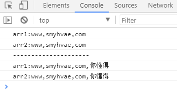
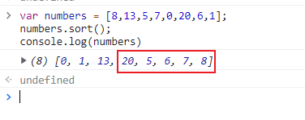

# 内置对象（一）：String 与 Array

> 本文件是《JavaScript 笔记》第 2 部分，[⬆ 返回总目录](./0. JavaScript（总目录）.md)

# String

## 字符串的定义

常规方法 “” ‘’ `` 都可以

```js
// 一：使用一对单引号或者一对双引号来定义一个字符串
let str1 = "str1";
console.log(str1); // str1
let str2 = 'str2';
console.log(str2); // str2
// 1. 在 JavaScript 中双引号定义的字符串和单引号定义的字符串没有本质区别
// 2. 无论是单引号还是双引号，都必须配对使用，不能一个单引号和双引号配对
let str3 = "str3'";
console.log(str3); // str'
// 3. 单引号中的字符串中不能出现单引号，可以出现双引号
//    双引号中的字符串中不能出现双引号，可以出现单引号
// 4. 单引号和双引号定义字符串时，须在一行内完成，不能换行
// 二：使用模板字符串的方式定义字符串：我们可以使用一对反引号来定义字符串（tab 键上面的 ``）
let str4 = `这是一个普通的字符串`;
let str5 = `这是一个换行的 字符串`;
let str6 = 7;
let str7 = 6;
// 模板字符串利用 ${} 使用变量
let str8 = `这是一个可以解析变量的字符串，例如：${str6 + str7}`;
console.log(str4); // 这是一个普通的字符串
console.log(str5); /* 这是一个换行的 字符串 */
console.log(str6); // 7
console.log(str7); // 6
console.log(str8); // 这是一个可以解析变量的字符串，例如：13
// ${varName} 或 ${value}。即 ${} 中可为变量名，也可直接为字面量值（如 ${123} 或 ${asd}）
```

不关心里面的内容是什么,只匹配对应的 “” ‘’ `` 与转义符

```js
let str1 = "true"; // 把布尔值转换为字符串
console.log(str1);
let str2 = "123"; // 把数值转换为字符串
console.log(str2);
let str3 = "[1,2,3]"; // 把数组转换为字符串
console.log(str3);
let str4 = "{x : 1; y : 2}"; // 把对象转换为字符串
console.log(str4);
let str5 = "console.log('Hello,World')"; // 把可执行表达式转换为字符串
console.log(str5);
// 打印结果：
// true
// 123
// [1,2,3]
// {x : 1; y : 2}
// console.log('Hello,World')
console.log(typeof str1);
console.log(typeof str2);
console.log(typeof str3);
console.log(typeof str4);
console.log(typeof str5);
// string
// string
// string
// string
// string
```

转义符: `\`

```js
// 在定义一个字符串的时候，有些特殊字符并不适合直接出现。例如：换行符、单引 号（不能出现在单引号内）、双引号（不能出现在双引号内）
```

例如 下面是错误的

```js
let str = " " " // 会直接报语法错误
```

但是我们需要这样去使用 , 这个时候可以我们就需要使用 `\` 转义符，例如： 

```js
// 在这里使用了 \n 来代表换行符
// 在这里使用了 \" 来代表双引号。
let str1 = '这是一个换行的\n字符串';
let str2 = '这是一个换行的\' 字符串';
console.log(str1);
console.log(str2);
/* 这是一个换行的字符串 */
// 这是一个换行的' 字符串
let str3 = `123 str3 \"\'`;
// 如果使用模板字符串的方式定义字符串，可以直接使用回车换行。但是要在其中使用反引号 `，也必须转义
console.log(str3);
// 打印结果：
// 123
// str3 "'
```

## String 对象的属性

**字符串可以看成是字符组成的数组**,拥有属性 length ------> 字符串的长度,可以通过for循环进行遍历

```js
let str = 'abcd';
for (let i of str) {
  console.log(i);
}
// a
// b
// c
// d
```

**字符串特性:不可变性,字符串的值是不能改变**

## String 对象的方法


### localeCompare() 

**这里先说明一个东西: 字符比较是指按照字典次序对单个字符或字符串进行比较大小的操作，一般都是以Unicode码值的大小作为字符比较的标准。**

JS字符串在进行大于(小于)比较时，**会根据第一个不同的字符的Unicode值码进行比较**

下面演示一些案例

```js
let a = "91";
let b = "390";
console.log(a.charCodeAt()); // 57
console.log(b.charCodeAt()); // 51
console.log(a < b); // false
```

**“91” < “390” 结果为 false** 

**字符串在比较的时候会按字符的 Unicode 码位（ASCII 打印字符部分）逐位比较**（'9' 是 57，'3' 是 51），从第一个字符开始依次比较，如果第一个字符相等就比较下一个，直到分出大小或到达末尾为止。所以在比较"数字字符串"的大小时，一定要先转化为 number 再比较。

所以解释一下上面的结果

a 中第一个字符为 9 , b 中第一个字符为 3 ,两者不同,所以开始比较他们的 ASCII 码位 , a 的 '9' (57) 大于 b 的 '3' (51) 所以 **“91” < “390” 结果为 false**

```js
let a = 34;
let b = "34";
console.log(a == b); // true
```

**如果一个是字符串,一个是数值,会倾向于将字符串转换为数值然后进行比较**

下面说正题

因为后一个参数浏览器支持不是很友好，就不多做介绍

一般的用法就是 a.localeCompare(b)，浏览器基本都是支持的。

```js
let str1 = "123456";
let str2 = "1234567";
let str3 = "12345678";
let str4 = "123478";
let str5 = "abcd";
let str6 = "dcba";
// 返回值大于 0：说明当前字符串 string 大于对比字符串 targetString
// 返回值小于 0：说明当前字符串 string 小于对比字符串 targetString
// 返回值等于 0：说明当前字符串 string 等于对比字符串 targetString
console.log(str1.localeCompare(str2)); // -1
console.log(str2.localeCompare(str2)); // 0
console.log(str3.localeCompare(str2)); // 1
console.log(str4.localeCompare(str2)); // 1
console.log(str5.localeCompare(str6)); // -1
```

### charCodeAt()

```js
// 返回字符串 index 位置的 Unicode 编码，默认为 0 号位置
console.log("a".charCodeAt(0));
console.log("aabb".charCodeAt(2));
// 97
// 98
```

### charAt()

```js
// charAt（index）
// 返回指定位置（index）的字符。
// 如果 index 小于 0 或者大于等于字符串的长度 string.length，它会返回空字符串。
let str = "str1";
console.log(str.charAt(1));
console.log(str.charAt(5));
// 打印结果：
// t
// （空字符串）
```

### String.fromCharCode()

```js
console.log(String.fromCharCode(5, 66, 67, 68, 69, 70, 71));
console.log(String.fromCharCode(38));
console.log(String.fromCharCode(13, 22269));
console.log(String.fromCharCode());
// 打印结果：
// ║BCDEFG
// &
// 国
// （空字符串）
```

### slice()

注意：

1.   字符串的索引是从0到 length-1
2.   slice（start, end）
3.   substring（start, to）
4.   substr（start，length）与前两者不同的是第二个参数是长度
5.   **三者的差别很细,具体仔细看下面案例结果**

```js
// slice（start, end）
// 截取字符串 start 索引位置到 end 索引位置之前的字符串
// start 参数：字符串中第一个字符位置为 0，第二个字符位置为 1，以此类推；如果是负数，表示从尾部截取。slice(-2) 表示提取原字符串的倒数第二个元素到最后一个元素（包含最后一个元素）。
// end 参数如果为负数：-1 指字符串的最后一个字符的位置，-2 指倒数第二个字符，以此类推。
let str1 = "123456789";
console.log(str1.slice(0, str1.length));
// 123456789
let str2 = "123456789";
console.log(str2.slice(1, 3));
// 23
console.log(str2.slice(-2));
// 89
// 使用 slice() 原字符串不会发生改变
console.log(str2);
// 123456789
console.log(str1.slice(0, -1));
// 参数为负数时，从字符串末尾开始处理
// 12345678
console.log(str1.slice(6, -5));
// （空字符串）
console.log(str1.slice(3, -5));
// 4
```

### substr()

```js
// substr（start，length）
// 从 start 索引位开始，截取长度为 length 的字符串；如果没有 length，将后面的全部截取
let str = "str1";
console.log(str.substr(1));
console.log(str.substr(1, 2));
// 对，没错，最后的结果为空字符串
console.log(str.substr(1, -1));
// 打印结果：
// tr1
// tr
// （空字符串）
```

### substring()

```js
// substring（start，to）
let str = "str1";
console.log(str.substring(0));
console.log(str.substring(1, 2));
// 如果参数 start 与 end 相等，那么该方法返回的就是一个空串（即长度为 0 的字符串）
console.log(str.substring(1, 1));
// start => to：如果 start 的数值大于 to 的位置，可以理解为把两个参数位置颠倒
console.log(str.substring(3, 1));
console.log(str.substring(2, 1));
console.log(str.substring(4, 2));
// 打印结果：
// str1
// t
// （空字符串）
// tr
// t
// r1
```

### concat()

```js
// concat()// 一般字符串的拼接可以直接使用 + 连接console.log("c".concat("23", "str"));// c23str
```

### indexOf()

```js
// indexOf（searchString，position）
let str1 = "123qwe";
console.log(str1.indexOf("2"));
console.log(str1.indexOf("a"));
console.log(str1.indexOf("ad"));
console.log(str1.indexOf("ae"));
console.log(str1.indexOf("we"));
console.log(str1.indexOf("we", 5));
// 打印结果：
// 1
// -1
// -1
// -1
// 4
// -1
```

**案例**：查找字符串"qianguyihao"中，所有 `a` 出现的位置以及次数。

思路：

（1）先查找第一个 a 出现的位置。

（2）只要 indexOf 返回的结果不是 -1 就继续往后查找。

（3）因为 indexOf 只能查找到第一个，所以后面的查找，可以利用第二个参数，在当前索引加 1，从而继续查找。

代码实现：


```js
var str = 'qianguyihao';
var index = str.indexOf('a');
var num = 0;
while (index !== -1) {
  console.log(index);
  num++; // 每打印一次，就计数一次
  index = str.indexOf('a', index + 1); // 继续向后查找下一个 'a'
}
console.log('a 出现的次数是: ' + num);
// 打印结果：
// 3
// a 出现的次数是: 1
```

### lastIndexOf()

```js
// lastIndexOf（searchString，position）
let str1 = "123qwe";
// 与 indexOf 方法类似，只不过它是从该字符串的末尾开始查找而不是从开头
console.log(str1.lastIndexOf("2"));
console.log(str1.lastIndexOf("a"));
console.log(str1.lastIndexOf("ad"));
console.log(str1.lastIndexOf("ae"));
console.log(str1.lastIndexOf("we"));
console.log(str1.lastIndexOf("we", 5));
// 打印结果：
// 1
// -1
// -1
// -1
// 4
// 4
```

### replace()

```js
let str1 = "121416";
let str2 = "1234567";
// 只会替换第一个匹配到的字符
console.log(str1.replace("1", str2));
// 123456721416
```

```js
var stringObj="终古，终古人民";var newstr=stringObj.replace("终古","中国"); // 中国，终古人民
```

会发现第二个错别字“终古”并没有被替换成“中国”

```js
var reg = new RegExp("终古", "g"); // 创建正则 RegExp 对象
var stringObj = "终古，终古人民";
var newstr = stringObj.replace(reg, "中国"); // 中国，中国人民
```

### split()

```js
let str1 = '深入 Vue底层，手写一个vuex\n 348\n'; // split() 将以传递的参数把字符串分割，最后返回一个数组
console.log(str1.split(" "));
// [ '深入', 'Vue底层，手写一个vuex\n', '348\n' ]
console.log(str1.split("\n"));
// [ '深入 Vue底层，手写一个vuex', ' 348', '' ]
```

第二个参数代表分割次数

```js
let str = "山东省-济南市-市中区";
let newStr = str.split('-');
console.log(newStr);
// ["山东省","济南市","市中区"]
// 第二个参数 times：只匹配 '-' 两次
let str2 = "山东省-济南市-市中区";
let newStr2 = str2.split('-', 2);
console.log(newStr2);
// ["山东省", "济南市"]
```

### includes()

```js
// 返回布尔值，表示是否找到了参数字符串。
let str = '这是测试字符串';
if (str.indexOf('测试') !== -1) {
  console.log(true); // 包含
} else {
  console.log(false); // 不包含
}
// true
```

### startsWith()

```js
// 返回布尔值，表示参数字符串是否在原字符串的头部。
let str = '这是测试字符串';
if (str.startsWith('这') === true) {
  console.log(true);
} else {
  console.log(false);
}
if (str.startsWith('是') === true) {
  console.log(true);
} else {
  console.log(false);
}
// 打印结果：
// true
// false
```

### endsWith()

```js
// 返回布尔值，表示参数字符串是否在原字符串的尾部。
let str = '这是测试字符串';
if (str.endsWith('这') === true) {
  console.log(true);
} else {
  console.log(false);
}
if (str.endsWith('串') === true) {
  console.log(true);
} else {
  console.log(false);
}
// 打印结果：
// false
// true
```

-   includes() startsWith() endsWith() 这三个方法都支持第二个参数，表示开始搜索的位置。如果repeat的参数是负数或者Infinity，会报错。

### repeat()

```js
// repeat 方法返回一个新字符串，表示将原字符串重复 n 次。参数如果是小数，会被取整。
let str = '这是测试字符串';
console.log(str.repeat(3));
// 这是测试字符串这是测试字符串这是测试字符串
```

### padStart()    padEnd()

-   ES2017 引入了字符串补全长度的功能。如果某个字符串不够指定长度，会在头部或尾部补全。padStart()用于头部补全，padEnd()用于尾部补全。

```js
console.log('x'.padStart(5, 'ab')); // 'ababx'
console.log('x'.padStart(4, 'ab')); // 'abax'
console.log('x'.padEnd(5, 'ab')); // 'xabab'
console.log('x'.padEnd(4, 'ab')); // 'xaba'
// 如果原字符串的长度，等于或大于最大长度，则字符串补全不生效，返回原字符串
// 如果省略第二个参数，默认使用空格补全长度。
// padStart() 的常见用途是为数值补全指定位数。下面代码生成 10 位的数值字符串。
console.log('1'.padStart(10, '0'));
console.log('12'.padStart(10, '0'));
console.log('123456'.padStart(10, '0'));
// 0000000001
// 0000000012
// 0000123456
// 另一个用途是提示字符串格式。
console.log('12'.padStart(10, 'YYYY-MM-DD')); // "YYYY-MM-12"
console.log('09-12'.padStart(10, 'YYYY-MM-DD')); // "YYYY-09-12"
```

### trimStart()，trimEnd()

-   ES2019 对字符串实例新增了trimStart()和trimEnd()这两个方法。它们的行为与trim()一致，trimStart()消除字符串头部的空格，trimEnd()消除尾部的空格。它们返回的都是新字符串，不会修改原始字符串。

```js
const s = '  abc  ';s.trim() // "abc"s.trimStart() // "abc  "s.trimEnd() // "  abc"
```

### search()

search() 方法用于检索字符串中指定的子字符串，或检索与正则表达式相匹配的子字符串。
如果没有找到任何匹配的子串，则返回 -1。

**search()方法查找时是对大小写敏感的。**

```js
let str = "abcd Abcd abc";
console.log(str.search("abc")); // 0
console.log(str.search("Abc")); // 5
```

### match(正则表达式)

```js
let article = "12345657abcdeABCDE123";
console.log(article.match("123"));
// [ '123', index: 0, input: '12345657abcdeABCDE123', groups: undefined ]
console.log(article.match("3"));
// [ '3', index: 2, input: '12345657abcdeABCDE123', groups: undefined ]
```

### toLowerCase() ,toUpperCase()

```js
let article = "this is pink";
console.log(article.toLowerCase());
console.log(article.toUpperCase());
// this is pink
// THIS IS PINK
```

## 一些案例

检索文章中有多少个单词

```js
let article = `ECMAScript (/ˈɛkməskrɪpt/) (or ES)[1] is a general-purpose programming language, standardised by Ecma International according to the document ECMA-262. It is a JavaScript standard meant to ensure the interoperability of web pages across different web browsers.[2] ECMAScript is commonly used for client-side scripting on the World Wide Web, and it is increasingly being used for writing server applications and services using Node.js.`;
```

```js
// 方法一，但结果并不理想，有很多小细节让人不满足
let try1 = article.split(' ');
console.log(try1);
// 打印结果：
// [
//   'ECMAScript',         '(/ˈɛkməskrɪpt/)', '(or',
//   'ES)[1]',             'is',              'a',
//   'general-purpose',    'programming',     'language,',
//   'standardised',       '\nby',            'Ecma',
//   'International',      'according',       'to',
//   'the',                'document',        'ECMA-262.',
//   'It',                 'is',              'a',
//   'JavaScript',         'standard',        'meant',
//   'to',                 'ensure',          'the',
//   '\ninteroperability', 'of',              'web',
//   'pages',              'across',          'different',
//   'web',                'browsers.[2]',    'ECMAScript',
//   'is',                 'commonly',        'used',
//   'for',                'client-side',     '\nscripting',
//   'on',                 'the',             'World',
//   'Wide',               'Web,',            'and',
//   'it',                 'is',              'increasingly',
//   'being',              'used',            'for',
//   'writing',            'server',          'applications',
//   'and',                '\nservices',      'using',
//   'Node.js.'
// ]
```

```js
let template = `qwertyuiopasdfghjklzxcvbnm`;
let word = '';
let list = [];
let obj = {};
for (let i = 0; i < article.length; i++) {
  if (template.indexOf(article[i].toLowerCase()) !== -1) {
    word += article[i].toLowerCase();
  } else {
    if (word !== '') {
      list.push(word);
      word = '';
    }
  }
}
console.log(list);
// 打印结果：
// [
//   'ecmascript',       'km',          'skr',
//   'pt',               'or',          'es',
//   'is',               'a',           'general',
//   'purpose',          'programming', 'language',
//   'standardised',     'by',          'ecma',
//   'international',    'according',   'to',
//   'the',              'document',    'ecma',
//   'it',               'is',          'a',
//   'javascript',       'standard',    'meant',
//   'to',               'ensure',      'the',
//   'interoperability', 'of',          'web',
//   'pages',            'across',      'different',
//   'web',              'browsers',    'ecmascript',
//   'is',               'commonly',    'used',
//   'for',              'client',      'side',
//   'scripting',        'on',          'the',
//   'world',            'wide',        'web',
//   'and',              'it',          'is',
//   'increasingly',     'being',       'used',
//   'for',              'writing',     'server',
//   'applications',     'and',         'services',
//   'using',            'node',        'js'
// ]
list.forEach(function (item) {
  if (obj[item] === undefined) {
    obj[item] = 1;
  } else {
    obj[item]++;
  }
});
console.log(obj);
// 打印结果：
// {
//   ecmascript: 2,
//   km: 1,
//   skr: 1,
//   pt: 1,
//   or: 1,
//   es: 1,
//   is: 4,
//   a: 2,
//   general: 1,
//   purpose: 1,
//   programming: 1,
//   language: 1,
//   standardised: 1,
//   by: 1,
//   ecma: 2,
//   international: 1,
//   according: 1,
//   to: 2,
//   the: 3,
//   document: 1,
//   it: 2,
//   javascript: 1,
//   standard: 1,
//   meant: 1,
//   ensure: 1,
//   interoperability: 1,
//   of: 1,
//   web: 3,
//   pages: 1,
//   across: 1,
//   different: 1,
//   browsers: 1,
//   commonly: 1,
//   used: 2,
//   for: 2,
//   client: 1,
//   side: 1,
//   scripting: 1,
//   on: 1,
//   world: 1,
//   wide: 1,
//   and: 2,
//   increasingly: 1,
//   being: 1,
//   writing: 1,
//   server: 1,
//   applications: 1,
//   services: 1,
//   using: 1,
//   node: 1,
//   js: 1
// }
```

## 字符串练习

### 练习 1："smyhvaevaesmyh"查找字符串中所有 m 出现的位置。

代码实现：

```javascript
var str2 = 'smyhvaevaesmyh';
for (var i = 0; i < str2.length; i++) {
  // 如果指定位置的符号 === 'm'
  // str2[i]
  if (str2.charAt(i) === 'm') {
    console.log(i);
  }
}
```

### 练习 2：判断一个字符串中出现次数最多的字符，统计这个次数

```html
<script>
    var str2 = 'smyhvaevaesmyhvae';
    // 定义一个 json，然后判断 json 中是否有该属性：如果有该属性，那么值 +1；否则创建一个该属性，并赋值为 1
    var json = {};
    for (var i = 0; i < str2.length; i++) {
        // 判断：如果有该属性，那么值 +1；否则创建一个该属性，并赋值为 1
        var key = str2.charAt(i);
        if (json[key] === undefined) {
            json[key] = 1;
        } else {
            json[key] += 1;
        }
    }
    console.log(json);
    console.log('----------------');
    // 获取 json 中属性值最大的选项
    var maxKey = '';
    var maxValue = 0;
    for (var k in json) {
        if (json[k] > maxValue) {
            maxKey = k;
            maxValue = json[k];
        }
    }
    console.log(maxKey);
    console.log(maxValue);
</script>
```

## ...运算符 扩展运算符（展开语法）

扩展运算符和剩余参数是相反的。

剩余参数是将剩余的元素放到一个数组中；而扩展运算符是将数组或者对象拆分成逗号分隔的参数序列。

代码举例：

```js
const arr = [10, 20, 30];
// ...arr // 10, 20, 30   （伪代码：这里用到了扩展运算符）
console.log(...arr); // 10 20 30
console.log(10, 20, 30); // 10 20 30
```

上面的代码要仔细看：

`arr`是一个数组，而`...arr`则表示`10, 20, 30`这样的序列。

我们把`...arr` 打印出来，发现打印结果竟然是 `10 20 30`，为啥逗号不见了呢？因为逗号被当作了 console.log 的参数分隔符。如果你不信，可以直接打印 `console.log(10, 20, 30)` 看看。

接下来，我们看一下扩展运算符的应用。

### 数组赋值

数组赋值的代码举例：

```js
let arr2 = [...arr1]; // 将 arr1 赋值给 arr2
```

为了理解上面这行代码，我们先来分析一段代码：（将数组 arr1 赋值给 arr2）

```javascript
let arr1 = ['www', 'smyhvae', 'com'];
let arr2 = arr1; // 将 arr1 赋值给 arr2，其实是让 arr2 指向 arr1 的内存地址
console.log('arr1:' + arr1);
console.log('arr2:' + arr2);
console.log('---------------------');
arr2.push('你懂得'); // 往 arr2 里添加一部分内容
console.log('arr1:' + arr1);
console.log('arr2:' + arr2);
```

运行结果：



上方代码中，我们往往 arr2 里添加了`你懂的`，却发现，arr1 里也有这个内容。原因是：`let arr2 = arr1;`**其实是让 arr2 指向 arr1 的地址。也就是说，二者指向的是同一个内存地址。**

如果不想让 arr1 和 arr2 指向同一个内存地址，我们可以借助**扩展运算符**来做：

```javascript
let arr1 = ['www', 'smyhvae', 'com'];
let arr2 = [...arr1]; // 【重要代码】arr2 会重新开辟内存地址
console.log('arr1:' + arr1);
console.log('arr2:' + arr2);
console.log('---------------------');
arr2.push('你懂得'); // 往 arr2 里添加一部分内容
console.log('arr1:' + arr1);
console.log('arr2:' + arr2);
```

运行结果：

```bash
arr1:www,smyhvae,comarr2:www,smyhvae,com---------------------arr1:www,smyhvae,comarr2:www,smyhvae,com,你懂得
```

我们明白了这个例子，就可以避免开发中的很多业务逻辑上的 bug。

### 合并数组

代码举例：

```js
let arr1 = ['王一', '王二', '王三'];
let arr2 = ['王四', '王五', '王六'];
// ...arr1  // '王一','王二','王三'
// ...arr2  // '王四','王五','王六'
// 方法 1
let arr3 = [...arr1, ...arr2];
console.log(arr3); // ["王一", "王二", "王三", "王四", "王五", "王六"]
// 方法 2
arr1.push(...arr2);
console.log(arr1); // ["王一", "王二", "王三", "王四", "王五", "王六"]
```

### 将伪数组或者可遍历对象转换为真正的数组

代码举例：

```js
const myDivs = document.getElementsByClassName('div');const divArr = [...myDivs]; // 利用扩展运算符，将伪数组转为真正的数组
```

---

# Array

## 1. 数组简介

数组（Array）属于**内置对象**

数组和普通对象的功能类似，也是用来存储一些值的。不同的是：

-   普通对象是使用字符串作为属性名的，而数组是使用数字作为**索引**来操作元素。索引：从 0 开始的整数就是索引。

数组的存储性能比普通对象要好。在实际开发中我们经常使用数组来存储一些数据（尤其是**列表数据**），使用频率非常高。

数组中的元素可以是任意的数据类型，也可以是对象，也可以是函数，也可以是数组。数组的元素中，如果存放的是数组，我们就称这种数组为二维数组。(可以以此类推多维数组)

## 2. 创建数组对象

### 方式一：使用字面量创建数组

举例：

```js
// 使用字面量创建数组
let arr1 = []; // 创建一个空数组
let arr2 = ["arr2"]; // 创建一个包含 1 个字符串的数组 ("arr2")
let arr3 = ["leo", "is", 18]; // 创建一个包含 3 项数据的数组
// 使用 var 创建数组
var arrA = []; // 创建一个空的数组
var arrB = [1, 2, 3]; // 创建带初始值的数组
```

### 方式二：使用构造函数创建数组

语法：

```js
// 伪代码：new Array(参数) 和 Array(参数) 都可以创建数组
// let arr = new Array(参数);
// let arr = Array(参数);
let arr1 = new Array(); // 创建一个空数组
let arr2 = new Array("leo"); // 创建一个包含 1 个字符串的数组
let arr3 = new Array("leo", "is", "nice"); // 创建一个包含 3 个字符串的数组
```

如果**参数为空**，则表示创建一个空数组；如果参数是**一个数值**时，表示数组的长度；如果有多个参数时，表示数组中的元素。

这里很容易犯错, 一定要记得参数是**一个数值**时，表示的是数组的长度

来举个例子：

```javascript
// 方式一：使用字面量创建数组
var arr1 = [11, 12, 13];
// 方式二：使用构造函数创建数组
var arr2 = new Array(); // 参数为空
var arr3 = new Array(4); // 参数为一个数值
var arr4 = new Array(15, 16, 17); // 参数为多个数值
console.log(typeof arr1); // 打印结果：object
// JSON.stringify(arr1) 的目的是将数组转化为字符串
console.log('arr1 = ' + JSON.stringify(arr1));
console.log('arr2 = ' + JSON.stringify(arr2));
console.log('arr3 = ' + JSON.stringify(arr3));
console.log('arr4 = ' + JSON.stringify(arr4));
```

打印结果：

```javascript
object;arr1 = [11, 12, 13];arr2 = [];// 主要注意这里arr3 = [null, null, null, null]; arr4 = [15, 16, 17];
```

从上方打印结果的第一行里，可以看出，数组的类型其实也是属于**对象**。

### Array.of 

Array.of()方法总会创建一个包含所有传入参数的数组，而不管参数的数量与类型

```js
let arr = Array.of(1, 2);
console.log(arr.length); // 2
console.log(arr[0]); // 1
let arr1 = Array.of("leo");
console.log(arr1.length); // 1
console.log(arr1[0]); // "leo"
```

### Array.from 方式

Array.from() 将可迭代对象或者类数组对象作为第一个参数传入，就能返回一个数组

```js
console.log(Array.from('foo')); // expected output: Array ["f", "o", "o"]
console.log(Array.from([1, 2, 3], (x) => x + x));
// expected output: Array [2, 4, 6]
```

### 数组中的元素的类型

数组中可以存放**任意类型**的数据，例如字符串、数字、布尔值、对象等。

比如：

```javascript
const arr = ['ximingx', 20, true, { name: 'ximingx' }];
```

我们甚至还可以存放**多维数组**（数组里面放数组）。比如：

```js
const arr2 = [    [11, 12, 13],    [21, 22, 23],];
```

## 3. 数组的基本操作

### 数组的索引

**索引** (下标) ：用来访问数组元素的序号，代表的是数组中的元素在数组中的位置（下标从 0 开始算起）。

数组可以通过索引来访问、设置、修改对应的数组元素。我们继续看看。

### 向数组中添加元素

语法：

```javascript
数组[索引] = 值;
```

代码举例：

```javascript
var arr = [];
// 向数组中添加元素
arr[0] = 10;
arr[1] = 20;
arr[2] = 30;
arr[3] = 40;
arr[5] = 50;
console.log(JSON.stringify(arr));
```

打印结果：

```js
[10,20,30,40,null,50]
```

### 获取数组中的元素

语法：

```javascript
数组[索引];
```

如果读取不存在的索引（比如元素没那么多），系统不会报错，而是返回 undefined。

代码举例：

```javascript
var arr = [21, 22, 23];console.log(arr[0]); // 打印结果：21console.log(arr[5]); // 打印结果：undefined
```

### 获取数组的长度

可以使用`length`属性来获取数组的长度(即“元素的个数”)。

数组的长度是元素个数，不要跟索引号混淆。

语法：

```javascript
// 伪代码：数组的长度 = 数组名.length;
```

代码举例：

```javascript
var arr = [21, 22, 23];console.log(arr.length); // 打印结果：3
```

补充：

对于连续的数组，使用 length 可以获取到数组的长度（元素的个数）；对于非连续的数组（即“稀疏数组”，下一段会讲），length 的值会大于元素的个数。因此，尽量不要创建非连续的数组。


### 修改数组的长度（修改 length）

-   如果修改的 length 大于原长度，则多出部分会空出来，变成**空位（hole，稀疏数组）**。注意：这些空位并不是 null，用 `JSON.stringify` 序列化时显示为 null，但直接读取（如 `arr[4]`）结果是 undefined。

-   如果修改的 length 小于原长度，**则多出的元素会被删除，数组将从后面删除元素。**

代码举例：

```javascript
var arr1 = [11, 12, 13];
var arr2 = [21, 22, 23];
// 修改数组 arr1 的 length
arr1.length = 1;
console.log(JSON.stringify(arr1));
// 修改数组 arr2 的 length
arr2.length = 5;
console.log(JSON.stringify(arr2));
```

打印结果：

```javascript
[11]
[21, 22, 23, null, null]
```

> 说明：`arr2.length = 5` 之后多出的两个位置是空位（hole），`JSON.stringify` 会把它们显示成 null，但 `arr2[3]` 的实际读取结果是 undefined。

### 遍历数组

**遍历**: 就是把数组中的每个元素从头到尾都访问一次。

最简单的做法是通过 for 循环，遍历数组中的每一项。举例：

```javascript
var arr = [10, 20, 30, 40, 50];
for (var i = 0; i < arr.length; i++) {
  console.log(arr[i]); // 打印出数组中的每一项
}
```

## 4. 数组的方法详细介绍


### 数组的方法清单

######## 数组的类型相关

| 方法                             | 描述                               | 备注 |
| :------------------------------- | :--------------------------------- | :--- |
| Array.isArray()                  | 判断是否为数组                     |      |
| toString()                       | 将数组转换为字符串                 |      |
| Array.from(arrayLike)            | 将**伪数组**转化为**真数组**       |      |
| Array.of(value1, value2, value3) | 创建数组：将**一系列值**转换成数组 |      |

注意，获取数组的长度是用`length`属性，不是方法。

######## 数组元素的添加和删除

| 方法      | 描述                                                         | 备注           |
| :-------- | :----------------------------------------------------------- | :------------- |
| push()    | 向数组的**最后面**插入一个或多个元素，返回结果为新数组的**长度** | 会改变原数组   |
| pop()     | 删除数组中的**最后一个**元素，返回结果为**被删除的元素**     | 会改变原数组   |
| unshift() | 在数组**最前面**插入一个或多个元素，返回结果为新数组的**长度** | 会改变原数组   |
| shift()   | 删除数组中的**第一个**元素，返回结果为**被删除的元素**       | 会改变原数组   |
|           |                                                              |                |
| slice()   | 从数组中**提取**指定的一个或多个元素，返回结果为**新的数组** | 不会改变原数组 |
| splice()  | 从数组中**删除**指定的一个或多个元素，返回结果为**被删除元素组成的新数组** | 会改变原数组   |
|           |                                                              |                |
| fill()    | 填充数组：用固定的值填充数组，返回结果为**原数组本身**（已被填充修改） | 会改变原数组   |

######## 数组的合并和拆分

| 方法     | 描述                                                 | 备注             |
| :------- | :--------------------------------------------------- | :--------------- |
| concat() | 合并数组：连接两个或多个数组，返回结果为**新的数组** | 不会改变原数组   |
| join()   | 将数组转换为字符串，返回结果为**转换后的字符串**     | 不会改变原数组   |
| split()  | 将字符串按照指定的分隔符，组装为数组                 | 不会改变原字符串 |

注意，`split()`是字符串的方法，不是数组的方法。

######## 数组排序

| 方法      | 描述                                                    | 备注         |
| :-------- | :------------------------------------------------------ | :----------- |
| reverse() | 反转数组，返回结果为**反转后的数组**                    | 会改变原数组 |
| sort()    | 对数组的元素,默认按照**Unicode 编码**，从小到大进行排序 | 会改变原数组 |

######## 查找数组的元素

| 方法                  | 描述                                                         | 备注                                                     |
| :-------------------- | :----------------------------------------------------------- | :------------------------------------------------------- |
| indexOf(value)        | 从前往后索引，检索一个数组中是否含有指定的元素               |                                                          |
| lastIndexOf(value)    | 从后往前索引，检索一个数组中是否含有指定的元素               |                                                          |
| includes(item)        | 数组中是否包含指定的内容                                     |                                                          |
| find(function())      | 找出**第一个**满足「指定条件返回 true」的元素                |                                                          |
| findIndex(function()) | 找出**第一个**满足「指定条件返回 true」的元素的 index        |                                                          |
| every()               | 确保数组中的每个元素都满足「指定条件返回 true」，则停止遍历，此方法才返回 true | 全真才为真。要求每一项都返回 true，最终的结果才返回 true |
| some()                | 数组中只要有一个元素满足「指定条件返回 true」，则停止遍历，此方法就返回 true | 一真即真。只要有一项返回 true，最终的结果就返回 true     |

######## 遍历数组

| 方法      | 描述                                                         | 备注                                                   |
| :-------- | :----------------------------------------------------------- | :----------------------------------------------------- |
| for 循环  | 这个大家都懂                                                 |                                                        |
| forEach() | 和 for 循环类似，但它是 ES5 方法，IE9 以下（IE8 及更老）不支持 | forEach() 没有返回值。也就是说，它的返回值是 undefined |
| map()     | 对原数组中的每一项进行加工，将组成新的数组(最后的结果可能会含有undefined) | 不会改变原数组                                         |
| filter()  | 过滤数组：返回结果是 true 的项，将组成新的数组，返回结果为**新的数组** | 不会改变原数组                                         |
| reduce    | 接收一个函数作为累加器，返回值是回调函数累计处理的结果       |                                                        |


---

### concat()

**返回结果: Array1 后直接拼接增加 Array2**

该方法不会改变现有的数组，而仅仅会返回被连接数组的一个副本。

Array2 的位置可以有多个数组,最后都将合并

**arrayObject.concat(arrayX,arrayX,......,arrayX)**

```js
let Array1 = [1, 2, 3, 4, 5];
let Array2 = ['a', 'b', 'c', 'd', 'e'];
let Array3 = Array1.concat(Array2);
console.log(Array3);
// 打印结果：
// [ 1, 2, 3, 4, 5, 'a', 'b', 'c', 'd', 'e' ]
// 原数组不改变
console.log(Array1);
// [ 1, 2, 3, 4, 5 ]
// 可以拼接多个数组
console.log(Array1.concat(Array2, Array1));
// [ 1, 2, 3, 4, 5, 'a', 'b', 'c', 'd', 'e', 1, 2, 3, 4, 5 ]
```

当然,拼接数组一般可以选择更简单的方式 `... `

```js
let arr1 = [1, 2, 3, 4];
let arr2 = [5, 6, 7, 8, 9, 1];
arr1.push(...arr2);
console.log(arr1);
console.log(arr2);
// 打印结果：
// [ 1, 2, 3, 4, 5, 6, 7, 8, 9, 1 ]
// [ 5, 6, 7, 8, 9, 1 ]
```

注意: 

```js
console.log(arr1.push(...arr2));// 返回的是数组的长度
```

### copyWithin()

使用这个方法，**会修改当前数组。**

**start 索引位到 end 索引位之前(不包含end索引位)的值将依次替换掉 traget 索引位起的值 (start - end中间有几位,就替换几位 )      （会覆盖原有成员）**

**Array1.copyWithin(target,start,end)**

| 参数   | 描述                                                         |
| ------ | ------------------------------------------------------------ |
| target | 必填。复制到指定目标索引位置。                               |
| start  | 选填。元素复制的起始位置。默认为 0 ，如果为负值，表示倒数。  |
| end    | 选填。停止复制的索引位置。默认为array.length。如果为负值，表示倒数。 |

```js
let Array1 = [1, 2, 3, 4, 5, 6];
let Array2 = ['a', 'b', 'c', 'd', 'e', 'f'];
let Array3 = Array1.concat(Array2).copyWithin(1, 3, 5);
console.log(Array3);
// 打印结果：
// [ 1, 4, 5, 4, 5, 6, 'a', 'b', 'c', 'd', 'e', 'f' ]
// 省略第三个参数，将会从第二个参数到最后全部修改
console.log(Array1.copyWithin(0, 1));
// [ 2, 3, 4, 5, 6, 6 ]
console.log([1, 2, 3, 4, 5].copyWithin(0, -2, -1));
// [ 4, 2, 3, 4, 5 ]
```

### every()

js中every和some都是对数组进行迭代操作的函数

**检测数组所有元素是否都符合every()里的函数,有一个不满足就返回false,全符合返回true,并停止检测**

**Array1.every((item) => {return condition})**

```js
let Array1 = [1, 2, 3, 4, 5, 6];
let Array2 = [2, 3, 4, 5];
let Array3 = Array1.concat(Array2);
Array3 = Array3.every((item) => {
  return item >= 2;
});
console.log(Array3);
// false
```

### some()

**检测数组中是否至少有一个元素符合条件：只要有一个满足就返回 true，并停止检测；全部不满足才返回 false**

**Array1.some((item) => {return condition})**

```js
let Array1 = [1, 2, 3, 4, 5, 6];
let Array2 = [2, 3, 4, 5];
let Array3 = Array1.concat(Array2);
Array3 = Array3.some((item) => {
  return item >= 2;
});
console.log(Array3);
// true
```

### fill()

**使用固定的值来填充数组,value为填充值,start 索引位到 end 索引位之前(不包含end索引位)的值被 value 替换**

**Array1.fill(value,start,end)**

```js
let Array1 = [1, 2, 3, 4, 5, 6];
let Array2 = [2, 3, 4, 5];
let Array3 = Array1.concat(Array2);
Array3 = Array3.fill("x", 1, 2);
console.log(Array3);
// 打印结果：
// [ 1, 'x', 3, 4, 5, 6, 2, 3, 4, 5 ]
let arr1 = [1, 2, 3, 4, 56, 7, 7, 8, 9];
arr1.fill(4, 2, 5);
console.log(arr1); // [1, 2, 4, 4, 4, 7, 7, 8, 9]
let arr2 = [1, 2, 3, 4, 56, 7, 7, 8, 9];
arr2.fill(4);
console.log(arr2); // [4, 4, 4, 4, 4, 4, 4, 4, 4]
```

### filter()

**检测指定的数组中所有符合条件的元素，并将满足的值返回新的数组。**

**Array1.filter((item) => {return condition})**

```js
let Array1 = [1, 2, 3, 4, 5, 6];
let Array2 = [2, 3, 4, 5];
let Array3 = Array1.concat(Array2);
Array3 = Array3.fill("1", 1, 2);
let Array4 = Array3.filter((item) => {
  return item >= 2;
});
console.log(Array4);
// 打印结果：
// [ 3, 4, 5, 6, 2, 3, 4, 5 ]
```

### find()

**语法**：

```javascript
find((item, index, arr) => {    return true;});
```


**返回通过函数判断的数组的  第一个元素的值  。**

如果没有符合条件的元素返回 undefined ,  find() 对于空数组，函数是不会执行的。

**Array1.find((item) => {return condition})**

```js
let Array2 = [2, 3, 4, 5];
console.log(
  Array2.find((item) => {
    return item >= 3;
  })
);
// 3
```

### findindex()

**与 find() 方法相似,返回的结果为索引位置,返回通过函数判断的数组的  第一个元素的索引位置  。**

**Array1.findIndex((item) => {return condition})**

```js
let Array2 = [2, 3, 4, 5];
console.log(
  Array2.findIndex((item) => {
    return item >= 3;
  })
);
// 1
```

### forEach()

**有三个参数  值,索引,和当前的数组  对每个元素进行一次调用**

**Array2.forEach((item,index,arr) => {return condition})**

```js
let Array2 = [2, 3, 4, 5];
Array2.forEach((item, index, arr) => {
  item = item * index;
  console.log(item);
});
// 0
// 3
// 8
// 15
```

forEach可以使用return中止这一层循环后续的代码执行 , **但是不能使用break**

forEach无法在所有元素都传递给调用的函数之前终止（而for循环却有break方法），**如果要提前终止**，必须把forEach放在try块中，并能抛出一个异常。

如果forEach()调用的函数抛出foreach.break异常，循环会提前终止

### includes()

**判断一个数组是否包含一个指定的值，如果是返回true，否则返回false**

**注意：对象数组不能使用includes方法来检测,使用 includes()比较字符串和字符时是区分大小写。**

**Array1.includes(value, fromIndex)**

includes可以包含两个参数，**第二个参数表示判断的起始位置,起始位置第一个数字是0。**

```js
console.log([1, 2, 3, 4].includes(1)); // true
console.log([1, 2, 3, 4].includes(5)); // false
console.log([1, 2, 3, 4].includes(1, 0)); // true
console.log([1, 2, 3, 4].includes(2, 2)); // false
console.log([1, 2, 3, 4].includes(3, 2)); // true
```

### indexOf()

**该方法将从头到尾地检索数组，看它是否含有对应的元素。如果找到一个 item，则返回 item 的第一次出现的位置。开始位置的索引为 0。**
**如果在数组中没找到指定元素则返回 -1。**

第二个参数 从第几位开始

**Array1.indexOf(value, fromIndex)**

```js
let arr=["a","b","c","a","b","c"];console.log(arr.indexOf("a", 2)); //3
```

### isArray()

**判断一个对象是否为数组。返回bool值。**
**Array.isArray(obj)**

```js
let arr=["a","b","c","a","b","c"];console.log(Array.isArray(arr)); // true
```

### join()

**把数组中的所有元素转换为一个字符串，元素通过分隔符分隔。**
**若没有指定分隔符则用逗号来分隔元素。**

**传入undefined会默认用逗号分隔。**

```js
let arr = ['a', 'b', 'c', 'a', 'b', 'c'];
console.log(arr.join()); // a,b,c,a,b,c
console.log(arr.join(",")); // a,b,c,a,b,c
console.log(arr.join(".")); // a.b.c.a.b.c
console.log(arr.join("-")); // a-b-c-a-b-c
```

### lastIndexOf()

**返回一个指定的元素在数组中最后出现的位置，从后向前查找。若没有找到，则返回-1。**
**数组的检索位置从0开始。**

```js
let arr = ["a", "b", "c", "a", "b", "c"];
console.log(arr.lastIndexOf("a")); // 3
console.log(arr.lastIndexOf("a", 2)); // 0
```

### map()

**通过指定函数处理数组的每个元素，并返回处理后的数组。**

```js
let arr = ["a", "b", "c", "a", "b", "c"];
let Array1 = arr.map((item) => {
  return (item = item + 1);
});
console.log(Array1);
// [ 'a1', 'b1', 'c1', 'a1', 'b1', 'c1' ]
let array1 = [1, 4, 9, 16];
const map1 = array1.map((x) => {
  if (x === 4) {
    return x * 2;
  }
});
console.log(map1);
// [ undefined, 8, undefined, undefined ]
```

map()方法创建了一个新数组，但新数组并不是在遍历完array1后才被赋值的，而是**每遍历一次就得到一个值**

```js
var array1 = [1, 4, 9, 16];
const map1 = array1.map((x) => {
    if (x == 4) {
        return x * 2;
    }
});
console.log(map1); // > Array [undefined, 8, undefined, undefined]
```

### pop()

**pop()删除并返回数组的最后一个元素。**

**影响原数组** 

如果数组变为空，则该方法不改变数组，返回 undefined 值

```js
let arr=["a","b","c","a","b","c"];console.log(arr.pop()); //c
```

### shift()

**shift()删除并返回数组的第一个元素。**

**影响原数组** 

```js
let arr=["a","b","c","a","b","c"];console.log(arr.shift()); //a
```

### push()

**push()向数组的末尾添加一个或多个元素，并返回该数组的新长度。**

```js
let arr = ['a', 'b', 'c', 'a', 'b', 'c'];
console.log(arr.push('1')); // 7
let Array1 = arr.push("b");
console.log(Array1); // 8
let array1 = [1, 4, 9, 16];
array1.push("1", "2", "3", "4");
console.log(array1);
// [ 1, 4, 9, 16, '1', '2', '3', '4' ]
```

### unshift()

**unshift() 向数组的开头添加一个或多个元素，并返回数组的新长度。**（注意拼写是 `unshift`，不是 `unshitf`）

```js
let arr = ["a", "b", "c", "a", "b", "c"];
console.log(arr.unshift("a")); // 7
console.log(arr); // [ 'a', 'a', 'b', 'c', 'a', 'b', 'c' ]
```

### reduce()

**reduce 有两个参数 ,第一个参数为 callback 函数 ,第二个参数 是初始值**

**callback 函数中有四个参数(上一次回调时返回的值,当前的值,当前索引,原数组)**

**arr.reduce(callback(accumulator, currentValue[, index[, array]])[, initialValue])**

**这个很容易,不要被误导很难的想法**

相当于一个累加的效果,将前面运算的结果与当前的值进行运算

```js
let arr = ["a", "b", "c", "a", "b", "c"];
let Array = arr.reduce((pre, now, index, arr) => {
  return pre + now;
}, 0);
console.log(Array);
// 0abcabc
Array = arr.reduce((pre, now, index, arr) => {
  return pre + pre;
}, 0);
console.log(Array);
// 0
arr = [1, 2, 3, 4, 5, 6, 10];
Array = arr.reduce((pre, now, index, arr) => {
  return pre + now;
}, 0);
console.log(Array);
// 31
```

一个数组去重的实现

```js
let arr = [1, 2, 3, 3, 4, 2];
let newArr = arr.reduce((pre, cur) => {
  if (!pre.includes(cur)) {
    return pre.concat(cur);
  } else {
    return pre;
  }
}, []);
console.log(newArr);
```

在对象中的使用

```js
let arr = [
  { subject: 'math', score: 10 },
  { subject: 'chinese', score: 20 },
  { subject: 'english', score: 310 },
];
let sum = arr.reduce((pre, cur) => {
  return cur.score + pre;
}, 0);
console.log(sum); // 340
```

######## reduce() 的常见应用

**举例 1**、求和：

计算数组中所有元素项的总和。代码实现：

```javascript
const arr = [2, 0, 1, 9, 6];
// 数组求和
const total = arr.reduce((prev, item) => {
  return prev + item;
});
console.log('total:' + total); // 打印结果：18
```

**举例 2**、统计某个元素出现的次数：

代码实现：

```js
// 定义方法：统计 value 这个元素在数组 arr 中出现的次数
function repeatCount(arr, value) {
  if (!arr || arr.length == 0) return 0;
  return arr.reduce((totalCount, item) => {
    totalCount += item == value ? 1 : 0;
    return totalCount;
  }, 0);
}
let arr1 = [1, 2, 6, 5, 6, 1, 6];
console.log(repeatCount(arr1, 6)); // 打印结果：3
```

**举例 3**、求元素的最大值：

代码实现：

```js
const arr = [2, 0, 1, 9, 6];
// 数组求最大值
const maxValue = arr.reduce((prev, item) => {
  return prev > item ? prev : item;
});
console.log(maxValue); // 打印结果：9
```


### sort()

**sort()对数组的元素进行排序。排序顺序可以是字母或数字，并按升序或降序，默认按字母升序。**

**在使用sort()方法时，可以使用箭头函数,比较好看**

```js
array.sort((a, b) => b - a);
```

**如果在使用 sort() 方法时不带参，则默认按照Unicode 编码，从小到大进行排序。**

```js
var fruits = ["Banana", "Orange", "Apple", "Mango"];fruits.sort();console.log(fruits,'fruits')
```


对数字排序

```js
var numbers = [8,13,5,7,0,20,6,1];numbers.sort();console.log(numbers)
```




**可以看出对数值的排序并不是理想状态**

此时打印出来的数组并不是按照升序进行排序，上面说到sort()默认是按照Unicode编码进行排序，

所以即使13 < 20，13也会在20的前面，因为13的第一位是1。

**数字与字母混合排序**

```js
var minx = [8,13,5,7,0,20,6,1,"Banana", "Orange", "Apple", "Mango"];minx.sort();console.log(minx)
```


```js
let arr = ['General', 'Tom', 'Bob', 'John', 'Army'];
let resArr = arr.sort();
console.log(resArr); // 输出：["Army", "Bob", "General", "John", "Tom"]
let arr2 = [30, 10, 111, 35, 1899, 50, 45];
let resArr2 = arr2.sort();
console.log(resArr2); // 输出：[10, 111, 1899, 30, 35, 45, 50]
```

使用数字排序，你必须通过一个函数作为参数来调用。

**<font color="red">原理:  (理解了原理随便玩)</font>**

**sort()里面的函数返回值如果大于0，则a、b交换位置；（数组原本位置为a在b的前面）**

如果返回值小于0，则a、b不交换位置；

如果返回值等于0，则a、b的位置不变。

**简单的记忆: a-b是升序,b-a是降序**

**升序排列**

```js
let arr = [20, 20, 4, 22, 23];
console.log(
  arr.sort(function (a, b) {
    // 升序
    return a - b;
  })
); // [ 4, 20, 20, 22, 23 ]
```

**降序排列**

```js
let arr = [20, 20, 4, 22, 23];
console.log(
  arr.sort(function (a, b) {
    // 降序
    return b - a;
  })
); // [ 23, 22, 20, 20, 4 ]
```

**多排序**

```js
let arr6 = [
  { id: 10, age: 2 },
  { id: 5, age: 4 },
  { id: 6, age: 10 },
  { id: 9, age: 6 },
  { id: 2, age: 8 },
  { id: 10, age: 9 },
];
arr6.sort(function (a, b) {
  if (a.id === b.id) {
    // 如果 id 相同，按照 age 的降序
    return b.age - a.age;
  } else {
    return a.id - b.id;
  }
});
console.log(arr6);
// 输出新的排序：
// {id: 2, age: 8}
// {id: 5, age: 4}
// {id: 6, age: 10}
// {id: 9, age: 6}
// {id: 10, age: 9}
// {id: 10, age: 2}
```


### reverse()

**reverse()反转数组的元素顺序。**

```js
let arr=["b","o","a","m"];arr.sort(); //字母升序arr.reverse(); //反转顺序console.log(arr)// o,m,b,a
```

### slice()

**选取数组的一部分，并返回新数组。**

如果是负数，则表示从数组尾部开始算起

```js
let arr = ["b", "o", "a", "m"];
console.log(arr.slice(1, 3)); // [ 'o', 'a' ]
arr = ["b", "o", "a", "m"];
console.log(arr.slice(1)); // [ 'o', 'a', 'm' ]
```

```js
let arr=["b","o","a","m","c"];console.log(arr.slice(-3, -1));  //[ 'a', 'm' ]
```

### splice()   !important

**从数组中添加或删除更改元素,注意: 会改变原始数组,返回删除的元素  个人最喜欢使用的方法**

**array.splice(index,deleteNumber,item1,item2)**

**其中的参数第一个是操作的数组下标index，而第二个是删除个数，之后的  可选参数  是增加内容**

**1. 删除操作**

splice(0) 会把原数组清空。

```js
let arr = ["b", "o", "a", "m"];
arr.splice(0);
console.log(arr);
// []
let array = ["a", "b", "c", "d", "e", "1"];
console.log(array.splice(0, 2));
console.log(array);
// [ 'a', 'b' ]
// [ 'c', 'd', 'e', '1' ]
```

> 举例4\：（删除指定元素，用得很多）

```js
const arr4 = ['a', 'b', 'c', 'd'];arr4.splice(arr4.indexOf('c'), 1); // 删除数组中的'c'这个元素
```


**2. 增加操作**

```js
let array = ["a", "b", "c", "d", "e", "1"];
console.log(array.splice(0, 0, "23"));
console.log(array);
// []
// [ '23', 'a', 'b', 'c', 'd', 'e', '1' ]
```

**3. 修改操作**

```js
let array = ["a", "b", "c", "d", "e", "1"];
console.log(array.splice(2, 0, "23"));
console.log(array);
// []
// [ 'a', 'b', '23', 'c', 'd', 'e', '1' ]
```

######## splice()练习：数组去重

代码实现：

```javascript
// 创建一个数组
var arr = [1, 2, 3, 2, 2, 1, 3, 4, 2, 5];
// 去除数组中重复的数字
// 获取数组中的每一个元素
for (var i = 0; i < arr.length; i++) {
  // console.log(arr[i]);
  /* 获取当前元素后的所有元素 */
  for (var j = i + 1; j < arr.length; j++) {
    // console.log("---->" + arr[j]);
    // 判断两个元素的值是否相等
    if (arr[i] == arr[j]) {
      // 如果相等则证明出现了重复的元素，则删除 j 对应的元素
      arr.splice(j, 1);
      // 当删除了当前 j 所在的元素以后，后边的元素会自动补位
      // 此时将不会再比较这个元素，我需要再比较一次 j 所在位置的元素
      // 使 j 自减
      j--;
    }
  }
}
console.log(arr);
```


### toString()

**将数组转化成字符串**

```js
let arr=["b","o","a","m"];console.log(arr.toString())// b,o,a,m
```

### Array.from()

> **伪数组**：包含 length 属性的对象或可迭代的对象。
> 另外，伪数组的原型链中没有 Array.prototype，而真数组的原型链中有  Array.prototype。因此伪数组没有数组的一般方法，比如 pop()、join() 等方 法。

用于类似数组的对象（**必须拥有length属性的对象**）和可遍历对象转为真正的数组。

**注意下面的三种结果差别**

```js
let json1 = {
  "0": "123",
  "1": "123",
  "2": "123",
};
let json2 = {
  "1": "123",
  "2": "123",
  "3": "123",
  length: 3,
};
let json3 = {
  "0": "123",
  "1": "123",
  "2": "123",
  length: 3,
};
let arr1 = Array.from(json1);
let arr2 = Array.from(json2);
let arr3 = Array.from(json3);
console.log(arr1);
console.log(arr2);
console.log(arr3);
// []
// [ undefined, '123', '123' ]
// [ '123', '123', '123' ]
```

将字符串转换为数组

```js
let array1 = "alone to find";
console.log(Array.from(array1));
// 打印结果：
// [ 'a', 'l', 'o', 'n', 'e', ' ', 't', 'o', ' ', 'f', 'i', 'n', 'd' ]
```

伪数组的举例

######## 

```html
<body>
    <button>按钮1</button>
    <button>按钮2</button>
    <button>按钮3</button>
    <script>
        let btnArray = document.getElementsByTagName('button');
        console.log(btnArray);
        console.log(btnArray[0]);
    </script>
</body>
```

上面的布局中，有三个 button 标签，我们通过`getElementsByTagName`获取到的`btnArray`实际上是**伪数组**，并不是真实的数组

**但是如果我们想要用到数组的方法该怎么办呢?**

解决办法：采用`Array.from`方法将`btnArray`这个伪数组转换为真数组即可：

```javascript
Array.from(btnArray);
```

然后就可以使用数组的一般方法了

### Array.of()

**将一组值转变为数组**

```js
let arr1 = Array.of(1, 2, 3);
let arr2 = Array.of([1, 2, 3]);
let arr3 = Array.of({ "1": "1" });
let arr4 = Array.of();
console.log(arr1);
console.log(arr2);
console.log(arr3);
console.log(arr4);
// [ 1, 2, 3 ]
// [ [ 1, 2, 3 ] ]
// [ { '1': '1' } ]
// []
```

补充：`new Array()`和 `Array.of()`的区别在于：当参数只有一个时，前者表示数组的长度，后者表示数组中的内容。

### keys()、values()、entries()

这三个方法都是返回一个遍历器对象，可用for...of循环遍历，**唯一区别：keys()是对键名的遍历、values()对键值的遍历、entries()是对键值对的遍历。**

```js
let arr = ['a', 'b', 'c', 'd'];
for (let i of arr.keys()) {
  console.log(i);
}
// 0
// 1
// 2
// 3
for (let i of arr.values()) {
  console.log(i);
}
// a
// b
// c
// d
for (let i of arr.entries()) {
  console.log(i);
}
// [ 0, 'a' ]
// [ 1, 'b' ]
// [ 2, 'c' ]
// [ 3, 'd' ]
```


## 5. 关于数组的练习

```js
let arr = [[1,2,3,4],[4,3,4,3],[[[123,23],[12,23,34]],[12,22,1]]]
```

使一个多维数组变成一维数组, 要得到数组的最终形式

```js
arr = [   1,  2,   3,  4,  4,  3,   4,  3, 123, 23, 12, 23,  34, 12,  22,  1]
```

实现方法:

```js
let arr = [
  [1, 2, 3, 4],
  [4, 3, 4, 3],
  [
    [
      [123, 23],
      [12, 23, 34],
    ],
    [12, 22, 1],
  ],
];
function flat(arr) {
  let result = [];
  arr.map((item) => {
    if (Array.isArray(item)) {
      result = result.concat(flat(item));
    } else {
      result.push(item);
    }
  });
  return result;
}
console.log(flat(arr));
// [ 1, 2, 3, 4, 4, 3, 4, 3, 123, 23, 12, 23, 34, 12, 22, 1 ]
```

---

[⬆ 返回总目录](./0. JavaScript（总目录）.md)
