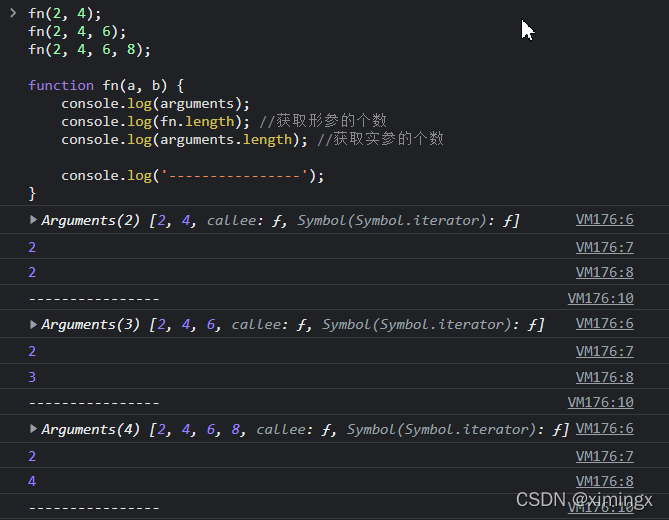
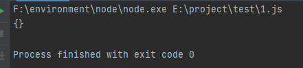

# 内置对象（三）：Function

> 本文件是《JavaScript 笔记》第 4 部分，[⬆ 返回总目录](./0. JavaScript（总目录）.md)

# Function

函数：就是将一些功能或语句进行**封装**，在需要的时候，通过**调用**的形式，执行这些语句。

- **函数也是一个对象**

- 使用`typeof`检查一个函数对象时，会返回 `function`

**函数的作用**：

- 将大量重复的语句抽取出来，写在函数里，以后需要这些语句的时候，可以直接调用函数，避免重复劳动。

- **简化编程，让编程模块化。高内聚、低耦合。**

来看个例子：

```javascript
console.log("你好");
sayHello(); // 调用函数
// 定义函数
function sayHello() {
  console.log("欢迎");
  console.log("welcome");
}
```

## 函数的定义/声明

### 方式一：利用函数关键字自定义函数（命名函数）

使用`函数声明`来创建一个函数（也就是 function 关键字）。语法：

```javascript
// 伪代码：函数声明语法
// function 函数名([形参1, 形参2...形参N]) {
//   语句...
// }
// 备注：语法中的中括号，表示"可选"
```

举例：

```javascript
function fun1(a, b) {
  return a + b;
}
```

解释如下：

- function：是一个关键字。中文是“函数”、“功能”。

- 函数名字：命名规定和变量的命名规定一样。只能是字母、数字、下划线、美元符号，不能以数字开头。

- 参数：可选。

- 大括号里面，是这个函数的语句。

PS：在有些编辑器中，方法写完之后，我们在方法的前面输入`/**`，然后回车，会发现，注释的格式会自动补齐。

### 方式二：函数表达式（匿名函数）

使用`函数表达式`来创建一个函数。语法：

```javascript
// 伪代码：函数表达式语法
// var 变量名 = function([形参1, 形参2...形参N]) {
//   语句...
// }
```

举例：

```javascript
var fun2 = function () {
  console.log("我是匿名函数中封装的代码");
};
```

解释如下：


- 上面的 fun2 是变量名，不是函数名。

- 函数表达式的声明方式跟声明变量类似，只不过变量里面存的是值，而函数表达式里面存的是函数。

- 函数表达式也可以传递参数。

从方式二的举例中可以看出：所谓的“函数表达式”，其实就是将匿名函数赋值给一个变量。

### 方式三：使用构造函数 new Function()

使用构造函数`new Function()`来创建一个对象。这种方式，用的少。

语法：

```javascript
// 伪代码：使用 new Function 创建函数
// var 变量名 = new Function('形参1', '形参2', '函数体');
```

注意，Function 里面的参数都必须是**字符串**格式。也就是说，形参也必须放在**字符串**里；函数体也是放在**字符串**里包裹起来，放在 Function 的最后一个参数的位置。

代码举例：

```javascript
var fun3 = new Function('a', 'b', 'console.log("我是函数内部的内容");  console.log(a + b);');
fun3(1, 2); // 调用函数
```

打印结果：

```js
我是函数内部的内容3
```

**分析**：

方式3的写法很少用，原因如下：

- 不方便书写：写法过于啰嗦和麻烦。

- 执行效率较低：首先需要把字符串转换为 js 代码，然后再执行。

### 总结

1、**所有的函数，都是 `Function` 的“实例”**（或者说是“实例对象”）。函数本质上都是通过 new Function 得到的。

2、函数既然是实例对象，那么，**函数也属于“对象”**。还可以通过如下特征，来佐证函数属于对象：

（1）我们直接打印某一个函数，比如 `console.log(fun2)`，发现它的里面有`__proto__`。

（2）我们还可以打印 `console.log(fun2 instanceof Object)`，发现打印结果为 `true`。这说明 fun2 函数就是属于 Object。

## 函数的调用

### 方式1：普通函数的调用

函数调用的语法：

```javascript
函数名();
```

或者：

```js
函数名.call();
```

代码举例：

```javascript
function fn1() {
  console.log('我是函数体里面的内容1');
}
function fn2() {
  console.log('我是函数体里面的内容2');
}
fn1(); // 调用函数
fn2.call(); // 调用函数
```

### 方式2：通过对象的方法来调用

```javascript
var obj = {
  a: 'qianguyihao',
  fn2: function () {
    console.log('千古壹号，永不止步!');
  },
};
obj.fn2(); // 调用函数
```

如果一个函数是作为一个对象的属性保存，那么，我们称这个函数是这个对象的**方法**。


### 方式3：立即执行函数

代码举例：

```javascript
(function () {
  console.log('我是立即执行函数');
})();
```

立即执行函数在定义后，会自动调用。

### 方式4：通过构造函数来调用

代码举例：

```javascript
function Fun3() {
  console.log('千古壹号，永不止步~');
}
new Fun3();
```

这种方式用得不多。

### 方式5：绑定事件函数

代码举例：


```html
<!DOCTYPE html>
<html lang="en">
    <head>
        <meta charset="UTF-8" />
        <meta name="viewport" content="width=device-width, initial-scale=1.0" />
        <title>Document</title>
    </head>
    <body>
        <div id="btn">我是按钮，请点击我</div>
        <script>
            var btn = document.getElementById('btn');
            // 2.绑定事件
            btn.onclick = function () {
                console.log('点击按钮后，要做的事情');
            };
        </script>
    </body>
</html>
```


### 方式6：定时器函数

代码举例：（每间隔一秒，将 数字 加1）

```javascript
    let num = 1;   setInterval(function () {       num ++;       console.log(num);   }, 1000);
```

这里涉及到定时器的知识点。

## 函数的参数：形参和实参

**形参：**

- 概念：形式上的参数。定义函数时传递的参数，当时并不知道是什么值。

- 定义函数时，可以在函数的`()`中来指定一个或多个形参。

- 多个形参之间使用`,`隔开，声明形参就相当于在函数内部声明了对应的变量，但是并不赋值。

**实参**：

- 概念：实际上的参数。调用函数时传递的参数，实参将会传递给函数中对应的形参。

- 在调用函数时，可以在函数的 `()`中指定实参。

注意：实际参数和形式参数的个数，一般要相同。

举例：

```javascript
// 调用函数
sum(3, 4);
sum("3", 4);
sum("Hello", "World");
// 定义函数：求和
function sum(a, b) {
  console.log(a + b);
}
```

控制台输出结果：

```
734 helloworld
```

### 实参的类型

函数的实参可以是任意的数据类型。

调用函数时，解析器不会检查实参的类型，所以要注意，是否有可能会接收到非法的参数，如果有可能则需要对参数进行类型的检查。

### 实参的数量（实参和形参的个数不匹配时）

调用函数时，解析器也不会检查实参的数量。

- 如果实参的数量多余形参的数量，多余实参不会被赋值。

- 如果实参的数量少于形参的数量，多余的形参会被定义为 undefined。表达式的运行结果为 NaN。

代码举例：

```javascript
function sum(a, b) {
  console.log(a + b);
}
sum(1, 2);
sum(1, 2, 3);
sum(1);
```

打印结果：

```
33NaN
```

注意：在 JS 中，形参的默认值是 undefined。

## 函数的返回值

举例：

```javascript
console.log(sum(3, 4)); // 将函数的返回值打印出来
// 函数：求和
function sum(a, b) {
  return a + b;
}
```

return 的作用是结束方法（终止函数）。

注意：

- return 的值将会作为函数的执行结果返回，可以定义一个变量，来接收该结果。

- 在函数中，return后的语句都不会执行（函数在执行完 return 语句之后停止并立即退出函数）

- 如果return语句后不跟任何值，就相当于返回一个undefined

- 如果函数中不写return，则也会返回undefined

- 返回值可以是任意的数据类型，可以是对象，也可以是函数。

- return 只能返回一个值。如果用逗号隔开多个值，则以最后一个为准。

## 函数名、函数体和函数加载问题（重要，请记住）

我们要记住：**函数名 == 整个函数**。举例：

```javascript
console.log(fn) ==
  console.log(function fn() {
    alert(1);
  });
// 定义 fn 方法
function fn() {
  alert(1);
}
```

我们知道，当我们在调用一个函数时，通常使用`函数()`这种格式；可如果，我们是直接使用`函数`这种格式，它的作用相当于整个函数。

**函数的加载问题**：JS加载的时候，只加载函数名，不加载函数体。所以如果想使用内部的成员变量，需要调用函数。

## fn()  和 fn 的区别【重要】

- `fn()`：调用函数。调用之后，还获取了函数的返回值。

- `fn`：函数对象。相当于直接获取了整个函数对象。

## break、continue、return 

- break ：结束当前的循环体（如 for、while）

- continue ：跳出本次循环，继续执行下次循环（如 for、while）

- return ：1、退出循环。2、返回 return 语句中的值，同时结束当前的函数体内的代码，退出当前函数。


## 立即执行函数

现有匿名函数如下：

```javascript
var fn = function (a, b) {
  console.log("a = " + a);
  console.log("b = " + b);
};
```

立即执行函数如下：

```javascript
(function (a, b) {
  console.log("a = " + a);
  console.log("b = " + b);
})(123, 456);
```

立即执行函数：函数定义完，立即被调用，这种函数叫做立即执行函数。

立即执行函数往往只会执行一次。为什么呢？因为没有变量保存它，执行完了之后，就找不到它了。

## 方法

函数也可以成为对象的属性。**如果一个函数是作为一个对象的属性保存，那么，我们称这个函数是这个对象的方法**。

调用这个函数就说调用对象的方法（method）。函数和方法，有什么本质的区别吗？它只是名称上的区别，并没有其他的区别。

函数举例：

```javascript
// 调用函数
fn();
```

方法举例：

```javascript
// 调用方法
obj.fn();
```

我们可以这样说，如果直接是`fn()`，那就说明是函数调用。如果是`XX.fn()`的这种形式，那就说明是**方法**调用。

## 类数组 arguments

在调用函数时，浏览器每次都会传递进两个隐含的参数：

- 1.函数的上下文对象 this

- 2.**封装实参的对象** arguments

例如：

```javascript
function foo() {    console.log(arguments);    console.log(typeof arguments);}foo();
```


arguments 是一个类数组对象，它可以通过索引来操作数据，也可以获取长度。

**arguments 代表的是实参**。在调用函数时，我们所传递的实参都会在arguments 中保存。

有个讲究的地方是：arguments**只在函数中使用**。

## arguments.length

arguments.length 可以用来获取**实参的长度**。

> 函数名.length 可以获取形参的个数

举例：

```javascript
fn(2, 4);
fn(2, 4, 6);
fn(2, 4, 6, 8);
function fn(a, b) {
  console.log(arguments);
  console.log(fn.length); // 获取形参的个数
  console.log(arguments.length); // 获取实参的个数
  console.log('----------------');
}
```

打印结果：




我们即使不定义形参，也可以通过 arguments 来使用实参（只不过比较麻烦）：arguments[0] 表示第一个实参、arguments[1] 表示第二个实参...

## arguments.callee

arguments 里边有一个属性叫做 callee，这个属性对应一个函数对象，就是**当前正在指向的函数对象**。

```javascript
function fun() {
  console.log(arguments.callee == fun); // 打印结果为 true
}
fun('hello');
```

在使用函数**递归**调用时，推荐使用 arguments.callee 代替函数名本身。

## arguments 可以修改元素

之所以说 arguments 是伪数组，是因为：**arguments 可以修改元素，但不能改变数组的长短**。举例：

```javascript
fn(2, 4);
fn(2, 4, 6);
fn(2, 4, 6, 8);
function fn(a, b) {
  arguments[0] = 99; // 将实参的第一个数改为 99
  arguments.push(8); // 此方法不通过，因为无法增加元素
}
```


## arguments 的使用

当我们不确定有多少个参数传递的时候，可以用 **arguments** 来获取。在 JavaScript 中，arguments 实际上是当前函数的一个**内置对象**。所有函数都内置了一个 arguments 对象（只有函数才有 arguments 对象），arguments 对象中存储了**传递的所有实参**.

arguments的展示形式是一个**伪数组**。伪数组具有以下特点：

- 可以进行遍历；具有数组的 length 属性。

- 按索引方式存储数据。

- 不具有数组的 push()、pop() 等方法。

**代码举例**：利用 arguments 求函数实参中的最大值

代码实现：

```javascript
function getMaxValue() {
  var max = arguments[0];
  // 通过 arguments 遍历实参
  for (var i = 0; i < arguments.length; i++) {
    if (max < arguments[i]) {
      max = arguments[i];
    }
  }
  return max;
}
console.log(getMaxValue(1, 3, 7, 5));
```

## 函数参数默认值

**传统写法**：

```javascript
function fn(param) {    let p = param || 'hello';    console.log(p);}
```

上方代码中，函数体内的写法是：如果 param 不存在，就用 `hello`字符串做兜底。这样写比较啰嗦。

**ES6 写法**：（参数默认值的写法，很简洁）

```javascript
function fn(param = 'hello') {    console.log(param);}
```

在 ES6 中定义方法时，我们可以给方法里的参数加一个**默认值**（缺省值）：

-   方法被调用时，如果没有给参数赋值，那就是用默认值；

-   方法被调用时，如果给参数赋值了新的值，那就用新的值。

如下：

```javascript
var fn2 = (a, b = 5) => {
  console.log('haha');
  return a + b;
};
console.log(fn2(1)); // 第二个参数使用默认值 5。输出结果：6
console.log(fn2(1, 8)); // 输出结果：9
```

**提醒 1**：默认值的后面，不能再有**没有默认值的变量**。比如`(a,b,c)`这三个参数，如果我给 b 设置了默认值，那么就一定要给 c 设置默认值。

**提醒 2**：

我们来看下面这段代码：

```javascript
let x = 'smyh';function fn(x, y = x) {    console.log(x, y);}fn('vae');
```

注意第二行代码，我们给 y 赋值为`x`，这里的`x`是括号里的第一个参数，并不是第一行代码里定义的`x`。打印结果：`vae vae`。

如果我把第一个参数改一下，改成：

```javascript
let x = 'smyh';function fn(z, y = x) {    console.log(z, y);}fn('vae');
```

此时打印结果是：`vae smyh`。

## 剩余参数 (rest 运算符)

**剩余参数**允许我们将不确定数量的**剩余的元素**放到一个**数组**中。

比如说，当函数的实参个数大于形参个数时，我们可以将剩余的实参放到一个数组中。

**传统写法**：

ES5 中，在定义方法时，参数要确定个数，如下：（程序会报错）

```javascript
function fn(a, b, c) {
  console.log(a);
  console.log(b);
  console.log(c);
  console.log(d);
}
fn(1, 2, 3);
```

上方代码中，报错并不是因为"实参和形参个数不匹配"——JS 本身**不检查参数个数**（多传的实参被忽略，少传的形参是 undefined）。真正报错的原因是函数体里引用了一个从未声明过的变量 `d`：`ReferenceError: d is not defined`。


**ES6 写法**：

ES6 中，我们有了剩余参数，就不用担心报错的问题了。代码可以这样写：

```javascript
const fn = (...args) => {
  // 当不确定方法的参数时，可以使用剩余参数
  console.log(args[0]);
  console.log(args[1]);
  console.log(args[2]);
  console.log(args[3]);
};
fn(1, 2);
fn(1, 2, 3); // 方法的定义中有四个参数，但调用函数时只使用了三个参数，ES6 中并不会报错
```

打印结果：

```bash
12undefinedundefined123undefined
```

上方代码中注意，args 参数之后，不能再加别的参数，否则编译报错。

下面这段代码，也是利用到了剩余参数：

```js
function fn1(first, ...args) {
  console.log(first); // 10
  console.log(args); // 数组：[20, 30]
}
fn1(10, 20, 30);
```

### 剩余参数的举例：参数求和

代码举例：

```js
const sum = (...args) => {
  let total = 0;
  args.forEach((item) => (total += item)); // 注意 forEach 里面的代码，写得很精简
  return total;
};
console.log(sum(10, 20, 30));
```

打印结果：60

### 剩余参数和解构赋值配合使用

代码举例：

```js
const students = ['张三', '李四', '王五'];
let [s1, ...s2] = students;
console.log(s1); // '张三'
console.log(s2); // ['李四', '王五']
```


## 原型， 原型链

### 原型对象

```javascript
function Person(name, age, gender) {
  this.name = name;
  this.age = age;
  this.gender = gender;
  // 向对象中添加一个方法
  this.sayName = function () {
    console.log("我是" + this.name);
  };
}
// 创建一个 Person 的实例
var per = new Person("孙悟空", 18, "男");
var per2 = new Person("猪八戒", 28, "男");
per.sayName();
per2.sayName();
console.log(per.sayName == per2.sayName); // 打印结果为 false
```

**分析如下**：

上方代码中，我们的sayName方法是写在构造函数 Person 内部的，然后在两个实例中进行了调用。造成的结果是，**构造函数每执行一次，就会给每个实例创建一个新的 sayName 方法**。

也就是说，每个实例的sayName都是唯一的。因此，最后一行代码的打印结果为false。

按照上面这种写法，假设创建10000个对象实例，就会创建10000个 sayName 方法。这种写法肯定是不合适的。

还有一种方式是，将sayName方法在全局作用域中定义：（不建议。原因看注释）

```javascript
function Person(name, age, gender) {
  this.name = name;
  this.age = age;
  this.gender = gender;
  this.sayName = fun;
}
// 将 sayName 方法在全局作用域中定义
/*
 * 将函数定义在全局作用域，污染了全局作用域的命名空间
 * 而且定义在全局作用域中也很不安全
 */
function fun() {
  alert("Hello大家好，我是:" + this.name);
}
```

比较好的方式是，在原型中添加sayName方法：

```javascript
    Person.prototype.sayName = function(){        alert("Hello大家好，我是:"+this.name);    };
```

这也就引入了我们本文要讲的「原型」。

### 原型prototype的概念

**认识1**：

我们所创建的每一个函数，解析器都会向函数中添加一个属性 prototype。这个属性对应着一个对象，这个对象就是我们所谓的原型对象。

如果函数作为普通函数调用prototype没有任何作用，当函数以构造函数的形式调用时，它所创建的实例对象中都会有一个隐含的属性，指向该构造函数的原型，我们可以通过__proto__来访问该属性。

代码举例：

```javascript
// 定义构造函数
function Person() {}
var per1 = new Person();
var per2 = new Person();
console.log(Person.prototype); // 打印结果：{}
console.log(per1.__proto__ == Person.prototype); // 打印结果：true
```

上方代码的最后一行：打印结果表明，`实例.__proto__` 和 `构造函数.prototype`都指的是原型对象。

**认识2**：

原型对象就相当于一个公共的区域，**所有同一个类的实例都可以访问到这个原型对象，我们可以将对象中共有的内容，统一设置到原型对象中。**

以后我们创建构造函数时，可以将这些对象共有的属性和方法，统一添加到构造函数的原型对象中，这样就不用分别为每一个对象添加，也不会影响到全局作用域，就可以使每个对象都具有这些属性和方法了。

**认识3**：

使用 `in` 检查对象中是否含有某个属性时，如果对象中没有但是**原型中**有，也会返回true。

可以使用对象的`hasOwnProperty()`来检查**对象自身中**是否含有该属性。

### 原型链

原型对象也是对象，所以它也有原型，当我们使用或访问一个对象的属性或方法时：

- 它会先在对象自身中寻找，如果有则直接使用；

- 如果没有则会去原型对象中寻找，如果找到则直接使用；

- 如果没有则去原型的原型中寻找，直到找到Object对象的原型。

- Object对象的原型没有原型，如果在Object原型中依然没有找到，则返回 null

### 原型规则

> 1. 所有的引用类型（数组、对象、函数），都具有对象特性，都可以**自由扩展属性**。null 除外。

```js
let a = {};
a.name = "ximingx";
console.log(a.name);
```


> 2. 所有的**引用类型**（数组、对象、函数），都有一个`__proto__`属性（注意：前后各两个下划线），属性值是一个**普通的对象**。`__proto__`的含义是隐式原型。

```js
let a = {};
a.name = "ximingx";
console.log(a.__proto__);
```


> 3. 所有的**函数**（不包括数组、对象），都有一个`prototype`属性，属性值是一个**普通的对象**。`prototype`的含义是**显式原型**。（实例没有这个属性）

```js
let a = function () {};
console.log(a.prototype);
```



> 4. 所有的**引用类型**（数组、对象、函数），`__proto__`属性指向它的**构造函数**的`prototype`值。

```js
let a = {};
console.log(a.__proto__ === Object.prototype);
```


> 5. 当试图获取一个对象的某个属性时，如果这个对象本身没有这个属性，那么会去它的`__proto__`中寻找（即它的构造函数的`prototype`）。

```js
// 创建方法
function Foo(name) {
  this.name = name;
}
Foo.prototype.alertName = function () {
  // 既然 Foo.prototype 是普通的对象，那也允许给它添加额外的属性 alertName
  console.log(this.name);
};
// 测试
let fn = new Foo("ximingx");
fn.alertName(); // 输出结果：ximingx
```

上方代码中，虽然 alertName 不是 fn 自身的属性，但是会从它的构造函数的`prototype`里面找。

## 构造函数

### 代码引入

```javascript
// 创建一个构造函数，专门用来创建 Person 对象
function Person(name, age, gender) {
  this.name = name;
  this.age = age;
  this.gender = gender;
  this.sayName = function () {
    alert(this.name);
  };
}
var per = new Person('ximingx', 18, '男');
var per2 = new Person('luotyue', 16, '女');
// 创建一个构造函数，专门用来创建 Dog 对象
function Dog() {}
var dog = new Dog();
```

### 构造函数的概念

**构造函数**：是一种特殊的函数，主要用来创建和初始化对象，也就是为对象的成员变量赋初始值。它与 `new` 一起使用才有意义。

我们可以把对象中一些公共的属性和方法抽取出来，然后封装到这个构造函数里面。

### 构造函数和普通函数的区别

构造函数的创建方式和普通函数没有区别，**不同的是构造函数习惯上首字母大写。**

构造函数和普通函数的区别就是**调用方式**的不同：普通函数是直接调用，而构造函数需要使用 new 关键字来调用。

**this 的指向也有所不同**：

-   1.以函数的形式调用时，**非严格模式下** this 是 window。比如`fun();`相当于`window.fun();`（严格模式下是 undefined，详见后文「函数内 this 的指向」）

-   2.以方法的形式调用时，this 是调用方法的那个对象

-   3.以构造函数的形式调用时，this 是新创建的实例对象

### new 一个构造函数的执行流程

new 在执行时，会做下面这四件事：

（1）开辟内存空间，在内存中创建一个新的空对象。

（2）让 this 指向这个新的对象。

（3）执行构造函数里面的代码，给这个新对象添加属性和方法。

（4）返回这个新对象（所以构造函数里面不需要 return）。

因为 this 指的是 new 一个 Object 之后的对象实例。于是，下面这段代码：

```javascript
// 创建一个函数
function createStudent(name) {
  var student = new Object();
  student.name = name; // 第一个 name 指的是 student 对象定义的变量；第二个 name 指的是 createStudent 函数的参数。二者不一样
}
```

可以改进为：

```javascript
// 创建一个函数function Student(name) {    this.name = name; //this指的是构造函数中的对象实例}
```

注意上方代码中的注释。

### 静态成员和实例成员

JavaScript 的构造函数中可以添加一些成员，可以在构造函数本身上添加，也可以在构造函数内部的 this 上添加。通过这两种方式添加的成员，就分别称为静态成员和实例成员。

-   静态成员：在构造函数本上添加的成员称为静态成员，只能由构造函数本身来访问。

-   实例成员：在构造函数内部创建的对象成员称为实例成员，只能由实例化的对象来访问。

### 类、实例

使用同一个构造函数创建的对象，我们称为一类对象，也将一个构造函数称为一个**类**。

通过一个构造函数创建的对象，称为该类的**实例**。

### instanceof

使用 instanceof 可以检查**一个对象是否为一个类的实例**。

**语法如下**：

```javascript
对象 instanceof 构造函数;
```

如果是，则返回 true；否则返回 false。

**代码举例**：

```javascript
function Person() {}
function Dog() {}
var person1 = new Person();
var dog1 = new Dog();
console.log(person1 instanceof Person); // 打印结果：true
console.log(dog1 instanceof Person); // 打印结果：false
console.log(dog1 instanceof Object); // 所有的对象都是 Object 的后代。因此，打印结果为：true
```

根据上方代码中的最后一行，需要补充一点：**所有的对象都是 Object 的后代，因此 `任何对象 instanceof Object` 的返回结果都是 true**。

## 面向过程和面向对象

### 面向过程

**面向过程**：先分析好的具体步骤，然后按照步骤，一步步解决问题。

优点：性能比面向对象高，适合跟硬件联系很紧密的东西，例如单片机就采用的面向过程编程。

缺点：没有面向对象易维护、易复用、易扩展。

### 面向对象

**面向对象**（OOP，Object Oriented Programming）：以对象功能来划分问题，而不是步骤。

优点：**易维护、易复用、易扩展，由于面向对象有封装、继承、多态性的特性**，可以设计出低耦合的系统，使系统 更加灵活、更加易于维护。

缺点：性能比面向过程低。

### 面向对象的编程思想

面向对象的编程思想：对代码和数据进行封装，并以对象调用的方式，对外提供统一的调用接口。

比如说，当我们在开车的时候，无需关心汽车的内部构造有多复杂，对于大多数人而言，只需要会开、知道汽车有哪些功能就行了。

### 面向对象的特性

在面向对象程序开发思想中，每一个对象都是功能中心，具有明确分工。面向对象编程具有灵活、代码可复用、容易维护和开发的优点，适合多人合作的大型软件项目，更符合我们认识事物的规律。

面向对象的特性如下：

- **封装性**

- **继承性**

- **多态性**

### JS 中的面向对象

JS 中的面向对象，是基于**原型**的面向对象。

另外，在ES6中，新引入了 类（`Class`）和继承（`Extends`）来实现面向对象。


### 基于原型的面向对象

JS 中的对象（Object）是依靠构造器（`constructor`）和原型（`prototype`）构造出来的。

---

## 原型的三角关系

这是理解原型必须记住的三条等式，几乎所有原型相关的面试题都是从它派生出来的：

```js
function Person(name) {
    this.name = name;
}
const p = new Person('ximingx');

// ① 实例的隐式原型 === 构造函数的显式原型
console.log(p.__proto__ === Person.prototype);          // true

// ② 原型对象的 constructor 指回构造函数
console.log(Person.prototype.constructor === Person);   // true

// ③ 实例自身没有 constructor，是沿着原型链从 Person.prototype 上读到的
console.log(p.constructor === Person);                  // true
console.log(p.hasOwnProperty('constructor'));           // false
```

图示：

```
        ┌──────────────────┐
        │   Person（函数）  │
        └────────┬─────────┘
                 │ .prototype
                 ▼
        ┌──────────────────────────┐        ┌──────────────┐
        │  Person.prototype        │◀──┐    │  p（实例）    │
        │  ├─ constructor ─────────┼───┼───▶│              │
        │  └─ sayName()            │   │    └──────┬───────┘
        └──────────────────────────┘   │           │
                                       └───────────┘
                                         p.__proto__
```

> **注意**：`constructor` 是可以被改写的。一旦你用 `Person.prototype = { ... }` 整体覆盖原型对象，`constructor` 就会丢失（变成指向 `Object`），必须手动补回来 —— 这是继承实现里最容易漏掉的一步。

### 原型链的终点

```js
function Foo() {}
const f = new Foo();

console.log(f.__proto__ === Foo.prototype);               // true
console.log(Foo.prototype.__proto__ === Object.prototype); // true
console.log(Object.prototype.__proto__);                   // null  ← 原型链的终点
console.log(Object.prototype.constructor === Object);      // true
```

所以完整的查找路径是：

```
f → Foo.prototype → Object.prototype → null
```

**这里有几个"反直觉但必须记住"的结论**（函数在 JS 里也是对象）：

```js
// 所有函数都是 Function 的实例，包括内建构造函数本身
console.log(Person.__proto__ === Function.prototype);   // true
console.log(Object.__proto__ === Function.prototype);   // true

// Function 自己也是 Function 的实例（自己造自己）
console.log(Function.__proto__ === Function.prototype); // true

// Function.prototype 是个普通对象，所以它的原型是 Object.prototype
console.log(Function.prototype.__proto__ === Object.prototype); // true
```

---

## 继承的演进：从原型链到 class

JS 里没有真正的"类继承"（ES6 的 `class` 只是语法糖），但可以用原型模拟出继承。下面按"由浅入深、由劣到优"的顺序梳理 6 种方案，重点理解**每一种解决了什么问题、又留下了什么问题**。

### 方式一：原型链继承

**做法**：把子类的原型对象，替换成父类的一个实例。

```js
function Parent() {
    this.name = 'parent';
    this.colors = ['red', 'blue'];
}
Parent.prototype.sayName = function () {
    console.log(this.name);
};

function Child() {
    this.age = 18;
}
// 关键一步：让 Child 的原型指向 Parent 的实例
Child.prototype = new Parent();
Child.prototype.constructor = Child; // 补回 constructor

const c1 = new Child();
c1.sayName(); // parent —— 成功继承到父类原型上的方法
```

**两个致命缺点**：

1. **引用类型的属性被所有实例共享**（这是最常见的踩坑点）

```js
const c2 = new Child();
c1.colors.push('green');
console.log(c2.colors); // ['red', 'blue', 'green'] —— c2 被 c1 污染了！
```

原因是 `colors` 数组挂在 `Parent` 实例上，而这个实例被当成了 `Child.prototype`，于是所有 `Child` 实例共享同一个数组。

2. **创建子类实例时，无法向父类构造函数传参**。

### 方式二：借用构造函数继承（经典继承）

**做法**：在子类构造函数内部，用 `call` / `apply` 把父类构造函数跑一遍，并绑定 `this`。

```js
function Parent(name) {
    this.name = name;
    this.colors = ['red', 'blue'];
}

function Child(name, age) {
    Parent.call(this, name); // 关键：把 Parent 的 this 换成 Child 的 this
    this.age = age;
}

const c1 = new Child('ximingx', 18);
const c2 = new Child('luoyue', 16);
c1.colors.push('green');

console.log(c1.colors); // ['red', 'blue', 'green']
console.log(c2.colors); // ['red', 'blue']  ← 互不干扰，缺点 1 解决了
console.log(c1.name);   // 'ximingx'        ← 可以传参了，缺点 2 解决了
```

**遗留问题**：

> **只能继承父类构造函数内部的属性，继承不到 `Parent.prototype` 上的方法。**
> 方法如果都写在构造函数里，就又退化成了"每 new 一次就重新创建一个函数"，失去复用意义。

```js
Parent.prototype.sayName = function () { console.log(this.name); };
c1.sayName(); // TypeError: c1.sayName is not a function
```

### 方式三：组合继承（最常用的经典方案）

**做法**：原型链继承（拿方法）+ 借用构造函数继承（拿属性），两者结合。

```js
function Parent(name) {
    this.name = name;
    this.colors = ['red', 'blue'];
}
Parent.prototype.sayName = function () {
    console.log(this.name);
};

function Child(name, age) {
    Parent.call(this, name);   // 第二次调用 Parent —— 拿到实例属性
    this.age = age;
}
Child.prototype = new Parent();       // 第一次调用 Parent —— 拿到原型方法
Child.prototype.constructor = Child;

const c1 = new Child('ximingx', 18);
c1.sayName();            // ximingx —— 方法能用了
c1.colors.push('green');
const c2 = new Child('luoyue', 16);
console.log(c2.colors);  // ['red', 'blue'] —— 属性也独立了
```

**唯一缺点**：**父类构造函数被调用了两次**。

- 一次是 `Child.prototype = new Parent()`，在 `Child.prototype` 上留下了一份 `name`、`colors`；
- 一次是 `new Child()` 时的 `Parent.call(this)`，在实例上又留了一份。

实例上的属性会**遮蔽（shadow）**原型上的同名属性，所以功能没问题，但存在冗余。

### 方式四：原型式继承与 Object.create()

**做法**：不定义构造函数，直接基于一个已有对象创建新对象。

```js
const parent = {
    name: 'parent',
    colors: ['red', 'blue'],
    sayName() { console.log(this.name); }
};

const child = Object.create(parent); // child.__proto__ === parent
child.name = 'child';
child.sayName(); // child
```

`Object.create(proto, [propertiesObject])` 的本质等价于：

```js
function create(proto) {
    function F() {}
    F.prototype = proto;
    return new F();
}
```

要点：

- `Object.create(null)` 创建的是**无原型对象**（`__proto__` 为 `null`），没有 `toString`、`hasOwnProperty` 等任何 Object 方法，常被用作"纯净的字典"。
- 原型式继承同样存在**引用类型共享**的问题，和方式一完全一样。

### 方式五：寄生组合式继承（最优方案，也是 ES6 class 的实现原理）

**做法**：用 `Object.create()` 代替 `new Parent()` 来建立原型链，从而避免"父类构造函数被调用两次"。

```js
function Parent(name) {
    this.name = name;
    this.colors = ['red', 'blue'];
}
Parent.prototype.sayName = function () {
    console.log(this.name);
};

function Child(name, age) {
    Parent.call(this, name);   // 只调用这一次
    this.age = age;
}

// 关键差异：不再 new Parent()，而是用一个干净的、只继承原型的对象
Child.prototype = Object.create(Parent.prototype);
Child.prototype.constructor = Child;

const c1 = new Child('ximingx', 18);
c1.sayName(); // ximingx
```

**为什么它是最优解**：

| 方案 | 父类执行次数 | 实例属性独立 | 能继承原型方法 | 能传参 |
| --- | --- | --- | --- | --- |
| ① 原型链继承 | 1 | ✗（共享引用） | ✓ | ✗ |
| ② 借用构造函数 | 1 | ✓ | ✗ | ✓ |
| ③ 组合继承 | 2 | ✓ | ✓ | ✓ |
| ⑤ 寄生组合式 | **1** | ✓ | ✓ | ✓ |

可以封装成一个通用工具函数：

```js
function inheritPrototype(Child, Parent) {
    const prototype = Object.create(Parent.prototype); // 创建对象
    prototype.constructor = Child;                     // 增强对象
    Child.prototype = prototype;                       // 指定对象
}
```

### 方式六：ES6 class 与 extends

**做法**：`class` + `extends` + `super`。它在底层做的事情，本质上就是**寄生组合式继承**。

```js
class Parent {
    constructor(name) {
        this.name = name;
        this.colors = ['red', 'blue'];
    }
    sayName() {
        console.log(this.name);
    }
    static staticMethod() {
        console.log('我是静态方法，只能通过 Parent.staticMethod() 调用');
    }
}

class Child extends Parent {
    constructor(name, age) {
        super(name);  // 必须在使用 this 之前调用！等价于 Parent.call(this, name)
        this.age = age;
    }
    sayAge() {
        console.log(this.age);
    }
}

const c = new Child('ximingx', 18);
c.sayName(); // ximingx
c.sayAge();  // 18
```

**class 与普通构造函数的 6 个重要区别**（高频面试点）：

1. **class 不存在变量提升**，有暂时性死区，必须先声明后使用。

```js
new Foo();      // ReferenceError: Cannot access 'Foo' before initialization
class Foo {}
```

2. **必须用 `new` 调用**，直接调用会报错（普通函数不会）。

```js
Foo(); // TypeError: Class constructor Foo cannot be invoked without 'new'
```

3. **class 内部默认是严格模式**，不需要也不应该手动加 `"use strict"`。

4. **class 的方法不可枚举**。用 `function` 定义在 `prototype` 上的方法是可枚举的，会被 `for...in` 遍历到。

```js
function F() {}
F.prototype.foo = function () {};
class C { bar() {} }

console.log(Object.keys(F.prototype)); // ['foo']
console.log(Object.keys(C.prototype)); // []  —— bar 不可枚举
```

5. **class 的所有方法都没有 `prototype` 属性**，因此不能用 `new` 去调用一个类的方法。

6. **子类必须在 `constructor` 里先调用 `super()` 才能使用 `this`**。

> 本质原因：ES6 中，子类实例的构建是基于父类实例的（`this` 要先由父类构造出来），所以 `super()` 必须先执行。而在 ES5 的借用构造函数继承里，`Parent.call(this)` 的位置就比较自由。

**继承的两条链**（理解这个，class 的继承就通了）：

```js
// 链 1：实例的原型链（对象角度）
// c.__proto__ → Child.prototype → Parent.prototype → Object.prototype → null
//
// 链 2：构造函数自身的原型链（类角度，实现静态方法继承）
// Child.__proto__ → Parent → Function.prototype → Object.prototype → null
```

所以 `Child.staticMethod()` 能调用成功，靠的是链 2。

---

## instanceof 的原理与手写实现

`instanceof` 的判断逻辑是：**沿着左边对象的 `__proto__` 链一直往上找，看能否找到右边函数的 `prototype`**。

```js
function myInstanceof(left, right) {
    // 基本数据类型直接返回 false
    if (left === null || (typeof left !== 'object' && typeof left !== 'function')) {
        return false;
    }
    let proto = Object.getPrototypeOf(left); // 等价于 left.__proto__
    const prototype = right.prototype;
    while (true) {
        if (proto === null) return false;    // 找到原型链终点还没找到
        if (proto === prototype) return true;
        proto = Object.getPrototypeOf(proto);
    }
}

console.log(myInstanceof([], Array));    // true
console.log(myInstanceof([], Object));   // true
console.log(myInstanceof('abc', String)); // false（基本类型不是对象）
```

> **注意**：`instanceof` 判断的是"是否出现在原型链上"，因此 `[] instanceof Object` 也是 `true`。
> 它并**不能**准确判断一个对象的真实类型。更可靠的做法是使用 `Object.prototype.toString.call()`：
> ```js
> Object.prototype.toString.call([]);      // '[object Array]'
> Object.prototype.toString.call(null);    // '[object Null]'
> Object.prototype.toString.call(new Date);// '[object Date]'
> ```

## 属性判断的四种方式

```js
function Parent() { this.a = 1; }
Parent.prototype.b = 2;
const obj = new Parent();

// ① in：自身 + 原型链
console.log('a' in obj); // true
console.log('b' in obj); // true

// ② hasOwnProperty()：只看自身
console.log(obj.hasOwnProperty('a')); // true
console.log(obj.hasOwnProperty('b')); // false

// ③ Object.getOwnPropertyNames()：自身所有属性（含不可枚举）
console.log(Object.getOwnPropertyNames(obj)); // ['a']

// ④ Object.keys()：自身所有【可枚举】属性
console.log(Object.keys(obj)); // ['a']
```

| 方法 | 查找原型链 | 包含不可枚举 | 包含 Symbol |
| --- | --- | --- | --- |
| `in` | ✓ | ✓ | ✓ |
| `hasOwnProperty()` | ✗ | ✓ | ✓ |
| `Object.keys()` | ✗ | ✗ | ✗ |
| `Object.getOwnPropertyNames()` | ✗ | ✓ | ✗ |
| `Reflect.ownKeys()` | ✗ | ✓ | ✓ |

## 闭包的引入

我们知道，变量根据作用域的不同分为两种：全局变量和局部变量。

- 函数内部可以访问全局变量和局部变量。

- 函数外部只能访问全局变量，不能访问局部变量。

- 当函数执行完毕，本作用域内的局部变量会销毁。

比如下面这样的代码：

```js
function foo() {
  let a = 1;
}
foo();
console.log(a); // 打印报错：Uncaught ReferenceError: a is not defined
```

上方代码中，由于变量 `a` 是函数内的局部变量，所以外部无法访问。

但是，在有些场景下，我们就是想要在函数外部访问函数内的局部变量，那要怎么办呢？这就需要引入闭包的概念。

### 闭包的概念

**闭包**（closure）：指有权**访问**另一个函数作用域中**变量**的**函数**。

闭包是一种函数；当然，你可以**把闭包理解成是一种现象**。具体解释如下。

简单理解就是：如果**这个作用域可以访问另外一个函数内部的局部变量**，那就产生了闭包（此时，你可以把闭包理解成是一种现象）；而另外那个作用域所在的函数称之为**闭包函数**。注意，这里强调的是访问**局部变量**哦。

### 闭包代码举例

代码举例：

```js
function fn1() {    let a = 10;    function fn2() {        console.log(a);    }    fn2();}fn1();
```

打印结果：

```js
10
```

上方代码中，函数 fn2 的作用域 访问了 fn1 中的局部变量，那么，此时在 fn1 中就产生了闭包，fn1 称之为闭包函数。

### 闭包的作用：延伸变量的作用范围

我们来看看下面这段闭包的代码：

```js
function fn1() {
    let a = 20;
    function fn2() {
        console.log(a);
    }
    return fn2;
}
const foo = fn1(); // 执行 fn1() 之后，会得到一个返回值。foo 代表的就是 fn2 函数foo();
```

上方代码中，foo 代表的就是整个 fn2 函数。当执行了 `foo()` 语句之后（相当于执行了 `fn2()`），fn1 函数内就产生了闭包。

一般来说，在 fn1 函数执行完毕后，它里面的变量 a 会立即销毁。但此时由于产生了闭包，所以 **fn1 函数中的变量 a 不会立即销毁，因为 fn2 函数还要继续调用变量 a**。只有等所有函数把变量 a 调用完了（即 fn2 也不再被引用、可以被垃圾回收时），变量 a 才会销毁。

而且，可以看出， 在执行 `foo()`语句之后，竟然能够打印出 `20`，这就完美通过闭包实现了：全局作用域成功访问到了局部作用域中的变量 a。

因此，我们可以看出，闭包的主要作用就是：**延伸了变量的作用范围。**

上面的代码也可以简写成：

```js
function fn1() {
  let a = 20;
  return function () {
    console.log(a);
  };
}
const foo = fn1(); // 执行 fn1() 之后，会得到一个返回值。这个返回值是函数 foo
```

## 执行期上下文

当**函数执行**时（准确来说，是在函数发生预编译的前一刻），会创建一个执行期上下文的内部对象。一个执行期上下文定义了一个函数执行时的环境。

每调用一次函数，就会创建一个新的上下文对象，他们之间是相互独立且独一无二的。当函数执行完毕，它所产生的执行期上下文会被销毁。

### this

解析器在调用函数每次都会向函数内部传递进一个隐含的参数，这个隐含的参数就是 this，this 指向的是一个对象，这个对象我们称为函数执行的 上下文对象。

### 函数内 this 的指向【非常重要】

根据函数的调用方式的不同，this 会指向不同的对象：

- 1.以函数的形式（包括普通函数、定时器函数、立即执行函数）调用时，**非严格模式下** this 的指向是 window。比如`fun();`相当于`window.fun();`。

  > **严格模式下的例外**：如果脚本或函数开启了 `"use strict"`，独立函数调用时 `this` 是 `undefined`，不再是 `window`。
  > ```js
  > function f() { console.log(this); }
  > f();                 // 非严格：Window   严格：undefined
  > setTimeout(f, 0);    // 浏览器里恒为 Window（定时器回调由宿主环境以全局对象调用）
  > ```
  > 另外，Node.js 的模块作用域中，顶层 `this` 是 `module.exports`（不是 `global`），这一点和浏览器不同。

- 2.以方法的形式调用时，this 指向调用方法的那个对象

- 3.以构造函数的形式调用时，this 指向实例对象

- 4.以事件绑定函数的形式调用时，this 指向**绑定事件的对象**

- 5.使用 call 和 apply 调用时，this 指向指定的那个对象

**针对第 1 条的举例**：

```javascript
function fun() {
    console.log(this);
    console.log(this.name);
}
var obj1 = { name: 'ximingx', sayName: fun };
var obj2 = { name: 'luoyue', sayName: fun };
var name = '全局的name属性'; //以函数形式调用，this是windowfun(); //可以理解成 window.fun()
```

打印结果：

```
Window    全局的 name 属性
```

上面的举例可以看出，this 指向的是 window 对象，所以 this.name 指的是全局的 name。

**第 2 条的举例**：

```javascript
function fun() {
    console.log(this);
    console.log(this.name);
}
var obj1 = { name: 'ximingx', sayName: fun };
var obj2 = { name: 'luoyue', sayName: fun };
var name = '全局的name属性'; //以方法的形式调用，this是调用方法的对象obj2.sayName();
```

打印结果：

```
Object    luoyue
```

上面的举例可以看出，this 指向的是 对象 obj2 ，所以 this.name 指的是 obj2.name。

### 箭头函数中 this 的指向

ES6 中的箭头函数并不会使用上面的准则，而是会继承外层函数调用的 this 绑定（无论 this 绑定到什么）。


### 改变 this 的指向

JS 专门为我们提供了一些方法来改变函数内部的 this 指向。常见的方法有 call()、apply()、bind() 方法。

### call() 方法的作用

call() 方法的作用：可以**调用**一个函数，与此同时，它还可以改变这个函数内部的 this 指向。

call() 方法的另一个应用：**可以实现继承**。之所以能实现继承，其实是利用了上面的作用。

语法：

```js
fn1.call(想要将this指向哪里, 函数实参1, 函数实参2);
```

备注：第一个参数中，如果不需要改变 this 指向，则传 null。

### call() 方法举例

**举例 1**、通过 call() 调用函数：

```js
const obj1 = { nickName: 'ximingx', age: 28 };
function fn1() {
    console.log(this);
    console.log(this.nickName);
}
fn1.call(this); // this的指向并没有被改变，此时相当于 fn1();
```

上方代码的打印结果：

```js
windowundefined
```

上面的代码，跟普通的函数调用 `fn1()` 没有区别。

**举例 2**、通过 call() 改变 this 指向：

```js
var obj1 = { nickName: 'ximingx', age: 28 };
function fn1(a, b) {
    console.log(this);
    console.log(this.nickName);
    console.log(a + b);
}
fn1.call(obj1, 2, 4); // 先将 this 指向 obj1，然后执行 fn1() 函数
```

上方代码的打印结果：

```js
obj1ximingx6
```

**举例 3**、通过 call() 实现继承：

```js
// 给 Father 增加 name 和 age 属性
function Father(myName, myAge) {
  this.name = myName;
  this.age = myAge;
}
function Son(myName, myAge) {
  // 【下面这一行，重要代码】
  // 通过这一步，将 Father 里面的 this 修改为 Son 里面的 this；另外，给 Son 加上相应的参数，让 Son 自动拥有 Father 里的属性。最终实现继承
  Father.call(this, myName, myAge);
}
const son1 = new Son('ximingx', 28);
console.log(JSON.stringify(son1));
```

上方代码中，通过 call() 方法，让 Son 继承了 Father 里面的 name 和 age 属性。

打印结果：

```
{"name":"ximingx","age":28}
```

> **说明**：结果里的 key 是 `name` 和 `age`，而不是 `myName` / `myAge`。
> 因为 `Father` 内部写的是 `this.name = myName`，等号左边的 `this.name` 才决定属性名，等号右边的 `myName` 只是形参名。这一点在手写继承时非常容易写错。

同时也要注意，这种方式（借用构造函数）**只能继承构造函数内部的属性，继承不了 `Father.prototype` 上的方法**，后面「原型与继承」一节会详细讲。

### apply() 方法的作用

apply() 方法的作用：可以**调用**一个函数，与此同时，它还可以改变这个函数内部的 this 指向。这一点，和 call()类似。

apply() 方法的应用： 由于 apply()需要传递数组，所以它有一些巧妙应用，稍后看接下来的应用举例就知道了。

语法：

```js
fn1.apply(想要将this指向哪里, [函数实参1, 函数实参2]);
```

备注：第一个参数中，如果不需要改变 this 指向，则传 null。

到这里可以看出，call() 和 apply() 方法的作用是相同的。唯一的区别在于，apply() 里面传入的**实参，必须是数组（或者类数组，即 array-like object）**。

### apply() 方法举例

**举例**、通过 apply() 改变 this 指向：

```js
var obj1 = { nickName: 'ximingx', age: 28 };
function fn1(a) {
    console.log(this);
    console.log(this.nickName);
    console.log(a);
}
fn1.apply(obj1, ['hello']); // 先将 this 指向 obj1，然后执行 fn1() 函数
```

注意，上方代码中，**apply()** 里面传实参时，需要以数组的形式。即便是只传一个实参，也需要传数组。（原文写作 call()，此处为笔误，call() 是逐个传参的）

打印结果：

```js
obj1ximingxhello
```

### apply() 方法的巧妙应用：求数组的最大值

我们知道，如果想要求数组中元素的最大值的时候，数组本身是没有自带方法的。那怎么办呢？

虽然数组里没有获取最大值的方法，但是数值里面有 `Math.max(数字1，数字2，数字3)` 方法，可以获取**多个数值中的最大值**。 另外，由于 apply() 方法在传递实参时，必须要以数组的形式，所以我们可以 通过 Math.max() 和 apply() 曲线救国。

**举例**：求数组中多个元素的最大值：

```js
const arr1 = [3, 7, 10, 8];
// 下面这一行代码的目的，无需改变 this 指向，所以：第一个参数填 null，或者填 Math，或者填 this 都可以。
// 补充：非严格模式下传 null，this 会被自动替换成 window；严格模式下传 null，this 就是 null 本身（不会被替换），但都不影响 Math.max 的计算结果。
const maxValue = Math.max.apply(Math, arr1); // 求数组 arr1 中元素的最大值
console.log(maxValue);
const minValue = Math.min.apply(Math, arr1); // 求数组 arr1 中元素的最小值
console.log(minValue);
```

打印结果：

```js
103
```

### bind() 方法的作用

bind() 方法**不会调用函数**，但是可以改变函数内部的 this 指向。

把call()、apply()、bind()这三个方法做一下对比，你会发现：实际开发中， bind() 方法使用得最为频繁。如果有些函数，我们不需要立即调用，但是又想改变这个函数内部的this指向，此时用 bind() 是最为合适的。


语法：

```js
新函数 = fn1.bind(想要将this指向哪里, 函数实参1, 函数实参2);
```

参数：

- 第一个参数：在 fn1 函数运行时，指定 fn1 函数的this 指向。如果不需要改变 this 指向，则传 null。

- 其他参数：fn1 函数的实参。

解释：它不会调用 fn1 函数，但会返回 由指定this 和指定实参的**原函数拷贝**。可以看出， bind() 方法是有返回值的。

---

[⬆ 返回总目录](./0. JavaScript（总目录）.md)
