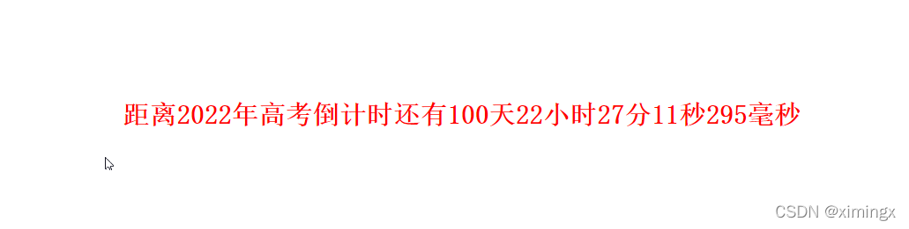

# 内置对象（四）：Math、Date、Set、JSON 与 Null

> 本文件是《JavaScript 笔记》第 5 部分，[⬆ 返回总目录](./0. JavaScript（总目录）.md)

# Math

## 内置对象：Math

Math 是 JavaScript 的内置对象，提供**数学计算**相关的常量与方法。与 Date 不同，**Math 不是构造函数，不需要实例化**，直接通过 `Math.方法名()` 调用即可。

## Math 的常用属性（常量）

| 属性 | 值 | 说明 |
| --- | --- | --- |
| `Math.PI` | 3.14159… | 圆周率 π |
| `Math.E` | 2.71828… | 自然对数的底数 e |

## Math 的常用方法

### 1. 取整相关

| 方法 | 说明 | 示例 |
| --- | --- | --- |
| `Math.ceil(x)` | 向上取整（天花板） | `Math.ceil(2.1)` → 3 |
| `Math.floor(x)` | 向下取整（地板） | `Math.floor(2.9)` → 2 |
| `Math.round(x)` | 四舍五入 | `Math.round(2.5)` → 3 |
| `Math.trunc(x)` | 直接截断小数部分（ES6 新增） | `Math.trunc(2.9)` → 2 |

代码举例：

```js
console.log(Math.ceil(2.1));  // 3
console.log(Math.floor(2.9)); // 2
console.log(Math.round(2.5)); // 3
console.log(Math.trunc(2.9)); // 2
```

### 2. 最值

| 方法 | 说明 | 示例 |
| --- | --- | --- |
| `Math.max(a, b, ...)` | 取最大值 | `Math.max(1, 5, 3)` → 5 |
| `Math.min(a, b, ...)` | 取最小值 | `Math.min(1, 5, 3)` → 1 |

### 3. 幂、开方与绝对值

| 方法 | 说明 | 示例 |
| --- | --- | --- |
| `Math.pow(x, y)` | x 的 y 次幂 | `Math.pow(2, 10)` → 1024 |
| `Math.sqrt(x)` | 平方根 | `Math.sqrt(9)` → 3 |
| `Math.abs(x)` | 绝对值 | `Math.abs(-5)` → 5 |

### 4. 随机数

- `Math.random()`：返回 **[0, 1)** 之间的随机小数（包含 0，不包含 1）。

代码举例：生成 [min, max] 之间的随机整数：

```js
function getRandomInt(min, max) {
  return Math.floor(Math.random() * (max - min + 1)) + min;
}
console.log(getRandomInt(1, 10)); // 1~10 之间的随机整数
```

> 其他常用方法：`Math.sin()` / `Math.cos()` / `Math.tan()`（三角函数）、`Math.log()`（自然对数）、`Math.sign(x)`（返回数字的符号：-1 / 0 / 1，ES6 新增）、`Math.hypot()`（平方和的平方根）等。

---

# Date

## 内置对象：Date


内置对象 Date 用来处理日期和时间。

**需要注意的是**：与 Math 对象不同，Date 对象是一个**构造函数** ，需要**先实例化**后才能使用。

## 创建Date对象

创建Date对象有两种写法：

- 写法一：如果Date()不写参数，就返回当前时间对象

- 写法二：如果Date()里面写参数，就返回括号里输入的时间对象

### 写法一：不传递参数时，则获取系统的当前时间对象

代码举例：

```javascript
var date1 = new Date();console.log(date1);console.log(typeof date1);
```

代码解释：不传递参数时，表示的是获取系统的当前时间对象。也可以理解成是：获取当前代码执行的时间。

打印结果： (node 执行环境)

> 2022年,3月,5日

```bash
2022-03-05T02:19:02.682Zobject
```

打印结果： (浏览器执行环境)

```bash
Sat Mar 05 2022 10:21:22 GMT+0800 (中国标准时间)VM102:3 object
```

### 写法二：传递参数

传递参数时，表示获取指定时间的时间对象。**参数中既可以传递字符串，也可以传递数字，也可以传递时间戳。**

通过传参的这种写法，我们可以把时间字符串/时间数字/时间戳，按照指定的格式，转换为时间对象。

**举例1：（参数是字符串）**

```js
const date11 = new Date('2020/02/17 21:00:00');
console.log(date11); // Mon Feb 17 2020 21:00:00 GMT+0800 (中国标准时间)
const date12 = new Date('2020/04/19'); // 返回的就是四月
console.log(date12); // Sun Apr 19 2020 00:00:00 GMT+0800 (中国标准时间)
const date13 = new Date('2020-05-20');
console.log(date13); // Wed May 20 2020 08:00:00 GMT+0800 (中国标准时间)
const date14 = new Date('Wed Jan 27 2017 12:00:00 GMT+0800 (中国标准时间)');
console.log(date14); // Fri Jan 27 2017 12:00:00 GMT+0800 (中国标准时间)
```


举例2：（参数是多个数字）

```js
const date21 = new Date(2020, 2, 18); // 注意，第二个参数返回的是三月，不是二月
console.log(date21); // Wed Mar 18 2020 00:00:00 GMT+0800 (中国标准时间)
const date22 = new Date(2020, 3, 18, 22, 59, 58);
console.log(date22); // Sat Apr 18 2020 22:59:58 GMT+0800 (中国标准时间)
const params = [2020, 06, 12, 16, 20, 59];
const date23 = new Date(...params);
console.log(date23); // Sun Jul 12 2020 16:20:59 GMT+0800 (中国标准时间)
```


举例3：（参数是时间戳）

```js
const date31 = new Date(1591950413388);
console.log(date31); // Fri Jun 12 2020 16:26:53 GMT+0800 (中国标准时间)
// 先把时间对象转换成时间戳，然后把时间戳转换成时间对象
const timestamp = new Date().getTime();
const date32 = new Date(timestamp);
console.log(date32); // Fri Jun 12 2020 16:28:21 GMT+0800 (中国标准时间)
```


## 日期的格式化

上一段内容里，我们获取到了 Date **对象**，但这个对象，打印出来的结果并不是特别直观。

如果我们需要获取日期的**指定部分**，就需要用到 Date对象自带的方法。

获取了日期指定的部分之后，我们就可以让日期按照指定的格式，进行展示（即日期的格式化）。比如说，我期望能以 `2020-02-02 19:30:59` 这种格式进行展示。

在这之前，我们先来看看 Date 对象有哪些方法。

## Date对象的方法

Date对象 有如下方法，可以获取日期和时间的**指定部分**：

| 方法名            | 含义              | 备注                 |
| ----------------- | ----------------- | -------------------- |
| getFullYear()     | 获取年份          |                      |
| getMonth()        | **获取月： 0-11** | 0代表一月            |
| getDate()         | **获取日：1-31**  | 获取的是几号         |
| getDay()          | **获取星期：0-6** | 0代表周日，1代表周一 |
| getHours()        | 获取小时：0-23    |                      |
| getMinutes()      | 获取分钟：0-59    |                      |
| getSeconds()      | 获取秒：0-59      |                      |
| getMilliseconds() | 获取毫秒          | 1s = 1000ms          |


**代码举例**：

## 一些关于 Date 方法的测试

```js
const date = new Date();

console.log(new Date);   // 2021-12-05T11:11:42.652Z
console.log(+new Date);  // 1638702702658
// + 运算符（一元数值运算符）会将表达式转换为数字，从而拿到当前时间戳

// -----------------------------------------------------------------------
/* 获取时间 */
// 注意：getYear() / setYear() 已被废弃，请用 getFullYear() / setFullYear() 代替
console.log(date.getFullYear());     // 获取完整年份（4 位，1970-????）
console.log(date.getMonth());        // 获取月份（0-11，0 代表 1 月）
console.log(date.getDate());         // 获取日期（1-31）
console.log(date.getDay());          // 获取星期（0-6，0 代表星期天）
console.log(date.getTime());         // 获取时间戳（从 1970.1.1 开始的毫秒数）
console.log(date.getHours());        // 获取小时（0-23）
console.log(date.getMinutes());      // 获取分钟（0-59）
console.log(date.getSeconds());      // 获取秒（0-59）
console.log(date.getMilliseconds()); // 获取毫秒（0-999）
console.log(date.toLocaleDateString()); // 获取当前日期  2021/12/5
console.log(date.toLocaleTimeString()); // 获取当前时间  下午7:11:42
console.log(date.toLocaleString());     // 获取日期与时间 2021/12/5 下午7:11:42

// -----------------------------------------------------------------------
/* 修改时间（会直接修改原 date 对象） */
date.setTime(14);       // 设置时间戳（单位：毫秒），不是"设置时"
date.setFullYear(2023); // 设置年（用 setFullYear，不要用已废弃的 setYear）
date.setMonth(1);       // 设置月（0-11，此处的 1 表示二月）
date.setDate(20);       // 设置日（1-31，日期从 1 开始计，不是从 0 开始）
date.setHours(11);      // 设置小时
date.setMinutes(56);    // 设置分
date.setSeconds(36);    // 设置秒

console.log(date.getFullYear());     // 2023
console.log(date.getMonth());        // 1
console.log(date.getDate());         // 20
console.log(date.getDay());          // 1
console.log(date.getMilliseconds()); // 14（由 setTime(14) 留下来的毫秒位）
console.log(date.toLocaleString());  // 2023/2/20 上午11:56:36
```


```javascript
// 我在执行这行代码时，当前时间为 2019年2月4日，周一，13:23:52
var myDate = new Date();
console.log(myDate); // 打印结果：Mon Feb 04 2019 13:23:52 GMT+0800 (中国标准时间)
console.log(myDate.getFullYear()); // 打印结果：2019
console.log(myDate.getMonth() + 1); // 打印结果：2
console.log(myDate.getDate()); // 打印结果：4
var dayArr = ['星期日', '星期一', '星期二', '星期三', '星期四', '星期五', '星期六'];
console.log(myDate.getDay()); // 打印结果：1
console.log(dayArr[myDate.getDay()]); // 打印结果：星期一
console.log(myDate.getHours()); // 打印结果：13
console.log(myDate.getMinutes()); // 打印结果：23
console.log(myDate.getSeconds()); // 打印结果：52
console.log(myDate.getMilliseconds()); // 打印结果：393
console.log(myDate.getTime()); // 获取时间戳。打印结果：1549257832393
```

获取了日期和时间的指定部分之后，我们把它们用字符串拼接起来，就可以按照自己想要的格式，来展示日期。

## 举例：年月日的格式化

代码举例：

```js
console.log(formatDate());
/*
  方法：日期格式化。
  格式要求：今年是：2020年02月02日 08:57:09 星期日
*/
function formatDate() {
  var date = new Date();
  var year = date.getFullYear(); // 年
  var month = date.getMonth() + 1; // 月
  var day = date.getDate(); // 日
  var week = date.getDay(); // 星期几
  var weekArr = ['星期日', '星期一', '星期二', '星期三', '星期四', '星期五', '星期六'];
  var hour = date.getHours(); // 时
  hour = hour < 10 ? '0' + hour : hour; // 如果只有一位，则前面补零
  var minute = date.getMinutes(); // 分
  minute = minute < 10 ? '0' + minute : minute; // 如果只有一位，则前面补零
  var second = date.getSeconds(); // 秒
  second = second < 10 ? '0' + second : second; // 如果只有一位，则前面补零
  var result = '今天是：' + year + '年' + month + '月' + day + '日 ' + hour + ':' + minute + ':' + second + ' ' + weekArr[week];
  return result;
}
```


## 获取时间戳


**时间戳**：指的是从格林威治标准时间的`1970年1月1日，0时0分0秒`到当前日期所花费的**毫秒数**（1秒 = 1000毫秒）。

计算机底层在保存时间时，使用的都是时间戳。时间戳的存在，就是为了**统一**时间的单位。

我们经常会利用时间戳来计算时间，因为它更精确。而且，在实战开发中，接口返回给前端的日期数据，都是以时间戳的形式。

我们再来看下面这样的代码：

```javascript
var myDate = new Date("1970/01/01 0:0:0");
console.log(myDate.getTime()); // 获取时间戳
```

打印结果（可能会让你感到惊讶）

```javascript
	-28800000
```

为啥打印结果是`-28800000`，而不是`0`呢？这是因为，我们的当前代码，是在中文环境下运行的，与英文时间会存在**8个小时的时差**（中文时间比英文时间早了八个小时）。如果代码是在英文环境下运行，打印结果就是`0`。


## getTime()：获取时间戳

`getTime()`  获取日期对象的**时间戳**（单位：毫秒）。这个方法在实战开发中，用得比较多。但还有比它更常用的写法，我们往下看。


## 获取 Date 对象的时间戳

代码演示：

```js
// 方式一：获取 Date 对象的时间戳（最常用的写法）
const timestamp1 = +new Date();
console.log(timestamp1); // 打印结果举例：1589448165370
// 方式二：获取 Date 对象的时间戳（较常用的写法）
const timestamp2 = new Date().getTime();
console.log(timestamp2); // 打印结果举例：1589448165370
// 方式三：获取 Date 对象的时间戳
const timestamp3 = new Date().valueOf();
console.log(timestamp3); // 打印结果举例：1589448165370
// 方式四：获取 Date 对象的时间戳
const timestamp4 = new Date() * 1;
console.log(timestamp4); // 打印结果举例：1589448165370
// 方式五：获取 Date 对象的时间戳
const timestamp5 = Number(new Date());
console.log(timestamp5); // 打印结果举例：1589448165370
```

上面这五种写法都可以获取任意 Date 对象的时间戳，最常见的写法是**方式一**，其次是方式二。

根据前面所讲的关于「时间戳」的概念，上方代码获取到的时间戳指的是：从 `1970年1月1日，0时0分0秒` 到现在所花费的总毫秒数。

## 获取当前时间的时间戳

如果我们要获取**当前时间**的时间戳，除了上面的几种方式之外，还有另一种方式。代码如下：

```js
// 方式六：获取当前时间的时间戳（很常用的写法）console.log(Date.now()); // 打印结果举例：1589448165370
```

上面这种方式六，用得也很多。`Date.now()` 是 ES5 中新增的特性，如今所有现代浏览器（含 IE9+）均已支持，可以直接使用。


## 利用时间戳检测代码的执行时间

我们可以在业务代码的前面定义 `时间戳1`，在业务代码的后面定义 `时间戳2`。把这两个时间戳相减，就能得出业务代码的执行时间。

## 举例1：模拟日历

要求每天打开这个页面，都能定时显示当前的日期。

代码实现：

```html
<!DOCTYPE html>
<html>
    <head lang="en">
        <meta charset="UTF-8" />
        <title></title>
        <style>
            div {
                width: 800px;
                margin: 200px auto;
                color: red;
                text-align: center;
                font: 600 30px/30px 'simsun';
            }
        </style>
    </head>
    <body>
        <div></div>
        <script>
            // 模拟日历
            // 需求：每天打开这个页面都能定时显示年月日和星期几
            function getCurrentDate() {
                // 1.创建一个当前日期的日期对象
                const date = new Date();
                // 2.然后获取其中的年、月、日和星期
                const year = date.getFullYear();
                const month = date.getMonth();
                const hao = date.getDate();
                const week = date.getDay();
                // console.log(year + " " + month + " " + hao + " " + week);
                // 3.赋值给 div
                const arr = ['星期日', '星期一', '星期二', '星期三', '星期四', '星期五', '星期六'];
                const div = document.getElementsByTagName('div')[0];
                return '今天是：' + year + '年' + (month + 1) + '月' + hao + '日 ' + arr[week];
            }
            const div = document.getElementsByTagName('div')[0];
            div.innerText = getCurrentDate();
        </script>
    </body>
</html>
```


## 举例2：倒计时

实现思路：

- 设置一个定时器，每间隔1毫秒就自动刷新一次div的内容。

- 核心算法：输入的时间戳减去当前的时间戳，就是剩余时间（即倒计时），然后转换成时分秒。

代码实现：

```html
<!DOCTYPE html>
<html>
    <head lang="en">
        <meta charset="UTF-8" />
        <title></title>
        <style>
            div {
                width: 1210px;
                margin: 200px auto;
                color: red;
                text-align: center;
                font: 600 30px/30px 'simsun';
            }
        </style>
    </head>
    <body>
        <div></div>
        <script>
            var div = document.getElementsByTagName('div')[0];
            var timer = setInterval(() => {
                countDown('2022/06/07 09:00:00');
            }, 1);
            function countDown(myTime) {
                var nowTime = new Date();
                var future = new Date(myTime);
                var timeSum = future.getTime() - nowTime.getTime(); // 获取时间差：发布会时间减去此刻的毫秒值
                var day = parseInt(timeSum / 1000 / 60 / 60 / 24); // 天
                var hour = parseInt((timeSum / 1000 / 60 / 60) % 24); // 时
                var minu = parseInt((timeSum / 1000 / 60) % 60); // 分
                var sec = parseInt((timeSum / 1000) % 60); // 秒
                var millsec = parseInt(timeSum % 1000); // 毫秒
                // 细节处理：所有的时间小于 10 的时候，在前面自动补 0，毫秒值要补双 0（比如，把 8 秒改成 08 秒）
                day = day < 10 ? '0' + day : day; // day 小于 10 吗？如果小于，就补 0；如果不小于，就是 day 本身
                hour = hour < 10 ? '0' + hour : hour;
                minu = minu < 10 ? '0' + minu : minu;
                sec = sec < 10 ? '0' + sec : sec;
                if (millsec < 10) {
                    millsec = '00' + millsec;
                } else if (millsec < 100) {
                    millsec = '0' + millsec;
                }
                // 兜底处理
                if (timeSum < 0) {
                    div.innerHTML = '祝你未来可期';
                    clearInterval(timer);
                    return;
                }
                // 前端要显示的文案
                div.innerHTML = day + '天' + hour + '小时' + minu + '分' + sec + '秒' + millsec + '毫秒';
            }
        </script>
    </body>
</html>
```



---

# Set

ES6 提供了 新的数据结构 Set。Set 类似于**数组**，但成员的值都是**唯一**的，没有重复的值。可以轻松实现去重的功能。

Set 的应用有很多。比如，在 H5 页面的搜索功能里，用户可能会多次搜索重复的关键字；但是在数据存储上，不需要存储重复的关键字。此时，我们就可以用 Set 来存储用户的搜索记录，Set 内部会自动判断值是否重复，如果重复，则不会进行存储，十分方便。

## 生成 Set 数据结构

Set 本身就是一个构造函数，可通过 `new Set()` 生成一个 Set 的实例。

举例 1：

```js
const set1 = new Set();console.log(set1.size); // 打印结果：0
```

**举例 2**、可以接收一个**数组**作为参数，实现**数组去重**：

```js
const set2 = new Set(['张三', '李四', '王五', '张三']); // 注意，这个数组里有重复的值
// 注意，这里的 set2 并不是数组，而是一个单纯的 Set 数据结构
// 是一种对象的形式
console.log(set2); // {"张三", "李四", "王五"}
// 通过 ... 扩展运算符，拿到 set 中的元素（用逗号分隔的序列）
// ...set2 // "张三", "李四", "王五"
// 注意，到这一步，才获取到了真正的数组
console.log([...set2]); // ["张三", "李四", "王五"]
```

注意上方的第一行代码，虽然参数里传递的是数组结构，但拿到的 `set2` 不是数组结构，而是 Set 结构，而且里面元素是去重了的。通过 `[...set2]`就可以拿到`set2`对应的数组。

## 删除元素

```js
// 伪代码：set.delete(item)
```

## 添加元素

```js
set.add(item)
```

## 判断是否存在元素

```js
set.has(item) // 返回 true or false
```

## size 属性获取 set 的长度

```js
set.size
```

---

# JSON

一般我们可以在本地存储使用

1、js对象(数组) --> json对象(数组)：

```javascript
	JSON.stringify(obj/arr)
```

2、json对象(数组) --> js对象(数组)：


```javascript
	JSON.parse(json)
```


上面这两个方法是ES5中提供的。

我们要记住，我们通常说的“json字符串”，只有两种：**json对象、json数组**。

`typeof json字符串`的返回结果是string。

---

# Null 与 Undefined

## Null：空对象

null 专门用来定义一个**空对象**。例如：`let a = null`，又例如 `Object.create(null)`.

如果你想定义一个变量用来保存引用类型，但是还没想好放什么内容，这个时候，可以在初始化时将其设置为 null。你可以把 null 理解为：**null 虽然是一个单独的数据类型，但null 相当于是一个 object，只不过地址为空（空指针）而已**。

比如：

```js
let myObj = null;console.log(typeof myObj); // 打印结果：object
```

补充：

-   Null 类型的值只有一个，就是 null。比如 `let a = null`。

-   使用 typeof 检查一个 null 值时，会返回 object。

## undefined：未定义类型

### case1：变量已声明，未赋值时

**声明**了一个变量，但没有**赋值**，此时它的值就是 `undefined`。举例：

```js
let name;console.log(name); // 打印结果：undefinedconsole.log(typeof name); // 打印结果：undefined
```

补充：

-   Undefined 类型的值只有一个，就是 undefined。比如 `let a = undefined`。

-   使用 typeof 检查一个 undefined 值时，会返回 undefined。

### case2：变量未声明（未定义）时

如果你从未声明一个变量，就去使用它，则会报错（这个大家都知道）；此时，如果用 `typeof` 检查这个变量时，会返回 `undefined`。举例：

```js
console.log(typeof a); // undefinedconsole.log(a); // 打印结果：Uncaught ReferenceError: a is not defined
```

### case3：函数无返回值时

如果一个函数没有返回值，那么，这个函数的返回值就是 undefined。

或者，也可以这样理解：在定义一个函数时，如果末尾没有 return 语句，那么，其实就是 `return undefined`。

举例：

```js
function foo() {}console.log(foo()); // 打印结果：undefined
```

### case4：调用函数时，未传参

调用函数时，如果没有传参，那么，这个参数的值就是 undefined。

举例：

```js
function foo(name) {    console.log(name);}foo(); // 调用函数时，未传参。执行函数后的打印结果：undefined
```

实际开发中，如果调用函数时没有传参，我们可以根据需要给形参设置一个默认值：

```js
function foo(name) {    name = name || 'qianguyihao';}foo();
```

等学习了 ES6 之后，上方代码也可以这样写：

```js
function foo(name = 'qianguyihao') {}foo();
```

## 其他区别

null 和 undefined 有很大的相似性。看看 `null == undefined` 的结果为 `true` 也更加能说明这点。

但是 `null === undefined` 的结果是 false。它们虽然相似，但还是有区别的，其中一个区别是，和数字运算时：

-   10 + null 结果为 10。

-   10 + undefined 结果为 NaN。

规律总结：

- **数值运算**中，null 会被看做 0（`10 + null = 10`）。
- 数值运算中，只要有 undefined 参与，结果就是 NaN（`10 + undefined = NaN`）。
- 注意：如果是字符串拼接（`+` 且有一方是字符串），则不适用上述规律，如 `'a' + null` 得到 `'anull'`。

---

[⬆ 返回总目录](./0. JavaScript（总目录）.md)
