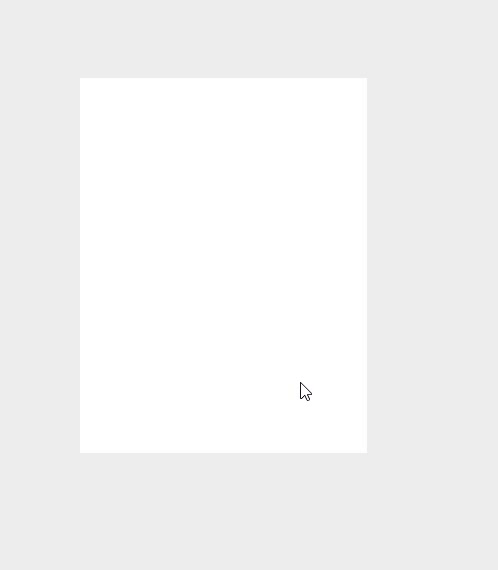
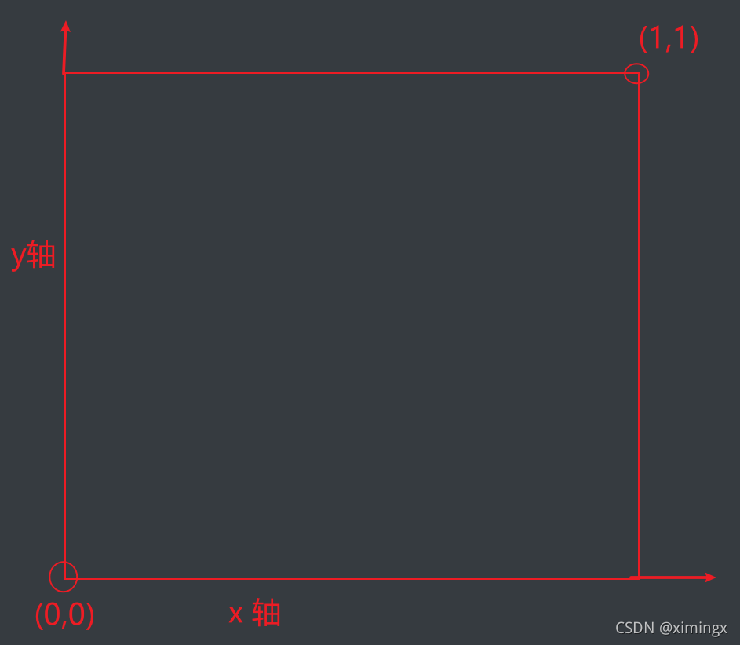
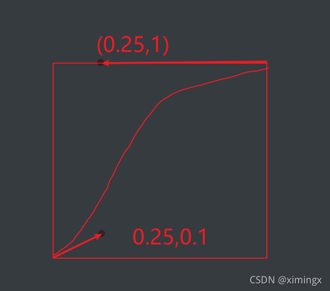
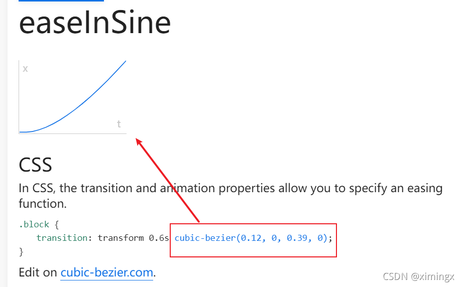
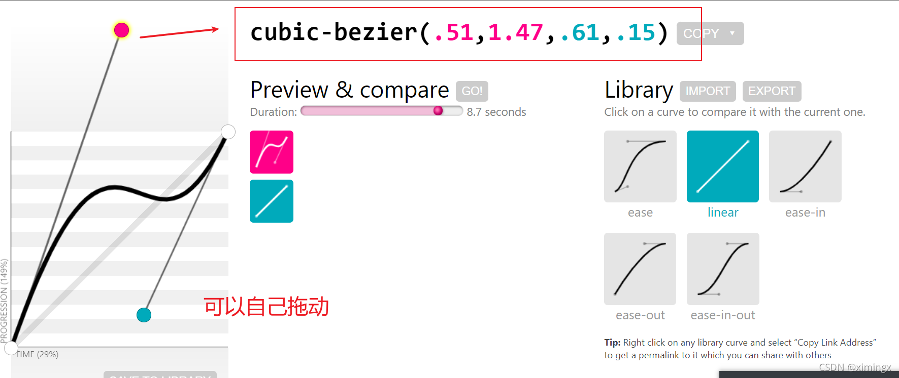

# CSS 动画：transition、transform 与 animation

> 本文件是《JavaScript 笔记》第 6 部分，[⬆ 返回总目录](./0. JavaScript（总目录）.md)

# transition

animation 的学习之前 其实需要顺便提一下 transition 

首先强调一下我认为他最大的不足

1.   过渡只关心元素的初始状态和结束状态，没有方法可以获取到元素在过渡中每一帧的状态

下面介绍一下他的四个属性以及简写

## 1.2 transition-property

**不是所有属性都能过渡，只有属性具有一个中间点值才具备过渡效果 !!!**

用于指定应用过渡的属性名称，可以指定多个属性名称，多个属性名称之间用`,` 分隔。

默认值为 `all` 也就是所有的元素都应用过渡效果。

```html
<template><div id="test"></div></template>
<script>
    export default { name: 'Test' };
</script>
<style scoped>
    div {
        width: 200px;
        height: 200px;
        background-color: dodgerblue;
        transition-property: width, height;
    }
    div:hover {
        width: 400px;
        height: 400px;
    }
</style>
```


当鼠标悬浮上去的时候 , 他会立即变成这个样子,**过渡效果不会生效。因为没有设置 transition-duration 属性**,他会立即变成最后的结果


## 1.3 transition-duration

用于设置过渡的持续时间，属性值以秒`s`或毫秒`ms`为单位，默认值为0 , 为0时，表示变化是瞬时的，看不到过渡效果。

多个每个时长会被应用到由 `transition-property` 指定的对应属性上。

**如果指定的时长个数小于属性个数，那么时长列表会重复.如果时长列表更长，那么该列表会被裁减。**

## 1.4 transition-timing-function

>   liner
>   ease-in
>   ease-out
>   ease-in-out
>   cubic-bezier

这里先提一下,下面 animation 里会有具体的解释

## 1.5 transition-delay

`transition-delay` 规定了在过渡效果开始作用之前需要等待的时间（延迟时间），值以秒（s）或毫秒（ms）为单位，表明动画过渡效果将在何时开始

**取值为正时会延迟一段时间来响应过渡效果；取值为负时会导致过渡立即开始。**

一个完整的案例

```css
div {
    width: 200px;
    height: 200px;
    background-color: #000000;
    transition-property: width;
    transition-duration: 3s;
    transition-timing-function: linear;
    transition-delay: 0.5s;
}
div:hover {
    width: 400px;
}
```

## 1.6 简写属性

```css
transition: 过渡属性 过渡所需要时间 过渡动画函数 过渡延迟时间；
```

## 1.7 transition 的不足

**transition的优点在于简单易用，但是它有几个很大的局限。**
（1）transition需要事件的触发，所以没法在网页加载时自动发生。
（2）transition是一次性的，不能重复发生，除非一再触发。
（3）transition只能定义开始状态和结束状态，不能定义中间状态，也就是说只有两个状态。
（4）一条 transition 规则，**可以通过逗号同时定义多个属性的变化**（如 `transition: width 1s, height 2s;`）；它的真正局限是一条规则只能定义"开始态 → 结束态"这一种过渡，无法描述中间过程。
CSS Animation就是为了解决这些问题而提出的,完美的解决了这些问题

## 1.8 一个简单的样式

```html
<!DOCTYPE html>
<html lang="en">
    <head>
        <meta charset="UTF-8" />
        <title>CSS 过渡</title>
        <style>
            body {
                margin: 0;
                padding: 0;
                background-color: #eeeeee;
            }
            .content {
                width: 800px;
                height: 320px;
                padding-left: 20px;
                margin: 80px auto;
            }
            .item {
                width: 230px;
                height: 300px;
                text-align: center;
                margin-right: 20px;
                background-color: #fff;
                float: left;
                position: relative;
                top: 0;
                overflow: hidden; /* 让溢出的内容隐藏起来。意思是让下方的橙色方形先躲起来 */
                transition: all 0.5s; /* 从最初到鼠标悬停时的过渡 */
            }
            .item .desc {
                position: absolute;
                left: 0;
                bottom: -80px;
                width: 100%;
                height: 80px;
                background-color: #ff6700;
                transition: all 0.5s;
            } /* 鼠标悬停时，让 item 整体往上移动5px，且加一点阴影 */
            .item:hover {
                top: -5px;
                box-shadow: 0 0 15px #aaa;
            } /* 鼠标悬停时，让下方的橙色方形现身 */
            .item:hover .desc {
                bottom: 0;
            }
        </style>
    </head>
    <body>
        <div class="content">
            <div class="item"><span class="desc"></span></div>
        </div>
    </body>
</html>
```



---

# 2D 转换 (transform)

**转换**是 CSS3 中具有颠覆性的一个特征，可以实现元素的**位移、旋转、变形、缩放**，甚至支持矩阵方式。

转换再配合过渡和动画，可以取代大量早期只能靠 Flash 才可以实现的效果。

在 CSS3 当中，通过 `transform` 转换来实现 2D 转换或者 3D 转换。

- 2D转换包括：缩放、移动、旋转。

## 2.1 缩放：`scale`

格式：

```css
/* transform: scale(x, y); */
/* transform: scale(2, 0.5); */
```

参数解释： x：表示水平方向的缩放倍数。y：表示垂直方向的缩放倍数。如果只写一个值就是等比例缩放。

取值：大于1表示放大，小于1表示缩小。不能为百分比。

## 2.2 位移：translate

格式：


```css
/* transform: translate(水平位移, 垂直位移); */
/* transform: translate(-50%, -50%); */
```

参数解释：

- 参数为百分比，相对于自身移动。

- 正值：向右和向下。 负值：向左和向上。如果只写一个值，则表示水平移动。

## 2.3 旋转：rotate

格式：

```css
/* transform: rotate(角度); */
/* transform: rotate(45deg); */
```

参数解释：正值 顺时针；负值：逆时针。

rotate 旋转时，默认是以盒子的正中心为坐标原点的。如果想**改变旋转的坐标原点**，可以用`transform-origin`属性。格式如下：


```css
/* transform-origin: 水平坐标 垂直坐标; */
/* transform-origin: 50px 50px; */
/* transform-origin: center bottom; // 旋转时，以盒子底部的中心为坐标原点 */
```

---

# 3D 转换

## 3.1 旋转：rotateX、rotateY、rotateZ

**3D坐标系（左手坐标系）**

**浏览器的这个平面，是X轴、Y轴；垂直于浏览器的平面，是Z轴。**

从上面这句话，我们也能看出：所有的3d旋转，对着正方向去看，都是顺时针旋转。

**格式：**

```css
/* transform: rotateX(360deg); // 绕 X 轴旋转 360 度 */
/* transform: rotateY(360deg); // 绕 Y 轴旋转 360 度 */
/* transform: rotateZ(360deg); // 绕 Z 轴旋转 360 度 */
```

## 3.2 移动：translateX、translateY、translateZ

**格式：**

```css
/* transform: translateX(100px); // 沿着 X 轴移动 */
/* transform: translateY(360px); // 沿着 Y 轴移动 */
/* transform: translateZ(360px); // 沿着 Z 轴移动 */
```

## 3.3 透视：perspective

电脑显示屏是一个 2D 平面，图像之所以具有立体感（3D效果），其实只是一种视觉呈现，通过透视可以实现此目的。

透视可以将一个2D平面，在转换的过程当中，呈现3D效果。但仅仅只是视觉呈现出 3d 效果，并不是正真的3d。

格式有两种写法：

- 作为一个属性，设置给父元素，作用于所有3D转换的子元素

- 作为 transform 属性的一个值，做用于元素自身。

格式举例：

```css
perspective: 500px;
```

---

# animation

**CSS3的animation属性可以像Flash制作动画一样，通过控制关键帧来控制动画的每一步**，实现更为复杂的动画效果。ainimation实现动画效果主要由两部分组成：

制作动画分为两步：

1.  定义动画 @keyframes
2.  使用(调用)

## 4.1 定义动画

### @keyframes(关键帧) 用于 定义动画

```css
@keyframes animation01 {    0% {        margin-top: 10px;    }    100% {        margin-top: 20px;    }}
```

0%是动画的开始，100%是动画的完成。**中间可以插入任意百分比**
在 @keyframes 中规定某项CSS样式，就能创建由当前样式逐渐改为新样式的动画效果
**可以改变任意多的样式任意多的次数。**
或用关键词"from"和"to",等同于0%和100%

两者等同

```css
@keyframes animation01 {    from {        margin-top: 10px;    }    to {        margin-top: 20px;    }}
```

**部分属性是不可以发生改变的,因为 “不连续”,属性间的变换没有中间值**

## 4.2 调用动画

要调用动画,必须要得给他添加一些必要的属性: 

### 时间函数（animation-timing-function）

animation-timing-function 属性定义了动画的播放速度曲线。

|                               |                                                              |
| :---------------------------: | :----------------------------------------------------------: |
|              值               |                             描述                             |
|            linear             |                 动画从头到尾的速度是相同的。                 |
|             ease              |        默认。动画以低速开始，然后加快，在结束前变慢。        |
|            ease-in            |                       动画以低速开始。                       |
|           ease-out            |                       动画以低速结束。                       |
|          ease-in-out          |                    动画以低速开始和结束。                    |
|             steps             |              指定了时间函数中的间隔数量（步长）              |
| cubic-bezier(*n*,*n*,*n*,*n*) | 在 cubic-bezier 函数中自己的值。可能的值是从 0 到 1 的数值。 |

默认值，如果没有显示写调用的函数，则默认为ease。

**cubic-bezier(*n*,*n*,*n*,*n*)  是生成速度曲线的函数**  





从上图中我们可以看到，cubic-bezier有四个点：
两个默认的，即：P0(0,0)，P3(1,1)；
**两个控制点，即 cubic-bezier 函数中传递的四个值,分别依次带入 P1(x1,y1)，P2(x2,y2)**
注：X轴的范围是0~1，超出cubic-bezier将失效，Y轴的取值没有规定，但是也不宜过大。
**我们只要调整两个控制点P1和P2的坐标，最后形成的曲线就是动画曲线。**

举例 cubic-bezier(0.25,0.1,0.25,1)




画的丑,下面不手画了

给大家一个地址: https://easings.net/

可以自己去看看 cubic-bezier( ) 函数的演示




and cubic-bezier 可以自己随心所欲地绘制 cubic-bezier( ) 函数

https://cubic-bezier.com/##.17,.67,.83,.67




**而 steps 会一卡一卡的 生成我们的动画**

---

### 动画方向（animation-direction）

animation-direction: normal 正序播放  起点=>终点
animation-direction: reverse 倒序播放  终点=>起点
animation-direction: alternate 交替播放  
animation-direction: alternate-reverse 反向交替播放  

---

### 动画延迟（animation-delay）

animation-delay属性定义动画是从何时开始播放，即动画应用在元素上的到动画开始的这段时间的长度。默认值0s，表示动画在该元素上后立即开始执行。该值以秒(s)或者毫秒(ms)为单位。

---


### 动画迭代次数（animation-iteration-count）

animation-iteration-count该属性就是定义我们的动画播放的次数。次数可以是1次或者无限循环。默认值只播放一次。

single-animation-iteration-count = infinite | number


---


### 动画填充模式（animation-fill-mode）

animation-fill-mode是指给定动画播放前后应用元素的样式。

single-animation-fill-mode = none | forwards | backwards | both

animation-fill-mode: none 动画执行前后不改变任何样式
animation-fill-mode: forwards 保持目标动画最后一帧的样式
animation-fill-mode: backwards 保持目标动画第一帧的样式
animation-fill-mode: both 动画将会执行 forwards 和 backwards 执行的动作。


---


### 动画播放状态（animation-play-state）

animation-play-state: 定义动画是否运行或者暂停。可以确定查询它来确定动画是否运行。默认值为running

animation-play-state = running | paused

running 动画正常播放
paused 动画暂停播放


---


### 简写

```css
animation:动画名称 持续时间 运动曲线 何时开始 播放次数 是否反方向 动画起始或者结束的状态;
```

但是需要注意: 简写属性里面不包含 **animation- play-state**

## 5.1 按钮抖动动画

```html
<template>
  <div :class="{ shake: disabled }">
    <button @click="warnDisabled">Click me</button>
    <span v-if="disabled">This feature is disabled!</span>
  </div>
</template>
<script>
export default {
  name: 'ShakeButton',
  data() {
    return {
      disabled: false,
    };
  },
  methods: {
    warnDisabled() {
      this.disabled = true;
      setTimeout(() => {
        this.disabled = false;
      }, 1500);
    },
  },
};
</script>
<style>
.shake {
  animation: shake 0.82s cubic-bezier(0.36, 0.07, 0.19, 0.97) both;
  transform: translate3d(0, 0, 0);
}
@keyframes shake {
  10%,
  90% {
    transform: translate3d(-1px, 0, 0);
  }
  20%,
  80% {
    transform: translate3d(2px, 0, 0);
  }
  30%,
  50%,
  70% {
    transform: translate3d(-4px, 0, 0);
  }
  40%,
  60% {
    transform: translate3d(4px, 0, 0);
  }
}
</style>
```

## 5.2 背景颜色随鼠标渐变

[演示地址](http://ximingx.com/TransitionColor22_3_24/index.html)

```html
<template>
  <div
    @mousemove="onMousemove"
    :style="{ backgroundColor: `hsl(${x}, 80%, 50%)` }"
    class="movearea"
  >
    <p>Move your mouse across this div...</p>
    <p>x: {{ x }}</p>
  </div>
</template>
<script>
export default {
  name: 'ShakeButton',
  data() {
    return {
      x: 0,
    };
  },
  methods: {
    onMousemove(e) {
      this.x = e.clientX;
    },
  },
};
</script>
<style>
* {
  padding: 0;
  margin: 0;
}
.movearea {
  width: 100vw;
  height: 100vh;
  transition: 0.3s background-color ease;
}
</style>
```

---

[⬆ 返回总目录](./0. JavaScript（总目录）.md)
