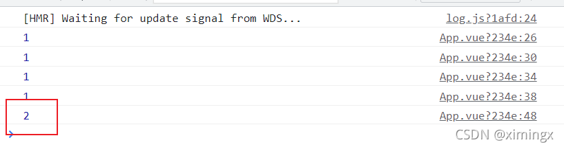
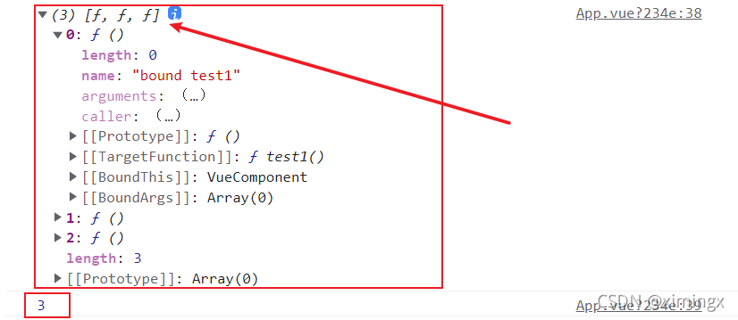

# 异步编程：Promise、async 与 EventLoop

> 本文件是《JavaScript 笔记》第 8 部分，[⬆ 返回总目录](./0. JavaScript（总目录）.md)

# promise

学习 Promise 之前我们需要了解 回调地狱

**多层回调函数的相互嵌套，就形成了回调地狱。**

回调地狱的缺点：

- 代码耦合性太强，牵一发而动全身，难以维护；
- 大量冗余的代码相互嵌套，代码的可读性变差；

---

**Promise 是异步编程的一种优雅的解决方案**，是一个构造函数，有all、reject、resolve这几个方法，原型上有then、catch等方法

## Promise 特点

（1）Promise对象里的异步操作执行时**有三种状态：pending（进行中）、fulfilled（已成功）和rejected（已失败)** ,而Promise对象状态的改变，只有两种可能：**从pending变为fulfilled或者从pending变为rejected。**

（2）而一旦上面的这种状态发生改变，之后就不会再变，任何时候都可以得到这个结果。**如果改变已经发生了，你再对Promise对象添加回调函数，也会立即得到这个结果**。

（3） Promise.prototype 上包含一个 `.then()` 方法	**每一次 new Promise() 构造函数得到的实例对象，都可以通过原型链的方式访问到 .then() 方法**, `.then()` 方法用来预先指定成功和失败的回调函数, 也可以 p.then(result => { }, error => { })；这样的方式, 调用 .then() 方法时，成功的回调函数是必选的、失败的回调函数是可选的；

（4）**new 出来的 Promise 实例对象，代表一个异步操作；**

以下案例均在 vue 的代码中演示

```js
mounted() {
  let promise1 = new Promise(function (resolve, reject) {
    // 做一些异步操作（可以是网络请求、定时器、回调函数、事件绑定）
    setTimeout(function () {
      console.log('完成异步操作');
      resolve('返回任意的数据');
      // 会在两秒之后返回打印值
    }, 2000);
  });
}
```

**这里我们 new 了一个 Promise , 在 Promise 里面执行异步操作的代码** 

可以看到,这里**只是对他进行了声明,并没有执行这一个函数**

但是从结果上看来结果 却是执行了 这个函数  ,  这里先忘记里面的  resolve('返回任意的数据');  里起了什么作用

**其执行过程是：执行了一个异步操作，也就是setTimeout，2秒后，输出“完成异步操作”，并且调用resolve方法。这里首先要明白一件事情, Promise 对象的声明会使内部的异步操作发生**

这里需要知道的是:  如果我们直接 new 一个 promise , 而没有将他放置在函数中的时候 , 他会直接执行里面的异步操作

所以我们用Promise的时候一般是包在一个函数中，在需要的时候去运行这个函数 , 这里演示一下

```js
methods: {
  test: function () {
    return new Promise(function (resolve, reject) {
      // 做一些异步操作（可以是网络请求、定时器、回调函数、事件绑定）
      setTimeout(function () {
        console.log('完成异步操作');
        resolve('返回任意的数据');
        // 会在两秒之后返回打印值
      }, 2000);
    });
  },
},
mounted() {
  this.test();
}
```

可以看到 在这里 我们直接 return 出  Promise对象 , 这将在在之后给我们非常大的便利 , **可以让我们直接链式调用它的方法**

## resolve() 的作用

先看一段代码和结果

```js
mounted() {
  let promise = new Promise(function (resolve, reject) {
    // 做一些异步操作（可以是网络请求、定时器、回调函数、事件绑定）
    setTimeout(function () {
      resolve('返回任意的数据');
      // 会在两秒之后返回打印值
    }, 2000);
  }).then((data) => {
    console.log(data);
  });
}
```


我们可以发现在之后的 .then(data) 中有一句 console.log(data)

这这里的 **data 对应的正是 resolve() 参数中返回的值** , **原来then里面的函数就跟我们平时的回调函数一个意思，能够在这个异步任务执行完成之后被执行.** 而这也这就是Promise的作用了，**用链式调用的方式执行回调函数。**

而 Promise的优势正是在于可以链式调用 , 可以在then方法中继续写Promise对象并返回，然后继续调用then来进行回调操作。

但是 + - +

```js
mounted() {
  return new Promise(function (resolve, reject) {
    if (1 < 2) {
      resolve(true);
    } else {
      console.log("error");
    }
  })
    .then((data) => {
      console.log(data);
      return new Promise(function (resolve, reject) {
        if (2 < 3) {
          resolve(true);
        } else {
          console.log("error");
        }
      });
    })
    .then((data) => {
      console.log(data);
      return new Promise(function (resolve, reject) {
        if (2 < 3) {
          resolve(true);
        } else {
          console.log("error");
        }
      }).then((data) => {
        console.log(data);
      });
    });
}
```

上面这样子的代码  是不是很丑 , 很难看懂 + - + , 而且和之前的回调地狱一样不方便读懂代码

但是实际上 不这么搞

## 我们一般采用下面的写法

```js
methods: {
  test: function () {
    return new Promise((resolve, reject) => {
      setTimeout(() => {
        resolve(1);
      }, 1000);
    });
  },
},
mounted() {
  this.test()
    .then((data) => {
      console.log(data);
      // 返回 Promise 对象，使其继续进行链式调用
      return this.test();
    })
    .then((data) => {
      console.log(data);
      return this.test();
    })
    .then((data) => {
      console.log(data);
      return this.test();
    })
    .then((data) => {
      console.log(data);
    });
}
```

这样就能够按顺序,输出每个异步回调中的内容

每次 .then 中的 return 都可以返回一个 Promise , 从而可以在之后继续链式调用  , 这样写是不是就很好看了


## reject() 的用法

**resolve 是 promise 成功执行时候的回调，它把 promise 的状态修改为 fulfilled**（注意拼写是 `fulfilled`，不是 `fullfiled`）

那么，**reject就是失败的时候的回调，他把promise的状态修改为rejected**，这样我们就可以在 .then中 捕捉到，然后执行“失败”情况的回调

```js
methods: {
  test: function () {
    return new Promise((resolve, reject) => {
      setTimeout(() => {
        resolve(1);
      }, 1000);
    });
  },
},
mounted() {
  this.test()
    .then((data) => {
      console.log(data);
      return this.test();
    })
    .then((data) => {
      console.log(data);
      return this.test();
    })
    .then((data) => {
      console.log(data);
      return this.test();
    })
    .then((data) => {
      console.log(data);
      return new Promise((resolve, reject) => {
        if (1 !== 1) {
          reject(1);
        } else {
          resolve(2);
        }
      });
    })
    .then(
      (data) => {
        console.log(data);
      },
      (info) => {
        console.log(info);
      }
    );
}
```

这里在最后一次调用 promise 返回的结果时 , 执行力 resolve(2) , 最后打印台显示的结果也是 2 ,

而且我们也可以看到 , 在then中传了两个参数，这两个参数分别是两个函数，then方法可以接受两个参数，**第一个对应resolve的回调，第二个对应reject的回调。（也就是说then方法中接受两个回调，一个成功的回调函数，一个失败的回调函数）**，所以我们能够分别拿到成功和失败传过来的数据就有以上的运行结果



接下来我们再看一下 .catch 和 直接在 .then 中传入第二个参数的区别

```js
methods: {
  test: function () {
    return new Promise((resolve, reject) => {
      setTimeout(() => {
        resolve(1);
      }, 1000);
    });
  },
},
mounted() {
  this.test()
    .then((data) => {
      console.log(data);
      return this.test();
    })
    .then((data) => {
      console.log(data);
      return this.test();
    })
    .then((data) => {
      console.log(data);
      return this.test();
    })
    .then((data) => {
      console.log(data);
      return new Promise((resolve, reject) => {
        if (1 !== 1) {
          reject(1);
        } else {
          resolve(2);
        }
      });
    })
    .then((data) => {
      console.log(data);
    })
    .catch((info) => {
      console.log(info);
    });
}
```

我们可以看到: 两次结果是一样的 , 但是我们需要明白 , 在 .then 中写第二个参数 和 用 .catch 是有区别的

.catch 除了会得到失败的结果,还会捕获异常 , 类似于一些语法的错误 , 在捕获到异常的时候 , 并不会卡死 , 而是继续执行下面的代码
**`Promise.all()` 是 Promise 上的一个静态方法（注意：它是构造函数 `Promise` 自己的方法，不是原型上的，和 `then` 不在同一层），该方法提供了并行执行异步操作的能力，并且在所有异步操作都执行完、且结果都是成功的时候，才执行回调。**

## all() 多个Promise 一起执行

```js
methods: {
  test1: function () {
    return new Promise((resolve, reject) => {
      setTimeout(() => {
        resolve(1);
      }, 1000);
    });
  },
  test2: function () {
    return new Promise((resolve, reject) => {
      setTimeout(() => {
        resolve(1);
      }, 1000);
    });
  },
  test3: function () {
    return new Promise((resolve, reject) => {
      setTimeout(() => {
        resolve(1);
      }, 1000);
    });
  },
},
mounted() {
  // 用一个数组包裹。注意：这里传的是【调用后返回的 Promise 实例】，必须带小括号
  Promise.all([this.test1(), this.test2(), this.test3()]).then((res) => {
    console.log(res);
    console.log(res.length);
  });
}
```

> **易错点**：上面必须写 `this.test1()` 而不是 `this.test1`。
> 如果只写 `this.test1`，传进去的是**函数本身**而非 Promise 实例，`Promise.all()` 会把它当成普通值（非 thenable）直接放进结果数组，于是**立刻** resolve，根本不会等待异步操作完成——链式调用看起来"能用"，但结果是错的。

这里在三个异步方法都执行完毕后 , 返回了一个数组 , 里面包含了每个方法对应的结果




Promise.all来执行多个异步操作，**all接收一个数组参数**，这组参数为需要执行异步操作的所有方法，**里面的值最终都算返回Promise对象。**

这样，**三个异步操作的并行执行的，等到它们都执行完后才会进到then里面**。

**数组中 Promise 实例的顺序，就是最终结果的顺序！**

## 除此之外还有 race 的 用法

all是等所有的异步操作都执行完了再执行then方法，那么race方法就是相反的，**谁先执行完成就先执行回调**。先执行完的不管是进行了race的成功回调还是失败回调，**其余的将不会再进入race的任何回调**

```js
methods: {
  test1: function () {
    return new Promise((resolve, reject) => {
      setTimeout(() => {
        resolve(1);
      }, 1000);
    });
  },
  test2: function () {
    return new Promise((resolve, reject) => {
      setTimeout(() => {
        resolve(1);
      }, 2000);
    });
  },
  test3: function () {
    return new Promise((resolve, reject) => {
      setTimeout(() => {
        resolve(1);
      }, 3000);
    });
  },
},
mounted() {
  // 同样要传调用后的 Promise 实例
  Promise.race([this.test1(), this.test2(), this.test3()]).then((res) => {
    console.log(res);
  });
}
```

这次只是 将 Promise.all 修改为了 Promise.race , 返回的结果中 只有最先执行结束的结果


**补充:**


```js
// Promise 用于解决回调地狱
// Promise 是一个构造函数
const fs = require('fs');
// 在 promise 容器里的函数里放置异步操作
// promise 容器一旦创建就开始执行里面的代码
new Promise(function (resolve, reject) {
  fs.readFile('./package.json', 'utf8', function (err, data) {
    if (err) {
      reject(err);
    } else {
      resolve(data);
    }
  });
})
  .then((data) => {
    console.log(data);
    // -----------------------------------------------------------------------
    new Promise(function (resolve, reject) {
      fs.readFile('./package.json', 'utf8', function (err, data) {
        if (err) {
          reject(err);
        } else {
          resolve(data);
        }
      });
    })
      .then((data) => {
        console.log(data);
      })
      .catch((err) => {
        console.log(err);
      });
    // -----------------------------------------------------------------------
  })
  .catch((err) => {
    console.log(err);
  });
```

**异步的处理方式**

```js
const fs = require('fs');
const p1 = new Promise((resolve, reject) => {
  fs.readFile('./a.txt', 'utf8', (err, data) => {
    if (err) {
      reject(err);
    } else {
      resolve(data);
    }
  });
});
const p2 = new Promise((resolve, reject) => {
  fs.readFile('./b.txt', 'utf8', (err, data) => {
    if (err) {
      reject(err);
    } else {
      resolve(data);
    }
  });
});
const p3 = new Promise((resolve, reject) => {
  fs.readFile('./c.txt', 'utf8', (err, data) => {
    if (err) {
      reject(err);
    } else {
      resolve(data);
    }
  });
});
p1.then((data) => {
  console.log(data);
  // 这里的 return p2 会将 p2 的 resolve 结果传递给下面的 .then
  // 当 return 一个 promise 对象时，后续的 .then 中方法的第一个参数会作为返回的 promise (p2) 的 resolve
  return p2;
})
  .catch((err) => {
    console.log(err);
  })
  .then((data) => {
    console.log(data);
    return p3;
  })
  .catch((err) => {
    console.log(err);
  })
  .then((data) => {
    console.log(data);
  })
  .catch((err) => {
    console.log(err);
  });
```

**异步函数的封装**

```js
const fs = require('fs');
function pReadFile(filePath) {
  return new Promise(function (resolve, reject) {
    fs.readFile(filePath, 'utf8', function (err, data) {
      if (err) {
        reject(err);
      } else {
        resolve(data);
      }
    });
  });
}
pReadFile('./a.txt')
  .then((data) => {
    console.log(data);
    return pReadFile('./b.txt');
  })
  .then((data) => {
    console.log(data);
    return pReadFile('./c.txt');
  })
  .then((data) => {
    console.log(data);
  });
```

**Promise 在创建后会立马执行**
下面代码中，Promise 新建后立即执行，所以首先输出的是Promise。然后，then方法指定的回调函数，将在当前脚本所有同步任务执行完才会执行，所以resolved最后输出。
注意结果的输出顺序

```js
let promise = new Promise(function (resolve, reject) {
    console.log('Promise');
    resolve();
});
promise.then(function () {
    console.log('resolved.');
});
console.log('Hi!'); // Promise// Hi!// resolved
```

---

## 读取多个文件 (案例)

由于 node.js 官方提供的 fs 模块仅支持以回调函数的方式读取文件，不支持Promise 的调用方式。因此，需要先运行如下的命令，安装 `then-fs` 这个第三方包，从而支持我们基于 Promise 的方式读取文件的内容：

```bash
npm install then-fs
```

调用 then-fs 提供的 `readFile()` 方法，可以异步地读取文件的内容，它的返回值是 Promise 的实例对象。因此可以调用 `.then()` 方法为每个 Promise 异步操作指定成功和失败之后的回调函数。示例代码如下：

```js
import thenFS from 'then-fs';
thenFS.readFile('./1.text', 'utf8').then((r1) => {
  console.log(r1);
});
thenFS.readFile('./1.text', 'utf8').then((r2) => {
  console.log(r2);
});
thenFS.readFile('./1.text', 'utf8').then((r3) => {
  console.log(r3);
});
```

上述的代码无法保证文件的读取顺序，需要做进一步的改进！

`Promise` 支持链式调用，从而来解决回调地狱的问题。示例代码如下：

```js
import thenFS from 'then-fs';
thenFS
  .readFile('./1.text', 'utf8')
  .catch((err) => {
    console.log(err);
  })
  .then((r1) => {
    console.log(r1);
    return thenFS.readFile('./2.text', 'utf8');
  })
  .then((r2) => {
    console.log(r2);
    return thenFS.readFile('./3.text', 'utf8');
  })
  .then((r3) => {
    console.log(r3);
  });
```

---

# async/await

终究是放弃了写 Promise

**`async/await`** 是 **ES8（ECMAScript 2017）引入的新语法**，用来简化 Promise 异步操作。在 `async/await` 出现之前，开发者只能通过链式.then() 的方式处理 Promise 异步操作。

## 基本使用

使用 `async/await` 简化 Promise 异步操作的示例代码如下

```js
const thenFs = require('then-fs');
async function get() {
    const r1 = await thenFs.readFile('./yarn.lock');
    console.log(r1.toString());
    const r2 = await thenFs.readFile('./1.js');
    console.log(r2.toString());
    const r3 = await thenFs.readFile('./1.html');
    console.log(r3.toString());
}
get();
```

**如果在 function 中使用了 await，则 function 必须被 async 修饰；**

---

# EventLoop

JavaScript 是一门单线程执行的编程语言。也就是说，同一时间只能做一件事情。

单线程执行任务队列的问题：如果前一个任务非常耗时，则后续的任务就不得不一直等待，从而导致程序假死的问题。

一般而言，任务分为：发出调用和得到结果两步。

- 发出调用，“立即”得到结果是为同步
- 发出调用，但无法“立即”得到结果，需要额外的操作才能得到预期的结果是为异步。

为了防止某个耗时任务导致程序假死的问题，**JavaScript 把待执行的任务分为了两类：**

- **同步任务（synchronous）**

又叫做非耗时任务，指的是在主线程上排队执行的那些任务；

- **异步任务（asynchronous）**

又叫做耗时任务，异步任务由JavaScript 委托给宿主环境进行执行；
当异步任务执行完成后，会通知 JavaScript 主线程执行异步任务的回调函数；

**JS 执行栈采用的是后进先出的规则，当函数执行的时候，会被添加到栈的顶部，当执行栈执行完成后，就会从栈顶移出，直到栈内被清空。**

执行过程: 

- 首先任务会依次进入**执行栈**，而首先入场的就是宏任务全局上下文, 然后执行 js 主线程中的同步任务
- 将异步任务委托给宿主环境执行
- 已完成的异步任务会把它对应的回调函数放到任务队列中等待执行
- **当 js 主线程执行栈执行完毕**, 查看执行栈是否为空，如果执行栈为空
- **先检查**微任务(microTask)队列，如果存在任务，则**一次性执行完所有**微任务，无任务则跳过
- **后检查**宏任务(macroTask)队列，如果存在任务，则**取出第一个**宏任务，执行，
- 主线程不断重复上述操作

**JavaScript 主线程从“任务队列”中读取异步任务的回调函数，放到执行栈中依次执行。这个过程是循环不断的，所以整个的这种运行机制又称为 EventLoop（事件循环）。**

然而异步任务的也做了进一步的划分

1. **宏任务（macrotask）**

- 异步 Ajax 请求、
- setTimeout、setInterval、
- 文件操作
- 其它宏任务

2.  **微任务（microtask）**

- Promise.then、.catch 和 .finally
- `async/await` 中 `await` 之后的代码（本质是 Promise 回调）
- `queueMicrotask()`、`MutationObserver`
- `process.nextTick`（**Node 环境特有，优先级高于普通微任务**）
- 其它微任务

**每一个宏任务执行完之后，都会检查是否存在待执行的微任务，如果有，则执行完所有微任务之后，再继续执行下一个宏任务。**

> **更正一个常见误解**：早期笔记里写的"把宏任务理解为进程、微任务理解为线程"是不准确的。
> 宏任务和微任务**都是运行在同一个主线程上的任务**，与操作系统里的进程/线程没有任何对应关系。
> 二者的真实区别在于**调度时机**：一轮事件循环（tick）只取**一个**宏任务执行，执行完后必须把微任务队列**清空**，才允许进入下一轮。
> 一个更贴切的比喻是：宏任务是"一节课"，微任务是"这节课的随堂作业"——作业必须在本节课结束时全部做完，才能上下一节课。

```js
console.log(1);
setTimeout(() => {
  console.log(2);
  new Promise(function (resolve) {
    console.log(3);
    resolve();
  }).then(() => {
    console.log(4);
  });
});
new Promise((resolve) => {
  console.log(5);
  resolve();
}).then(() => {
  console.log(6);
});
setTimeout(() => {
  console.log(7);
  new Promise(function (resolve) {
    console.log(8);
    resolve();
  }).then(() => {
    console.log(9);
  });
});
// 打印结果：156234789
```

---

---

# 异步编程（进阶）

## 异步编程的演进路线

| 阶段 | 方案 | 解决的问题 | 遗留问题 |
| --- | --- | --- | --- |
| ① | **回调函数** | 让耗时任务不阻塞主线程 | 回调地狱、无法 `return`、无法 `try/catch` |
| ② | **Promise** | 链式调用、统一错误处理 | 仍然是回调，语义不够直观 |
| ③ | **Generator** | 用同步写法写异步 | 需要手动执行器，用起来麻烦 |
| ④ | **async / await** | 语法层面彻底用同步写法写异步 | 容易滥用串行，丢失并发 |

## 事件循环综合题（含 async/await）

这是目前最经典的一道执行顺序题，务必能独立推导出来：

```js
async function async1() {
    console.log('async1 start');
    await async2();
    console.log('async1 end');
}
async function async2() {
    console.log('async2');
}

console.log('script start');

setTimeout(function () {
    console.log('setTimeout');
}, 0);

async1();

new Promise(function (resolve) {
    console.log('promise1');
    resolve();
}).then(function () {
    console.log('promise2');
});

console.log('script end');
```

打印结果：

```
script start
async1 start
async2
promise1
script end
async1 end
promise2
setTimeout
```

**逐步推导**：

1. 同步代码开始：`console.log('script start')` → 打印 `script start`
2. 遇到 `setTimeout`，回调进入**宏任务队列**
3. 调用 `async1()`：**async 函数被调用时，函数体是同步执行的**，直到遇到第一个 `await`
   - 打印 `async1 start`
   - 执行 `async2()`，打印 `async2`
   - 遇到 `await`，**`await` 后面的代码（`console.log('async1 end')`）被包装成微任务**推入队列
4. 继续同步执行 `new Promise(...)`：executor 是同步的 → 打印 `promise1`；`resolve()` 后把 `.then` 回调推入**微任务队列**
5. 打印 `script end`
6. **同步代码执行完，清空微任务队列**：
   - 微任务 1：`async1 end`
   - 微任务 2：`promise2`
7. 微任务清空，取下一个宏任务 → `setTimeout`

> **关键认知**：`async` 函数体在被**调用**时是同步执行的，`await` 只会让**它后面的代码**变成异步。

### 进阶题：返回 Promise 会"慢两个 tick"

```js
Promise.resolve().then(() => {
    console.log(0);
    return Promise.resolve(4);   // ← 返回的是一个 Promise
}).then((res) => {
    console.log(res);
});

Promise.resolve().then(() => {
    console.log(1);
}).then(() => {
    console.log(2);
}).then(() => {
    console.log(3);
}).then(() => {
    console.log(5);
}).then(() => {
    console.log(6);
});
```

打印结果：

```js
0
1
2
3
4
5
6
```

**为什么 `4` 排在了 `3` 后面**：

当 `then` 的回调**返回一个 Promise（thenable）**时，引擎不能直接采纳它的值，必须走"thenable 解包"流程——这会额外消耗 **2 个微任务 tick**：

1. 第 1 个 tick：把 `Promise.resolve(4)` 注册为待解包的 thenable
2. 第 2 个 tick：执行 `thenable.then(...)`，把结果 4 传给外层的 resolve

而另一条链上每个 `then` 只消耗 1 个 tick，跑得更快，所以 `1 2 3` 先打印完，才轮到 `4`。

> 如果 `then` 里 `return 4`（普通值）而不是 `return Promise.resolve(4)`，结果就是 `0 1 4 2 3 5 6` —— 这个差异是区分"背过答案"和"真懂微任务"的分水岭。

## Promise 静态方法全家桶

```js
const p1 = Promise.resolve(3);
const p2 = new Promise((resolve) => setTimeout(() => resolve('fast'), 100));
const p3 = new Promise((_, reject) => setTimeout(() => reject(new Error('boom')), 200));
```

| 方法 | 标准 | 行为 | 特点 |
| --- | --- | --- | --- |
| `Promise.resolve(v)` | ES6 | 返回以 v 敲定的 Promise | v 是 thenable 时会**采纳其状态** |
| `Promise.reject(e)` | ES6 | 返回以 e 拒绝的 Promise | 不会被"再包一层" |
| `Promise.all([...])` | ES6 | 全部成功才成功 | **快速失败**，一个 reject 立即结束；结果顺序 = 输入顺序 |
| `Promise.allSettled([...])` | ES2020 | 等所有都敲定 | **永不 reject**，返回 `[{status, value \| reason}]` |
| `Promise.race([...])` | ES6 | 第一个**敲定**的胜出 | 失败也算"敲定"，会直接 reject |
| `Promise.any([...])` | ES2021 | 第一个**成功**的胜出 | 全部失败才 reject，抛 `AggregateError` |

```js
// all：全部成功，结果是数组，顺序与输入一致（不是按完成先后排序！）
Promise.all([p1, p2]).then(console.log);        // [3, 'fast']

// all：快速失败
Promise.all([p1, p2, p3]).catch((e) => console.log(e.message)); // 'boom'

// allSettled：无论成败都等全部结束
Promise.allSettled([p1, p2, p3]).then(console.log);
// [
//   { status: 'fulfilled', value: 3 },
//   { status: 'fulfilled', value: 'fast' },
//   { status: 'rejected',  reason: Error: boom }
// ]

// race：谁先敲定用谁
Promise.race([p2, p3]).then(console.log);       // 'fast'

// any：谁先成功用谁（会跳过失败）
Promise.any([p3, p2]).then(console.log);        // 'fast'

// any：全部失败时抛 AggregateError
Promise.any([p3, Promise.reject(new Error('x'))]).catch((e) => {
    console.log(e instanceof AggregateError); // true
    console.log(e.errors);                    // [Error: boom, Error: x]
});
```

**几个容易掉的坑**：

```js
Promise.all([])         // 立即 resolve → []
Promise.race([])        // 永远 pending，什么都不做
Promise.any([])         // 立即 reject → AggregateError: All promises were rejected
Promise.allSettled([])  // 立即 resolve → []
```

还有一个**高频陷阱**：

```js
// ❌ 错误：forEach 不会等待异步，Promise.all 收到的是 [undefined, undefined, ...]
const results = await Promise.all(urls.forEach(async (url) => fetch(url)));

// ✅ 正确：用 map 得到 Promise 数组
const results = await Promise.all(urls.map((url) => fetch(url)));
```

> **重要提醒**：`Promise.all` **没有并发数限制**。如果一次性发出 10000 个请求，很可能把接口打挂或触发浏览器每域名 6 个连接的限制。需要限流时，请用后面「并发控制」一节的工具函数。

## then 链式调用的 7 条规则

1. **`then` 永远返回一个全新的 Promise**，这是链式调用的基础。
2. 回调 `return` 一个**普通值** → 新 Promise 以该值 resolve。
3. 回调 `return` 一个 **Promise** → 新 Promise 采纳它的状态和结果（**慢 2 个 tick**）。
4. 回调**没有 return** → 新 Promise 以 `undefined` resolve。
5. 回调 **throw** → 新 Promise reject。
6. 错误沿链**向后冒泡**，直到遇到 `onRejected` 或 `catch`。
7. `catch` 本身也返回 Promise，**所以 `catch` 后面还能继续 `then`**。

```js
Promise.resolve(1)
    .then((v) => v + 1)              // return 普通值 → 2
    .then((v) => Promise.resolve(v * 10)) // return Promise → 采纳，得 20
    .then((v) => { console.log(v); })      // 没有 return → undefined
    .then((v) => { console.log(v); throw new Error('出错了'); }) // throw → reject
    .then(() => console.log('这里不会执行'))  // 被跳过
    .catch((e) => console.log('捕获：', e.message)) // 捕获：出错了
    .then(() => console.log('catch 之后还能继续'));  // 执行
```

### `.then(fn1, fn2)` 和 `.then(fn1).catch(fn2)` 的区别

这是本节最值得记住的一条：

```js
// 写法 A：第二个参数【捕获不到】fn1 里抛出的错误
Promise.resolve()
    .then(
        () => { throw new Error('A'); },
        (err) => console.log('A 能捕获吗？不能')
    )
    .catch((err) => console.log('最终被外层 catch 捕获：', err.message));

// 写法 B：catch 能捕获链上【前面所有】的错误
Promise.resolve()
    .then(() => { throw new Error('B'); })
    .catch((err) => console.log('catch 捕获：', err.message));
```

**结论**：`onRejected` 只能处理**它前面那个 Promise**的失败；`catch` 能处理它之前**整条链**的失败。实际开发中推荐统一用 `catch` 收尾。

## 手写 Promise（Promise A+ 核心实现）

面试高频。下面是一份能跑通异步 resolve、链式调用、值穿透、错误冒泡的精简实现：

```js
const PENDING = 'pending';
const FULFILLED = 'fulfilled';
const REJECTED = 'rejected';

class MyPromise {
    constructor(executor) {
        this.status = PENDING;
        this.value = undefined;
        this.reason = undefined;
        this.onFulfilledCallbacks = []; // 支持同一个 Promise 被 then 多次
        this.onRejectedCallbacks = [];

        const resolve = (value) => {
            if (this.status !== PENDING) return; // ① 状态一旦改变就不可逆
            this.status = FULFILLED;
            this.value = value;
            this.onFulfilledCallbacks.forEach((fn) => fn());
        };

        const reject = (reason) => {
            if (this.status !== PENDING) return;
            this.status = REJECTED;
            this.reason = reason;
            this.onRejectedCallbacks.forEach((fn) => fn());
        };

        try {
            executor(resolve, reject); // ② executor 是同步执行的
        } catch (err) {
            reject(err);
        }
    }

    then(onFulfilled, onRejected) {
        // ③ 参数可选 + 值穿透：then() / then(null, fn) 也要能工作
        onFulfilled = typeof onFulfilled === 'function' ? onFulfilled : (v) => v;
        onRejected =
            typeof onRejected === 'function'
                ? onRejected
                : (e) => { throw e; };

        const promise2 = new MyPromise((resolve, reject) => {
            const runFulfilled = () => {
                // ④ 回调必须异步执行（这里用 queueMicrotask 模拟微任务）
                queueMicrotask(() => {
                    try {
                        const x = onFulfilled(this.value);
                        resolvePromise(promise2, x, resolve, reject);
                    } catch (err) {
                        reject(err);
                    }
                });
            };
            const runRejected = () => {
                queueMicrotask(() => {
                    try {
                        const x = onRejected(this.reason);
                        resolvePromise(promise2, x, resolve, reject);
                    } catch (err) {
                        reject(err);
                    }
                });
            };

            if (this.status === FULFILLED) runFulfilled();
            else if (this.status === REJECTED) runRejected();
            else {
                // ⑤ 还在 pending：先存起来，等 resolve / reject 时再执行
                this.onFulfilledCallbacks.push(runFulfilled);
                this.onRejectedCallbacks.push(runRejected);
            }
        });

        return promise2;
    }

    catch(onRejected) {
        return this.then(null, onRejected);
    }

    finally(callback) {
        return this.then(
            (value) => MyPromise.resolve(callback()).then(() => value),
            (reason) =>
                MyPromise.resolve(callback()).then(() => { throw reason; })
        );
    }

    static resolve(value) {
        if (value instanceof MyPromise) return value;
        return new MyPromise((resolve) => resolve(value));
    }

    static reject(reason) {
        return new MyPromise((_, reject) => reject(reason));
    }
}

// ⑥ 处理 then 的返回值（Promise A+ 规范 2.3）
function resolvePromise(promise2, x, resolve, reject) {
    if (x === promise2) {
        return reject(new TypeError('Chaining cycle detected for promise'));
    }
    if (x instanceof MyPromise) {
        x.then(resolve, reject); // 采纳 x 的状态
    } else {
        resolve(x); // 普通值直接 resolve
    }
}
```

**验证**：

```js
new MyPromise((resolve) => setTimeout(() => resolve(1), 1000))
    .then((v) => {
        console.log(v);   // 1 秒后打印 1
        return v + 1;
    })
    .then((v) => console.log(v)); // 打印 2

new MyPromise((_, reject) => reject(new Error('失败')))
    .then((v) => console.log('不会执行'))
    .catch((e) => console.log('捕获：', e.message)); // 捕获：失败
```

> `queueMicrotask()` 是浏览器原生的微任务 API（Node 11+ 也支持），等价于 `Promise.resolve().then(fn)`，但语义更清晰、开销更小。
> 完整实现还需支持 `Promise.all` / `race` 等静态方法，以及更严格的 thenable 处理，这里从略。

## async / await 深入

**五条核心规则**：

1. **`async` 函数的返回值永远是一个 Promise**，无论你 `return` 什么。

```js
async function f() { return 123; }
console.log(f() instanceof Promise); // true
f().then(console.log);               // 123
// 等价于：return Promise.resolve(123)
```

2. **`await` 后面可以跟 Promise，也可以跟普通值**（普通值会被 `Promise.resolve()` 包装）。

```js
async function f() {
    const a = await 1;      // 等价于 await Promise.resolve(1)
    const b = await Promise.resolve(2);
    return a + b;
}
f().then(console.log); // 3
```

3. **`async` 函数里 `throw` 等价于 `reject`**。

```js
async function f() { throw new Error('出错'); }
f().catch((e) => console.log(e.message)); // '出错'
```

4. **错误处理用 try / catch**，这是 async/await 相对 Promise 链最大的优势。

```js
async function getUser() {
    try {
        const res = await fetch('/api/user');
        const data = await res.json();
        return data;
    } catch (err) {
        console.error('请求失败：', err);
        return null; // 兜底，避免错误继续往上抛
    } finally {
        console.log('无论成功失败都会执行');
    }
}
```

5. **await 只会等待，不会自动重试；一个 await 失败，后面的 await 都不会执行。**

### 最大的性能陷阱：把并行写成串行

```js
// ❌ 串行：总耗时 = 1000 + 1000 = 2000ms
async function slow() {
    const a = await request('A'); // 等 1000ms
    const b = await request('B'); // 再等 1000ms
    return [a, b];
}

// ✅ 并行：总耗时 = max(1000, 1000) = 1000ms
async function fast() {
    const [a, b] = await Promise.all([request('A'), request('B')]);
    return [a, b];
}
```

> 只有当**后一个请求依赖前一个的结果**时，才必须用串行写法。

### forEach 里的 await 不生效

```js
// ❌ 错误：forEach 是同步的，不会等待回调里的 await
arr.forEach(async (item) => {
    await handle(item);
});
console.log('done'); // 会立刻打印，此时任务还没跑完

// ✅ 方案一：for...of（串行）
for (const item of arr) {
    await handle(item);
}
console.log('done');

// ✅ 方案二：Promise.all + map（并行）
await Promise.all(arr.map((item) => handle(item)));
console.log('done');
```

**原因**：`forEach` 的回调返回什么它都不管，更不会去 `await` 那个 Promise。

### 顶层 await（ES2022）

只能在 **ES Module**（`<script type="module">`）里使用，模块顶层可以直接 `await`：

```js
// module.js
const data = await fetch('/api/config').then((r) => r.json());
export default data;
```

## Generator 与 async/await 的关系

**Generator** 是可以暂停和恢复执行的函数，语法是 `function*` + `yield`。

```js
function* gen() {
    const a = yield 1;
    console.log('a =', a);
    const b = yield 2;
    console.log('b =', b);
    return 3;
}

const g = gen();
console.log(g.next());   // { value: 1, done: false }
console.log(g.next(10)); // a = 10  →  { value: 2, done: false }
console.log(g.next(20)); // b = 20  →  { value: 3, done: true }
console.log(g.next());   // { value: undefined, done: true }
```

要点：

- 调用 `gen()` **不会执行函数体**，只是返回一个迭代器
- 每次 `next()` 执行到下一个 `yield` 处暂停
- **`next(arg)` 传入的参数，会作为上一个 `yield` 表达式的返回值**

### async/await 就是 Generator + 自动执行器

下面这个函数，把 Generator 自动跑完，作用和 `async` 关键字完全等价：

```js
function asyncToGenerator(generatorFn) {
    return function (...args) {
        const gen = generatorFn.apply(this, args);
        return new Promise((resolve, reject) => {
            function step(key, arg) {
                let result;
                try {
                    result = gen[key](arg);
                } catch (err) {
                    return reject(err);
                }
                const { value, done } = result;
                if (done) {
                    return resolve(value); // 全部执行完
                }
                // 用 Promise.resolve 包一层，让 yield 普通值也能 work
                return Promise.resolve(value).then(
                    (v) => step('next', v),   // 成功 → 继续下一步
                    (e) => step('throw', e)   // 失败 → 把错误抛回函数体内
                );
            }
            step('next');
        });
    };
}

// 使用：写法和 async/await 几乎一模一样
const fetchData = asyncToGenerator(function* () {
    const a = yield Promise.resolve(1);
    const b = yield Promise.resolve(2);
    return a + b;
});

fetchData().then(console.log); // 3
```

**对比记忆**：

| | Generator | async / await |
| --- | --- | --- |
| 暂停关键字 | `yield` | `await` |
| 是否自动执行 | 否，需手动 `next()` | 是，内置执行器 |
| 返回值 | 迭代器 | Promise |
| 错误处理 | 手动 `gen.throw()` | `try / catch` |
| 语义 | 更底层、可自定义 | 专为异步设计 |

## 异步实战工具函数

### 1. sleep

```js
const sleep = (ms) => new Promise((resolve) => setTimeout(resolve, ms));

(async () => {
    console.log('开始');
    await sleep(1000);
    console.log('1 秒后');
})();
```

### 2. 超时控制（timeout）

```js
function timeout(promise, ms) {
    let timer;
    const timeoutPromise = new Promise((_, reject) => {
        timer = setTimeout(() => reject(new Error(`请求超时（${ms}ms）`)), ms);
    });
    return Promise.race([promise, timeoutPromise]).finally(() => clearTimeout(timer));
}

// 使用
timeout(fetch('/api/slow'), 3000).catch((e) => console.log(e.message));
```

### 3. 失败重试（retry）

```js
function retry(fn, times = 3, delay = 1000) {
    return new Promise((resolve, reject) => {
        function attempt(remaining) {
            Promise.resolve(fn())
                .then(resolve)
                .catch((err) => {
                    if (remaining <= 0) return reject(err);
                    console.log(`失败，${delay}ms 后重试，剩余 ${remaining} 次`);
                    setTimeout(() => attempt(remaining - 1), delay);
                });
        }
        attempt(times);
    });
}

// 使用：最多重试 3 次
retry(() => fetch('/api/data'), 3).then(console.log).catch(console.error);
```

### 4. 并发控制（limitConcurrency）

`Promise.all` 无法限流，这是实际项目里最常用的一段异步工具代码：

```js
function limitConcurrency(tasks, limit) {
    return new Promise((resolve, reject) => {
        if (tasks.length === 0) return resolve([]);

        const results = new Array(tasks.length);
        let index = 0;     // 下一个要取的任务下标
        let finished = 0;  // 已完成数量
        let running = 0;   // 正在执行数量

        function run() {
            // 只要没到上限、任务还没取完，就继续往里塞
            while (running < limit && index < tasks.length) {
                const cur = index++;
                const task = tasks[cur];
                running++;
                Promise.resolve(task())
                    .then((res) => { results[cur] = res; }) // 按原顺序存放
                    .catch(reject)
                    .finally(() => {
                        running--;
                        finished++;
                        if (finished === tasks.length) {
                            resolve(results); // 全部完成
                        } else {
                            run();            // 空出一个位置，补一个任务
                        }
                    });
            }
        }

        run();
    });
}

// 使用：10 个任务，但同一时刻最多只跑 3 个
const tasks = Array.from({ length: 10 }, (_, i) => () => fetch(`/api/page/${i}`));
limitConcurrency(tasks, 3).then((results) => console.log(results));
```

### 5. 串行执行（series）

```js
function series(tasks) {
    return tasks.reduce(
        (chain, task) =>
            chain.then((results) =>
                Promise.resolve(task()).then((res) => [...results, res])
            ),
        Promise.resolve([])
    );
}

// 使用：按顺序依次执行，后一个等前一个完成
series([() => fetch('/a'), () => fetch('/b'), () => fetch('/c')]).then(console.log);
```

### 6. 图片 / 资源加载

```js
function loadImage(src) {
    return new Promise((resolve, reject) => {
        const img = new Image();
        img.onload = () => resolve(img);
        img.onerror = () => reject(new Error(`图片加载失败：${src}`));
        img.src = src;
    });
}

// 批量预加载
Promise.allSettled(urls.map(loadImage))
    .then((results) => console.log(results.filter((r) => r.status === 'fulfilled').length));
```

---

[⬆ 返回总目录](./0. JavaScript（总目录）.md)
